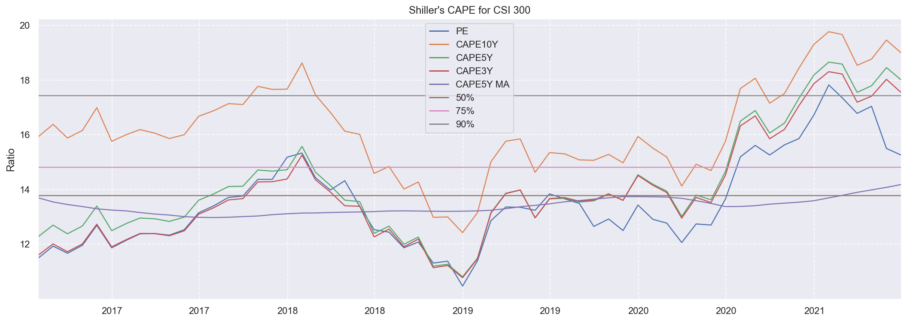
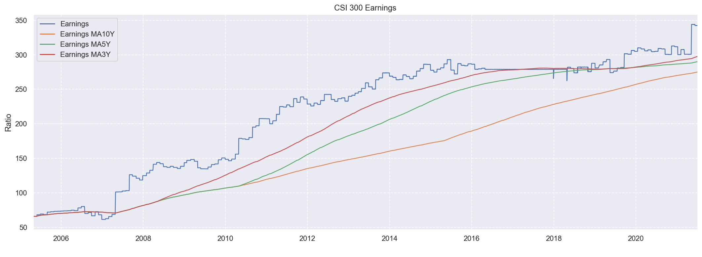
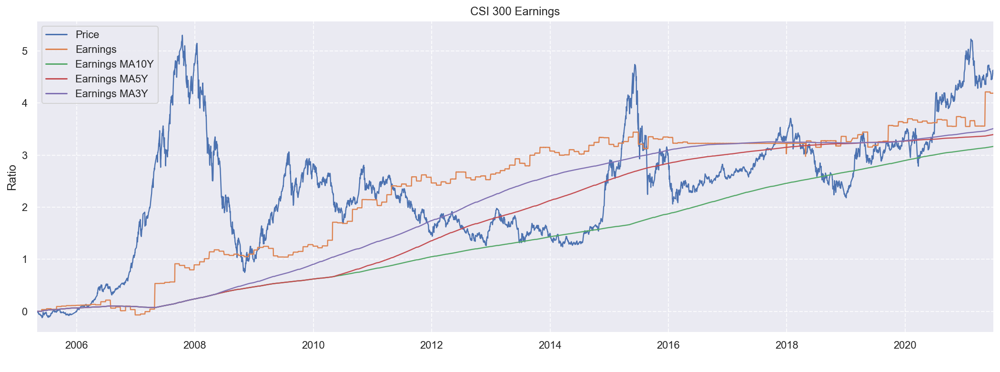

## 无风险收益率

国债ETF(511010)滚动(365天)收益率

    

    

## 沪深300估值

### CAPE

<table border="1" class="dataframe">
  <thead>
    <tr style="text-align: right;">
      <th></th>
      <th>2021-06-16</th>
    </tr>
  </thead>
  <tbody>
    <tr>
      <th>PE</th>
      <td>14.84</td>
    </tr>
    <tr>
      <th>CAPE10Y</th>
      <td>18.51</td>
    </tr>
    <tr>
      <th>CAPE5Y</th>
      <td>17.55</td>
    </tr>
    <tr>
      <th>CAPE3Y</th>
      <td>17.12</td>
    </tr>
    <tr>
      <th>CAPE10Y MA</th>
      <td>16.93</td>
    </tr>
    <tr>
      <th>CAPE10Y 50%</th>
      <td>17.79</td>
    </tr>
    <tr>
      <th>CAPE10Y 75%</th>
      <td>24.70</td>
    </tr>
    <tr>
      <th>CAPE10Y 90%</th>
      <td>33.14</td>
    </tr>
  </tbody>
</table>

    

    

#### 中期(5年)趋势

<table border="1" class="dataframe">
  <thead>
    <tr style="text-align: right;">
      <th></th>
      <th>2021-06-16</th>
    </tr>
  </thead>
  <tbody>
    <tr>
      <th>PE</th>
      <td>14.84</td>
    </tr>
    <tr>
      <th>CAPE10Y</th>
      <td>18.51</td>
    </tr>
    <tr>
      <th>CAPE5Y</th>
      <td>17.55</td>
    </tr>
    <tr>
      <th>CAPE3Y</th>
      <td>17.12</td>
    </tr>
    <tr>
      <th>CAPE5Y MA</th>
      <td>14.13</td>
    </tr>
    <tr>
      <th>50%</th>
      <td>13.75</td>
    </tr>
    <tr>
      <th>75%</th>
      <td>14.76</td>
    </tr>
    <tr>
      <th>90%</th>
      <td>17.32</td>
    </tr>
  </tbody>
</table>

    

    

#### 盈利能力

    

    

#### 价格

    

    

### 回测

    

    

   

