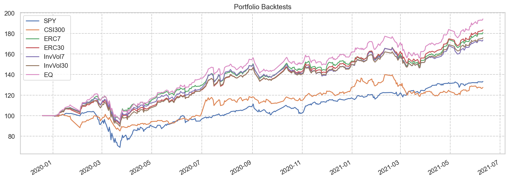

# 全球时代精选

Last Update: 2021-06-11

### 选股

<table id="T_86a8d_" ><thead>    <tr>        <th class="blank level0" ></th>        <th class="col_heading level0 col0" >名称</th>        <th class="col_heading level0 col1" >负债率</th>        <th class="col_heading level0 col2" >ROE</th>        <th class="col_heading level0 col3" >利润率</th>        <th class="col_heading level0 col4" >收入增长</th>        <th class="col_heading level0 col5" >收入增长TTM</th>        <th class="col_heading level0 col6" >盈利增长</th>        <th class="col_heading level0 col7" >盈利增长TTM</th>        <th class="col_heading level0 col8" >FCF增长</th>        <th class="col_heading level0 col9" >PE</th>        <th class="col_heading level0 col10" >PEm</th>        <th class="col_heading level0 col11" >PEG</th>        <th class="col_heading level0 col12" >CAGR</th>        <th class="col_heading level0 col13" >最大回撤</th>        <th class="col_heading level0 col14" >Score</th>        <th class="col_heading level0 col15" >价格</th>    </tr>    <tr>        <th class="index_name level0" >Symbol</th>        <th class="blank" ></th>        <th class="blank" ></th>        <th class="blank" ></th>        <th class="blank" ></th>        <th class="blank" ></th>        <th class="blank" ></th>        <th class="blank" ></th>        <th class="blank" ></th>        <th class="blank" ></th>        <th class="blank" ></th>        <th class="blank" ></th>        <th class="blank" ></th>        <th class="blank" ></th>        <th class="blank" ></th>        <th class="blank" ></th>        <th class="blank" ></th>    </tr></thead><tbody>
                <tr>
                        <th id="T_86a8d_level0_row0" class="row_heading level0 row0" >MPWR</th>
                        <td id="T_86a8d_row0_col0" class="data row0 col0" >Monolithic</td>
                        <td id="T_86a8d_row0_col1" class="data row0 col1" >20.02</td>
                        <td id="T_86a8d_row0_col2" class="data row0 col2" >15.00</td>
                        <td id="T_86a8d_row0_col3" class="data row0 col3" >17.18</td>
                        <td id="T_86a8d_row0_col4" class="data row0 col4" >21.99</td>
                        <td id="T_86a8d_row0_col5" class="data row0 col5" >34.48</td>
                        <td id="T_86a8d_row0_col6" class="data row0 col6" >38.62</td>
                        <td id="T_86a8d_row0_col7" class="data row0 col7" >51.03</td>
                        <td id="T_86a8d_row0_col8" class="data row0 col8" >50.72</td>
                        <td id="T_86a8d_row0_col9" class="data row0 col9" >97.08</td>
                        <td id="T_86a8d_row0_col10" class="data row0 col10" >888.26</td>
                        <td id="T_86a8d_row0_col11" class="data row0 col11" >1.90</td>
                        <td id="T_86a8d_row0_col12" class="data row0 col12" >35.86</td>
                        <td id="T_86a8d_row0_col13" class="data row0 col13" >-31.02</td>
                        <td id="T_86a8d_row0_col14" class="data row0 col14" >8.18</td>
                        <td id="T_86a8d_row0_col15" class="data row0 col15" >7.00</td>
            </tr>
            <tr>
                        <th id="T_86a8d_level0_row1" class="row_heading level0 row1" >TROW</th>
                        <td id="T_86a8d_row1_col0" class="data row1 col0" >T</td>
                        <td id="T_86a8d_row1_col1" class="data row1 col1" >13.04</td>
                        <td id="T_86a8d_row1_col2" class="data row1 col2" >29.13</td>
                        <td id="T_86a8d_row1_col3" class="data row1 col3" >35.30</td>
                        <td id="T_86a8d_row1_col4" class="data row1 col4" >8.57</td>
                        <td id="T_86a8d_row1_col5" class="data row1 col5" >5.87</td>
                        <td id="T_86a8d_row1_col6" class="data row1 col6" >16.67</td>
                        <td id="T_86a8d_row1_col7" class="data row1 col7" >17.12</td>
                        <td id="T_86a8d_row1_col8" class="data row1 col8" >1088.12</td>
                        <td id="T_86a8d_row1_col9" class="data row1 col9" >16.51</td>
                        <td id="T_86a8d_row1_col10" class="data row1 col10" >142.72</td>
                        <td id="T_86a8d_row1_col11" class="data row1 col11" >0.96</td>
                        <td id="T_86a8d_row1_col12" class="data row1 col12" >18.80</td>
                        <td id="T_86a8d_row1_col13" class="data row1 col13" >-37.96</td>
                        <td id="T_86a8d_row1_col14" class="data row1 col14" >7.87</td>
                        <td id="T_86a8d_row1_col15" class="data row1 col15" >8.00</td>
            </tr>
            <tr>
                        <th id="T_86a8d_level0_row2" class="row_heading level0 row2" >ERII</th>
                        <td id="T_86a8d_row2_col0" class="data row2 col0" >Energy Rec</td>
                        <td id="T_86a8d_row2_col1" class="data row2 col1" >16.00</td>
                        <td id="T_86a8d_row2_col2" class="data row2 col2" >15.71</td>
                        <td id="T_86a8d_row2_col3" class="data row2 col3" >22.73</td>
                        <td id="T_86a8d_row2_col4" class="data row2 col4" >20.44</td>
                        <td id="T_86a8d_row2_col5" class="data row2 col5" >6.22</td>
                        <td id="T_86a8d_row2_col6" class="data row2 col6" >37.19</td>
                        <td id="T_86a8d_row2_col7" class="data row2 col7" >23.67</td>
                        <td id="T_86a8d_row2_col8" class="data row2 col8" >-306.59</td>
                        <td id="T_86a8d_row2_col9" class="data row2 col9" >42.72</td>
                        <td id="T_86a8d_row2_col10" class="data row2 col10" >376.11</td>
                        <td id="T_86a8d_row2_col11" class="data row2 col11" >1.81</td>
                        <td id="T_86a8d_row2_col12" class="data row2 col12" >32.30</td>
                        <td id="T_86a8d_row2_col13" class="data row2 col13" >-44.59</td>
                        <td id="T_86a8d_row2_col14" class="data row2 col14" >7.75</td>
                        <td id="T_86a8d_row2_col15" class="data row2 col15" >7.00</td>
            </tr>
            <tr>
                        <th id="T_86a8d_level0_row3" class="row_heading level0 row3" >FB</th>
                        <td id="T_86a8d_row3_col0" class="data row3 col0" >Facebook I</td>
                        <td id="T_86a8d_row3_col1" class="data row3 col1" >19.47</td>
                        <td id="T_86a8d_row3_col2" class="data row3 col2" >22.18</td>
                        <td id="T_86a8d_row3_col3" class="data row3 col3" >34.71</td>
                        <td id="T_86a8d_row3_col4" class="data row3 col4" >28.52</td>
                        <td id="T_86a8d_row3_col5" class="data row3 col5" >9.81</td>
                        <td id="T_86a8d_row3_col6" class="data row3 col6" >26.68</td>
                        <td id="T_86a8d_row3_col7" class="data row3 col7" >15.76</td>
                        <td id="T_86a8d_row3_col8" class="data row3 col8" >12.46</td>
                        <td id="T_86a8d_row3_col9" class="data row3 col9" >28.31</td>
                        <td id="T_86a8d_row3_col10" class="data row3 col10" >277.26</td>
                        <td id="T_86a8d_row3_col11" class="data row3 col11" >1.80</td>
                        <td id="T_86a8d_row3_col12" class="data row3 col12" >19.80</td>
                        <td id="T_86a8d_row3_col13" class="data row3 col13" >-42.96</td>
                        <td id="T_86a8d_row3_col14" class="data row3 col14" >7.62</td>
                        <td id="T_86a8d_row3_col15" class="data row3 col15" >7.00</td>
            </tr>
            <tr>
                        <th id="T_86a8d_level0_row4" class="row_heading level0 row4" >MNST</th>
                        <td id="T_86a8d_row4_col0" class="data row4 col0" >Monster Be</td>
                        <td id="T_86a8d_row4_col1" class="data row4 col1" >16.80</td>
                        <td id="T_86a8d_row4_col2" class="data row4 col2" >25.61</td>
                        <td id="T_86a8d_row4_col3" class="data row4 col3" >26.87</td>
                        <td id="T_86a8d_row4_col4" class="data row4 col4" >10.94</td>
                        <td id="T_86a8d_row4_col5" class="data row4 col5" >9.47</td>
                        <td id="T_86a8d_row4_col6" class="data row4 col6" >19.93</td>
                        <td id="T_86a8d_row4_col7" class="data row4 col7" >27.24</td>
                        <td id="T_86a8d_row4_col8" class="data row4 col8" >14.54</td>
                        <td id="T_86a8d_row4_col9" class="data row4 col9" >35.43</td>
                        <td id="T_86a8d_row4_col10" class="data row4 col10" >289.51</td>
                        <td id="T_86a8d_row4_col11" class="data row4 col11" >1.30</td>
                        <td id="T_86a8d_row4_col12" class="data row4 col12" >18.57</td>
                        <td id="T_86a8d_row4_col13" class="data row4 col13" >-27.60</td>
                        <td id="T_86a8d_row4_col14" class="data row4 col14" >7.57</td>
                        <td id="T_86a8d_row4_col15" class="data row4 col15" >7.00</td>
            </tr>
            <tr>
                        <th id="T_86a8d_level0_row5" class="row_heading level0 row5" >002833.SZ</th>
                        <td id="T_86a8d_row5_col0" class="data row5 col0" >弘亚数控</td>
                        <td id="T_86a8d_row5_col1" class="data row5 col1" >26.31</td>
                        <td id="T_86a8d_row5_col2" class="data row5 col2" >22.78</td>
                        <td id="T_86a8d_row5_col3" class="data row5 col3" >23.79</td>
                        <td id="T_86a8d_row5_col4" class="data row5 col4" >28.09</td>
                        <td id="T_86a8d_row5_col5" class="data row5 col5" >28.92</td>
                        <td id="T_86a8d_row5_col6" class="data row5 col6" >14.35</td>
                        <td id="T_86a8d_row5_col7" class="data row5 col7" >15.16</td>
                        <td id="T_86a8d_row5_col8" class="data row5 col8" >6.66</td>
                        <td id="T_86a8d_row5_col9" class="data row5 col9" >21.30</td>
                        <td id="T_86a8d_row5_col10" class="data row5 col10" >25.76</td>
                        <td id="T_86a8d_row5_col11" class="data row5 col11" >1.40</td>
                        <td id="T_86a8d_row5_col12" class="data row5 col12" >12.23</td>
                        <td id="T_86a8d_row5_col13" class="data row5 col13" >-45.79</td>
                        <td id="T_86a8d_row5_col14" class="data row5 col14" >7.52</td>
                        <td id="T_86a8d_row5_col15" class="data row5 col15" >7.00</td>
            </tr>
            <tr>
                        <th id="T_86a8d_level0_row6" class="row_heading level0 row6" >300595.SZ</th>
                        <td id="T_86a8d_row6_col0" class="data row6 col0" >欧普康视</td>
                        <td id="T_86a8d_row6_col1" class="data row6 col1" >10.02</td>
                        <td id="T_86a8d_row6_col2" class="data row6 col2" >21.91</td>
                        <td id="T_86a8d_row6_col3" class="data row6 col3" >48.20</td>
                        <td id="T_86a8d_row6_col4" class="data row6 col4" >40.94</td>
                        <td id="T_86a8d_row6_col5" class="data row6 col5" >21.01</td>
                        <td id="T_86a8d_row6_col6" class="data row6 col6" >42.15</td>
                        <td id="T_86a8d_row6_col7" class="data row6 col7" >23.11</td>
                        <td id="T_86a8d_row6_col8" class="data row6 col8" >54.08</td>
                        <td id="T_86a8d_row6_col9" class="data row6 col9" >114.88</td>
                        <td id="T_86a8d_row6_col10" class="data row6 col10" >220.13</td>
                        <td id="T_86a8d_row6_col11" class="data row6 col11" >4.97</td>
                        <td id="T_86a8d_row6_col12" class="data row6 col12" >111.24</td>
                        <td id="T_86a8d_row6_col13" class="data row6 col13" >-42.52</td>
                        <td id="T_86a8d_row6_col14" class="data row6 col14" >7.45</td>
                        <td id="T_86a8d_row6_col15" class="data row6 col15" >2.00</td>
            </tr>
            <tr>
                        <th id="T_86a8d_level0_row7" class="row_heading level0 row7" >CPRT</th>
                        <td id="T_86a8d_row7_col0" class="data row7 col0" >Copart Inc</td>
                        <td id="T_86a8d_row7_col1" class="data row7 col1" >27.95</td>
                        <td id="T_86a8d_row7_col2" class="data row7 col2" >30.93</td>
                        <td id="T_86a8d_row7_col3" class="data row7 col3" >27.77</td>
                        <td id="T_86a8d_row7_col4" class="data row7 col4" >15.27</td>
                        <td id="T_86a8d_row7_col5" class="data row7 col5" >11.97</td>
                        <td id="T_86a8d_row7_col6" class="data row7 col6" >21.96</td>
                        <td id="T_86a8d_row7_col7" class="data row7 col7" >20.88</td>
                        <td id="T_86a8d_row7_col8" class="data row7 col8" >2.37</td>
                        <td id="T_86a8d_row7_col9" class="data row7 col9" >42.37</td>
                        <td id="T_86a8d_row7_col10" class="data row7 col10" >356.19</td>
                        <td id="T_86a8d_row7_col11" class="data row7 col11" >2.03</td>
                        <td id="T_86a8d_row7_col12" class="data row7 col12" >29.59</td>
                        <td id="T_86a8d_row7_col13" class="data row7 col13" >-43.75</td>
                        <td id="T_86a8d_row7_col14" class="data row7 col14" >7.16</td>
                        <td id="T_86a8d_row7_col15" class="data row7 col15" >5.00</td>
            </tr>
            <tr>
                        <th id="T_86a8d_level0_row8" class="row_heading level0 row8" >300725.SZ</th>
                        <td id="T_86a8d_row8_col0" class="data row8 col0" >药石科技</td>
                        <td id="T_86a8d_row8_col1" class="data row8 col1" >21.88</td>
                        <td id="T_86a8d_row8_col2" class="data row8 col2" >16.51</td>
                        <td id="T_86a8d_row8_col3" class="data row8 col3" >23.36</td>
                        <td id="T_86a8d_row8_col4" class="data row8 col4" >55.95</td>
                        <td id="T_86a8d_row8_col5" class="data row8 col5" >11.27</td>
                        <td id="T_86a8d_row8_col6" class="data row8 col6" >44.56</td>
                        <td id="T_86a8d_row8_col7" class="data row8 col7" >22.56</td>
                        <td id="T_86a8d_row8_col8" class="data row8 col8" >413.19</td>
                        <td id="T_86a8d_row8_col9" class="data row8 col9" >117.55</td>
                        <td id="T_86a8d_row8_col10" class="data row8 col10" >207.10</td>
                        <td id="T_86a8d_row8_col11" class="data row8 col11" >5.21</td>
                        <td id="T_86a8d_row8_col12" class="data row8 col12" >55.19</td>
                        <td id="T_86a8d_row8_col13" class="data row8 col13" >-39.63</td>
                        <td id="T_86a8d_row8_col14" class="data row8 col14" >6.96</td>
                        <td id="T_86a8d_row8_col15" class="data row8 col15" >1.00</td>
            </tr>
            <tr>
                        <th id="T_86a8d_level0_row9" class="row_heading level0 row9" >300529.SZ</th>
                        <td id="T_86a8d_row9_col0" class="data row9 col0" >健帆生物</td>
                        <td id="T_86a8d_row9_col1" class="data row9 col1" >11.91</td>
                        <td id="T_86a8d_row9_col2" class="data row9 col2" >25.48</td>
                        <td id="T_86a8d_row9_col3" class="data row9 col3" >40.97</td>
                        <td id="T_86a8d_row9_col4" class="data row9 col4" >39.53</td>
                        <td id="T_86a8d_row9_col5" class="data row9 col5" >10.25</td>
                        <td id="T_86a8d_row9_col6" class="data row9 col6" >45.56</td>
                        <td id="T_86a8d_row9_col7" class="data row9 col7" >11.30</td>
                        <td id="T_86a8d_row9_col8" class="data row9 col8" >68.14</td>
                        <td id="T_86a8d_row9_col9" class="data row9 col9" >75.31</td>
                        <td id="T_86a8d_row9_col10" class="data row9 col10" >135.26</td>
                        <td id="T_86a8d_row9_col11" class="data row9 col11" >6.67</td>
                        <td id="T_86a8d_row9_col12" class="data row9 col12" >59.52</td>
                        <td id="T_86a8d_row9_col13" class="data row9 col13" >-55.71</td>
                        <td id="T_86a8d_row9_col14" class="data row9 col14" >6.86</td>
                        <td id="T_86a8d_row9_col15" class="data row9 col15" >0.10</td>
            </tr>
            <tr>
                        <th id="T_86a8d_level0_row10" class="row_heading level0 row10" >600585.SS</th>
                        <td id="T_86a8d_row10_col0" class="data row10 col0" >海螺水泥</td>
                        <td id="T_86a8d_row10_col1" class="data row10 col1" >16.30</td>
                        <td id="T_86a8d_row10_col2" class="data row10 col2" >22.59</td>
                        <td id="T_86a8d_row10_col3" class="data row10 col3" >21.40</td>
                        <td id="T_86a8d_row10_col4" class="data row10 col4" >35.01</td>
                        <td id="T_86a8d_row10_col5" class="data row10 col5" >6.37</td>
                        <td id="T_86a8d_row10_col6" class="data row10 col6" >35.10</td>
                        <td id="T_86a8d_row10_col7" class="data row10 col7" >2.55</td>
                        <td id="T_86a8d_row10_col8" class="data row10 col8" >36.04</td>
                        <td id="T_86a8d_row10_col9" class="data row10 col9" >7.10</td>
                        <td id="T_86a8d_row10_col10" class="data row10 col10" >8.49</td>
                        <td id="T_86a8d_row10_col11" class="data row10 col11" >2.79</td>
                        <td id="T_86a8d_row10_col12" class="data row10 col12" >13.14</td>
                        <td id="T_86a8d_row10_col13" class="data row10 col13" >-27.78</td>
                        <td id="T_86a8d_row10_col14" class="data row10 col14" >6.81</td>
                        <td id="T_86a8d_row10_col15" class="data row10 col15" >5.00</td>
            </tr>
            <tr>
                        <th id="T_86a8d_level0_row11" class="row_heading level0 row11" >000858.SZ</th>
                        <td id="T_86a8d_row11_col0" class="data row11 col0" >五 粮 液</td>
                        <td id="T_86a8d_row11_col1" class="data row11 col1" >22.95</td>
                        <td id="T_86a8d_row11_col2" class="data row11 col2" >21.48</td>
                        <td id="T_86a8d_row11_col3" class="data row11 col3" >33.75</td>
                        <td id="T_86a8d_row11_col4" class="data row11 col4" >24.06</td>
                        <td id="T_86a8d_row11_col5" class="data row11 col5" >7.13</td>
                        <td id="T_86a8d_row11_col6" class="data row11 col6" >27.68</td>
                        <td id="T_86a8d_row11_col7" class="data row11 col7" >8.11</td>
                        <td id="T_86a8d_row11_col8" class="data row11 col8" >22.79</td>
                        <td id="T_86a8d_row11_col9" class="data row11 col9" >56.73</td>
                        <td id="T_86a8d_row11_col10" class="data row11 col10" >81.03</td>
                        <td id="T_86a8d_row11_col11" class="data row11 col11" >6.99</td>
                        <td id="T_86a8d_row11_col12" class="data row11 col12" >57.25</td>
                        <td id="T_86a8d_row11_col13" class="data row11 col13" >-43.75</td>
                        <td id="T_86a8d_row11_col14" class="data row11 col14" >6.59</td>
                        <td id="T_86a8d_row11_col15" class="data row11 col15" >0.10</td>
            </tr>
            <tr>
                        <th id="T_86a8d_level0_row12" class="row_heading level0 row12" >603444.SS</th>
                        <td id="T_86a8d_row12_col0" class="data row12 col0" >吉比特</td>
                        <td id="T_86a8d_row12_col1" class="data row12 col1" >21.16</td>
                        <td id="T_86a8d_row12_col2" class="data row12 col2" >26.31</td>
                        <td id="T_86a8d_row12_col3" class="data row12 col3" >40.37</td>
                        <td id="T_86a8d_row12_col4" class="data row12 col4" >24.14</td>
                        <td id="T_86a8d_row12_col5" class="data row12 col5" >13.78</td>
                        <td id="T_86a8d_row12_col6" class="data row12 col6" >19.94</td>
                        <td id="T_86a8d_row12_col7" class="data row12 col7" >4.11</td>
                        <td id="T_86a8d_row12_col8" class="data row12 col8" >66.50</td>
                        <td id="T_86a8d_row12_col9" class="data row12 col9" >38.19</td>
                        <td id="T_86a8d_row12_col10" class="data row12 col10" >52.21</td>
                        <td id="T_86a8d_row12_col11" class="data row12 col11" >9.28</td>
                        <td id="T_86a8d_row12_col12" class="data row12 col12" >62.78</td>
                        <td id="T_86a8d_row12_col13" class="data row12 col13" >-53.22</td>
                        <td id="T_86a8d_row12_col14" class="data row12 col14" >6.43</td>
                        <td id="T_86a8d_row12_col15" class="data row12 col15" >0.10</td>
            </tr>
            <tr>
                        <th id="T_86a8d_level0_row13" class="row_heading level0 row13" >300653.SZ</th>
                        <td id="T_86a8d_row13_col0" class="data row13 col0" >正海生物</td>
                        <td id="T_86a8d_row13_col1" class="data row13 col1" >19.72</td>
                        <td id="T_86a8d_row13_col2" class="data row13 col2" >16.38</td>
                        <td id="T_86a8d_row13_col3" class="data row13 col3" >38.07</td>
                        <td id="T_86a8d_row13_col4" class="data row13 col4" >17.52</td>
                        <td id="T_86a8d_row13_col5" class="data row13 col5" >19.53</td>
                        <td id="T_86a8d_row13_col6" class="data row13 col6" >24.83</td>
                        <td id="T_86a8d_row13_col7" class="data row13 col7" >20.77</td>
                        <td id="T_86a8d_row13_col8" class="data row13 col8" >-25.18</td>
                        <td id="T_86a8d_row13_col9" class="data row13 col9" >61.49</td>
                        <td id="T_86a8d_row13_col10" class="data row13 col10" >95.06</td>
                        <td id="T_86a8d_row13_col11" class="data row13 col11" >2.96</td>
                        <td id="T_86a8d_row13_col12" class="data row13 col12" >14.18</td>
                        <td id="T_86a8d_row13_col13" class="data row13 col13" >-52.67</td>
                        <td id="T_86a8d_row13_col14" class="data row13 col14" >6.34</td>
                        <td id="T_86a8d_row13_col15" class="data row13 col15" >5.00</td>
            </tr>
            <tr>
                        <th id="T_86a8d_level0_row14" class="row_heading level0 row14" >300628.SZ</th>
                        <td id="T_86a8d_row14_col0" class="data row14 col0" >亿联网络</td>
                        <td id="T_86a8d_row14_col1" class="data row14 col1" >9.97</td>
                        <td id="T_86a8d_row14_col2" class="data row14 col2" >24.39</td>
                        <td id="T_86a8d_row14_col3" class="data row14 col3" >46.38</td>
                        <td id="T_86a8d_row14_col4" class="data row14 col4" >26.19</td>
                        <td id="T_86a8d_row14_col5" class="data row14 col5" >3.39</td>
                        <td id="T_86a8d_row14_col6" class="data row14 col6" >30.91</td>
                        <td id="T_86a8d_row14_col7" class="data row14 col7" >0.66</td>
                        <td id="T_86a8d_row14_col8" class="data row14 col8" >28.68</td>
                        <td id="T_86a8d_row14_col9" class="data row14 col9" >51.88</td>
                        <td id="T_86a8d_row14_col10" class="data row14 col10" >67.87</td>
                        <td id="T_86a8d_row14_col11" class="data row14 col11" >78.49</td>
                        <td id="T_86a8d_row14_col12" class="data row14 col12" >51.65</td>
                        <td id="T_86a8d_row14_col13" class="data row14 col13" >-36.17</td>
                        <td id="T_86a8d_row14_col14" class="data row14 col14" >6.30</td>
                        <td id="T_86a8d_row14_col15" class="data row14 col15" >0.10</td>
            </tr>
            <tr>
                        <th id="T_86a8d_level0_row15" class="row_heading level0 row15" >300327.SZ</th>
                        <td id="T_86a8d_row15_col0" class="data row15 col0" >中颖电子</td>
                        <td id="T_86a8d_row15_col1" class="data row15 col1" >18.54</td>
                        <td id="T_86a8d_row15_col2" class="data row15 col2" >19.01</td>
                        <td id="T_86a8d_row15_col3" class="data row15 col3" >21.27</td>
                        <td id="T_86a8d_row15_col4" class="data row15 col4" >13.98</td>
                        <td id="T_86a8d_row15_col5" class="data row15 col5" >10.35</td>
                        <td id="T_86a8d_row15_col6" class="data row15 col6" >16.35</td>
                        <td id="T_86a8d_row15_col7" class="data row15 col7" >12.19</td>
                        <td id="T_86a8d_row15_col8" class="data row15 col8" >11.01</td>
                        <td id="T_86a8d_row15_col9" class="data row15 col9" >71.97</td>
                        <td id="T_86a8d_row15_col10" class="data row15 col10" >97.85</td>
                        <td id="T_86a8d_row15_col11" class="data row15 col11" >5.90</td>
                        <td id="T_86a8d_row15_col12" class="data row15 col12" >48.69</td>
                        <td id="T_86a8d_row15_col13" class="data row15 col13" >-35.85</td>
                        <td id="T_86a8d_row15_col14" class="data row15 col14" >6.30</td>
                        <td id="T_86a8d_row15_col15" class="data row15 col15" >1.00</td>
            </tr>
            <tr>
                        <th id="T_86a8d_level0_row16" class="row_heading level0 row16" >2269.HK</th>
                        <td id="T_86a8d_row16_col0" class="data row16 col0" >药明生物</td>
                        <td id="T_86a8d_row16_col1" class="data row16 col1" >27.84</td>
                        <td id="T_86a8d_row16_col2" class="data row16 col2" >7.58</td>
                        <td id="T_86a8d_row16_col3" class="data row16 col3" >24.01</td>
                        <td id="T_86a8d_row16_col4" class="data row16 col4" >51.54</td>
                        <td id="T_86a8d_row16_col5" class="data row16 col5" >40.88</td>
                        <td id="T_86a8d_row16_col6" class="data row16 col6" >92.32</td>
                        <td id="T_86a8d_row16_col7" class="data row16 col7" >66.59</td>
                        <td id="T_86a8d_row16_col8" class="data row16 col8" >146.45</td>
                        <td id="T_86a8d_row16_col9" class="data row16 col9" >-</td>
                        <td id="T_86a8d_row16_col10" class="data row16 col10" >471.08</td>
                        <td id="T_86a8d_row16_col11" class="data row16 col11" >-</td>
                        <td id="T_86a8d_row16_col12" class="data row16 col12" >57.75</td>
                        <td id="T_86a8d_row16_col13" class="data row16 col13" >-50.94</td>
                        <td id="T_86a8d_row16_col14" class="data row16 col14" >6.27</td>
                        <td id="T_86a8d_row16_col15" class="data row16 col15" >0.10</td>
            </tr>
            <tr>
                        <th id="T_86a8d_level0_row17" class="row_heading level0 row17" >TREX</th>
                        <td id="T_86a8d_row17_col0" class="data row17 col0" >Trex Compa</td>
                        <td id="T_86a8d_row17_col1" class="data row17 col1" >23.62</td>
                        <td id="T_86a8d_row17_col2" class="data row17 col2" >35.61</td>
                        <td id="T_86a8d_row17_col3" class="data row17 col3" >18.96</td>
                        <td id="T_86a8d_row17_col4" class="data row17 col4" >16.06</td>
                        <td id="T_86a8d_row17_col5" class="data row17 col5" >18.18</td>
                        <td id="T_86a8d_row17_col6" class="data row17 col6" >23.45</td>
                        <td id="T_86a8d_row17_col7" class="data row17 col7" >21.34</td>
                        <td id="T_86a8d_row17_col8" class="data row17 col8" >-26.07</td>
                        <td id="T_86a8d_row17_col9" class="data row17 col9" >64.72</td>
                        <td id="T_86a8d_row17_col10" class="data row17 col10" >521.97</td>
                        <td id="T_86a8d_row17_col11" class="data row17 col11" >3.03</td>
                        <td id="T_86a8d_row17_col12" class="data row17 col12" >45.46</td>
                        <td id="T_86a8d_row17_col13" class="data row17 col13" >-42.36</td>
                        <td id="T_86a8d_row17_col14" class="data row17 col14" >6.17</td>
                        <td id="T_86a8d_row17_col15" class="data row17 col15" >2.00</td>
            </tr>
            <tr>
                        <th id="T_86a8d_level0_row18" class="row_heading level0 row18" >603986.SS</th>
                        <td id="T_86a8d_row18_col0" class="data row18 col0" >兆易创新</td>
                        <td id="T_86a8d_row18_col1" class="data row18 col1" >8.68</td>
                        <td id="T_86a8d_row18_col2" class="data row18 col2" >15.96</td>
                        <td id="T_86a8d_row18_col3" class="data row18 col3" >19.04</td>
                        <td id="T_86a8d_row18_col4" class="data row18 col4" >31.22</td>
                        <td id="T_86a8d_row18_col5" class="data row18 col5" >17.76</td>
                        <td id="T_86a8d_row18_col6" class="data row18 col6" >32.29</td>
                        <td id="T_86a8d_row18_col7" class="data row18 col7" >15.14</td>
                        <td id="T_86a8d_row18_col8" class="data row18 col8" >-297.55</td>
                        <td id="T_86a8d_row18_col9" class="data row18 col9" >65.72</td>
                        <td id="T_86a8d_row18_col10" class="data row18 col10" >118.18</td>
                        <td id="T_86a8d_row18_col11" class="data row18 col11" >4.34</td>
                        <td id="T_86a8d_row18_col12" class="data row18 col12" >41.50</td>
                        <td id="T_86a8d_row18_col13" class="data row18 col13" >-54.40</td>
                        <td id="T_86a8d_row18_col14" class="data row18 col14" >6.13</td>
                        <td id="T_86a8d_row18_col15" class="data row18 col15" >2.00</td>
            </tr>
            <tr>
                        <th id="T_86a8d_level0_row19" class="row_heading level0 row19" >603160.SS</th>
                        <td id="T_86a8d_row19_col0" class="data row19 col0" >汇顶科技</td>
                        <td id="T_86a8d_row19_col1" class="data row19 col1" >18.72</td>
                        <td id="T_86a8d_row19_col2" class="data row19 col2" >25.04</td>
                        <td id="T_86a8d_row19_col3" class="data row19 col3" >26.16</td>
                        <td id="T_86a8d_row19_col4" class="data row19 col4" >26.11</td>
                        <td id="T_86a8d_row19_col5" class="data row19 col5" >1.02</td>
                        <td id="T_86a8d_row19_col6" class="data row19 col6" >55.80</td>
                        <td id="T_86a8d_row19_col7" class="data row19 col7" >-2.90</td>
                        <td id="T_86a8d_row19_col8" class="data row19 col8" >18.94</td>
                        <td id="T_86a8d_row19_col9" class="data row19 col9" >37.02</td>
                        <td id="T_86a8d_row19_col10" class="data row19 col10" >42.03</td>
                        <td id="T_86a8d_row19_col11" class="data row19 col11" >-</td>
                        <td id="T_86a8d_row19_col12" class="data row19 col12" >21.93</td>
                        <td id="T_86a8d_row19_col13" class="data row19 col13" >-73.31</td>
                        <td id="T_86a8d_row19_col14" class="data row19 col14" >6.00</td>
                        <td id="T_86a8d_row19_col15" class="data row19 col15" >0.10</td>
            </tr>
            <tr>
                        <th id="T_86a8d_level0_row20" class="row_heading level0 row20" >002223.SZ</th>
                        <td id="T_86a8d_row20_col0" class="data row20 col0" >鱼跃医疗</td>
                        <td id="T_86a8d_row20_col1" class="data row20 col1" >25.54</td>
                        <td id="T_86a8d_row20_col2" class="data row20 col2" >15.16</td>
                        <td id="T_86a8d_row20_col3" class="data row20 col3" >19.12</td>
                        <td id="T_86a8d_row20_col4" class="data row20 col4" >24.67</td>
                        <td id="T_86a8d_row20_col5" class="data row20 col5" >4.02</td>
                        <td id="T_86a8d_row20_col6" class="data row20 col6" >53.35</td>
                        <td id="T_86a8d_row20_col7" class="data row20 col7" >4.36</td>
                        <td id="T_86a8d_row20_col8" class="data row20 col8" >271.92</td>
                        <td id="T_86a8d_row20_col9" class="data row20 col9" >18.13</td>
                        <td id="T_86a8d_row20_col10" class="data row20 col10" >34.66</td>
                        <td id="T_86a8d_row20_col11" class="data row20 col11" >4.16</td>
                        <td id="T_86a8d_row20_col12" class="data row20 col12" >14.69</td>
                        <td id="T_86a8d_row20_col13" class="data row20 col13" >-36.79</td>
                        <td id="T_86a8d_row20_col14" class="data row20 col14" >5.38</td>
                        <td id="T_86a8d_row20_col15" class="data row20 col15" >2.00</td>
            </tr>
            <tr>
                        <th id="T_86a8d_level0_row21" class="row_heading level0 row21" >VRTX</th>
                        <td id="T_86a8d_row21_col0" class="data row21 col0" >Vertex Pha</td>
                        <td id="T_86a8d_row21_col1" class="data row21 col1" >26.08</td>
                        <td id="T_86a8d_row21_col2" class="data row21 col2" >27.71</td>
                        <td id="T_86a8d_row21_col3" class="data row21 col3" >37.84</td>
                        <td id="T_86a8d_row21_col4" class="data row21 col4" >36.04</td>
                        <td id="T_86a8d_row21_col5" class="data row21 col5" >3.37</td>
                        <td id="T_86a8d_row21_col6" class="data row21 col6" >260.79</td>
                        <td id="T_86a8d_row21_col7" class="data row21 col7" >1.86</td>
                        <td id="T_86a8d_row21_col8" class="data row21 col8" >61.71</td>
                        <td id="T_86a8d_row21_col9" class="data row21 col9" >20.01</td>
                        <td id="T_86a8d_row21_col10" class="data row21 col10" >220.55</td>
                        <td id="T_86a8d_row21_col11" class="data row21 col11" >10.77</td>
                        <td id="T_86a8d_row21_col12" class="data row21 col12" >11.64</td>
                        <td id="T_86a8d_row21_col13" class="data row21 col13" >-31.77</td>
                        <td id="T_86a8d_row21_col14" class="data row21 col14" >5.11</td>
                        <td id="T_86a8d_row21_col15" class="data row21 col15" >0.10</td>
            </tr>
            <tr>
                        <th id="T_86a8d_level0_row22" class="row_heading level0 row22" >002507.SZ</th>
                        <td id="T_86a8d_row22_col0" class="data row22 col0" >涪陵榨菜</td>
                        <td id="T_86a8d_row22_col1" class="data row22 col1" >14.06</td>
                        <td id="T_86a8d_row22_col2" class="data row22 col2" >23.03</td>
                        <td id="T_86a8d_row22_col3" class="data row22 col3" >31.60</td>
                        <td id="T_86a8d_row22_col4" class="data row22 col4" >14.70</td>
                        <td id="T_86a8d_row22_col5" class="data row22 col5" >9.95</td>
                        <td id="T_86a8d_row22_col6" class="data row22 col6" >26.55</td>
                        <td id="T_86a8d_row22_col7" class="data row22 col7" >4.84</td>
                        <td id="T_86a8d_row22_col8" class="data row22 col8" >-290.57</td>
                        <td id="T_86a8d_row22_col9" class="data row22 col9" >38.74</td>
                        <td id="T_86a8d_row22_col10" class="data row22 col10" >51.25</td>
                        <td id="T_86a8d_row22_col11" class="data row22 col11" >8.00</td>
                        <td id="T_86a8d_row22_col12" class="data row22 col12" >14.52</td>
                        <td id="T_86a8d_row22_col13" class="data row22 col13" >-37.23</td>
                        <td id="T_86a8d_row22_col14" class="data row22 col14" >5.04</td>
                        <td id="T_86a8d_row22_col15" class="data row22 col15" >0.10</td>
            </tr>
    </tbody></table>

### 历史回测

    

    

    Stat                 SPY         CSI300      ERC7        ERC30       InvVol7     InvVol30    EQ
    -------------------  ----------  ----------  ----------  ----------  ----------  ----------  ----------
    Start                2019-12-19  2019-12-19  2019-12-19  2019-12-19  2019-12-19  2019-12-19  2019-12-19
    End                  2021-06-10  2021-06-10  2021-06-10  2021-06-10  2021-06-10  2021-06-10  2021-06-10
    Risk-free rate       0.00%       0.00%       0.00%       0.00%       0.00%       0.00%       0.00%
    
    Total Return         33.27%      27.48%      80.90%      83.52%      73.64%      75.93%      94.21%
    Daily Sharpe         0.86        0.87        1.94        2.01        1.82        1.89        2.13
    Daily Sortino        1.29        1.43        3.06        3.15        2.86        2.94        3.35
    CAGR                 21.49%      17.88%      49.43%      50.90%      45.34%      46.64%      56.80%
    Max Drawdown         -33.71%     -16.09%     -19.33%     -20.34%     -20.61%     -21.89%     -21.08%
    Calmar Ratio         0.64        1.11        2.56        2.50        2.20        2.13        2.69
    
    MTD                  0.85%       -0.81%      2.74%       2.60%       2.06%       2.17%       3.04%
    3m                   9.09%       5.78%       20.73%      20.62%      17.05%      18.74%      22.98%
    6m                   16.38%      5.57%       20.61%      24.87%      20.86%      21.85%      24.76%
    YTD                  13.67%      0.04%       18.12%      20.56%      15.85%      17.59%      20.00%
    1Y                   34.92%      30.92%      42.77%      52.75%      41.16%      47.04%      49.61%
    3Y (ann.)            21.49%      17.88%      49.43%      50.90%      45.34%      46.64%      56.80%
    5Y (ann.)            -           -           -           -           -           -           -
    10Y (ann.)           -           -           -           -           -           -           -
    Since Incep. (ann.)  21.49%      17.88%      49.43%      50.90%      45.34%      46.64%      56.80%
    
    Daily Sharpe         0.86        0.87        1.94        2.01        1.82        1.89        2.13
    Daily Sortino        1.29        1.43        3.06        3.15        2.86        2.94        3.35
    Daily Mean (ann.)    25.42%      20.55%      46.31%      47.31%      43.31%      44.16%      51.62%
    Daily Vol (ann.)     29.49%      23.51%      23.82%      23.58%      23.83%      23.36%      24.22%
    Daily Skew           -0.64       -0.05       -0.77       -0.85       -0.83       -0.90       -0.82
    Daily Kurt           9.52        7.57        4.17        5.13        4.73        5.77        3.99
    Best Day             9.06%       9.47%       5.31%       5.94%       5.83%       6.16%       5.46%
    Worst Day            -10.94%     -8.43%      -7.98%      -8.38%      -8.28%      -8.56%      -8.02%
    
    Monthly Sharpe       0.98        0.99        2.31        2.47        2.09        2.21        2.38
    Monthly Sortino      1.66        2.37        5.42        5.43        5.40        5.14        5.73
    Monthly Mean (ann.)  21.66%      17.78%      41.69%      42.56%      38.95%      39.76%      46.89%
    Monthly Vol (ann.)   22.18%      18.00%      18.01%      17.26%      18.61%      18.00%      19.73%
    Monthly Skew         -0.71       0.51        -0.56       -0.85       -0.17       -0.52       -0.56
    Monthly Kurt         0.85        0.32        0.29        0.92        -0.33       0.04        0.05
    Best Month           12.70%      13.69%      12.50%      11.13%      12.54%      10.78%      12.06%
    Worst Month          -12.48%     -6.71%      -8.16%      -8.68%      -7.63%      -8.40%      -8.80%
    
    Yearly Sharpe        6.12        0.71        1.44        1.63        1.37        1.48        1.38
    Yearly Sortino       inf         inf         inf         inf         inf         inf         inf
    Yearly Mean          15.46%      13.73%      35.63%      36.39%      32.87%      33.60%      40.92%
    Yearly Vol           2.53%       19.37%      24.77%      22.39%      24.06%      22.65%      29.58%
    Yearly Skew          -           -           -           -           -           -           -
    Yearly Kurt          -           -           -           -           -           -           -
    Best Year            17.24%      27.43%      53.15%      52.23%      49.88%      49.61%      61.84%
    Worst Year           13.67%      0.04%       18.12%      20.56%      15.85%      17.59%      20.00%
    
    Avg. Drawdown        -2.02%      -4.53%      -2.69%      -2.62%      -2.95%      -2.80%      -2.67%
    Avg. Drawdown Days   11.03       34.50       12.06       11.74       15.44       13.03       11.66
    Avg. Up Month        4.84%       5.08%       5.52%       5.56%       5.28%       4.93%       6.17%
    Avg. Down Month      -6.09%      -3.02%      -3.69%      -3.51%      -3.86%      -4.75%      -4.03%
    Win Year %           100.00%     100.00%     100.00%     100.00%     100.00%     100.00%     100.00%
    Win 12m %            100.00%     100.00%     100.00%     100.00%     100.00%     100.00%     100.00%

### 当前仓位

<table id="T_89a47_" ><thead>    <tr>        <th class="blank level0" ></th>        <th class="col_heading level0 col0" >名称</th>        <th class="col_heading level0 col1" >负债率</th>        <th class="col_heading level0 col2" >ROE</th>        <th class="col_heading level0 col3" >利润率</th>        <th class="col_heading level0 col4" >收入增长</th>        <th class="col_heading level0 col5" >收入增长TTM</th>        <th class="col_heading level0 col6" >盈利增长</th>        <th class="col_heading level0 col7" >盈利增长TTM</th>        <th class="col_heading level0 col8" >FCF增长</th>        <th class="col_heading level0 col9" >PE</th>        <th class="col_heading level0 col10" >PEm</th>        <th class="col_heading level0 col11" >PEG</th>        <th class="col_heading level0 col12" >CAGR</th>        <th class="col_heading level0 col13" >最大回撤</th>        <th class="col_heading level0 col14" >Score</th>        <th class="col_heading level0 col15" >价格</th>        <th class="col_heading level0 col16" >EQ</th>        <th class="col_heading level0 col17" >ERC7</th>        <th class="col_heading level0 col18" >ERC30</th>        <th class="col_heading level0 col19" >VOL7</th>        <th class="col_heading level0 col20" >VOL30</th>        <th class="col_heading level0 col21" >W</th>        <th class="col_heading level0 col22" >D</th>    </tr></thead><tbody>
                <tr>
                        <th id="T_89a47_level0_row0" class="row_heading level0 row0" >600585.SS</th>
                        <td id="T_89a47_row0_col0" class="data row0 col0" >海螺水泥</td>
                        <td id="T_89a47_row0_col1" class="data row0 col1" >16.30</td>
                        <td id="T_89a47_row0_col2" class="data row0 col2" >22.59</td>
                        <td id="T_89a47_row0_col3" class="data row0 col3" >21.40</td>
                        <td id="T_89a47_row0_col4" class="data row0 col4" >35.01</td>
                        <td id="T_89a47_row0_col5" class="data row0 col5" >6.37</td>
                        <td id="T_89a47_row0_col6" class="data row0 col6" >35.10</td>
                        <td id="T_89a47_row0_col7" class="data row0 col7" >2.55</td>
                        <td id="T_89a47_row0_col8" class="data row0 col8" >36.04</td>
                        <td id="T_89a47_row0_col9" class="data row0 col9" >7.10</td>
                        <td id="T_89a47_row0_col10" class="data row0 col10" >8.49</td>
                        <td id="T_89a47_row0_col11" class="data row0 col11" >2.79</td>
                        <td id="T_89a47_row0_col12" class="data row0 col12" >13.14</td>
                        <td id="T_89a47_row0_col13" class="data row0 col13" >-27.78</td>
                        <td id="T_89a47_row0_col14" class="data row0 col14" >6.81</td>
                        <td id="T_89a47_row0_col15" class="data row0 col15" >5.00</td>
                        <td id="T_89a47_row0_col16" class="data row0 col16" >4.26</td>
                        <td id="T_89a47_row0_col17" class="data row0 col17" >5.65</td>
                        <td id="T_89a47_row0_col18" class="data row0 col18" >6.98</td>
                        <td id="T_89a47_row0_col19" class="data row0 col19" >12.55</td>
                        <td id="T_89a47_row0_col20" class="data row0 col20" >10.09</td>
                        <td id="T_89a47_row0_col21" class="data row0 col21" >7.79</td>
                        <td id="T_89a47_row0_col22" class="data row0 col22" >U</td>
            </tr>
            <tr>
                        <th id="T_89a47_level0_row1" class="row_heading level0 row1" >VRTX</th>
                        <td id="T_89a47_row1_col0" class="data row1 col0" >Vertex Pha</td>
                        <td id="T_89a47_row1_col1" class="data row1 col1" >26.08</td>
                        <td id="T_89a47_row1_col2" class="data row1 col2" >27.71</td>
                        <td id="T_89a47_row1_col3" class="data row1 col3" >37.84</td>
                        <td id="T_89a47_row1_col4" class="data row1 col4" >36.04</td>
                        <td id="T_89a47_row1_col5" class="data row1 col5" >3.37</td>
                        <td id="T_89a47_row1_col6" class="data row1 col6" >260.79</td>
                        <td id="T_89a47_row1_col7" class="data row1 col7" >1.86</td>
                        <td id="T_89a47_row1_col8" class="data row1 col8" >61.71</td>
                        <td id="T_89a47_row1_col9" class="data row1 col9" >20.01</td>
                        <td id="T_89a47_row1_col10" class="data row1 col10" >220.55</td>
                        <td id="T_89a47_row1_col11" class="data row1 col11" >10.77</td>
                        <td id="T_89a47_row1_col12" class="data row1 col12" >11.64</td>
                        <td id="T_89a47_row1_col13" class="data row1 col13" >-31.77</td>
                        <td id="T_89a47_row1_col14" class="data row1 col14" >5.11</td>
                        <td id="T_89a47_row1_col15" class="data row1 col15" >0.10</td>
                        <td id="T_89a47_row1_col16" class="data row1 col16" >4.43</td>
                        <td id="T_89a47_row1_col17" class="data row1 col17" >6.51</td>
                        <td id="T_89a47_row1_col18" class="data row1 col18" >6.72</td>
                        <td id="T_89a47_row1_col19" class="data row1 col19" >8.53</td>
                        <td id="T_89a47_row1_col20" class="data row1 col20" >10.70</td>
                        <td id="T_89a47_row1_col21" class="data row1 col21" >7.61</td>
                        <td id="T_89a47_row1_col22" class="data row1 col22" >D</td>
            </tr>
            <tr>
                        <th id="T_89a47_level0_row2" class="row_heading level0 row2" >TROW</th>
                        <td id="T_89a47_row2_col0" class="data row2 col0" >T</td>
                        <td id="T_89a47_row2_col1" class="data row2 col1" >13.04</td>
                        <td id="T_89a47_row2_col2" class="data row2 col2" >29.13</td>
                        <td id="T_89a47_row2_col3" class="data row2 col3" >35.30</td>
                        <td id="T_89a47_row2_col4" class="data row2 col4" >8.57</td>
                        <td id="T_89a47_row2_col5" class="data row2 col5" >5.87</td>
                        <td id="T_89a47_row2_col6" class="data row2 col6" >16.67</td>
                        <td id="T_89a47_row2_col7" class="data row2 col7" >17.12</td>
                        <td id="T_89a47_row2_col8" class="data row2 col8" >1088.12</td>
                        <td id="T_89a47_row2_col9" class="data row2 col9" >16.51</td>
                        <td id="T_89a47_row2_col10" class="data row2 col10" >142.72</td>
                        <td id="T_89a47_row2_col11" class="data row2 col11" >0.96</td>
                        <td id="T_89a47_row2_col12" class="data row2 col12" >18.80</td>
                        <td id="T_89a47_row2_col13" class="data row2 col13" >-37.96</td>
                        <td id="T_89a47_row2_col14" class="data row2 col14" >7.87</td>
                        <td id="T_89a47_row2_col15" class="data row2 col15" >8.00</td>
                        <td id="T_89a47_row2_col16" class="data row2 col16" >4.29</td>
                        <td id="T_89a47_row2_col17" class="data row2 col17" >5.51</td>
                        <td id="T_89a47_row2_col18" class="data row2 col18" >6.81</td>
                        <td id="T_89a47_row2_col19" class="data row2 col19" >8.02</td>
                        <td id="T_89a47_row2_col20" class="data row2 col20" >6.72</td>
                        <td id="T_89a47_row2_col21" class="data row2 col21" >6.27</td>
                        <td id="T_89a47_row2_col22" class="data row2 col22" >U</td>
            </tr>
            <tr>
                        <th id="T_89a47_level0_row3" class="row_heading level0 row3" >TREX</th>
                        <td id="T_89a47_row3_col0" class="data row3 col0" >Trex Compa</td>
                        <td id="T_89a47_row3_col1" class="data row3 col1" >23.62</td>
                        <td id="T_89a47_row3_col2" class="data row3 col2" >35.61</td>
                        <td id="T_89a47_row3_col3" class="data row3 col3" >18.96</td>
                        <td id="T_89a47_row3_col4" class="data row3 col4" >16.06</td>
                        <td id="T_89a47_row3_col5" class="data row3 col5" >18.18</td>
                        <td id="T_89a47_row3_col6" class="data row3 col6" >23.45</td>
                        <td id="T_89a47_row3_col7" class="data row3 col7" >21.34</td>
                        <td id="T_89a47_row3_col8" class="data row3 col8" >-26.07</td>
                        <td id="T_89a47_row3_col9" class="data row3 col9" >64.72</td>
                        <td id="T_89a47_row3_col10" class="data row3 col10" >521.97</td>
                        <td id="T_89a47_row3_col11" class="data row3 col11" >3.03</td>
                        <td id="T_89a47_row3_col12" class="data row3 col12" >45.46</td>
                        <td id="T_89a47_row3_col13" class="data row3 col13" >-42.36</td>
                        <td id="T_89a47_row3_col14" class="data row3 col14" >6.17</td>
                        <td id="T_89a47_row3_col15" class="data row3 col15" >2.00</td>
                        <td id="T_89a47_row3_col16" class="data row3 col16" >4.40</td>
                        <td id="T_89a47_row3_col17" class="data row3 col17" >7.71</td>
                        <td id="T_89a47_row3_col18" class="data row3 col18" >6.79</td>
                        <td id="T_89a47_row3_col19" class="data row3 col19" >9.23</td>
                        <td id="T_89a47_row3_col20" class="data row3 col20" >4.32</td>
                        <td id="T_89a47_row3_col21" class="data row3 col21" >5.91</td>
                        <td id="T_89a47_row3_col22" class="data row3 col22" >U</td>
            </tr>
            <tr>
                        <th id="T_89a47_level0_row4" class="row_heading level0 row4" >MNST</th>
                        <td id="T_89a47_row4_col0" class="data row4 col0" >Monster Be</td>
                        <td id="T_89a47_row4_col1" class="data row4 col1" >16.80</td>
                        <td id="T_89a47_row4_col2" class="data row4 col2" >25.61</td>
                        <td id="T_89a47_row4_col3" class="data row4 col3" >26.87</td>
                        <td id="T_89a47_row4_col4" class="data row4 col4" >10.94</td>
                        <td id="T_89a47_row4_col5" class="data row4 col5" >9.47</td>
                        <td id="T_89a47_row4_col6" class="data row4 col6" >19.93</td>
                        <td id="T_89a47_row4_col7" class="data row4 col7" >27.24</td>
                        <td id="T_89a47_row4_col8" class="data row4 col8" >14.54</td>
                        <td id="T_89a47_row4_col9" class="data row4 col9" >35.43</td>
                        <td id="T_89a47_row4_col10" class="data row4 col10" >289.51</td>
                        <td id="T_89a47_row4_col11" class="data row4 col11" >1.30</td>
                        <td id="T_89a47_row4_col12" class="data row4 col12" >18.57</td>
                        <td id="T_89a47_row4_col13" class="data row4 col13" >-27.60</td>
                        <td id="T_89a47_row4_col14" class="data row4 col14" >7.57</td>
                        <td id="T_89a47_row4_col15" class="data row4 col15" >7.00</td>
                        <td id="T_89a47_row4_col16" class="data row4 col16" >4.29</td>
                        <td id="T_89a47_row4_col17" class="data row4 col17" >8.20</td>
                        <td id="T_89a47_row4_col18" class="data row4 col18" >4.94</td>
                        <td id="T_89a47_row4_col19" class="data row4 col19" >7.95</td>
                        <td id="T_89a47_row4_col20" class="data row4 col20" >5.98</td>
                        <td id="T_89a47_row4_col21" class="data row4 col21" >5.75</td>
                        <td id="T_89a47_row4_col22" class="data row4 col22" >U</td>
            </tr>
            <tr>
                        <th id="T_89a47_level0_row5" class="row_heading level0 row5" >CPRT</th>
                        <td id="T_89a47_row5_col0" class="data row5 col0" >Copart Inc</td>
                        <td id="T_89a47_row5_col1" class="data row5 col1" >27.95</td>
                        <td id="T_89a47_row5_col2" class="data row5 col2" >30.93</td>
                        <td id="T_89a47_row5_col3" class="data row5 col3" >27.77</td>
                        <td id="T_89a47_row5_col4" class="data row5 col4" >15.27</td>
                        <td id="T_89a47_row5_col5" class="data row5 col5" >11.97</td>
                        <td id="T_89a47_row5_col6" class="data row5 col6" >21.96</td>
                        <td id="T_89a47_row5_col7" class="data row5 col7" >20.88</td>
                        <td id="T_89a47_row5_col8" class="data row5 col8" >2.37</td>
                        <td id="T_89a47_row5_col9" class="data row5 col9" >42.37</td>
                        <td id="T_89a47_row5_col10" class="data row5 col10" >356.19</td>
                        <td id="T_89a47_row5_col11" class="data row5 col11" >2.03</td>
                        <td id="T_89a47_row5_col12" class="data row5 col12" >29.59</td>
                        <td id="T_89a47_row5_col13" class="data row5 col13" >-43.75</td>
                        <td id="T_89a47_row5_col14" class="data row5 col14" >7.16</td>
                        <td id="T_89a47_row5_col15" class="data row5 col15" >5.00</td>
                        <td id="T_89a47_row5_col16" class="data row5 col16" >4.22</td>
                        <td id="T_89a47_row5_col17" class="data row5 col17" >6.82</td>
                        <td id="T_89a47_row5_col18" class="data row5 col18" >6.03</td>
                        <td id="T_89a47_row5_col19" class="data row5 col19" >4.11</td>
                        <td id="T_89a47_row5_col20" class="data row5 col20" >5.42</td>
                        <td id="T_89a47_row5_col21" class="data row5 col21" >5.37</td>
                        <td id="T_89a47_row5_col22" class="data row5 col22" >D</td>
            </tr>
            <tr>
                        <th id="T_89a47_level0_row6" class="row_heading level0 row6" >FB</th>
                        <td id="T_89a47_row6_col0" class="data row6 col0" >Facebook I</td>
                        <td id="T_89a47_row6_col1" class="data row6 col1" >19.47</td>
                        <td id="T_89a47_row6_col2" class="data row6 col2" >22.18</td>
                        <td id="T_89a47_row6_col3" class="data row6 col3" >34.71</td>
                        <td id="T_89a47_row6_col4" class="data row6 col4" >28.52</td>
                        <td id="T_89a47_row6_col5" class="data row6 col5" >9.81</td>
                        <td id="T_89a47_row6_col6" class="data row6 col6" >26.68</td>
                        <td id="T_89a47_row6_col7" class="data row6 col7" >15.76</td>
                        <td id="T_89a47_row6_col8" class="data row6 col8" >12.46</td>
                        <td id="T_89a47_row6_col9" class="data row6 col9" >28.31</td>
                        <td id="T_89a47_row6_col10" class="data row6 col10" >277.26</td>
                        <td id="T_89a47_row6_col11" class="data row6 col11" >1.80</td>
                        <td id="T_89a47_row6_col12" class="data row6 col12" >19.80</td>
                        <td id="T_89a47_row6_col13" class="data row6 col13" >-42.96</td>
                        <td id="T_89a47_row6_col14" class="data row6 col14" >7.62</td>
                        <td id="T_89a47_row6_col15" class="data row6 col15" >7.00</td>
                        <td id="T_89a47_row6_col16" class="data row6 col16" >4.33</td>
                        <td id="T_89a47_row6_col17" class="data row6 col17" >3.90</td>
                        <td id="T_89a47_row6_col18" class="data row6 col18" >3.68</td>
                        <td id="T_89a47_row6_col19" class="data row6 col19" >5.28</td>
                        <td id="T_89a47_row6_col20" class="data row6 col20" >5.22</td>
                        <td id="T_89a47_row6_col21" class="data row6 col21" >4.45</td>
                        <td id="T_89a47_row6_col22" class="data row6 col22" >U</td>
            </tr>
            <tr>
                        <th id="T_89a47_level0_row7" class="row_heading level0 row7" >300595.SZ</th>
                        <td id="T_89a47_row7_col0" class="data row7 col0" >欧普康视</td>
                        <td id="T_89a47_row7_col1" class="data row7 col1" >10.02</td>
                        <td id="T_89a47_row7_col2" class="data row7 col2" >21.91</td>
                        <td id="T_89a47_row7_col3" class="data row7 col3" >48.20</td>
                        <td id="T_89a47_row7_col4" class="data row7 col4" >40.94</td>
                        <td id="T_89a47_row7_col5" class="data row7 col5" >21.01</td>
                        <td id="T_89a47_row7_col6" class="data row7 col6" >42.15</td>
                        <td id="T_89a47_row7_col7" class="data row7 col7" >23.11</td>
                        <td id="T_89a47_row7_col8" class="data row7 col8" >54.08</td>
                        <td id="T_89a47_row7_col9" class="data row7 col9" >114.88</td>
                        <td id="T_89a47_row7_col10" class="data row7 col10" >220.13</td>
                        <td id="T_89a47_row7_col11" class="data row7 col11" >4.97</td>
                        <td id="T_89a47_row7_col12" class="data row7 col12" >111.24</td>
                        <td id="T_89a47_row7_col13" class="data row7 col13" >-42.52</td>
                        <td id="T_89a47_row7_col14" class="data row7 col14" >7.45</td>
                        <td id="T_89a47_row7_col15" class="data row7 col15" >2.00</td>
                        <td id="T_89a47_row7_col16" class="data row7 col16" >4.55</td>
                        <td id="T_89a47_row7_col17" class="data row7 col17" >4.02</td>
                        <td id="T_89a47_row7_col18" class="data row7 col18" >4.88</td>
                        <td id="T_89a47_row7_col19" class="data row7 col19" >3.00</td>
                        <td id="T_89a47_row7_col20" class="data row7 col20" >4.29</td>
                        <td id="T_89a47_row7_col21" class="data row7 col21" >4.37</td>
                        <td id="T_89a47_row7_col22" class="data row7 col22" >D</td>
            </tr>
            <tr>
                        <th id="T_89a47_level0_row8" class="row_heading level0 row8" >000858.SZ</th>
                        <td id="T_89a47_row8_col0" class="data row8 col0" >五 粮 液</td>
                        <td id="T_89a47_row8_col1" class="data row8 col1" >22.95</td>
                        <td id="T_89a47_row8_col2" class="data row8 col2" >21.48</td>
                        <td id="T_89a47_row8_col3" class="data row8 col3" >33.75</td>
                        <td id="T_89a47_row8_col4" class="data row8 col4" >24.06</td>
                        <td id="T_89a47_row8_col5" class="data row8 col5" >7.13</td>
                        <td id="T_89a47_row8_col6" class="data row8 col6" >27.68</td>
                        <td id="T_89a47_row8_col7" class="data row8 col7" >8.11</td>
                        <td id="T_89a47_row8_col8" class="data row8 col8" >22.79</td>
                        <td id="T_89a47_row8_col9" class="data row8 col9" >56.73</td>
                        <td id="T_89a47_row8_col10" class="data row8 col10" >81.03</td>
                        <td id="T_89a47_row8_col11" class="data row8 col11" >6.99</td>
                        <td id="T_89a47_row8_col12" class="data row8 col12" >57.25</td>
                        <td id="T_89a47_row8_col13" class="data row8 col13" >-43.75</td>
                        <td id="T_89a47_row8_col14" class="data row8 col14" >6.59</td>
                        <td id="T_89a47_row8_col15" class="data row8 col15" >0.10</td>
                        <td id="T_89a47_row8_col16" class="data row8 col16" >4.10</td>
                        <td id="T_89a47_row8_col17" class="data row8 col17" >5.49</td>
                        <td id="T_89a47_row8_col18" class="data row8 col18" >3.34</td>
                        <td id="T_89a47_row8_col19" class="data row8 col19" >9.46</td>
                        <td id="T_89a47_row8_col20" class="data row8 col20" >3.46</td>
                        <td id="T_89a47_row8_col21" class="data row8 col21" >4.36</td>
                        <td id="T_89a47_row8_col22" class="data row8 col22" >U</td>
            </tr>
            <tr>
                        <th id="T_89a47_level0_row9" class="row_heading level0 row9" >002223.SZ</th>
                        <td id="T_89a47_row9_col0" class="data row9 col0" >鱼跃医疗</td>
                        <td id="T_89a47_row9_col1" class="data row9 col1" >25.54</td>
                        <td id="T_89a47_row9_col2" class="data row9 col2" >15.16</td>
                        <td id="T_89a47_row9_col3" class="data row9 col3" >19.12</td>
                        <td id="T_89a47_row9_col4" class="data row9 col4" >24.67</td>
                        <td id="T_89a47_row9_col5" class="data row9 col5" >4.02</td>
                        <td id="T_89a47_row9_col6" class="data row9 col6" >53.35</td>
                        <td id="T_89a47_row9_col7" class="data row9 col7" >4.36</td>
                        <td id="T_89a47_row9_col8" class="data row9 col8" >271.92</td>
                        <td id="T_89a47_row9_col9" class="data row9 col9" >18.13</td>
                        <td id="T_89a47_row9_col10" class="data row9 col10" >34.66</td>
                        <td id="T_89a47_row9_col11" class="data row9 col11" >4.16</td>
                        <td id="T_89a47_row9_col12" class="data row9 col12" >14.69</td>
                        <td id="T_89a47_row9_col13" class="data row9 col13" >-36.79</td>
                        <td id="T_89a47_row9_col14" class="data row9 col14" >5.38</td>
                        <td id="T_89a47_row9_col15" class="data row9 col15" >2.00</td>
                        <td id="T_89a47_row9_col16" class="data row9 col16" >4.62</td>
                        <td id="T_89a47_row9_col17" class="data row9 col17" >3.69</td>
                        <td id="T_89a47_row9_col18" class="data row9 col18" >4.70</td>
                        <td id="T_89a47_row9_col19" class="data row9 col19" >2.54</td>
                        <td id="T_89a47_row9_col20" class="data row9 col20" >4.55</td>
                        <td id="T_89a47_row9_col21" class="data row9 col21" >4.32</td>
                        <td id="T_89a47_row9_col22" class="data row9 col22" >D</td>
            </tr>
            <tr>
                        <th id="T_89a47_level0_row10" class="row_heading level0 row10" >MPWR</th>
                        <td id="T_89a47_row10_col0" class="data row10 col0" >Monolithic</td>
                        <td id="T_89a47_row10_col1" class="data row10 col1" >20.02</td>
                        <td id="T_89a47_row10_col2" class="data row10 col2" >15.00</td>
                        <td id="T_89a47_row10_col3" class="data row10 col3" >17.18</td>
                        <td id="T_89a47_row10_col4" class="data row10 col4" >21.99</td>
                        <td id="T_89a47_row10_col5" class="data row10 col5" >34.48</td>
                        <td id="T_89a47_row10_col6" class="data row10 col6" >38.62</td>
                        <td id="T_89a47_row10_col7" class="data row10 col7" >51.03</td>
                        <td id="T_89a47_row10_col8" class="data row10 col8" >50.72</td>
                        <td id="T_89a47_row10_col9" class="data row10 col9" >97.08</td>
                        <td id="T_89a47_row10_col10" class="data row10 col10" >888.26</td>
                        <td id="T_89a47_row10_col11" class="data row10 col11" >1.90</td>
                        <td id="T_89a47_row10_col12" class="data row10 col12" >35.86</td>
                        <td id="T_89a47_row10_col13" class="data row10 col13" >-31.02</td>
                        <td id="T_89a47_row10_col14" class="data row10 col14" >8.18</td>
                        <td id="T_89a47_row10_col15" class="data row10 col15" >7.00</td>
                        <td id="T_89a47_row10_col16" class="data row10 col16" >4.30</td>
                        <td id="T_89a47_row10_col17" class="data row10 col17" >6.26</td>
                        <td id="T_89a47_row10_col18" class="data row10 col18" >3.82</td>
                        <td id="T_89a47_row10_col19" class="data row10 col19" >4.96</td>
                        <td id="T_89a47_row10_col20" class="data row10 col20" >3.24</td>
                        <td id="T_89a47_row10_col21" class="data row10 col21" >4.10</td>
                        <td id="T_89a47_row10_col22" class="data row10 col22" >U</td>
            </tr>
            <tr>
                        <th id="T_89a47_level0_row11" class="row_heading level0 row11" >603444.SS</th>
                        <td id="T_89a47_row11_col0" class="data row11 col0" >吉比特</td>
                        <td id="T_89a47_row11_col1" class="data row11 col1" >21.16</td>
                        <td id="T_89a47_row11_col2" class="data row11 col2" >26.31</td>
                        <td id="T_89a47_row11_col3" class="data row11 col3" >40.37</td>
                        <td id="T_89a47_row11_col4" class="data row11 col4" >24.14</td>
                        <td id="T_89a47_row11_col5" class="data row11 col5" >13.78</td>
                        <td id="T_89a47_row11_col6" class="data row11 col6" >19.94</td>
                        <td id="T_89a47_row11_col7" class="data row11 col7" >4.11</td>
                        <td id="T_89a47_row11_col8" class="data row11 col8" >66.50</td>
                        <td id="T_89a47_row11_col9" class="data row11 col9" >38.19</td>
                        <td id="T_89a47_row11_col10" class="data row11 col10" >52.21</td>
                        <td id="T_89a47_row11_col11" class="data row11 col11" >9.28</td>
                        <td id="T_89a47_row11_col12" class="data row11 col12" >62.78</td>
                        <td id="T_89a47_row11_col13" class="data row11 col13" >-53.22</td>
                        <td id="T_89a47_row11_col14" class="data row11 col14" >6.43</td>
                        <td id="T_89a47_row11_col15" class="data row11 col15" >0.10</td>
                        <td id="T_89a47_row11_col16" class="data row11 col16" >4.86</td>
                        <td id="T_89a47_row11_col17" class="data row11 col17" >4.31</td>
                        <td id="T_89a47_row11_col18" class="data row11 col18" >4.31</td>
                        <td id="T_89a47_row11_col19" class="data row11 col19" >1.36</td>
                        <td id="T_89a47_row11_col20" class="data row11 col20" >3.45</td>
                        <td id="T_89a47_row11_col21" class="data row11 col21" >3.87</td>
                        <td id="T_89a47_row11_col22" class="data row11 col22" >D</td>
            </tr>
            <tr>
                        <th id="T_89a47_level0_row12" class="row_heading level0 row12" >300725.SZ</th>
                        <td id="T_89a47_row12_col0" class="data row12 col0" >药石科技</td>
                        <td id="T_89a47_row12_col1" class="data row12 col1" >21.88</td>
                        <td id="T_89a47_row12_col2" class="data row12 col2" >16.51</td>
                        <td id="T_89a47_row12_col3" class="data row12 col3" >23.36</td>
                        <td id="T_89a47_row12_col4" class="data row12 col4" >55.95</td>
                        <td id="T_89a47_row12_col5" class="data row12 col5" >11.27</td>
                        <td id="T_89a47_row12_col6" class="data row12 col6" >44.56</td>
                        <td id="T_89a47_row12_col7" class="data row12 col7" >22.56</td>
                        <td id="T_89a47_row12_col8" class="data row12 col8" >413.19</td>
                        <td id="T_89a47_row12_col9" class="data row12 col9" >117.55</td>
                        <td id="T_89a47_row12_col10" class="data row12 col10" >207.10</td>
                        <td id="T_89a47_row12_col11" class="data row12 col11" >5.21</td>
                        <td id="T_89a47_row12_col12" class="data row12 col12" >55.19</td>
                        <td id="T_89a47_row12_col13" class="data row12 col13" >-39.63</td>
                        <td id="T_89a47_row12_col14" class="data row12 col14" >6.96</td>
                        <td id="T_89a47_row12_col15" class="data row12 col15" >1.00</td>
                        <td id="T_89a47_row12_col16" class="data row12 col16" >4.43</td>
                        <td id="T_89a47_row12_col17" class="data row12 col17" >3.40</td>
                        <td id="T_89a47_row12_col18" class="data row12 col18" >3.79</td>
                        <td id="T_89a47_row12_col19" class="data row12 col19" >2.25</td>
                        <td id="T_89a47_row12_col20" class="data row12 col20" >3.72</td>
                        <td id="T_89a47_row12_col21" class="data row12 col21" >3.70</td>
                        <td id="T_89a47_row12_col22" class="data row12 col22" >D</td>
            </tr>
            <tr>
                        <th id="T_89a47_level0_row13" class="row_heading level0 row13" >300628.SZ</th>
                        <td id="T_89a47_row13_col0" class="data row13 col0" >亿联网络</td>
                        <td id="T_89a47_row13_col1" class="data row13 col1" >9.97</td>
                        <td id="T_89a47_row13_col2" class="data row13 col2" >24.39</td>
                        <td id="T_89a47_row13_col3" class="data row13 col3" >46.38</td>
                        <td id="T_89a47_row13_col4" class="data row13 col4" >26.19</td>
                        <td id="T_89a47_row13_col5" class="data row13 col5" >3.39</td>
                        <td id="T_89a47_row13_col6" class="data row13 col6" >30.91</td>
                        <td id="T_89a47_row13_col7" class="data row13 col7" >0.66</td>
                        <td id="T_89a47_row13_col8" class="data row13 col8" >28.68</td>
                        <td id="T_89a47_row13_col9" class="data row13 col9" >51.88</td>
                        <td id="T_89a47_row13_col10" class="data row13 col10" >67.87</td>
                        <td id="T_89a47_row13_col11" class="data row13 col11" >78.49</td>
                        <td id="T_89a47_row13_col12" class="data row13 col12" >51.65</td>
                        <td id="T_89a47_row13_col13" class="data row13 col13" >-36.17</td>
                        <td id="T_89a47_row13_col14" class="data row13 col14" >6.30</td>
                        <td id="T_89a47_row13_col15" class="data row13 col15" >0.10</td>
                        <td id="T_89a47_row13_col16" class="data row13 col16" >4.59</td>
                        <td id="T_89a47_row13_col17" class="data row13 col17" >3.38</td>
                        <td id="T_89a47_row13_col18" class="data row13 col18" >3.73</td>
                        <td id="T_89a47_row13_col19" class="data row13 col19" >2.44</td>
                        <td id="T_89a47_row13_col20" class="data row13 col20" >3.24</td>
                        <td id="T_89a47_row13_col21" class="data row13 col21" >3.59</td>
                        <td id="T_89a47_row13_col22" class="data row13 col22" >D</td>
            </tr>
            <tr>
                        <th id="T_89a47_level0_row14" class="row_heading level0 row14" >002833.SZ</th>
                        <td id="T_89a47_row14_col0" class="data row14 col0" >弘亚数控</td>
                        <td id="T_89a47_row14_col1" class="data row14 col1" >26.31</td>
                        <td id="T_89a47_row14_col2" class="data row14 col2" >22.78</td>
                        <td id="T_89a47_row14_col3" class="data row14 col3" >23.79</td>
                        <td id="T_89a47_row14_col4" class="data row14 col4" >28.09</td>
                        <td id="T_89a47_row14_col5" class="data row14 col5" >28.92</td>
                        <td id="T_89a47_row14_col6" class="data row14 col6" >14.35</td>
                        <td id="T_89a47_row14_col7" class="data row14 col7" >15.16</td>
                        <td id="T_89a47_row14_col8" class="data row14 col8" >6.66</td>
                        <td id="T_89a47_row14_col9" class="data row14 col9" >21.30</td>
                        <td id="T_89a47_row14_col10" class="data row14 col10" >25.76</td>
                        <td id="T_89a47_row14_col11" class="data row14 col11" >1.40</td>
                        <td id="T_89a47_row14_col12" class="data row14 col12" >12.23</td>
                        <td id="T_89a47_row14_col13" class="data row14 col13" >-45.79</td>
                        <td id="T_89a47_row14_col14" class="data row14 col14" >7.52</td>
                        <td id="T_89a47_row14_col15" class="data row14 col15" >7.00</td>
                        <td id="T_89a47_row14_col16" class="data row14 col16" >3.94</td>
                        <td id="T_89a47_row14_col17" class="data row14 col17" >4.45</td>
                        <td id="T_89a47_row14_col18" class="data row14 col18" >3.65</td>
                        <td id="T_89a47_row14_col19" class="data row14 col19" >1.71</td>
                        <td id="T_89a47_row14_col20" class="data row14 col20" >3.21</td>
                        <td id="T_89a47_row14_col21" class="data row14 col21" >3.46</td>
                        <td id="T_89a47_row14_col22" class="data row14 col22" >D</td>
            </tr>
            <tr>
                        <th id="T_89a47_level0_row15" class="row_heading level0 row15" >ERII</th>
                        <td id="T_89a47_row15_col0" class="data row15 col0" >Energy Rec</td>
                        <td id="T_89a47_row15_col1" class="data row15 col1" >16.00</td>
                        <td id="T_89a47_row15_col2" class="data row15 col2" >15.71</td>
                        <td id="T_89a47_row15_col3" class="data row15 col3" >22.73</td>
                        <td id="T_89a47_row15_col4" class="data row15 col4" >20.44</td>
                        <td id="T_89a47_row15_col5" class="data row15 col5" >6.22</td>
                        <td id="T_89a47_row15_col6" class="data row15 col6" >37.19</td>
                        <td id="T_89a47_row15_col7" class="data row15 col7" >23.67</td>
                        <td id="T_89a47_row15_col8" class="data row15 col8" >-306.59</td>
                        <td id="T_89a47_row15_col9" class="data row15 col9" >42.72</td>
                        <td id="T_89a47_row15_col10" class="data row15 col10" >376.11</td>
                        <td id="T_89a47_row15_col11" class="data row15 col11" >1.81</td>
                        <td id="T_89a47_row15_col12" class="data row15 col12" >32.30</td>
                        <td id="T_89a47_row15_col13" class="data row15 col13" >-44.59</td>
                        <td id="T_89a47_row15_col14" class="data row15 col14" >7.75</td>
                        <td id="T_89a47_row15_col15" class="data row15 col15" >7.00</td>
                        <td id="T_89a47_row15_col16" class="data row15 col16" >4.58</td>
                        <td id="T_89a47_row15_col17" class="data row15 col17" >3.88</td>
                        <td id="T_89a47_row15_col18" class="data row15 col18" >3.19</td>
                        <td id="T_89a47_row15_col19" class="data row15 col19" >3.15</td>
                        <td id="T_89a47_row15_col20" class="data row15 col20" >2.47</td>
                        <td id="T_89a47_row15_col21" class="data row15 col21" >3.32</td>
                        <td id="T_89a47_row15_col22" class="data row15 col22" >U</td>
            </tr>
            <tr>
                        <th id="T_89a47_level0_row16" class="row_heading level0 row16" >300529.SZ</th>
                        <td id="T_89a47_row16_col0" class="data row16 col0" >健帆生物</td>
                        <td id="T_89a47_row16_col1" class="data row16 col1" >11.91</td>
                        <td id="T_89a47_row16_col2" class="data row16 col2" >25.48</td>
                        <td id="T_89a47_row16_col3" class="data row16 col3" >40.97</td>
                        <td id="T_89a47_row16_col4" class="data row16 col4" >39.53</td>
                        <td id="T_89a47_row16_col5" class="data row16 col5" >10.25</td>
                        <td id="T_89a47_row16_col6" class="data row16 col6" >45.56</td>
                        <td id="T_89a47_row16_col7" class="data row16 col7" >11.30</td>
                        <td id="T_89a47_row16_col8" class="data row16 col8" >68.14</td>
                        <td id="T_89a47_row16_col9" class="data row16 col9" >75.31</td>
                        <td id="T_89a47_row16_col10" class="data row16 col10" >135.26</td>
                        <td id="T_89a47_row16_col11" class="data row16 col11" >6.67</td>
                        <td id="T_89a47_row16_col12" class="data row16 col12" >59.52</td>
                        <td id="T_89a47_row16_col13" class="data row16 col13" >-55.71</td>
                        <td id="T_89a47_row16_col14" class="data row16 col14" >6.86</td>
                        <td id="T_89a47_row16_col15" class="data row16 col15" >0.10</td>
                        <td id="T_89a47_row16_col16" class="data row16 col16" >4.39</td>
                        <td id="T_89a47_row16_col17" class="data row16 col17" >2.60</td>
                        <td id="T_89a47_row16_col18" class="data row16 col18" >3.82</td>
                        <td id="T_89a47_row16_col19" class="data row16 col19" >1.36</td>
                        <td id="T_89a47_row16_col20" class="data row16 col20" >2.96</td>
                        <td id="T_89a47_row16_col21" class="data row16 col21" >3.31</td>
                        <td id="T_89a47_row16_col22" class="data row16 col22" >D</td>
            </tr>
            <tr>
                        <th id="T_89a47_level0_row17" class="row_heading level0 row17" >002507.SZ</th>
                        <td id="T_89a47_row17_col0" class="data row17 col0" >涪陵榨菜</td>
                        <td id="T_89a47_row17_col1" class="data row17 col1" >14.06</td>
                        <td id="T_89a47_row17_col2" class="data row17 col2" >23.03</td>
                        <td id="T_89a47_row17_col3" class="data row17 col3" >31.60</td>
                        <td id="T_89a47_row17_col4" class="data row17 col4" >14.70</td>
                        <td id="T_89a47_row17_col5" class="data row17 col5" >9.95</td>
                        <td id="T_89a47_row17_col6" class="data row17 col6" >26.55</td>
                        <td id="T_89a47_row17_col7" class="data row17 col7" >4.84</td>
                        <td id="T_89a47_row17_col8" class="data row17 col8" >-290.57</td>
                        <td id="T_89a47_row17_col9" class="data row17 col9" >38.74</td>
                        <td id="T_89a47_row17_col10" class="data row17 col10" >51.25</td>
                        <td id="T_89a47_row17_col11" class="data row17 col11" >8.00</td>
                        <td id="T_89a47_row17_col12" class="data row17 col12" >14.52</td>
                        <td id="T_89a47_row17_col13" class="data row17 col13" >-37.23</td>
                        <td id="T_89a47_row17_col14" class="data row17 col14" >5.04</td>
                        <td id="T_89a47_row17_col15" class="data row17 col15" >0.10</td>
                        <td id="T_89a47_row17_col16" class="data row17 col16" >4.08</td>
                        <td id="T_89a47_row17_col17" class="data row17 col17" >3.26</td>
                        <td id="T_89a47_row17_col18" class="data row17 col18" >2.91</td>
                        <td id="T_89a47_row17_col19" class="data row17 col19" >2.84</td>
                        <td id="T_89a47_row17_col20" class="data row17 col20" >3.35</td>
                        <td id="T_89a47_row17_col21" class="data row17 col21" >3.31</td>
                        <td id="T_89a47_row17_col22" class="data row17 col22" >D</td>
            </tr>
            <tr>
                        <th id="T_89a47_level0_row18" class="row_heading level0 row18" >603986.SS</th>
                        <td id="T_89a47_row18_col0" class="data row18 col0" >兆易创新</td>
                        <td id="T_89a47_row18_col1" class="data row18 col1" >8.68</td>
                        <td id="T_89a47_row18_col2" class="data row18 col2" >15.96</td>
                        <td id="T_89a47_row18_col3" class="data row18 col3" >19.04</td>
                        <td id="T_89a47_row18_col4" class="data row18 col4" >31.22</td>
                        <td id="T_89a47_row18_col5" class="data row18 col5" >17.76</td>
                        <td id="T_89a47_row18_col6" class="data row18 col6" >32.29</td>
                        <td id="T_89a47_row18_col7" class="data row18 col7" >15.14</td>
                        <td id="T_89a47_row18_col8" class="data row18 col8" >-297.55</td>
                        <td id="T_89a47_row18_col9" class="data row18 col9" >65.72</td>
                        <td id="T_89a47_row18_col10" class="data row18 col10" >118.18</td>
                        <td id="T_89a47_row18_col11" class="data row18 col11" >4.34</td>
                        <td id="T_89a47_row18_col12" class="data row18 col12" >41.50</td>
                        <td id="T_89a47_row18_col13" class="data row18 col13" >-54.40</td>
                        <td id="T_89a47_row18_col14" class="data row18 col14" >6.13</td>
                        <td id="T_89a47_row18_col15" class="data row18 col15" >2.00</td>
                        <td id="T_89a47_row18_col16" class="data row18 col16" >4.45</td>
                        <td id="T_89a47_row18_col17" class="data row18 col17" >3.30</td>
                        <td id="T_89a47_row18_col18" class="data row18 col18" >2.53</td>
                        <td id="T_89a47_row18_col19" class="data row18 col19" >3.45</td>
                        <td id="T_89a47_row18_col20" class="data row18 col20" >3.02</td>
                        <td id="T_89a47_row18_col21" class="data row18 col21" >3.23</td>
                        <td id="T_89a47_row18_col22" class="data row18 col22" >U</td>
            </tr>
            <tr>
                        <th id="T_89a47_level0_row19" class="row_heading level0 row19" >603160.SS</th>
                        <td id="T_89a47_row19_col0" class="data row19 col0" >汇顶科技</td>
                        <td id="T_89a47_row19_col1" class="data row19 col1" >18.72</td>
                        <td id="T_89a47_row19_col2" class="data row19 col2" >25.04</td>
                        <td id="T_89a47_row19_col3" class="data row19 col3" >26.16</td>
                        <td id="T_89a47_row19_col4" class="data row19 col4" >26.11</td>
                        <td id="T_89a47_row19_col5" class="data row19 col5" >1.02</td>
                        <td id="T_89a47_row19_col6" class="data row19 col6" >55.80</td>
                        <td id="T_89a47_row19_col7" class="data row19 col7" >-2.90</td>
                        <td id="T_89a47_row19_col8" class="data row19 col8" >18.94</td>
                        <td id="T_89a47_row19_col9" class="data row19 col9" >37.02</td>
                        <td id="T_89a47_row19_col10" class="data row19 col10" >42.03</td>
                        <td id="T_89a47_row19_col11" class="data row19 col11" >-</td>
                        <td id="T_89a47_row19_col12" class="data row19 col12" >21.93</td>
                        <td id="T_89a47_row19_col13" class="data row19 col13" >-73.31</td>
                        <td id="T_89a47_row19_col14" class="data row19 col14" >6.00</td>
                        <td id="T_89a47_row19_col15" class="data row19 col15" >0.10</td>
                        <td id="T_89a47_row19_col16" class="data row19 col16" >4.17</td>
                        <td id="T_89a47_row19_col17" class="data row19 col17" >1.75</td>
                        <td id="T_89a47_row19_col18" class="data row19 col18" >3.59</td>
                        <td id="T_89a47_row19_col19" class="data row19 col19" >1.57</td>
                        <td id="T_89a47_row19_col20" class="data row19 col20" >3.13</td>
                        <td id="T_89a47_row19_col21" class="data row19 col21" >3.18</td>
                        <td id="T_89a47_row19_col22" class="data row19 col22" >D</td>
            </tr>
            <tr>
                        <th id="T_89a47_level0_row20" class="row_heading level0 row20" >2269.HK</th>
                        <td id="T_89a47_row20_col0" class="data row20 col0" >药明生物</td>
                        <td id="T_89a47_row20_col1" class="data row20 col1" >27.84</td>
                        <td id="T_89a47_row20_col2" class="data row20 col2" >7.58</td>
                        <td id="T_89a47_row20_col3" class="data row20 col3" >24.01</td>
                        <td id="T_89a47_row20_col4" class="data row20 col4" >51.54</td>
                        <td id="T_89a47_row20_col5" class="data row20 col5" >40.88</td>
                        <td id="T_89a47_row20_col6" class="data row20 col6" >92.32</td>
                        <td id="T_89a47_row20_col7" class="data row20 col7" >66.59</td>
                        <td id="T_89a47_row20_col8" class="data row20 col8" >146.45</td>
                        <td id="T_89a47_row20_col9" class="data row20 col9" >-</td>
                        <td id="T_89a47_row20_col10" class="data row20 col10" >471.08</td>
                        <td id="T_89a47_row20_col11" class="data row20 col11" >-</td>
                        <td id="T_89a47_row20_col12" class="data row20 col12" >57.75</td>
                        <td id="T_89a47_row20_col13" class="data row20 col13" >-50.94</td>
                        <td id="T_89a47_row20_col14" class="data row20 col14" >6.27</td>
                        <td id="T_89a47_row20_col15" class="data row20 col15" >0.10</td>
                        <td id="T_89a47_row20_col16" class="data row20 col16" >4.26</td>
                        <td id="T_89a47_row20_col17" class="data row20 col17" >1.89</td>
                        <td id="T_89a47_row20_col18" class="data row20 col18" >3.60</td>
                        <td id="T_89a47_row20_col19" class="data row20 col19" >1.31</td>
                        <td id="T_89a47_row20_col20" class="data row20 col20" >2.89</td>
                        <td id="T_89a47_row20_col21" class="data row20 col21" >3.12</td>
                        <td id="T_89a47_row20_col22" class="data row20 col22" >D</td>
            </tr>
            <tr>
                        <th id="T_89a47_level0_row21" class="row_heading level0 row21" >300327.SZ</th>
                        <td id="T_89a47_row21_col0" class="data row21 col0" >中颖电子</td>
                        <td id="T_89a47_row21_col1" class="data row21 col1" >18.54</td>
                        <td id="T_89a47_row21_col2" class="data row21 col2" >19.01</td>
                        <td id="T_89a47_row21_col3" class="data row21 col3" >21.27</td>
                        <td id="T_89a47_row21_col4" class="data row21 col4" >13.98</td>
                        <td id="T_89a47_row21_col5" class="data row21 col5" >10.35</td>
                        <td id="T_89a47_row21_col6" class="data row21 col6" >16.35</td>
                        <td id="T_89a47_row21_col7" class="data row21 col7" >12.19</td>
                        <td id="T_89a47_row21_col8" class="data row21 col8" >11.01</td>
                        <td id="T_89a47_row21_col9" class="data row21 col9" >71.97</td>
                        <td id="T_89a47_row21_col10" class="data row21 col10" >97.85</td>
                        <td id="T_89a47_row21_col11" class="data row21 col11" >5.90</td>
                        <td id="T_89a47_row21_col12" class="data row21 col12" >48.69</td>
                        <td id="T_89a47_row21_col13" class="data row21 col13" >-35.85</td>
                        <td id="T_89a47_row21_col14" class="data row21 col14" >6.30</td>
                        <td id="T_89a47_row21_col15" class="data row21 col15" >1.00</td>
                        <td id="T_89a47_row21_col16" class="data row21 col16" >4.49</td>
                        <td id="T_89a47_row21_col17" class="data row21 col17" >2.13</td>
                        <td id="T_89a47_row21_col18" class="data row21 col18" >3.48</td>
                        <td id="T_89a47_row21_col19" class="data row21 col19" >1.26</td>
                        <td id="T_89a47_row21_col20" class="data row21 col20" >2.61</td>
                        <td id="T_89a47_row21_col21" class="data row21 col21" >3.06</td>
                        <td id="T_89a47_row21_col22" class="data row21 col22" >D</td>
            </tr>
            <tr>
                        <th id="T_89a47_level0_row22" class="row_heading level0 row22" >300653.SZ</th>
                        <td id="T_89a47_row22_col0" class="data row22 col0" >正海生物</td>
                        <td id="T_89a47_row22_col1" class="data row22 col1" >19.72</td>
                        <td id="T_89a47_row22_col2" class="data row22 col2" >16.38</td>
                        <td id="T_89a47_row22_col3" class="data row22 col3" >38.07</td>
                        <td id="T_89a47_row22_col4" class="data row22 col4" >17.52</td>
                        <td id="T_89a47_row22_col5" class="data row22 col5" >19.53</td>
                        <td id="T_89a47_row22_col6" class="data row22 col6" >24.83</td>
                        <td id="T_89a47_row22_col7" class="data row22 col7" >20.77</td>
                        <td id="T_89a47_row22_col8" class="data row22 col8" >-25.18</td>
                        <td id="T_89a47_row22_col9" class="data row22 col9" >61.49</td>
                        <td id="T_89a47_row22_col10" class="data row22 col10" >95.06</td>
                        <td id="T_89a47_row22_col11" class="data row22 col11" >2.96</td>
                        <td id="T_89a47_row22_col12" class="data row22 col12" >14.18</td>
                        <td id="T_89a47_row22_col13" class="data row22 col13" >-52.67</td>
                        <td id="T_89a47_row22_col14" class="data row22 col14" >6.34</td>
                        <td id="T_89a47_row22_col15" class="data row22 col15" >5.00</td>
                        <td id="T_89a47_row22_col16" class="data row22 col16" >3.88</td>
                        <td id="T_89a47_row22_col17" class="data row22 col17" >1.78</td>
                        <td id="T_89a47_row22_col18" class="data row22 col18" >2.61</td>
                        <td id="T_89a47_row22_col19" class="data row22 col19" >1.53</td>
                        <td id="T_89a47_row22_col20" class="data row22 col20" >1.87</td>
                        <td id="T_89a47_row22_col21" class="data row22 col21" >2.45</td>
                        <td id="T_89a47_row22_col22" class="data row22 col22" >D</td>
            </tr>
    </tbody></table>

