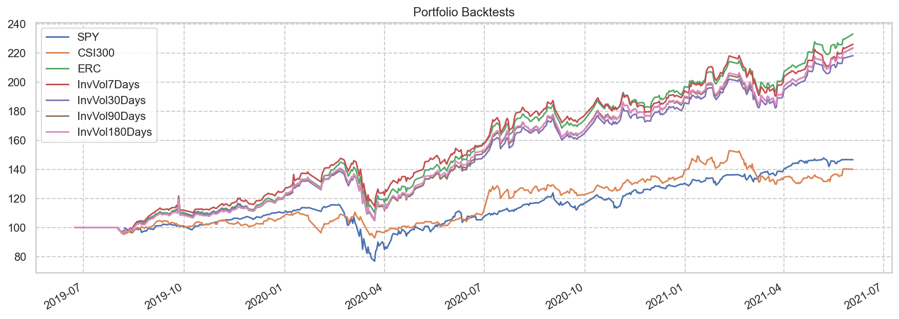

# 全球时代精选

### 选股

<table id="T_d8c88_" ><thead>    <tr>        <th class="blank level0" ></th>        <th class="col_heading level0 col0" >名称</th>        <th class="col_heading level0 col1" >负债率</th>        <th class="col_heading level0 col2" >ROE</th>        <th class="col_heading level0 col3" >利润率</th>        <th class="col_heading level0 col4" >收入增长</th>        <th class="col_heading level0 col5" >收入增长TTM</th>        <th class="col_heading level0 col6" >盈利增长</th>        <th class="col_heading level0 col7" >盈利增长TTM</th>        <th class="col_heading level0 col8" >FCF增长</th>        <th class="col_heading level0 col9" >PE</th>        <th class="col_heading level0 col10" >PEm</th>        <th class="col_heading level0 col11" >PEG</th>        <th class="col_heading level0 col12" >CAGR</th>        <th class="col_heading level0 col13" >最大回撤</th>        <th class="col_heading level0 col14" >Calmar</th>        <th class="col_heading level0 col15" >折价率</th>        <th class="col_heading level0 col16" >回报率</th>    </tr>    <tr>        <th class="index_name level0" >Symbol</th>        <th class="blank" ></th>        <th class="blank" ></th>        <th class="blank" ></th>        <th class="blank" ></th>        <th class="blank" ></th>        <th class="blank" ></th>        <th class="blank" ></th>        <th class="blank" ></th>        <th class="blank" ></th>        <th class="blank" ></th>        <th class="blank" ></th>        <th class="blank" ></th>        <th class="blank" ></th>        <th class="blank" ></th>        <th class="blank" ></th>        <th class="blank" ></th>        <th class="blank" ></th>    </tr></thead><tbody>
                <tr>
                        <th id="T_d8c88_level0_row0" class="row_heading level0 row0" >0799.HK</th>
                        <td id="T_d8c88_row0_col0" class="data row0 col0" >IGG</td>
                        <td id="T_d8c88_row0_col1" class="data row0 col1" >20.96</td>
                        <td id="T_d8c88_row0_col2" class="data row0 col2" >58.33</td>
                        <td id="T_d8c88_row0_col3" class="data row0 col3" >28.50</td>
                        <td id="T_d8c88_row0_col4" class="data row0 col4" >5.98</td>
                        <td id="T_d8c88_row0_col5" class="data row0 col5" >5.46</td>
                        <td id="T_d8c88_row0_col6" class="data row0 col6" >24.11</td>
                        <td id="T_d8c88_row0_col7" class="data row0 col7" >63.98</td>
                        <td id="T_d8c88_row0_col8" class="data row0 col8" >8.01</td>
                        <td id="T_d8c88_row0_col9" class="data row0 col9" >-</td>
                        <td id="T_d8c88_row0_col10" class="data row0 col10" >57.66</td>
                        <td id="T_d8c88_row0_col11" class="data row0 col11" >2.39</td>
                        <td id="T_d8c88_row0_col12" class="data row0 col12" >3.63</td>
                        <td id="T_d8c88_row0_col13" class="data row0 col13" >-63.74</td>
                        <td id="T_d8c88_row0_col14" class="data row0 col14" >0.06</td>
                        <td id="T_d8c88_row0_col15" class="data row0 col15" >-314.65</td>
                        <td id="T_d8c88_row0_col16" class="data row0 col16" >11.28</td>
            </tr>
            <tr>
                        <th id="T_d8c88_level0_row1" class="row_heading level0 row1" >603195.SS</th>
                        <td id="T_d8c88_row1_col0" class="data row1 col0" >公牛集团</td>
                        <td id="T_d8c88_row1_col1" class="data row1 col1" >26.53</td>
                        <td id="T_d8c88_row1_col2" class="data row1 col2" >50.07</td>
                        <td id="T_d8c88_row1_col3" class="data row1 col3" >20.55</td>
                        <td id="T_d8c88_row1_col4" class="data row1 col4" >12.02</td>
                        <td id="T_d8c88_row1_col5" class="data row1 col5" >11.88</td>
                        <td id="T_d8c88_row1_col6" class="data row1 col6" >22.75</td>
                        <td id="T_d8c88_row1_col7" class="data row1 col7" >18.87</td>
                        <td id="T_d8c88_row1_col8" class="data row1 col8" >61.00</td>
                        <td id="T_d8c88_row1_col9" class="data row1 col9" >49.70</td>
                        <td id="T_d8c88_row1_col10" class="data row1 col10" >61.28</td>
                        <td id="T_d8c88_row1_col11" class="data row1 col11" >2.69</td>
                        <td id="T_d8c88_row1_col12" class="data row1 col12" >-</td>
                        <td id="T_d8c88_row1_col13" class="data row1 col13" >-34.35</td>
                        <td id="T_d8c88_row1_col14" class="data row1 col14" >-</td>
                        <td id="T_d8c88_row1_col15" class="data row1 col15" >-34.61</td>
                        <td id="T_d8c88_row1_col16" class="data row1 col16" >-</td>
            </tr>
            <tr>
                        <th id="T_d8c88_level0_row2" class="row_heading level0 row2" >002607.SZ</th>
                        <td id="T_d8c88_row2_col0" class="data row2 col0" >中公教育</td>
                        <td id="T_d8c88_row2_col1" class="data row2 col1" >65.55</td>
                        <td id="T_d8c88_row2_col2" class="data row2 col2" >48.03</td>
                        <td id="T_d8c88_row2_col3" class="data row2 col3" >17.93</td>
                        <td id="T_d8c88_row2_col4" class="data row2 col4" >41.31</td>
                        <td id="T_d8c88_row2_col5" class="data row2 col5" >7.33</td>
                        <td id="T_d8c88_row2_col6" class="data row2 col6" >67.96</td>
                        <td id="T_d8c88_row2_col7" class="data row2 col7" >1.06</td>
                        <td id="T_d8c88_row2_col8" class="data row2 col8" >64.09</td>
                        <td id="T_d8c88_row2_col9" class="data row2 col9" >75.17</td>
                        <td id="T_d8c88_row2_col10" class="data row2 col10" >114.08</td>
                        <td id="T_d8c88_row2_col11" class="data row2 col11" >1.68</td>
                        <td id="T_d8c88_row2_col12" class="data row2 col12" >32.57</td>
                        <td id="T_d8c88_row2_col13" class="data row2 col13" >-55.50</td>
                        <td id="T_d8c88_row2_col14" class="data row2 col14" >0.59</td>
                        <td id="T_d8c88_row2_col15" class="data row2 col15" >-74.78</td>
                        <td id="T_d8c88_row2_col16" class="data row2 col16" >131.75</td>
            </tr>
            <tr>
                        <th id="T_d8c88_level0_row3" class="row_heading level0 row3" >9997.HK</th>
                        <td id="T_d8c88_row3_col0" class="data row3 col0" >康基医疗</td>
                        <td id="T_d8c88_row3_col1" class="data row3 col1" >2.77</td>
                        <td id="T_d8c88_row3_col2" class="data row3 col2" >43.05</td>
                        <td id="T_d8c88_row3_col3" class="data row3 col3" >44.74</td>
                        <td id="T_d8c88_row3_col4" class="data row3 col4" >28.95</td>
                        <td id="T_d8c88_row3_col5" class="data row3 col5" >1.59</td>
                        <td id="T_d8c88_row3_col6" class="data row3 col6" >28.87</td>
                        <td id="T_d8c88_row3_col7" class="data row3 col7" >21.24</td>
                        <td id="T_d8c88_row3_col8" class="data row3 col8" >23.56</td>
                        <td id="T_d8c88_row3_col9" class="data row3 col9" >-</td>
                        <td id="T_d8c88_row3_col10" class="data row3 col10" >72.19</td>
                        <td id="T_d8c88_row3_col11" class="data row3 col11" >2.50</td>
                        <td id="T_d8c88_row3_col12" class="data row3 col12" >-</td>
                        <td id="T_d8c88_row3_col13" class="data row3 col13" >-73.18</td>
                        <td id="T_d8c88_row3_col14" class="data row3 col14" >-</td>
                        <td id="T_d8c88_row3_col15" class="data row3 col15" >-168.17</td>
                        <td id="T_d8c88_row3_col16" class="data row3 col16" >-</td>
            </tr>
            <tr>
                        <th id="T_d8c88_level0_row4" class="row_heading level0 row4" >300782.SZ</th>
                        <td id="T_d8c88_row4_col0" class="data row4 col0" >卓胜微</td>
                        <td id="T_d8c88_row4_col1" class="data row4 col1" >14.18</td>
                        <td id="T_d8c88_row4_col2" class="data row4 col2" >39.60</td>
                        <td id="T_d8c88_row4_col3" class="data row4 col3" >32.25</td>
                        <td id="T_d8c88_row4_col4" class="data row4 col4" >83.09</td>
                        <td id="T_d8c88_row4_col5" class="data row4 col5" >26.22</td>
                        <td id="T_d8c88_row4_col6" class="data row4 col6" >105.87</td>
                        <td id="T_d8c88_row4_col7" class="data row4 col7" >31.74</td>
                        <td id="T_d8c88_row4_col8" class="data row4 col8" >-780.68</td>
                        <td id="T_d8c88_row4_col9" class="data row4 col9" >95.49</td>
                        <td id="T_d8c88_row4_col10" class="data row4 col10" >290.75</td>
                        <td id="T_d8c88_row4_col11" class="data row4 col11" >2.75</td>
                        <td id="T_d8c88_row4_col12" class="data row4 col12" >-</td>
                        <td id="T_d8c88_row4_col13" class="data row4 col13" >-54.84</td>
                        <td id="T_d8c88_row4_col14" class="data row4 col14" >-</td>
                        <td id="T_d8c88_row4_col15" class="data row4 col15" >-</td>
                        <td id="T_d8c88_row4_col16" class="data row4 col16" >-</td>
            </tr>
            <tr>
                        <th id="T_d8c88_level0_row5" class="row_heading level0 row5" >000672.SZ</th>
                        <td id="T_d8c88_row5_col0" class="data row5 col0" >上峰水泥</td>
                        <td id="T_d8c88_row5_col1" class="data row5 col1" >36.62</td>
                        <td id="T_d8c88_row5_col2" class="data row5 col2" >37.68</td>
                        <td id="T_d8c88_row5_col3" class="data row5 col3" >26.99</td>
                        <td id="T_d8c88_row5_col4" class="data row5 col4" >14.05</td>
                        <td id="T_d8c88_row5_col5" class="data row5 col5" >2.69</td>
                        <td id="T_d8c88_row5_col6" class="data row5 col6" >43.73</td>
                        <td id="T_d8c88_row5_col7" class="data row5 col7" >0.90</td>
                        <td id="T_d8c88_row5_col8" class="data row5 col8" >34.90</td>
                        <td id="T_d8c88_row5_col9" class="data row5 col9" >7.66</td>
                        <td id="T_d8c88_row5_col10" class="data row5 col10" >9.60</td>
                        <td id="T_d8c88_row5_col11" class="data row5 col11" >0.22</td>
                        <td id="T_d8c88_row5_col12" class="data row5 col12" >31.66</td>
                        <td id="T_d8c88_row5_col13" class="data row5 col13" >-44.75</td>
                        <td id="T_d8c88_row5_col14" class="data row5 col14" >0.71</td>
                        <td id="T_d8c88_row5_col15" class="data row5 col15" >66.27</td>
                        <td id="T_d8c88_row5_col16" class="data row5 col16" >127.05</td>
            </tr>
            <tr>
                        <th id="T_d8c88_level0_row6" class="row_heading level0 row6" >6186.HK</th>
                        <td id="T_d8c88_row6_col0" class="data row6 col0" >中国飞鹤</td>
                        <td id="T_d8c88_row6_col1" class="data row6 col1" >32.26</td>
                        <td id="T_d8c88_row6_col2" class="data row6 col2" >35.80</td>
                        <td id="T_d8c88_row6_col3" class="data row6 col3" >27.49</td>
                        <td id="T_d8c88_row6_col4" class="data row6 col4" >48.02</td>
                        <td id="T_d8c88_row6_col5" class="data row6 col5" >35.50</td>
                        <td id="T_d8c88_row6_col6" class="data row6 col6" >85.92</td>
                        <td id="T_d8c88_row6_col7" class="data row6 col7" >89.01</td>
                        <td id="T_d8c88_row6_col8" class="data row6 col8" >66.16</td>
                        <td id="T_d8c88_row6_col9" class="data row6 col9" >-</td>
                        <td id="T_d8c88_row6_col10" class="data row6 col10" >38.43</td>
                        <td id="T_d8c88_row6_col11" class="data row6 col11" >0.45</td>
                        <td id="T_d8c88_row6_col12" class="data row6 col12" >-</td>
                        <td id="T_d8c88_row6_col13" class="data row6 col13" >-23.78</td>
                        <td id="T_d8c88_row6_col14" class="data row6 col14" >-</td>
                        <td id="T_d8c88_row6_col15" class="data row6 col15" >24.33</td>
                        <td id="T_d8c88_row6_col16" class="data row6 col16" >-</td>
            </tr>
            <tr>
                        <th id="T_d8c88_level0_row7" class="row_heading level0 row7" >002027.SZ</th>
                        <td id="T_d8c88_row7_col0" class="data row7 col0" >分众传媒</td>
                        <td id="T_d8c88_row7_col1" class="data row7 col1" >20.21</td>
                        <td id="T_d8c88_row7_col2" class="data row7 col2" >34.01</td>
                        <td id="T_d8c88_row7_col3" class="data row7 col3" >34.64</td>
                        <td id="T_d8c88_row7_col4" class="data row7 col4" >1.40</td>
                        <td id="T_d8c88_row7_col5" class="data row7 col5" >13.68</td>
                        <td id="T_d8c88_row7_col6" class="data row7 col6" >14.23</td>
                        <td id="T_d8c88_row7_col7" class="data row7 col7" >33.23</td>
                        <td id="T_d8c88_row7_col8" class="data row7 col8" >23.11</td>
                        <td id="T_d8c88_row7_col9" class="data row7 col9" >26.89</td>
                        <td id="T_d8c88_row7_col10" class="data row7 col10" >32.99</td>
                        <td id="T_d8c88_row7_col11" class="data row7 col11" >2.32</td>
                        <td id="T_d8c88_row7_col12" class="data row7 col12" >0.70</td>
                        <td id="T_d8c88_row7_col13" class="data row7 col13" >-64.78</td>
                        <td id="T_d8c88_row7_col14" class="data row7 col14" >0.01</td>
                        <td id="T_d8c88_row7_col15" class="data row7 col15" >-80.61</td>
                        <td id="T_d8c88_row7_col16" class="data row7 col16" >2.09</td>
            </tr>
            <tr>
                        <th id="T_d8c88_level0_row8" class="row_heading level0 row8" >9992.HK</th>
                        <td id="T_d8c88_row8_col0" class="data row8 col0" >泡泡玛特</td>
                        <td id="T_d8c88_row8_col1" class="data row8 col1" >12.05</td>
                        <td id="T_d8c88_row8_col2" class="data row8 col2" >33.03</td>
                        <td id="T_d8c88_row8_col3" class="data row8 col3" >16.99</td>
                        <td id="T_d8c88_row8_col4" class="data row8 col4" >167.33</td>
                        <td id="T_d8c88_row8_col5" class="data row8 col5" >49.31</td>
                        <td id="T_d8c88_row8_col6" class="data row8 col6" >2204.10</td>
                        <td id="T_d8c88_row8_col7" class="data row8 col7" >16.05</td>
                        <td id="T_d8c88_row8_col8" class="data row8 col8" >1216.11</td>
                        <td id="T_d8c88_row8_col9" class="data row8 col9" >-</td>
                        <td id="T_d8c88_row8_col10" class="data row8 col10" >295.64</td>
                        <td id="T_d8c88_row8_col11" class="data row8 col11" >0.13</td>
                        <td id="T_d8c88_row8_col12" class="data row8 col12" >-</td>
                        <td id="T_d8c88_row8_col13" class="data row8 col13" >-51.38</td>
                        <td id="T_d8c88_row8_col14" class="data row8 col14" >-</td>
                        <td id="T_d8c88_row8_col15" class="data row8 col15" >98.80</td>
                        <td id="T_d8c88_row8_col16" class="data row8 col16" >-</td>
            </tr>
            <tr>
                        <th id="T_d8c88_level0_row9" class="row_heading level0 row9" >300677.SZ</th>
                        <td id="T_d8c88_row9_col0" class="data row9 col0" >英科医疗</td>
                        <td id="T_d8c88_row9_col1" class="data row9 col1" >27.00</td>
                        <td id="T_d8c88_row9_col2" class="data row9 col2" >28.62</td>
                        <td id="T_d8c88_row9_col3" class="data row9 col3" >19.24</td>
                        <td id="T_d8c88_row9_col4" class="data row9 col4" >194.16</td>
                        <td id="T_d8c88_row9_col5" class="data row9 col5" >43.08</td>
                        <td id="T_d8c88_row9_col6" class="data row9 col6" >1284.20</td>
                        <td id="T_d8c88_row9_col7" class="data row9 col7" >51.47</td>
                        <td id="T_d8c88_row9_col8" class="data row9 col8" >-1074.67</td>
                        <td id="T_d8c88_row9_col9" class="data row9 col9" >3.57</td>
                        <td id="T_d8c88_row9_col10" class="data row9 col10" >20.02</td>
                        <td id="T_d8c88_row9_col11" class="data row9 col11" >0.02</td>
                        <td id="T_d8c88_row9_col12" class="data row9 col12" >90.21</td>
                        <td id="T_d8c88_row9_col13" class="data row9 col13" >-62.57</td>
                        <td id="T_d8c88_row9_col14" class="data row9 col14" >1.44</td>
                        <td id="T_d8c88_row9_col15" class="data row9 col15" >-</td>
                        <td id="T_d8c88_row9_col16" class="data row9 col16" >586.03</td>
            </tr>
            <tr>
                        <th id="T_d8c88_level0_row10" class="row_heading level0 row10" >002677.SZ</th>
                        <td id="T_d8c88_row10_col0" class="data row10 col0" >浙江美大</td>
                        <td id="T_d8c88_row10_col1" class="data row10 col1" >21.80</td>
                        <td id="T_d8c88_row10_col2" class="data row10 col2" >28.29</td>
                        <td id="T_d8c88_row10_col3" class="data row10 col3" >28.67</td>
                        <td id="T_d8c88_row10_col4" class="data row10 col4" >20.62</td>
                        <td id="T_d8c88_row10_col5" class="data row10 col5" >14.49</td>
                        <td id="T_d8c88_row10_col6" class="data row10 col6" >21.24</td>
                        <td id="T_d8c88_row10_col7" class="data row10 col7" >14.76</td>
                        <td id="T_d8c88_row10_col8" class="data row10 col8" >44.23</td>
                        <td id="T_d8c88_row10_col9" class="data row10 col9" >19.73</td>
                        <td id="T_d8c88_row10_col10" class="data row10 col10" >29.71</td>
                        <td id="T_d8c88_row10_col11" class="data row10 col11" >1.40</td>
                        <td id="T_d8c88_row10_col12" class="data row10 col12" >1.72</td>
                        <td id="T_d8c88_row10_col13" class="data row10 col13" >-53.24</td>
                        <td id="T_d8c88_row10_col14" class="data row10 col14" >0.03</td>
                        <td id="T_d8c88_row10_col15" class="data row10 col15" >-6.01</td>
                        <td id="T_d8c88_row10_col16" class="data row10 col16" >5.25</td>
            </tr>
            <tr>
                        <th id="T_d8c88_level0_row11" class="row_heading level0 row11" >002714.SZ</th>
                        <td id="T_d8c88_row11_col0" class="data row11 col0" >牧原股份</td>
                        <td id="T_d8c88_row11_col1" class="data row11 col1" >46.09</td>
                        <td id="T_d8c88_row11_col2" class="data row11 col2" >28.10</td>
                        <td id="T_d8c88_row11_col3" class="data row11 col3" >26.61</td>
                        <td id="T_d8c88_row11_col4" class="data row11 col4" >87.55</td>
                        <td id="T_d8c88_row11_col5" class="data row11 col5" >21.47</td>
                        <td id="T_d8c88_row11_col6" class="data row11 col6" >448.77</td>
                        <td id="T_d8c88_row11_col7" class="data row11 col7" >10.32</td>
                        <td id="T_d8c88_row11_col8" class="data row11 col8" >199.27</td>
                        <td id="T_d8c88_row11_col9" class="data row11 col9" >8.29</td>
                        <td id="T_d8c88_row11_col10" class="data row11 col10" >27.97</td>
                        <td id="T_d8c88_row11_col11" class="data row11 col11" >0.06</td>
                        <td id="T_d8c88_row11_col12" class="data row11 col12" >82.37</td>
                        <td id="T_d8c88_row11_col13" class="data row11 col13" >-29.80</td>
                        <td id="T_d8c88_row11_col14" class="data row11 col14" >2.76</td>
                        <td id="T_d8c88_row11_col15" class="data row11 col15" >-</td>
                        <td id="T_d8c88_row11_col16" class="data row11 col16" >504.82</td>
            </tr>
            <tr>
                        <th id="T_d8c88_level0_row12" class="row_heading level0 row12" >VRTX</th>
                        <td id="T_d8c88_row12_col0" class="data row12 col0" >Vertex Pha</td>
                        <td id="T_d8c88_row12_col1" class="data row12 col1" >26.08</td>
                        <td id="T_d8c88_row12_col2" class="data row12 col2" >27.71</td>
                        <td id="T_d8c88_row12_col3" class="data row12 col3" >37.84</td>
                        <td id="T_d8c88_row12_col4" class="data row12 col4" >36.04</td>
                        <td id="T_d8c88_row12_col5" class="data row12 col5" >3.37</td>
                        <td id="T_d8c88_row12_col6" class="data row12 col6" >260.79</td>
                        <td id="T_d8c88_row12_col7" class="data row12 col7" >1.86</td>
                        <td id="T_d8c88_row12_col8" class="data row12 col8" >61.71</td>
                        <td id="T_d8c88_row12_col9" class="data row12 col9" >20.01</td>
                        <td id="T_d8c88_row12_col10" class="data row12 col10" >220.55</td>
                        <td id="T_d8c88_row12_col11" class="data row12 col11" >0.85</td>
                        <td id="T_d8c88_row12_col12" class="data row12 col12" >12.22</td>
                        <td id="T_d8c88_row12_col13" class="data row12 col13" >-31.77</td>
                        <td id="T_d8c88_row12_col14" class="data row12 col14" >0.38</td>
                        <td id="T_d8c88_row12_col15" class="data row12 col15" >-333.36</td>
                        <td id="T_d8c88_row12_col16" class="data row12 col16" >41.24</td>
            </tr>
            <tr>
                        <th id="T_d8c88_level0_row13" class="row_heading level0 row13" >002372.SZ</th>
                        <td id="T_d8c88_row13_col0" class="data row13 col0" >伟星新材</td>
                        <td id="T_d8c88_row13_col1" class="data row13 col1" >23.20</td>
                        <td id="T_d8c88_row13_col2" class="data row13 col2" >26.35</td>
                        <td id="T_d8c88_row13_col3" class="data row13 col3" >21.72</td>
                        <td id="T_d8c88_row13_col4" class="data row13 col4" >9.53</td>
                        <td id="T_d8c88_row13_col5" class="data row13 col5" >6.51</td>
                        <td id="T_d8c88_row13_col6" class="data row13 col6" >13.64</td>
                        <td id="T_d8c88_row13_col7" class="data row13 col7" >2.24</td>
                        <td id="T_d8c88_row13_col8" class="data row13 col8" >20.85</td>
                        <td id="T_d8c88_row13_col9" class="data row13 col9" >29.85</td>
                        <td id="T_d8c88_row13_col10" class="data row13 col10" >37.73</td>
                        <td id="T_d8c88_row13_col11" class="data row13 col11" >2.77</td>
                        <td id="T_d8c88_row13_col12" class="data row13 col12" >15.65</td>
                        <td id="T_d8c88_row13_col13" class="data row13 col13" >-40.34</td>
                        <td id="T_d8c88_row13_col14" class="data row13 col14" >0.39</td>
                        <td id="T_d8c88_row13_col15" class="data row13 col15" >-112.28</td>
                        <td id="T_d8c88_row13_col16" class="data row13 col16" >54.45</td>
            </tr>
            <tr>
                        <th id="T_d8c88_level0_row14" class="row_heading level0 row14" >603444.SS</th>
                        <td id="T_d8c88_row14_col0" class="data row14 col0" >吉比特</td>
                        <td id="T_d8c88_row14_col1" class="data row14 col1" >21.16</td>
                        <td id="T_d8c88_row14_col2" class="data row14 col2" >26.31</td>
                        <td id="T_d8c88_row14_col3" class="data row14 col3" >40.37</td>
                        <td id="T_d8c88_row14_col4" class="data row14 col4" >24.14</td>
                        <td id="T_d8c88_row14_col5" class="data row14 col5" >13.78</td>
                        <td id="T_d8c88_row14_col6" class="data row14 col6" >19.94</td>
                        <td id="T_d8c88_row14_col7" class="data row14 col7" >4.11</td>
                        <td id="T_d8c88_row14_col8" class="data row14 col8" >66.50</td>
                        <td id="T_d8c88_row14_col9" class="data row14 col9" >38.19</td>
                        <td id="T_d8c88_row14_col10" class="data row14 col10" >52.21</td>
                        <td id="T_d8c88_row14_col11" class="data row14 col11" >2.62</td>
                        <td id="T_d8c88_row14_col12" class="data row14 col12" >63.06</td>
                        <td id="T_d8c88_row14_col13" class="data row14 col13" >-53.22</td>
                        <td id="T_d8c88_row14_col14" class="data row14 col14" >1.18</td>
                        <td id="T_d8c88_row14_col15" class="data row14 col15" >14.59</td>
                        <td id="T_d8c88_row14_col16" class="data row14 col16" >332.54</td>
            </tr>
            <tr>
                        <th id="T_d8c88_level0_row15" class="row_heading level0 row15" >300832.SZ</th>
                        <td id="T_d8c88_row15_col0" class="data row15 col0" >新产业</td>
                        <td id="T_d8c88_row15_col1" class="data row15 col1" >9.45</td>
                        <td id="T_d8c88_row15_col2" class="data row15 col2" >25.97</td>
                        <td id="T_d8c88_row15_col3" class="data row15 col3" >46.52</td>
                        <td id="T_d8c88_row15_col4" class="data row15 col4" >24.46</td>
                        <td id="T_d8c88_row15_col5" class="data row15 col5" >11.10</td>
                        <td id="T_d8c88_row15_col6" class="data row15 col6" >20.61</td>
                        <td id="T_d8c88_row15_col7" class="data row15 col7" >6.11</td>
                        <td id="T_d8c88_row15_col8" class="data row15 col8" >27.94</td>
                        <td id="T_d8c88_row15_col9" class="data row15 col9" >25.82</td>
                        <td id="T_d8c88_row15_col10" class="data row15 col10" >35.56</td>
                        <td id="T_d8c88_row15_col11" class="data row15 col11" >1.73</td>
                        <td id="T_d8c88_row15_col12" class="data row15 col12" >-</td>
                        <td id="T_d8c88_row15_col13" class="data row15 col13" >-52.46</td>
                        <td id="T_d8c88_row15_col14" class="data row15 col14" >-</td>
                        <td id="T_d8c88_row15_col15" class="data row15 col15" >-107.18</td>
                        <td id="T_d8c88_row15_col16" class="data row15 col16" >-</td>
            </tr>
            <tr>
                        <th id="T_d8c88_level0_row16" class="row_heading level0 row16" >600801.SS</th>
                        <td id="T_d8c88_row16_col0" class="data row16 col0" >华新水泥</td>
                        <td id="T_d8c88_row16_col1" class="data row16 col1" >41.40</td>
                        <td id="T_d8c88_row16_col2" class="data row16 col2" >25.55</td>
                        <td id="T_d8c88_row16_col3" class="data row16 col3" >17.04</td>
                        <td id="T_d8c88_row16_col4" class="data row16 col4" >13.11</td>
                        <td id="T_d8c88_row16_col5" class="data row16 col5" >7.97</td>
                        <td id="T_d8c88_row16_col6" class="data row16 col6" >53.52</td>
                        <td id="T_d8c88_row16_col7" class="data row16 col7" >6.75</td>
                        <td id="T_d8c88_row16_col8" class="data row16 col8" >29.58</td>
                        <td id="T_d8c88_row16_col9" class="data row16 col9" >7.67</td>
                        <td id="T_d8c88_row16_col10" class="data row16 col10" >6.15</td>
                        <td id="T_d8c88_row16_col11" class="data row16 col11" >0.11</td>
                        <td id="T_d8c88_row16_col12" class="data row16 col12" >26.86</td>
                        <td id="T_d8c88_row16_col13" class="data row16 col13" >-33.90</td>
                        <td id="T_d8c88_row16_col14" class="data row16 col14" >0.79</td>
                        <td id="T_d8c88_row16_col15" class="data row16 col15" >76.12</td>
                        <td id="T_d8c88_row16_col16" class="data row16 col16" >103.92</td>
            </tr>
            <tr>
                        <th id="T_d8c88_level0_row17" class="row_heading level0 row17" >300529.SZ</th>
                        <td id="T_d8c88_row17_col0" class="data row17 col0" >健帆生物</td>
                        <td id="T_d8c88_row17_col1" class="data row17 col1" >11.91</td>
                        <td id="T_d8c88_row17_col2" class="data row17 col2" >25.48</td>
                        <td id="T_d8c88_row17_col3" class="data row17 col3" >40.97</td>
                        <td id="T_d8c88_row17_col4" class="data row17 col4" >39.53</td>
                        <td id="T_d8c88_row17_col5" class="data row17 col5" >10.25</td>
                        <td id="T_d8c88_row17_col6" class="data row17 col6" >45.56</td>
                        <td id="T_d8c88_row17_col7" class="data row17 col7" >11.30</td>
                        <td id="T_d8c88_row17_col8" class="data row17 col8" >68.14</td>
                        <td id="T_d8c88_row17_col9" class="data row17 col9" >75.31</td>
                        <td id="T_d8c88_row17_col10" class="data row17 col10" >135.26</td>
                        <td id="T_d8c88_row17_col11" class="data row17 col11" >2.97</td>
                        <td id="T_d8c88_row17_col12" class="data row17 col12" >60.33</td>
                        <td id="T_d8c88_row17_col13" class="data row17 col13" >-55.71</td>
                        <td id="T_d8c88_row17_col14" class="data row17 col14" >1.08</td>
                        <td id="T_d8c88_row17_col15" class="data row17 col15" >-299.44</td>
                        <td id="T_d8c88_row17_col16" class="data row17 col16" >311.19</td>
            </tr>
            <tr>
                        <th id="T_d8c88_level0_row18" class="row_heading level0 row18" >TGNA</th>
                        <td id="T_d8c88_row18_col0" class="data row18 col0" >TEGNA Inc</td>
                        <td id="T_d8c88_row18_col1" class="data row18 col1" >69.73</td>
                        <td id="T_d8c88_row18_col2" class="data row18 col2" >24.80</td>
                        <td id="T_d8c88_row18_col3" class="data row18 col3" >15.41</td>
                        <td id="T_d8c88_row18_col4" class="data row18 col4" >15.97</td>
                        <td id="T_d8c88_row18_col5" class="data row18 col5" >1.46</td>
                        <td id="T_d8c88_row18_col6" class="data row18 col6" >29.14</td>
                        <td id="T_d8c88_row18_col7" class="data row18 col7" >5.45</td>
                        <td id="T_d8c88_row18_col8" class="data row18 col8" >85.45</td>
                        <td id="T_d8c88_row18_col9" class="data row18 col9" >8.72</td>
                        <td id="T_d8c88_row18_col10" class="data row18 col10" >73.74</td>
                        <td id="T_d8c88_row18_col11" class="data row18 col11" >2.53</td>
                        <td id="T_d8c88_row18_col12" class="data row18 col12" >21.00</td>
                        <td id="T_d8c88_row18_col13" class="data row18 col13" >-43.69</td>
                        <td id="T_d8c88_row18_col14" class="data row18 col14" >0.48</td>
                        <td id="T_d8c88_row18_col15" class="data row18 col15" >16.97</td>
                        <td id="T_d8c88_row18_col16" class="data row18 col16" >76.99</td>
            </tr>
            <tr>
                        <th id="T_d8c88_level0_row19" class="row_heading level0 row19" >300628.SZ</th>
                        <td id="T_d8c88_row19_col0" class="data row19 col0" >亿联网络</td>
                        <td id="T_d8c88_row19_col1" class="data row19 col1" >9.97</td>
                        <td id="T_d8c88_row19_col2" class="data row19 col2" >24.39</td>
                        <td id="T_d8c88_row19_col3" class="data row19 col3" >46.38</td>
                        <td id="T_d8c88_row19_col4" class="data row19 col4" >26.19</td>
                        <td id="T_d8c88_row19_col5" class="data row19 col5" >3.39</td>
                        <td id="T_d8c88_row19_col6" class="data row19 col6" >30.91</td>
                        <td id="T_d8c88_row19_col7" class="data row19 col7" >0.66</td>
                        <td id="T_d8c88_row19_col8" class="data row19 col8" >28.68</td>
                        <td id="T_d8c88_row19_col9" class="data row19 col9" >51.88</td>
                        <td id="T_d8c88_row19_col10" class="data row19 col10" >67.87</td>
                        <td id="T_d8c88_row19_col11" class="data row19 col11" >2.20</td>
                        <td id="T_d8c88_row19_col12" class="data row19 col12" >51.23</td>
                        <td id="T_d8c88_row19_col13" class="data row19 col13" >-36.17</td>
                        <td id="T_d8c88_row19_col14" class="data row19 col14" >1.42</td>
                        <td id="T_d8c88_row19_col15" class="data row19 col15" >-256.05</td>
                        <td id="T_d8c88_row19_col16" class="data row19 col16" >245.15</td>
            </tr>
            <tr>
                        <th id="T_d8c88_level0_row20" class="row_heading level0 row20" >1579.HK</th>
                        <td id="T_d8c88_row20_col0" class="data row20 col0" >颐海国际</td>
                        <td id="T_d8c88_row20_col1" class="data row20 col1" >18.05</td>
                        <td id="T_d8c88_row20_col2" class="data row20 col2" >24.39</td>
                        <td id="T_d8c88_row20_col3" class="data row20 col3" >17.11</td>
                        <td id="T_d8c88_row20_col4" class="data row20 col4" >49.25</td>
                        <td id="T_d8c88_row20_col5" class="data row20 col5" >25.16</td>
                        <td id="T_d8c88_row20_col6" class="data row20 col6" >53.54</td>
                        <td id="T_d8c88_row20_col7" class="data row20 col7" >23.18</td>
                        <td id="T_d8c88_row20_col8" class="data row20 col8" >257.83</td>
                        <td id="T_d8c88_row20_col9" class="data row20 col9" >-</td>
                        <td id="T_d8c88_row20_col10" class="data row20 col10" >80.62</td>
                        <td id="T_d8c88_row20_col11" class="data row20 col11" >1.51</td>
                        <td id="T_d8c88_row20_col12" class="data row20 col12" >51.59</td>
                        <td id="T_d8c88_row20_col13" class="data row20 col13" >-61.43</td>
                        <td id="T_d8c88_row20_col14" class="data row20 col14" >0.84</td>
                        <td id="T_d8c88_row20_col15" class="data row20 col15" >79.80</td>
                        <td id="T_d8c88_row20_col16" class="data row20 col16" >247.63</td>
            </tr>
            <tr>
                        <th id="T_d8c88_level0_row21" class="row_heading level0 row21" >300033.SZ</th>
                        <td id="T_d8c88_row21_col0" class="data row21 col0" >同花顺</td>
                        <td id="T_d8c88_row21_col1" class="data row21 col1" >26.99</td>
                        <td id="T_d8c88_row21_col2" class="data row21 col2" >24.34</td>
                        <td id="T_d8c88_row21_col3" class="data row21 col3" >52.33</td>
                        <td id="T_d8c88_row21_col4" class="data row21 col4" >29.08</td>
                        <td id="T_d8c88_row21_col5" class="data row21 col5" >5.13</td>
                        <td id="T_d8c88_row21_col6" class="data row21 col6" >40.34</td>
                        <td id="T_d8c88_row21_col7" class="data row21 col7" >2.48</td>
                        <td id="T_d8c88_row21_col8" class="data row21 col8" >63.18</td>
                        <td id="T_d8c88_row21_col9" class="data row21 col9" >34.67</td>
                        <td id="T_d8c88_row21_col10" class="data row21 col10" >61.58</td>
                        <td id="T_d8c88_row21_col11" class="data row21 col11" >1.53</td>
                        <td id="T_d8c88_row21_col12" class="data row21 col12" >38.56</td>
                        <td id="T_d8c88_row21_col13" class="data row21 col13" >-41.83</td>
                        <td id="T_d8c88_row21_col14" class="data row21 col14" >0.92</td>
                        <td id="T_d8c88_row21_col15" class="data row21 col15" >-27.89</td>
                        <td id="T_d8c88_row21_col16" class="data row21 col16" >165.61</td>
            </tr>
            <tr>
                        <th id="T_d8c88_level0_row22" class="row_heading level0 row22" >0700.HK</th>
                        <td id="T_d8c88_row22_col0" class="data row22 col0" >腾讯控股</td>
                        <td id="T_d8c88_row22_col1" class="data row22 col1" >41.65</td>
                        <td id="T_d8c88_row22_col2" class="data row22 col2" >24.13</td>
                        <td id="T_d8c88_row22_col3" class="data row22 col3" >28.29</td>
                        <td id="T_d8c88_row22_col4" class="data row22 col4" >26.65</td>
                        <td id="T_d8c88_row22_col5" class="data row22 col5" >27.77</td>
                        <td id="T_d8c88_row22_col6" class="data row22 col6" >33.31</td>
                        <td id="T_d8c88_row22_col7" class="data row22 col7" >71.31</td>
                        <td id="T_d8c88_row22_col8" class="data row22 col8" >20.72</td>
                        <td id="T_d8c88_row22_col9" class="data row22 col9" >54.75</td>
                        <td id="T_d8c88_row22_col10" class="data row22 col10" >47.32</td>
                        <td id="T_d8c88_row22_col11" class="data row22 col11" >1.42</td>
                        <td id="T_d8c88_row22_col12" class="data row22 col12" >13.24</td>
                        <td id="T_d8c88_row22_col13" class="data row22 col13" >-39.81</td>
                        <td id="T_d8c88_row22_col14" class="data row22 col14" >0.33</td>
                        <td id="T_d8c88_row22_col15" class="data row22 col15" >-88.27</td>
                        <td id="T_d8c88_row22_col16" class="data row22 col16" >45.11</td>
            </tr>
            <tr>
                        <th id="T_d8c88_level0_row23" class="row_heading level0 row23" >600570.SS</th>
                        <td id="T_d8c88_row23_col0" class="data row23 col0" >恒生电子</td>
                        <td id="T_d8c88_row23_col1" class="data row23 col1" >49.48</td>
                        <td id="T_d8c88_row23_col2" class="data row23 col2" >24.06</td>
                        <td id="T_d8c88_row23_col3" class="data row23 col3" >26.42</td>
                        <td id="T_d8c88_row23_col4" class="data row23 col4" >16.27</td>
                        <td id="T_d8c88_row23_col5" class="data row23 col5" >5.69</td>
                        <td id="T_d8c88_row23_col6" class="data row23 col6" >49.90</td>
                        <td id="T_d8c88_row23_col7" class="data row23 col7" >16.16</td>
                        <td id="T_d8c88_row23_col8" class="data row23 col8" >10.32</td>
                        <td id="T_d8c88_row23_col9" class="data row23 col9" >58.78</td>
                        <td id="T_d8c88_row23_col10" class="data row23 col10" >95.23</td>
                        <td id="T_d8c88_row23_col11" class="data row23 col11" >1.91</td>
                        <td id="T_d8c88_row23_col12" class="data row23 col12" >37.63</td>
                        <td id="T_d8c88_row23_col13" class="data row23 col13" >-38.38</td>
                        <td id="T_d8c88_row23_col14" class="data row23 col14" >0.98</td>
                        <td id="T_d8c88_row23_col15" class="data row23 col15" >-604.99</td>
                        <td id="T_d8c88_row23_col16" class="data row23 col16" >159.14</td>
            </tr>
            <tr>
                        <th id="T_d8c88_level0_row24" class="row_heading level0 row24" >000333.SZ</th>
                        <td id="T_d8c88_row24_col0" class="data row24 col0" >美的集团</td>
                        <td id="T_d8c88_row24_col1" class="data row24 col1" >65.53</td>
                        <td id="T_d8c88_row24_col2" class="data row24 col2" >23.69</td>
                        <td id="T_d8c88_row24_col3" class="data row24 col3" >8.31</td>
                        <td id="T_d8c88_row24_col4" class="data row24 col4" >5.73</td>
                        <td id="T_d8c88_row24_col5" class="data row24 col5" >8.62</td>
                        <td id="T_d8c88_row24_col6" class="data row24 col6" >16.39</td>
                        <td id="T_d8c88_row24_col7" class="data row24 col7" >6.09</td>
                        <td id="T_d8c88_row24_col8" class="data row24 col8" >11.21</td>
                        <td id="T_d8c88_row24_col9" class="data row24 col9" >18.81</td>
                        <td id="T_d8c88_row24_col10" class="data row24 col10" >24.64</td>
                        <td id="T_d8c88_row24_col11" class="data row24 col11" >1.50</td>
                        <td id="T_d8c88_row24_col12" class="data row24 col12" >14.12</td>
                        <td id="T_d8c88_row24_col13" class="data row24 col13" >-36.70</td>
                        <td id="T_d8c88_row24_col14" class="data row24 col14" >0.38</td>
                        <td id="T_d8c88_row24_col15" class="data row24 col15" >-23.91</td>
                        <td id="T_d8c88_row24_col16" class="data row24 col16" >48.49</td>
            </tr>
            <tr>
                        <th id="T_d8c88_level0_row25" class="row_heading level0 row25" >002950.SZ</th>
                        <td id="T_d8c88_row25_col0" class="data row25 col0" >奥美医疗</td>
                        <td id="T_d8c88_row25_col1" class="data row25 col1" >39.81</td>
                        <td id="T_d8c88_row25_col2" class="data row25 col2" >23.62</td>
                        <td id="T_d8c88_row25_col3" class="data row25 col3" >17.23</td>
                        <td id="T_d8c88_row25_col4" class="data row25 col4" >32.51</td>
                        <td id="T_d8c88_row25_col5" class="data row25 col5" >5.82</td>
                        <td id="T_d8c88_row25_col6" class="data row25 col6" >98.59</td>
                        <td id="T_d8c88_row25_col7" class="data row25 col7" >2.17</td>
                        <td id="T_d8c88_row25_col8" class="data row25 col8" >921.00</td>
                        <td id="T_d8c88_row25_col9" class="data row25 col9" >10.41</td>
                        <td id="T_d8c88_row25_col10" class="data row25 col10" >25.32</td>
                        <td id="T_d8c88_row25_col11" class="data row25 col11" >0.26</td>
                        <td id="T_d8c88_row25_col12" class="data row25 col12" >-</td>
                        <td id="T_d8c88_row25_col13" class="data row25 col13" >-50.88</td>
                        <td id="T_d8c88_row25_col14" class="data row25 col14" >-</td>
                        <td id="T_d8c88_row25_col15" class="data row25 col15" >99.43</td>
                        <td id="T_d8c88_row25_col16" class="data row25 col16" >-</td>
            </tr>
            <tr>
                        <th id="T_d8c88_level0_row26" class="row_heading level0 row26" >605369.SS</th>
                        <td id="T_d8c88_row26_col0" class="data row26 col0" >拱东医疗</td>
                        <td id="T_d8c88_row26_col1" class="data row26 col1" >12.19</td>
                        <td id="T_d8c88_row26_col2" class="data row26 col2" >23.35</td>
                        <td id="T_d8c88_row26_col3" class="data row26 col3" >19.54</td>
                        <td id="T_d8c88_row26_col4" class="data row26 col4" >25.50</td>
                        <td id="T_d8c88_row26_col5" class="data row26 col5" >19.24</td>
                        <td id="T_d8c88_row26_col6" class="data row26 col6" >62.89</td>
                        <td id="T_d8c88_row26_col7" class="data row26 col7" >24.56</td>
                        <td id="T_d8c88_row26_col8" class="data row26 col8" >162.69</td>
                        <td id="T_d8c88_row26_col9" class="data row26 col9" >37.68</td>
                        <td id="T_d8c88_row26_col10" class="data row26 col10" >101.02</td>
                        <td id="T_d8c88_row26_col11" class="data row26 col11" >1.61</td>
                        <td id="T_d8c88_row26_col12" class="data row26 col12" >-</td>
                        <td id="T_d8c88_row26_col13" class="data row26 col13" >-30.84</td>
                        <td id="T_d8c88_row26_col14" class="data row26 col14" >-</td>
                        <td id="T_d8c88_row26_col15" class="data row26 col15" >19.17</td>
                        <td id="T_d8c88_row26_col16" class="data row26 col16" >-</td>
            </tr>
            <tr>
                        <th id="T_d8c88_level0_row27" class="row_heading level0 row27" >TSM</th>
                        <td id="T_d8c88_row27_col0" class="data row27 col0" >Taiwan Sem</td>
                        <td id="T_d8c88_row27_col1" class="data row27 col1" >32.97</td>
                        <td id="T_d8c88_row27_col2" class="data row27 col2" >23.33</td>
                        <td id="T_d8c88_row27_col3" class="data row27 col3" >35.07</td>
                        <td id="T_d8c88_row27_col4" class="data row27 col4" >11.48</td>
                        <td id="T_d8c88_row27_col5" class="data row27 col5" >3.87</td>
                        <td id="T_d8c88_row27_col6" class="data row27 col6" >16.70</td>
                        <td id="T_d8c88_row27_col7" class="data row27 col7" >4.38</td>
                        <td id="T_d8c88_row27_col8" class="data row27 col8" >21.73</td>
                        <td id="T_d8c88_row27_col9" class="data row27 col9" >32.04</td>
                        <td id="T_d8c88_row27_col10" class="data row27 col10" >9.26</td>
                        <td id="T_d8c88_row27_col11" class="data row27 col11" >0.55</td>
                        <td id="T_d8c88_row27_col12" class="data row27 col12" >51.19</td>
                        <td id="T_d8c88_row27_col13" class="data row27 col13" >-26.55</td>
                        <td id="T_d8c88_row27_col14" class="data row27 col14" >1.93</td>
                        <td id="T_d8c88_row27_col15" class="data row27 col15" >33.34</td>
                        <td id="T_d8c88_row27_col16" class="data row27 col16" >244.94</td>
            </tr>
            <tr>
                        <th id="T_d8c88_level0_row28" class="row_heading level0 row28" >002507.SZ</th>
                        <td id="T_d8c88_row28_col0" class="data row28 col0" >涪陵榨菜</td>
                        <td id="T_d8c88_row28_col1" class="data row28 col1" >14.06</td>
                        <td id="T_d8c88_row28_col2" class="data row28 col2" >23.03</td>
                        <td id="T_d8c88_row28_col3" class="data row28 col3" >31.60</td>
                        <td id="T_d8c88_row28_col4" class="data row28 col4" >14.70</td>
                        <td id="T_d8c88_row28_col5" class="data row28 col5" >9.95</td>
                        <td id="T_d8c88_row28_col6" class="data row28 col6" >26.55</td>
                        <td id="T_d8c88_row28_col7" class="data row28 col7" >4.84</td>
                        <td id="T_d8c88_row28_col8" class="data row28 col8" >-290.57</td>
                        <td id="T_d8c88_row28_col9" class="data row28 col9" >38.74</td>
                        <td id="T_d8c88_row28_col10" class="data row28 col10" >51.25</td>
                        <td id="T_d8c88_row28_col11" class="data row28 col11" >1.93</td>
                        <td id="T_d8c88_row28_col12" class="data row28 col12" >15.03</td>
                        <td id="T_d8c88_row28_col13" class="data row28 col13" >-37.23</td>
                        <td id="T_d8c88_row28_col14" class="data row28 col14" >0.40</td>
                        <td id="T_d8c88_row28_col15" class="data row28 col15" >-</td>
                        <td id="T_d8c88_row28_col16" class="data row28 col16" >51.98</td>
            </tr>
            <tr>
                        <th id="T_d8c88_level0_row29" class="row_heading level0 row29" >603260.SS</th>
                        <td id="T_d8c88_row29_col0" class="data row29 col0" >合盛硅业</td>
                        <td id="T_d8c88_row29_col1" class="data row29 col1" >51.07</td>
                        <td id="T_d8c88_row29_col2" class="data row29 col2" >22.70</td>
                        <td id="T_d8c88_row29_col3" class="data row29 col3" >18.78</td>
                        <td id="T_d8c88_row29_col4" class="data row29 col4" >13.47</td>
                        <td id="T_d8c88_row29_col5" class="data row29 col5" >15.80</td>
                        <td id="T_d8c88_row29_col6" class="data row29 col6" >17.28</td>
                        <td id="T_d8c88_row29_col7" class="data row29 col7" >46.39</td>
                        <td id="T_d8c88_row29_col8" class="data row29 col8" >94.46</td>
                        <td id="T_d8c88_row29_col9" class="data row29 col9" >27.97</td>
                        <td id="T_d8c88_row29_col10" class="data row29 col10" >33.62</td>
                        <td id="T_d8c88_row29_col11" class="data row29 col11" >1.95</td>
                        <td id="T_d8c88_row29_col12" class="data row29 col12" >6.67</td>
                        <td id="T_d8c88_row29_col13" class="data row29 col13" >-58.32</td>
                        <td id="T_d8c88_row29_col14" class="data row29 col14" >0.11</td>
                        <td id="T_d8c88_row29_col15" class="data row29 col15" >-</td>
                        <td id="T_d8c88_row29_col16" class="data row29 col16" >21.33</td>
            </tr>
            <tr>
                        <th id="T_d8c88_level0_row30" class="row_heading level0 row30" >0914.HK</th>
                        <td id="T_d8c88_row30_col0" class="data row30 col0" >海螺水泥</td>
                        <td id="T_d8c88_row30_col1" class="data row30 col1" >16.30</td>
                        <td id="T_d8c88_row30_col2" class="data row30 col2" >22.59</td>
                        <td id="T_d8c88_row30_col3" class="data row30 col3" >21.40</td>
                        <td id="T_d8c88_row30_col4" class="data row30 col4" >35.01</td>
                        <td id="T_d8c88_row30_col5" class="data row30 col5" >6.37</td>
                        <td id="T_d8c88_row30_col6" class="data row30 col6" >35.10</td>
                        <td id="T_d8c88_row30_col7" class="data row30 col7" >2.55</td>
                        <td id="T_d8c88_row30_col8" class="data row30 col8" >36.04</td>
                        <td id="T_d8c88_row30_col9" class="data row30 col9" >6.11</td>
                        <td id="T_d8c88_row30_col10" class="data row30 col10" >7.83</td>
                        <td id="T_d8c88_row30_col11" class="data row30 col11" >0.22</td>
                        <td id="T_d8c88_row30_col12" class="data row30 col12" >-0.04</td>
                        <td id="T_d8c88_row30_col13" class="data row30 col13" >-29.52</td>
                        <td id="T_d8c88_row30_col14" class="data row30 col14" >-</td>
                        <td id="T_d8c88_row30_col15" class="data row30 col15" >70.85</td>
                        <td id="T_d8c88_row30_col16" class="data row30 col16" >-0.12</td>
            </tr>
            <tr>
                        <th id="T_d8c88_level0_row31" class="row_heading level0 row31" >600585.SS</th>
                        <td id="T_d8c88_row31_col0" class="data row31 col0" >海螺水泥</td>
                        <td id="T_d8c88_row31_col1" class="data row31 col1" >16.30</td>
                        <td id="T_d8c88_row31_col2" class="data row31 col2" >22.59</td>
                        <td id="T_d8c88_row31_col3" class="data row31 col3" >21.40</td>
                        <td id="T_d8c88_row31_col4" class="data row31 col4" >35.01</td>
                        <td id="T_d8c88_row31_col5" class="data row31 col5" >6.37</td>
                        <td id="T_d8c88_row31_col6" class="data row31 col6" >35.10</td>
                        <td id="T_d8c88_row31_col7" class="data row31 col7" >2.55</td>
                        <td id="T_d8c88_row31_col8" class="data row31 col8" >36.04</td>
                        <td id="T_d8c88_row31_col9" class="data row31 col9" >7.10</td>
                        <td id="T_d8c88_row31_col10" class="data row31 col10" >8.49</td>
                        <td id="T_d8c88_row31_col11" class="data row31 col11" >0.24</td>
                        <td id="T_d8c88_row31_col12" class="data row31 col12" >14.69</td>
                        <td id="T_d8c88_row31_col13" class="data row31 col13" >-27.78</td>
                        <td id="T_d8c88_row31_col14" class="data row31 col14" >0.53</td>
                        <td id="T_d8c88_row31_col15" class="data row31 col15" >68.41</td>
                        <td id="T_d8c88_row31_col16" class="data row31 col16" >50.76</td>
            </tr>
            <tr>
                        <th id="T_d8c88_level0_row32" class="row_heading level0 row32" >0868.HK</th>
                        <td id="T_d8c88_row32_col0" class="data row32 col0" >信义玻璃</td>
                        <td id="T_d8c88_row32_col1" class="data row32 col1" >37.94</td>
                        <td id="T_d8c88_row32_col2" class="data row32 col2" >22.32</td>
                        <td id="T_d8c88_row32_col3" class="data row32 col3" >28.94</td>
                        <td id="T_d8c88_row32_col4" class="data row32 col4" >8.25</td>
                        <td id="T_d8c88_row32_col5" class="data row32 col5" >14.50</td>
                        <td id="T_d8c88_row32_col6" class="data row32 col6" >18.22</td>
                        <td id="T_d8c88_row32_col7" class="data row32 col7" >43.42</td>
                        <td id="T_d8c88_row32_col8" class="data row32 col8" >0.07</td>
                        <td id="T_d8c88_row32_col9" class="data row32 col9" >26.52</td>
                        <td id="T_d8c88_row32_col10" class="data row32 col10" >20.64</td>
                        <td id="T_d8c88_row32_col11" class="data row32 col11" >1.13</td>
                        <td id="T_d8c88_row32_col12" class="data row32 col12" >50.05</td>
                        <td id="T_d8c88_row32_col13" class="data row32 col13" >-27.71</td>
                        <td id="T_d8c88_row32_col14" class="data row32 col14" >1.81</td>
                        <td id="T_d8c88_row32_col15" class="data row32 col15" >-319.37</td>
                        <td id="T_d8c88_row32_col16" class="data row32 col16" >237.20</td>
            </tr>
            <tr>
                        <th id="T_d8c88_level0_row33" class="row_heading level0 row33" >300618.SZ</th>
                        <td id="T_d8c88_row33_col0" class="data row33 col0" >寒锐钴业</td>
                        <td id="T_d8c88_row33_col1" class="data row33 col1" >33.83</td>
                        <td id="T_d8c88_row33_col2" class="data row33 col2" >21.75</td>
                        <td id="T_d8c88_row33_col3" class="data row33 col3" >17.93</td>
                        <td id="T_d8c88_row33_col4" class="data row33 col4" >26.86</td>
                        <td id="T_d8c88_row33_col5" class="data row33 col5" >23.29</td>
                        <td id="T_d8c88_row33_col6" class="data row33 col6" >757.29</td>
                        <td id="T_d8c88_row33_col7" class="data row33 col7" >23.08</td>
                        <td id="T_d8c88_row33_col8" class="data row33 col8" >484.77</td>
                        <td id="T_d8c88_row33_col9" class="data row33 col9" >59.49</td>
                        <td id="T_d8c88_row33_col10" class="data row33 col10" >68.77</td>
                        <td id="T_d8c88_row33_col11" class="data row33 col11" >0.09</td>
                        <td id="T_d8c88_row33_col12" class="data row33 col12" >-3.81</td>
                        <td id="T_d8c88_row33_col13" class="data row33 col13" >-63.08</td>
                        <td id="T_d8c88_row33_col14" class="data row33 col14" >-0.06</td>
                        <td id="T_d8c88_row33_col15" class="data row33 col15" >-</td>
                        <td id="T_d8c88_row33_col16" class="data row33 col16" >-10.98</td>
            </tr>
            <tr>
                        <th id="T_d8c88_level0_row34" class="row_heading level0 row34" >600989.SS</th>
                        <td id="T_d8c88_row34_col0" class="data row34 col0" >宝丰能源</td>
                        <td id="T_d8c88_row34_col1" class="data row34 col1" >32.03</td>
                        <td id="T_d8c88_row34_col2" class="data row34 col2" >21.66</td>
                        <td id="T_d8c88_row34_col3" class="data row34 col3" >27.28</td>
                        <td id="T_d8c88_row34_col4" class="data row34 col4" >9.15</td>
                        <td id="T_d8c88_row34_col5" class="data row34 col5" >8.60</td>
                        <td id="T_d8c88_row34_col6" class="data row34 col6" >16.96</td>
                        <td id="T_d8c88_row34_col7" class="data row34 col7" >19.60</td>
                        <td id="T_d8c88_row34_col8" class="data row34 col8" >-184.25</td>
                        <td id="T_d8c88_row34_col9" class="data row34 col9" >18.16</td>
                        <td id="T_d8c88_row34_col10" class="data row34 col10" >26.95</td>
                        <td id="T_d8c88_row34_col11" class="data row34 col11" >1.59</td>
                        <td id="T_d8c88_row34_col12" class="data row34 col12" >-</td>
                        <td id="T_d8c88_row34_col13" class="data row34 col13" >-51.75</td>
                        <td id="T_d8c88_row34_col14" class="data row34 col14" >-</td>
                        <td id="T_d8c88_row34_col15" class="data row34 col15" >-</td>
                        <td id="T_d8c88_row34_col16" class="data row34 col16" >-</td>
            </tr>
            <tr>
                        <th id="T_d8c88_level0_row35" class="row_heading level0 row35" >601225.SS</th>
                        <td id="T_d8c88_row35_col0" class="data row35 col0" >陕西煤业</td>
                        <td id="T_d8c88_row35_col1" class="data row35 col1" >39.78</td>
                        <td id="T_d8c88_row35_col2" class="data row35 col2" >21.57</td>
                        <td id="T_d8c88_row35_col3" class="data row35 col3" >17.80</td>
                        <td id="T_d8c88_row35_col4" class="data row35 col4" >23.29</td>
                        <td id="T_d8c88_row35_col5" class="data row35 col5" >17.32</td>
                        <td id="T_d8c88_row35_col6" class="data row35 col6" >12.98</td>
                        <td id="T_d8c88_row35_col7" class="data row35 col7" >6.82</td>
                        <td id="T_d8c88_row35_col8" class="data row35 col8" >3.92</td>
                        <td id="T_d8c88_row35_col9" class="data row35 col9" >7.77</td>
                        <td id="T_d8c88_row35_col10" class="data row35 col10" >9.98</td>
                        <td id="T_d8c88_row35_col11" class="data row35 col11" >0.77</td>
                        <td id="T_d8c88_row35_col12" class="data row35 col12" >17.42</td>
                        <td id="T_d8c88_row35_col13" class="data row35 col13" >-28.52</td>
                        <td id="T_d8c88_row35_col14" class="data row35 col14" >0.61</td>
                        <td id="T_d8c88_row35_col15" class="data row35 col15" >37.95</td>
                        <td id="T_d8c88_row35_col16" class="data row35 col16" >61.77</td>
            </tr>
            <tr>
                        <th id="T_d8c88_level0_row36" class="row_heading level0 row36" >000858.SZ</th>
                        <td id="T_d8c88_row36_col0" class="data row36 col0" >五 粮 液</td>
                        <td id="T_d8c88_row36_col1" class="data row36 col1" >22.95</td>
                        <td id="T_d8c88_row36_col2" class="data row36 col2" >21.48</td>
                        <td id="T_d8c88_row36_col3" class="data row36 col3" >33.75</td>
                        <td id="T_d8c88_row36_col4" class="data row36 col4" >24.06</td>
                        <td id="T_d8c88_row36_col5" class="data row36 col5" >7.13</td>
                        <td id="T_d8c88_row36_col6" class="data row36 col6" >27.68</td>
                        <td id="T_d8c88_row36_col7" class="data row36 col7" >8.11</td>
                        <td id="T_d8c88_row36_col8" class="data row36 col8" >22.79</td>
                        <td id="T_d8c88_row36_col9" class="data row36 col9" >56.73</td>
                        <td id="T_d8c88_row36_col10" class="data row36 col10" >81.03</td>
                        <td id="T_d8c88_row36_col11" class="data row36 col11" >2.93</td>
                        <td id="T_d8c88_row36_col12" class="data row36 col12" >59.40</td>
                        <td id="T_d8c88_row36_col13" class="data row36 col13" >-43.75</td>
                        <td id="T_d8c88_row36_col14" class="data row36 col14" >1.36</td>
                        <td id="T_d8c88_row36_col15" class="data row36 col15" >-282.95</td>
                        <td id="T_d8c88_row36_col16" class="data row36 col16" >301.56</td>
            </tr>
            <tr>
                        <th id="T_d8c88_level0_row37" class="row_heading level0 row37" >002626.SZ</th>
                        <td id="T_d8c88_row37_col0" class="data row37 col0" >金达威</td>
                        <td id="T_d8c88_row37_col1" class="data row37 col1" >32.22</td>
                        <td id="T_d8c88_row37_col2" class="data row37 col2" >21.33</td>
                        <td id="T_d8c88_row37_col3" class="data row37 col3" >22.04</td>
                        <td id="T_d8c88_row37_col4" class="data row37 col4" >19.57</td>
                        <td id="T_d8c88_row37_col5" class="data row37 col5" >2.88</td>
                        <td id="T_d8c88_row37_col6" class="data row37 col6" >41.13</td>
                        <td id="T_d8c88_row37_col7" class="data row37 col7" >8.68</td>
                        <td id="T_d8c88_row37_col8" class="data row37 col8" >29.51</td>
                        <td id="T_d8c88_row37_col9" class="data row37 col9" >27.90</td>
                        <td id="T_d8c88_row37_col10" class="data row37 col10" >45.47</td>
                        <td id="T_d8c88_row37_col11" class="data row37 col11" >1.11</td>
                        <td id="T_d8c88_row37_col12" class="data row37 col12" >41.48</td>
                        <td id="T_d8c88_row37_col13" class="data row37 col13" >-49.66</td>
                        <td id="T_d8c88_row37_col14" class="data row37 col14" >0.84</td>
                        <td id="T_d8c88_row37_col15" class="data row37 col15" >-66.55</td>
                        <td id="T_d8c88_row37_col16" class="data row37 col16" >181.40</td>
            </tr>
            <tr>
                        <th id="T_d8c88_level0_row38" class="row_heading level0 row38" >601012.SS</th>
                        <td id="T_d8c88_row38_col0" class="data row38 col0" >隆基股份</td>
                        <td id="T_d8c88_row38_col1" class="data row38 col1" >59.38</td>
                        <td id="T_d8c88_row38_col2" class="data row38 col2" >21.03</td>
                        <td id="T_d8c88_row38_col3" class="data row38 col3" >16.28</td>
                        <td id="T_d8c88_row38_col4" class="data row38 col4" >49.97</td>
                        <td id="T_d8c88_row38_col5" class="data row38 col5" >13.29</td>
                        <td id="T_d8c88_row38_col6" class="data row38 col6" >46.72</td>
                        <td id="T_d8c88_row38_col7" class="data row38 col7" >7.46</td>
                        <td id="T_d8c88_row38_col8" class="data row38 col8" >-97.28</td>
                        <td id="T_d8c88_row38_col9" class="data row38 col9" >39.34</td>
                        <td id="T_d8c88_row38_col10" class="data row38 col10" >74.12</td>
                        <td id="T_d8c88_row38_col11" class="data row38 col11" >1.59</td>
                        <td id="T_d8c88_row38_col12" class="data row38 col12" >93.05</td>
                        <td id="T_d8c88_row38_col13" class="data row38 col13" >-37.57</td>
                        <td id="T_d8c88_row38_col14" class="data row38 col14" >2.48</td>
                        <td id="T_d8c88_row38_col15" class="data row38 col15" >-823887.39</td>
                        <td id="T_d8c88_row38_col16" class="data row38 col16" >617.15</td>
            </tr>
            <tr>
                        <th id="T_d8c88_level0_row39" class="row_heading level0 row39" >BIO</th>
                        <td id="T_d8c88_row39_col0" class="data row39 col0" >Bio-Rad La</td>
                        <td id="T_d8c88_row39_col1" class="data row39 col1" >23.84</td>
                        <td id="T_d8c88_row39_col2" class="data row39 col2" >20.59</td>
                        <td id="T_d8c88_row39_col3" class="data row39 col3" >61.81</td>
                        <td id="T_d8c88_row39_col4" class="data row39 col4" >5.69</td>
                        <td id="T_d8c88_row39_col5" class="data row39 col5" >6.09</td>
                        <td id="T_d8c88_row39_col6" class="data row39 col6" >232.17</td>
                        <td id="T_d8c88_row39_col7" class="data row39 col7" >7.66</td>
                        <td id="T_d8c88_row39_col8" class="data row39 col8" >-700.05</td>
                        <td id="T_d8c88_row39_col9" class="data row39 col9" >4.28</td>
                        <td id="T_d8c88_row39_col10" class="data row39 col10" >72.93</td>
                        <td id="T_d8c88_row39_col11" class="data row39 col11" >0.31</td>
                        <td id="T_d8c88_row39_col12" class="data row39 col12" >24.48</td>
                        <td id="T_d8c88_row39_col13" class="data row39 col13" >-32.52</td>
                        <td id="T_d8c88_row39_col14" class="data row39 col14" >0.75</td>
                        <td id="T_d8c88_row39_col15" class="data row39 col15" >-</td>
                        <td id="T_d8c88_row39_col16" class="data row39 col16" >92.55</td>
            </tr>
            <tr>
                        <th id="T_d8c88_level0_row40" class="row_heading level0 row40" >000002.SZ</th>
                        <td id="T_d8c88_row40_col0" class="data row40 col0" >万  科Ａ</td>
                        <td id="T_d8c88_row40_col1" class="data row40 col1" >81.28</td>
                        <td id="T_d8c88_row40_col2" class="data row40 col2" >20.50</td>
                        <td id="T_d8c88_row40_col3" class="data row40 col3" >10.84</td>
                        <td id="T_d8c88_row40_col4" class="data row40 col4" >20.02</td>
                        <td id="T_d8c88_row40_col5" class="data row40 col5" >3.46</td>
                        <td id="T_d8c88_row40_col6" class="data row40 col6" >14.10</td>
                        <td id="T_d8c88_row40_col7" class="data row40 col7" >0.10</td>
                        <td id="T_d8c88_row40_col8" class="data row40 col8" >25.80</td>
                        <td id="T_d8c88_row40_col9" class="data row40 col9" >7.32</td>
                        <td id="T_d8c88_row40_col10" class="data row40 col10" >8.33</td>
                        <td id="T_d8c88_row40_col11" class="data row40 col11" >0.59</td>
                        <td id="T_d8c88_row40_col12" class="data row40 col12" >2.62</td>
                        <td id="T_d8c88_row40_col13" class="data row40 col13" >-25.77</td>
                        <td id="T_d8c88_row40_col14" class="data row40 col14" >0.10</td>
                        <td id="T_d8c88_row40_col15" class="data row40 col15" >72.92</td>
                        <td id="T_d8c88_row40_col16" class="data row40 col16" >8.03</td>
            </tr>
            <tr>
                        <th id="T_d8c88_level0_row41" class="row_heading level0 row41" >1093.HK</th>
                        <td id="T_d8c88_row41_col0" class="data row41 col0" >石药集团</td>
                        <td id="T_d8c88_row41_col1" class="data row41 col1" >23.18</td>
                        <td id="T_d8c88_row41_col2" class="data row41 col2" >20.44</td>
                        <td id="T_d8c88_row41_col3" class="data row41 col3" >18.20</td>
                        <td id="T_d8c88_row41_col4" class="data row41 col4" >17.39</td>
                        <td id="T_d8c88_row41_col5" class="data row41 col5" >12.84</td>
                        <td id="T_d8c88_row41_col6" class="data row41 col6" >23.56</td>
                        <td id="T_d8c88_row41_col7" class="data row41 col7" >38.92</td>
                        <td id="T_d8c88_row41_col8" class="data row41 col8" >57.78</td>
                        <td id="T_d8c88_row41_col9" class="data row41 col9" >21.96</td>
                        <td id="T_d8c88_row41_col10" class="data row41 col10" >32.73</td>
                        <td id="T_d8c88_row41_col11" class="data row41 col11" >1.39</td>
                        <td id="T_d8c88_row41_col12" class="data row41 col12" >-0.11</td>
                        <td id="T_d8c88_row41_col13" class="data row41 col13" >-60.78</td>
                        <td id="T_d8c88_row41_col14" class="data row41 col14" >-</td>
                        <td id="T_d8c88_row41_col15" class="data row41 col15" >9.52</td>
                        <td id="T_d8c88_row41_col16" class="data row41 col16" >-0.33</td>
            </tr>
            <tr>
                        <th id="T_d8c88_level0_row42" class="row_heading level0 row42" >KL</th>
                        <td id="T_d8c88_row42_col0" class="data row42 col0" >Kirkland L</td>
                        <td id="T_d8c88_row42_col1" class="data row42 col1" >28.18</td>
                        <td id="T_d8c88_row42_col2" class="data row42 col2" >19.86</td>
                        <td id="T_d8c88_row42_col3" class="data row42 col3" >30.06</td>
                        <td id="T_d8c88_row42_col4" class="data row42 col4" >50.49</td>
                        <td id="T_d8c88_row42_col5" class="data row42 col5" >78.27</td>
                        <td id="T_d8c88_row42_col6" class="data row42 col6" >83.99</td>
                        <td id="T_d8c88_row42_col7" class="data row42 col7" >40.64</td>
                        <td id="T_d8c88_row42_col8" class="data row42 col8" >63.22</td>
                        <td id="T_d8c88_row42_col9" class="data row42 col9" >14.77</td>
                        <td id="T_d8c88_row42_col10" class="data row42 col10" >166.42</td>
                        <td id="T_d8c88_row42_col11" class="data row42 col11" >1.98</td>
                        <td id="T_d8c88_row42_col12" class="data row42 col12" >32.10</td>
                        <td id="T_d8c88_row42_col13" class="data row42 col13" >-54.64</td>
                        <td id="T_d8c88_row42_col14" class="data row42 col14" >0.59</td>
                        <td id="T_d8c88_row42_col15" class="data row42 col15" >-249.55</td>
                        <td id="T_d8c88_row42_col16" class="data row42 col16" >130.21</td>
            </tr>
            <tr>
                        <th id="T_d8c88_level0_row43" class="row_heading level0 row43" >600732.SS</th>
                        <td id="T_d8c88_row43_col0" class="data row43 col0" >爱旭股份</td>
                        <td id="T_d8c88_row43_col1" class="data row43 col1" >54.07</td>
                        <td id="T_d8c88_row43_col2" class="data row43 col2" >19.86</td>
                        <td id="T_d8c88_row43_col3" class="data row43 col3" >39.78</td>
                        <td id="T_d8c88_row43_col4" class="data row43 col4" >2984.11</td>
                        <td id="T_d8c88_row43_col5" class="data row43 col5" >12.15</td>
                        <td id="T_d8c88_row43_col6" class="data row43 col6" >191.07</td>
                        <td id="T_d8c88_row43_col7" class="data row43 col7" >2.55</td>
                        <td id="T_d8c88_row43_col8" class="data row43 col8" >-461.69</td>
                        <td id="T_d8c88_row43_col9" class="data row43 col9" >25.67</td>
                        <td id="T_d8c88_row43_col10" class="data row43 col10" >50.05</td>
                        <td id="T_d8c88_row43_col11" class="data row43 col11" >0.26</td>
                        <td id="T_d8c88_row43_col12" class="data row43 col12" >25.03</td>
                        <td id="T_d8c88_row43_col13" class="data row43 col13" >-49.49</td>
                        <td id="T_d8c88_row43_col14" class="data row43 col14" >0.51</td>
                        <td id="T_d8c88_row43_col15" class="data row43 col15" >94.93</td>
                        <td id="T_d8c88_row43_col16" class="data row43 col16" >95.24</td>
            </tr>
            <tr>
                        <th id="T_d8c88_level0_row44" class="row_heading level0 row44" >601318.SS</th>
                        <td id="T_d8c88_row44_col0" class="data row44 col0" >中国平安</td>
                        <td id="T_d8c88_row44_col1" class="data row44 col1" >89.63</td>
                        <td id="T_d8c88_row44_col2" class="data row44 col2" >19.77</td>
                        <td id="T_d8c88_row44_col3" class="data row44 col3" >10.76</td>
                        <td id="T_d8c88_row44_col4" class="data row44 col4" >8.44</td>
                        <td id="T_d8c88_row44_col5" class="data row44 col5" >2.13</td>
                        <td id="T_d8c88_row44_col6" class="data row44 col6" >18.48</td>
                        <td id="T_d8c88_row44_col7" class="data row44 col7" >0.81</td>
                        <td id="T_d8c88_row44_col8" class="data row44 col8" >30.57</td>
                        <td id="T_d8c88_row44_col9" class="data row44 col9" >8.73</td>
                        <td id="T_d8c88_row44_col10" class="data row44 col10" >10.49</td>
                        <td id="T_d8c88_row44_col11" class="data row44 col11" >0.57</td>
                        <td id="T_d8c88_row44_col12" class="data row44 col12" >6.77</td>
                        <td id="T_d8c88_row44_col13" class="data row44 col13" >-27.70</td>
                        <td id="T_d8c88_row44_col14" class="data row44 col14" >0.24</td>
                        <td id="T_d8c88_row44_col15" class="data row44 col15" >67.93</td>
                        <td id="T_d8c88_row44_col16" class="data row44 col16" >21.69</td>
            </tr>
            <tr>
                        <th id="T_d8c88_level0_row45" class="row_heading level0 row45" >300132.SZ</th>
                        <td id="T_d8c88_row45_col0" class="data row45 col0" >青松股份</td>
                        <td id="T_d8c88_row45_col1" class="data row45 col1" >32.24</td>
                        <td id="T_d8c88_row45_col2" class="data row45 col2" >19.69</td>
                        <td id="T_d8c88_row45_col3" class="data row45 col3" >16.84</td>
                        <td id="T_d8c88_row45_col4" class="data row45 col4" >70.90</td>
                        <td id="T_d8c88_row45_col5" class="data row45 col5" >3.79</td>
                        <td id="T_d8c88_row45_col6" class="data row45 col6" >112.48</td>
                        <td id="T_d8c88_row45_col7" class="data row45 col7" >1.59</td>
                        <td id="T_d8c88_row45_col8" class="data row45 col8" >320.52</td>
                        <td id="T_d8c88_row45_col9" class="data row45 col9" >23.45</td>
                        <td id="T_d8c88_row45_col10" class="data row45 col10" >30.68</td>
                        <td id="T_d8c88_row45_col11" class="data row45 col11" >0.27</td>
                        <td id="T_d8c88_row45_col12" class="data row45 col12" >24.50</td>
                        <td id="T_d8c88_row45_col13" class="data row45 col13" >-45.67</td>
                        <td id="T_d8c88_row45_col14" class="data row45 col14" >0.54</td>
                        <td id="T_d8c88_row45_col15" class="data row45 col15" >95.11</td>
                        <td id="T_d8c88_row45_col16" class="data row45 col16" >92.76</td>
            </tr>
            <tr>
                        <th id="T_d8c88_level0_row46" class="row_heading level0 row46" >002867.SZ</th>
                        <td id="T_d8c88_row46_col0" class="data row46 col0" >周大生</td>
                        <td id="T_d8c88_row46_col1" class="data row46 col1" >19.01</td>
                        <td id="T_d8c88_row46_col2" class="data row46 col2" >19.46</td>
                        <td id="T_d8c88_row46_col3" class="data row46 col3" >17.57</td>
                        <td id="T_d8c88_row46_col4" class="data row46 col4" >11.04</td>
                        <td id="T_d8c88_row46_col5" class="data row46 col5" >9.42</td>
                        <td id="T_d8c88_row46_col6" class="data row46 col6" >20.45</td>
                        <td id="T_d8c88_row46_col7" class="data row46 col7" >13.28</td>
                        <td id="T_d8c88_row46_col8" class="data row46 col8" >-1457.95</td>
                        <td id="T_d8c88_row46_col9" class="data row46 col9" >18.57</td>
                        <td id="T_d8c88_row46_col10" class="data row46 col10" >25.15</td>
                        <td id="T_d8c88_row46_col11" class="data row46 col11" >1.23</td>
                        <td id="T_d8c88_row46_col12" class="data row46 col12" >10.37</td>
                        <td id="T_d8c88_row46_col13" class="data row46 col13" >-33.05</td>
                        <td id="T_d8c88_row46_col14" class="data row46 col14" >0.31</td>
                        <td id="T_d8c88_row46_col15" class="data row46 col15" >-</td>
                        <td id="T_d8c88_row46_col16" class="data row46 col16" >34.38</td>
            </tr>
            <tr>
                        <th id="T_d8c88_level0_row47" class="row_heading level0 row47" >AVGO</th>
                        <td id="T_d8c88_row47_col0" class="data row47 col0" >Broadcom I</td>
                        <td id="T_d8c88_row47_col1" class="data row47 col1" >68.52</td>
                        <td id="T_d8c88_row47_col2" class="data row47 col2" >19.41</td>
                        <td id="T_d8c88_row47_col3" class="data row47 col3" >23.21</td>
                        <td id="T_d8c88_row47_col4" class="data row47 col4" >10.77</td>
                        <td id="T_d8c88_row47_col5" class="data row47 col5" >3.34</td>
                        <td id="T_d8c88_row47_col6" class="data row47 col6" >185.14</td>
                        <td id="T_d8c88_row47_col7" class="data row47 col7" >33.55</td>
                        <td id="T_d8c88_row47_col8" class="data row47 col8" >29.32</td>
                        <td id="T_d8c88_row47_col9" class="data row47 col9" >53.61</td>
                        <td id="T_d8c88_row47_col10" class="data row47 col10" >244.44</td>
                        <td id="T_d8c88_row47_col11" class="data row47 col11" >1.32</td>
                        <td id="T_d8c88_row47_col12" class="data row47 col12" >26.20</td>
                        <td id="T_d8c88_row47_col13" class="data row47 col13" >-48.30</td>
                        <td id="T_d8c88_row47_col14" class="data row47 col14" >0.54</td>
                        <td id="T_d8c88_row47_col15" class="data row47 col15" >-430.52</td>
                        <td id="T_d8c88_row47_col16" class="data row47 col16" >100.65</td>
            </tr>
            <tr>
                        <th id="T_d8c88_level0_row48" class="row_heading level0 row48" >000785.SZ</th>
                        <td id="T_d8c88_row48_col0" class="data row48 col0" >居然之家</td>
                        <td id="T_d8c88_row48_col1" class="data row48 col1" >47.25</td>
                        <td id="T_d8c88_row48_col2" class="data row48 col2" >19.32</td>
                        <td id="T_d8c88_row48_col3" class="data row48 col3" >21.98</td>
                        <td id="T_d8c88_row48_col4" class="data row48 col4" >6.87</td>
                        <td id="T_d8c88_row48_col5" class="data row48 col5" >10.58</td>
                        <td id="T_d8c88_row48_col6" class="data row48 col6" >25.84</td>
                        <td id="T_d8c88_row48_col7" class="data row48 col7" >27.27</td>
                        <td id="T_d8c88_row48_col8" class="data row48 col8" >-91.74</td>
                        <td id="T_d8c88_row48_col9" class="data row48 col9" >23.81</td>
                        <td id="T_d8c88_row48_col10" class="data row48 col10" >22.44</td>
                        <td id="T_d8c88_row48_col11" class="data row48 col11" >0.87</td>
                        <td id="T_d8c88_row48_col12" class="data row48 col12" >-9.61</td>
                        <td id="T_d8c88_row48_col13" class="data row48 col13" >-48.97</td>
                        <td id="T_d8c88_row48_col14" class="data row48 col14" >-0.20</td>
                        <td id="T_d8c88_row48_col15" class="data row48 col15" >-</td>
                        <td id="T_d8c88_row48_col16" class="data row48 col16" >-26.02</td>
            </tr>
            <tr>
                        <th id="T_d8c88_level0_row49" class="row_heading level0 row49" >300482.SZ</th>
                        <td id="T_d8c88_row49_col0" class="data row49 col0" >万孚生物</td>
                        <td id="T_d8c88_row49_col1" class="data row49 col1" >30.48</td>
                        <td id="T_d8c88_row49_col2" class="data row49 col2" >19.03</td>
                        <td id="T_d8c88_row49_col3" class="data row49 col3" >19.58</td>
                        <td id="T_d8c88_row49_col4" class="data row49 col4" >35.09</td>
                        <td id="T_d8c88_row49_col5" class="data row49 col5" >5.16</td>
                        <td id="T_d8c88_row49_col6" class="data row49 col6" >45.21</td>
                        <td id="T_d8c88_row49_col7" class="data row49 col7" >9.08</td>
                        <td id="T_d8c88_row49_col8" class="data row49 col8" >170.47</td>
                        <td id="T_d8c88_row49_col9" class="data row49 col9" >34.82</td>
                        <td id="T_d8c88_row49_col10" class="data row49 col10" >63.17</td>
                        <td id="T_d8c88_row49_col11" class="data row49 col11" >1.40</td>
                        <td id="T_d8c88_row49_col12" class="data row49 col12" >34.58</td>
                        <td id="T_d8c88_row49_col13" class="data row49 col13" >-45.26</td>
                        <td id="T_d8c88_row49_col14" class="data row49 col14" >0.76</td>
                        <td id="T_d8c88_row49_col15" class="data row49 col15" >53.83</td>
                        <td id="T_d8c88_row49_col16" class="data row49 col16" >143.40</td>
            </tr>
            <tr>
                        <th id="T_d8c88_level0_row50" class="row_heading level0 row50" >300773.SZ</th>
                        <td id="T_d8c88_row50_col0" class="data row50 col0" >拉卡拉</td>
                        <td id="T_d8c88_row50_col1" class="data row50 col1" >56.79</td>
                        <td id="T_d8c88_row50_col2" class="data row50 col2" >18.81</td>
                        <td id="T_d8c88_row50_col3" class="data row50 col3" >15.15</td>
                        <td id="T_d8c88_row50_col4" class="data row50 col4" >34.57</td>
                        <td id="T_d8c88_row50_col5" class="data row50 col5" >9.58</td>
                        <td id="T_d8c88_row50_col6" class="data row50 col6" >25.86</td>
                        <td id="T_d8c88_row50_col7" class="data row50 col7" >6.78</td>
                        <td id="T_d8c88_row50_col8" class="data row50 col8" >-27.09</td>
                        <td id="T_d8c88_row50_col9" class="data row50 col9" >23.33</td>
                        <td id="T_d8c88_row50_col10" class="data row50 col10" >32.99</td>
                        <td id="T_d8c88_row50_col11" class="data row50 col11" >1.28</td>
                        <td id="T_d8c88_row50_col12" class="data row50 col12" >-</td>
                        <td id="T_d8c88_row50_col13" class="data row50 col13" >-63.42</td>
                        <td id="T_d8c88_row50_col14" class="data row50 col14" >-</td>
                        <td id="T_d8c88_row50_col15" class="data row50 col15" >-1372.85</td>
                        <td id="T_d8c88_row50_col16" class="data row50 col16" >-</td>
            </tr>
            <tr>
                        <th id="T_d8c88_level0_row51" class="row_heading level0 row51" >603369.SS</th>
                        <td id="T_d8c88_row51_col0" class="data row51 col0" >今世缘</td>
                        <td id="T_d8c88_row51_col1" class="data row51 col1" >30.24</td>
                        <td id="T_d8c88_row51_col2" class="data row51 col2" >18.77</td>
                        <td id="T_d8c88_row51_col3" class="data row51 col3" >30.42</td>
                        <td id="T_d8c88_row51_col4" class="data row51 col4" >20.67</td>
                        <td id="T_d8c88_row51_col5" class="data row51 col5" >12.22</td>
                        <td id="T_d8c88_row51_col6" class="data row51 col6" >20.87</td>
                        <td id="T_d8c88_row51_col7" class="data row51 col7" >14.36</td>
                        <td id="T_d8c88_row51_col8" class="data row51 col8" >3.42</td>
                        <td id="T_d8c88_row51_col9" class="data row51 col9" >42.78</td>
                        <td id="T_d8c88_row51_col10" class="data row51 col10" >60.44</td>
                        <td id="T_d8c88_row51_col11" class="data row51 col11" >2.90</td>
                        <td id="T_d8c88_row51_col12" class="data row51 col12" >40.73</td>
                        <td id="T_d8c88_row51_col13" class="data row51 col13" >-44.58</td>
                        <td id="T_d8c88_row51_col14" class="data row51 col14" >0.91</td>
                        <td id="T_d8c88_row51_col15" class="data row51 col15" >-518.82</td>
                        <td id="T_d8c88_row51_col16" class="data row51 col16" >178.26</td>
            </tr>
            <tr>
                        <th id="T_d8c88_level0_row52" class="row_heading level0 row52" >603583.SS</th>
                        <td id="T_d8c88_row52_col0" class="data row52 col0" >捷昌驱动</td>
                        <td id="T_d8c88_row52_col1" class="data row52 col1" >15.10</td>
                        <td id="T_d8c88_row52_col2" class="data row52 col2" >18.51</td>
                        <td id="T_d8c88_row52_col3" class="data row52 col3" >21.83</td>
                        <td id="T_d8c88_row52_col4" class="data row52 col4" >39.83</td>
                        <td id="T_d8c88_row52_col5" class="data row52 col5" >5.93</td>
                        <td id="T_d8c88_row52_col6" class="data row52 col6" >38.51</td>
                        <td id="T_d8c88_row52_col7" class="data row52 col7" >2.42</td>
                        <td id="T_d8c88_row52_col8" class="data row52 col8" >386.44</td>
                        <td id="T_d8c88_row52_col9" class="data row52 col9" >43.01</td>
                        <td id="T_d8c88_row52_col10" class="data row52 col10" >68.51</td>
                        <td id="T_d8c88_row52_col11" class="data row52 col11" >1.78</td>
                        <td id="T_d8c88_row52_col12" class="data row52 col12" >-</td>
                        <td id="T_d8c88_row52_col13" class="data row52 col13" >-49.88</td>
                        <td id="T_d8c88_row52_col14" class="data row52 col14" >-</td>
                        <td id="T_d8c88_row52_col15" class="data row52 col15" >83.73</td>
                        <td id="T_d8c88_row52_col16" class="data row52 col16" >-</td>
            </tr>
            <tr>
                        <th id="T_d8c88_level0_row53" class="row_heading level0 row53" >VCTR</th>
                        <td id="T_d8c88_row53_col0" class="data row53 col0" >Victory Ca</td>
                        <td id="T_d8c88_row53_col1" class="data row53 col1" >59.12</td>
                        <td id="T_d8c88_row53_col2" class="data row53 col2" >18.10</td>
                        <td id="T_d8c88_row53_col3" class="data row53 col3" >16.06</td>
                        <td id="T_d8c88_row53_col4" class="data row53 col4" >25.22</td>
                        <td id="T_d8c88_row53_col5" class="data row53 col5" >26.61</td>
                        <td id="T_d8c88_row53_col6" class="data row53 col6" >107.21</td>
                        <td id="T_d8c88_row53_col7" class="data row53 col7" >129.78</td>
                        <td id="T_d8c88_row53_col8" class="data row53 col8" >40.82</td>
                        <td id="T_d8c88_row53_col9" class="data row53 col9" >10.64</td>
                        <td id="T_d8c88_row53_col10" class="data row53 col10" >133.75</td>
                        <td id="T_d8c88_row53_col11" class="data row53 col11" >1.25</td>
                        <td id="T_d8c88_row53_col12" class="data row53 col12" >40.81</td>
                        <td id="T_d8c88_row53_col13" class="data row53 col13" >-44.92</td>
                        <td id="T_d8c88_row53_col14" class="data row53 col14" >0.91</td>
                        <td id="T_d8c88_row53_col15" class="data row53 col15" >-130.12</td>
                        <td id="T_d8c88_row53_col16" class="data row53 col16" >178.71</td>
            </tr>
            <tr>
                        <th id="T_d8c88_level0_row54" class="row_heading level0 row54" >002832.SZ</th>
                        <td id="T_d8c88_row54_col0" class="data row54 col0" >比音勒芬</td>
                        <td id="T_d8c88_row54_col1" class="data row54 col1" >35.61</td>
                        <td id="T_d8c88_row54_col2" class="data row54 col2" >17.93</td>
                        <td id="T_d8c88_row54_col3" class="data row54 col3" >20.98</td>
                        <td id="T_d8c88_row54_col4" class="data row54 col4" >23.27</td>
                        <td id="T_d8c88_row54_col5" class="data row54 col5" >8.54</td>
                        <td id="T_d8c88_row54_col6" class="data row54 col6" >39.73</td>
                        <td id="T_d8c88_row54_col7" class="data row54 col7" >11.15</td>
                        <td id="T_d8c88_row54_col8" class="data row54 col8" >18.09</td>
                        <td id="T_d8c88_row54_col9" class="data row54 col9" >23.52</td>
                        <td id="T_d8c88_row54_col10" class="data row54 col10" >37.01</td>
                        <td id="T_d8c88_row54_col11" class="data row54 col11" >0.93</td>
                        <td id="T_d8c88_row54_col12" class="data row54 col12" >20.08</td>
                        <td id="T_d8c88_row54_col13" class="data row54 col13" >-59.43</td>
                        <td id="T_d8c88_row54_col14" class="data row54 col14" >0.34</td>
                        <td id="T_d8c88_row54_col15" class="data row54 col15" >-258.61</td>
                        <td id="T_d8c88_row54_col16" class="data row54 col16" >72.98</td>
            </tr>
            <tr>
                        <th id="T_d8c88_level0_row55" class="row_heading level0 row55" >1313.HK</th>
                        <td id="T_d8c88_row55_col0" class="data row55 col0" >华润水泥控股</td>
                        <td id="T_d8c88_row55_col1" class="data row55 col1" >27.01</td>
                        <td id="T_d8c88_row55_col2" class="data row55 col2" >17.92</td>
                        <td id="T_d8c88_row55_col3" class="data row55 col3" >19.28</td>
                        <td id="T_d8c88_row55_col4" class="data row55 col4" >10.94</td>
                        <td id="T_d8c88_row55_col5" class="data row55 col5" >7.28</td>
                        <td id="T_d8c88_row55_col6" class="data row55 col6" >44.18</td>
                        <td id="T_d8c88_row55_col7" class="data row55 col7" >1.96</td>
                        <td id="T_d8c88_row55_col8" class="data row55 col8" >22.32</td>
                        <td id="T_d8c88_row55_col9" class="data row55 col9" >6.52</td>
                        <td id="T_d8c88_row55_col10" class="data row55 col10" >6.35</td>
                        <td id="T_d8c88_row55_col11" class="data row55 col11" >0.14</td>
                        <td id="T_d8c88_row55_col12" class="data row55 col12" >-0.30</td>
                        <td id="T_d8c88_row55_col13" class="data row55 col13" >-34.06</td>
                        <td id="T_d8c88_row55_col14" class="data row55 col14" >-0.01</td>
                        <td id="T_d8c88_row55_col15" class="data row55 col15" >75.41</td>
                        <td id="T_d8c88_row55_col16" class="data row55 col16" >-0.88</td>
            </tr>
            <tr>
                        <th id="T_d8c88_level0_row56" class="row_heading level0 row56" >BABA</th>
                        <td id="T_d8c88_row56_col0" class="data row56 col0" >Alibaba Gr</td>
                        <td id="T_d8c88_row56_col1" class="data row56 col1" >33.70</td>
                        <td id="T_d8c88_row56_col2" class="data row56 col2" >17.71</td>
                        <td id="T_d8c88_row56_col3" class="data row56 col3" >26.46</td>
                        <td id="T_d8c88_row56_col4" class="data row56 col4" >47.99</td>
                        <td id="T_d8c88_row56_col5" class="data row56 col5" >26.39</td>
                        <td id="T_d8c88_row56_col6" class="data row56 col6" >51.30</td>
                        <td id="T_d8c88_row56_col7" class="data row56 col7" >6.51</td>
                        <td id="T_d8c88_row56_col8" class="data row56 col8" >28.25</td>
                        <td id="T_d8c88_row56_col9" class="data row56 col9" >24.11</td>
                        <td id="T_d8c88_row56_col10" class="data row56 col10" >43.79</td>
                        <td id="T_d8c88_row56_col11" class="data row56 col11" >0.85</td>
                        <td id="T_d8c88_row56_col12" class="data row56 col12" >1.62</td>
                        <td id="T_d8c88_row56_col13" class="data row56 col13" >-38.06</td>
                        <td id="T_d8c88_row56_col14" class="data row56 col14" >0.04</td>
                        <td id="T_d8c88_row56_col15" class="data row56 col15" >-33.96</td>
                        <td id="T_d8c88_row56_col16" class="data row56 col16" >4.92</td>
            </tr>
            <tr>
                        <th id="T_d8c88_level0_row57" class="row_heading level0 row57" >9988.HK</th>
                        <td id="T_d8c88_row57_col0" class="data row57 col0" >阿里巴巴-SW</td>
                        <td id="T_d8c88_row57_col1" class="data row57 col1" >33.70</td>
                        <td id="T_d8c88_row57_col2" class="data row57 col2" >17.71</td>
                        <td id="T_d8c88_row57_col3" class="data row57 col3" >26.46</td>
                        <td id="T_d8c88_row57_col4" class="data row57 col4" >47.99</td>
                        <td id="T_d8c88_row57_col5" class="data row57 col5" >26.39</td>
                        <td id="T_d8c88_row57_col6" class="data row57 col6" >51.30</td>
                        <td id="T_d8c88_row57_col7" class="data row57 col7" >6.51</td>
                        <td id="T_d8c88_row57_col8" class="data row57 col8" >28.25</td>
                        <td id="T_d8c88_row57_col9" class="data row57 col9" >-</td>
                        <td id="T_d8c88_row57_col10" class="data row57 col10" >43.16</td>
                        <td id="T_d8c88_row57_col11" class="data row57 col11" >0.84</td>
                        <td id="T_d8c88_row57_col12" class="data row57 col12" >-</td>
                        <td id="T_d8c88_row57_col13" class="data row57 col13" >-33.44</td>
                        <td id="T_d8c88_row57_col14" class="data row57 col14" >-</td>
                        <td id="T_d8c88_row57_col15" class="data row57 col15" >-32.03</td>
                        <td id="T_d8c88_row57_col16" class="data row57 col16" >-</td>
            </tr>
            <tr>
                        <th id="T_d8c88_level0_row58" class="row_heading level0 row58" >ABEV</th>
                        <td id="T_d8c88_row58_col0" class="data row58 col0" >Ambev S</td>
                        <td id="T_d8c88_row58_col1" class="data row58 col1" >39.97</td>
                        <td id="T_d8c88_row58_col2" class="data row58 col2" >17.53</td>
                        <td id="T_d8c88_row58_col3" class="data row58 col3" >19.83</td>
                        <td id="T_d8c88_row58_col4" class="data row58 col4" >6.89</td>
                        <td id="T_d8c88_row58_col5" class="data row58 col5" >6.92</td>
                        <td id="T_d8c88_row58_col6" class="data row58 col6" >17.90</td>
                        <td id="T_d8c88_row58_col7" class="data row58 col7" >13.48</td>
                        <td id="T_d8c88_row58_col8" class="data row58 col8" >-0.93</td>
                        <td id="T_d8c88_row58_col9" class="data row58 col9" >29.32</td>
                        <td id="T_d8c88_row58_col10" class="data row58 col10" >36.76</td>
                        <td id="T_d8c88_row58_col11" class="data row58 col11" >2.05</td>
                        <td id="T_d8c88_row58_col12" class="data row58 col12" >-5.80</td>
                        <td id="T_d8c88_row58_col13" class="data row58 col13" >-63.12</td>
                        <td id="T_d8c88_row58_col14" class="data row58 col14" >-0.09</td>
                        <td id="T_d8c88_row58_col15" class="data row58 col15" >-116.38</td>
                        <td id="T_d8c88_row58_col16" class="data row58 col16" >-16.37</td>
            </tr>
            <tr>
                        <th id="T_d8c88_level0_row59" class="row_heading level0 row59" >603317.SS</th>
                        <td id="T_d8c88_row59_col0" class="data row59 col0" >天味食品</td>
                        <td id="T_d8c88_row59_col1" class="data row59 col1" >13.06</td>
                        <td id="T_d8c88_row59_col2" class="data row59 col2" >17.26</td>
                        <td id="T_d8c88_row59_col3" class="data row59 col3" >17.18</td>
                        <td id="T_d8c88_row59_col4" class="data row59 col4" >30.57</td>
                        <td id="T_d8c88_row59_col5" class="data row59 col5" >7.94</td>
                        <td id="T_d8c88_row59_col6" class="data row59 col6" >26.37</td>
                        <td id="T_d8c88_row59_col7" class="data row59 col7" >0.87</td>
                        <td id="T_d8c88_row59_col8" class="data row59 col8" >-0.74</td>
                        <td id="T_d8c88_row59_col9" class="data row59 col9" >55.88</td>
                        <td id="T_d8c88_row59_col10" class="data row59 col10" >76.31</td>
                        <td id="T_d8c88_row59_col11" class="data row59 col11" >2.89</td>
                        <td id="T_d8c88_row59_col12" class="data row59 col12" >-</td>
                        <td id="T_d8c88_row59_col13" class="data row59 col13" >-51.26</td>
                        <td id="T_d8c88_row59_col14" class="data row59 col14" >-</td>
                        <td id="T_d8c88_row59_col15" class="data row59 col15" >-628.03</td>
                        <td id="T_d8c88_row59_col16" class="data row59 col16" >-</td>
            </tr>
            <tr>
                        <th id="T_d8c88_level0_row60" class="row_heading level0 row60" >601636.SS</th>
                        <td id="T_d8c88_row60_col0" class="data row60 col0" >旗滨集团</td>
                        <td id="T_d8c88_row60_col1" class="data row60 col1" >33.42</td>
                        <td id="T_d8c88_row60_col2" class="data row60 col2" >16.93</td>
                        <td id="T_d8c88_row60_col3" class="data row60 col3" >15.72</td>
                        <td id="T_d8c88_row60_col4" class="data row60 col4" >8.39</td>
                        <td id="T_d8c88_row60_col5" class="data row60 col5" >16.83</td>
                        <td id="T_d8c88_row60_col6" class="data row60 col6" >17.58</td>
                        <td id="T_d8c88_row60_col7" class="data row60 col7" >39.42</td>
                        <td id="T_d8c88_row60_col8" class="data row60 col8" >28.11</td>
                        <td id="T_d8c88_row60_col9" class="data row60 col9" >25.49</td>
                        <td id="T_d8c88_row60_col10" class="data row60 col10" >33.97</td>
                        <td id="T_d8c88_row60_col11" class="data row60 col11" >1.93</td>
                        <td id="T_d8c88_row60_col12" class="data row60 col12" >60.39</td>
                        <td id="T_d8c88_row60_col13" class="data row60 col13" >-33.07</td>
                        <td id="T_d8c88_row60_col14" class="data row60 col14" >1.83</td>
                        <td id="T_d8c88_row60_col15" class="data row60 col15" >-40.74</td>
                        <td id="T_d8c88_row60_col16" class="data row60 col16" >311.63</td>
            </tr>
            <tr>
                        <th id="T_d8c88_level0_row61" class="row_heading level0 row61" >600426.SS</th>
                        <td id="T_d8c88_row61_col0" class="data row61 col0" >华鲁恒升</td>
                        <td id="T_d8c88_row61_col1" class="data row61 col1" >23.85</td>
                        <td id="T_d8c88_row61_col2" class="data row61 col2" >16.76</td>
                        <td id="T_d8c88_row61_col3" class="data row61 col3" >15.94</td>
                        <td id="T_d8c88_row61_col4" class="data row61 col4" >9.73</td>
                        <td id="T_d8c88_row61_col5" class="data row61 col5" >15.59</td>
                        <td id="T_d8c88_row61_col6" class="data row61 col6" >33.88</td>
                        <td id="T_d8c88_row61_col7" class="data row61 col7" >63.75</td>
                        <td id="T_d8c88_row61_col8" class="data row61 col8" >-266.51</td>
                        <td id="T_d8c88_row61_col9" class="data row61 col9" >17.74</td>
                        <td id="T_d8c88_row61_col10" class="data row61 col10" >24.61</td>
                        <td id="T_d8c88_row61_col11" class="data row61 col11" >0.73</td>
                        <td id="T_d8c88_row61_col12" class="data row61 col12" >31.70</td>
                        <td id="T_d8c88_row61_col13" class="data row61 col13" >-42.88</td>
                        <td id="T_d8c88_row61_col14" class="data row61 col14" >0.74</td>
                        <td id="T_d8c88_row61_col15" class="data row61 col15" >-</td>
                        <td id="T_d8c88_row61_col16" class="data row61 col16" >128.12</td>
            </tr>
            <tr>
                        <th id="T_d8c88_level0_row62" class="row_heading level0 row62" >0285.HK</th>
                        <td id="T_d8c88_row62_col0" class="data row62 col0" >比亚迪电子</td>
                        <td id="T_d8c88_row62_col1" class="data row62 col1" >41.35</td>
                        <td id="T_d8c88_row62_col2" class="data row62 col2" >16.47</td>
                        <td id="T_d8c88_row62_col3" class="data row62 col3" >5.61</td>
                        <td id="T_d8c88_row62_col4" class="data row62 col4" >24.31</td>
                        <td id="T_d8c88_row62_col5" class="data row62 col5" >37.89</td>
                        <td id="T_d8c88_row62_col6" class="data row62 col6" >66.09</td>
                        <td id="T_d8c88_row62_col7" class="data row62 col7" >240.59</td>
                        <td id="T_d8c88_row62_col8" class="data row62 col8" >-353.88</td>
                        <td id="T_d8c88_row62_col9" class="data row62 col9" >66.55</td>
                        <td id="T_d8c88_row62_col10" class="data row62 col10" >33.23</td>
                        <td id="T_d8c88_row62_col11" class="data row62 col11" >0.50</td>
                        <td id="T_d8c88_row62_col12" class="data row62 col12" >62.70</td>
                        <td id="T_d8c88_row62_col13" class="data row62 col13" >-40.90</td>
                        <td id="T_d8c88_row62_col14" class="data row62 col14" >1.53</td>
                        <td id="T_d8c88_row62_col15" class="data row62 col15" >-</td>
                        <td id="T_d8c88_row62_col16" class="data row62 col16" >329.70</td>
            </tr>
            <tr>
                        <th id="T_d8c88_level0_row63" class="row_heading level0 row63" >601216.SS</th>
                        <td id="T_d8c88_row63_col0" class="data row63 col0" >君正集团</td>
                        <td id="T_d8c88_row63_col1" class="data row63 col1" >37.04</td>
                        <td id="T_d8c88_row63_col2" class="data row63 col2" >15.99</td>
                        <td id="T_d8c88_row63_col3" class="data row63 col3" >28.17</td>
                        <td id="T_d8c88_row63_col4" class="data row63 col4" >25.39</td>
                        <td id="T_d8c88_row63_col5" class="data row63 col5" >3.46</td>
                        <td id="T_d8c88_row63_col6" class="data row63 col6" >36.22</td>
                        <td id="T_d8c88_row63_col7" class="data row63 col7" >9.87</td>
                        <td id="T_d8c88_row63_col8" class="data row63 col8" >23.24</td>
                        <td id="T_d8c88_row63_col9" class="data row63 col9" >9.36</td>
                        <td id="T_d8c88_row63_col10" class="data row63 col10" >16.88</td>
                        <td id="T_d8c88_row63_col11" class="data row63 col11" >0.47</td>
                        <td id="T_d8c88_row63_col12" class="data row63 col12" >21.08</td>
                        <td id="T_d8c88_row63_col13" class="data row63 col13" >-58.79</td>
                        <td id="T_d8c88_row63_col14" class="data row63 col14" >0.36</td>
                        <td id="T_d8c88_row63_col15" class="data row63 col15" >19.52</td>
                        <td id="T_d8c88_row63_col16" class="data row63 col16" >77.33</td>
            </tr>
            <tr>
                        <th id="T_d8c88_level0_row64" class="row_heading level0 row64" >2331.HK</th>
                        <td id="T_d8c88_row64_col0" class="data row64 col0" >李宁</td>
                        <td id="T_d8c88_row64_col1" class="data row64 col1" >40.46</td>
                        <td id="T_d8c88_row64_col2" class="data row64 col2" >15.76</td>
                        <td id="T_d8c88_row64_col3" class="data row64 col3" >8.79</td>
                        <td id="T_d8c88_row64_col4" class="data row64 col4" >18.21</td>
                        <td id="T_d8c88_row64_col5" class="data row64 col5" >4.23</td>
                        <td id="T_d8c88_row64_col6" class="data row64 col6" >53.91</td>
                        <td id="T_d8c88_row64_col7" class="data row64 col7" >13.30</td>
                        <td id="T_d8c88_row64_col8" class="data row64 col8" >59.22</td>
                        <td id="T_d8c88_row64_col9" class="data row64 col9" >105.46</td>
                        <td id="T_d8c88_row64_col10" class="data row64 col10" >135.61</td>
                        <td id="T_d8c88_row64_col11" class="data row64 col11" >2.52</td>
                        <td id="T_d8c88_row64_col12" class="data row64 col12" >100.77</td>
                        <td id="T_d8c88_row64_col13" class="data row64 col13" >-40.94</td>
                        <td id="T_d8c88_row64_col14" class="data row64 col14" >2.46</td>
                        <td id="T_d8c88_row64_col15" class="data row64 col15" >-82.82</td>
                        <td id="T_d8c88_row64_col16" class="data row64 col16" >706.54</td>
            </tr>
            <tr>
                        <th id="T_d8c88_level0_row65" class="row_heading level0 row65" >002233.SZ</th>
                        <td id="T_d8c88_row65_col0" class="data row65 col0" >塔牌集团</td>
                        <td id="T_d8c88_row65_col1" class="data row65 col1" >17.09</td>
                        <td id="T_d8c88_row65_col2" class="data row65 col2" >15.70</td>
                        <td id="T_d8c88_row65_col3" class="data row65 col3" >23.06</td>
                        <td id="T_d8c88_row65_col4" class="data row65 col4" >17.15</td>
                        <td id="T_d8c88_row65_col5" class="data row65 col5" >7.23</td>
                        <td id="T_d8c88_row65_col6" class="data row65 col6" >47.47</td>
                        <td id="T_d8c88_row65_col7" class="data row65 col7" >1.59</td>
                        <td id="T_d8c88_row65_col8" class="data row65 col8" >161.27</td>
                        <td id="T_d8c88_row65_col9" class="data row65 col9" >7.14</td>
                        <td id="T_d8c88_row65_col10" class="data row65 col10" >8.76</td>
                        <td id="T_d8c88_row65_col11" class="data row65 col11" >0.18</td>
                        <td id="T_d8c88_row65_col12" class="data row65 col12" >4.24</td>
                        <td id="T_d8c88_row65_col13" class="data row65 col13" >-29.22</td>
                        <td id="T_d8c88_row65_col14" class="data row65 col14" >0.15</td>
                        <td id="T_d8c88_row65_col15" class="data row65 col15" >94.31</td>
                        <td id="T_d8c88_row65_col16" class="data row65 col16" >13.19</td>
            </tr>
            <tr>
                        <th id="T_d8c88_level0_row66" class="row_heading level0 row66" >600036.SS</th>
                        <td id="T_d8c88_row66_col0" class="data row66 col0" >招商银行</td>
                        <td id="T_d8c88_row66_col1" class="data row66 col1" >91.27</td>
                        <td id="T_d8c88_row66_col2" class="data row66 col2" >15.46</td>
                        <td id="T_d8c88_row66_col3" class="data row66 col3" >43.54</td>
                        <td id="T_d8c88_row66_col4" class="data row66 col4" >11.97</td>
                        <td id="T_d8c88_row66_col5" class="data row66 col5" >3.28</td>
                        <td id="T_d8c88_row66_col6" class="data row66 col6" >11.65</td>
                        <td id="T_d8c88_row66_col7" class="data row66 col7" >4.34</td>
                        <td id="T_d8c88_row66_col8" class="data row66 col8" >-693.52</td>
                        <td id="T_d8c88_row66_col9" class="data row66 col9" >14.53</td>
                        <td id="T_d8c88_row66_col10" class="data row66 col10" >17.00</td>
                        <td id="T_d8c88_row66_col11" class="data row66 col11" >1.46</td>
                        <td id="T_d8c88_row66_col12" class="data row66 col12" >30.05</td>
                        <td id="T_d8c88_row66_col13" class="data row66 col13" >-25.61</td>
                        <td id="T_d8c88_row66_col14" class="data row66 col14" >1.17</td>
                        <td id="T_d8c88_row66_col15" class="data row66 col15" >-</td>
                        <td id="T_d8c88_row66_col16" class="data row66 col16" >119.68</td>
            </tr>
            <tr>
                        <th id="T_d8c88_level0_row67" class="row_heading level0 row67" >002223.SZ</th>
                        <td id="T_d8c88_row67_col0" class="data row67 col0" >鱼跃医疗</td>
                        <td id="T_d8c88_row67_col1" class="data row67 col1" >25.54</td>
                        <td id="T_d8c88_row67_col2" class="data row67 col2" >15.16</td>
                        <td id="T_d8c88_row67_col3" class="data row67 col3" >19.12</td>
                        <td id="T_d8c88_row67_col4" class="data row67 col4" >24.67</td>
                        <td id="T_d8c88_row67_col5" class="data row67 col5" >4.02</td>
                        <td id="T_d8c88_row67_col6" class="data row67 col6" >53.35</td>
                        <td id="T_d8c88_row67_col7" class="data row67 col7" >4.36</td>
                        <td id="T_d8c88_row67_col8" class="data row67 col8" >271.92</td>
                        <td id="T_d8c88_row67_col9" class="data row67 col9" >18.13</td>
                        <td id="T_d8c88_row67_col10" class="data row67 col10" >34.66</td>
                        <td id="T_d8c88_row67_col11" class="data row67 col11" >0.65</td>
                        <td id="T_d8c88_row67_col12" class="data row67 col12" >15.59</td>
                        <td id="T_d8c88_row67_col13" class="data row67 col13" >-36.79</td>
                        <td id="T_d8c88_row67_col14" class="data row67 col14" >0.42</td>
                        <td id="T_d8c88_row67_col15" class="data row67 col15" >90.65</td>
                        <td id="T_d8c88_row67_col16" class="data row67 col16" >54.02</td>
            </tr>
            <tr>
                        <th id="T_d8c88_level0_row68" class="row_heading level0 row68" >601398.SS</th>
                        <td id="T_d8c88_row68_col0" class="data row68 col0" >工商银行</td>
                        <td id="T_d8c88_row68_col1" class="data row68 col1" >91.27</td>
                        <td id="T_d8c88_row68_col2" class="data row68 col2" >12.72</td>
                        <td id="T_d8c88_row68_col3" class="data row68 col3" >50.13</td>
                        <td id="T_d8c88_row68_col4" class="data row68 col4" >0.07</td>
                        <td id="T_d8c88_row68_col5" class="data row68 col5" >0.76</td>
                        <td id="T_d8c88_row68_col6" class="data row68 col6" >3.38</td>
                        <td id="T_d8c88_row68_col7" class="data row68 col7" >0.39</td>
                        <td id="T_d8c88_row68_col8" class="data row68 col8" >-104.59</td>
                        <td id="T_d8c88_row68_col9" class="data row68 col9" >6.01</td>
                        <td id="T_d8c88_row68_col10" class="data row68 col10" >5.82</td>
                        <td id="T_d8c88_row68_col11" class="data row68 col11" >1.72</td>
                        <td id="T_d8c88_row68_col12" class="data row68 col12" >2.08</td>
                        <td id="T_d8c88_row68_col13" class="data row68 col13" >-16.97</td>
                        <td id="T_d8c88_row68_col14" class="data row68 col14" >0.12</td>
                        <td id="T_d8c88_row68_col15" class="data row68 col15" >-41723.95</td>
                        <td id="T_d8c88_row68_col16" class="data row68 col16" >6.36</td>
            </tr>
            <tr>
                        <th id="T_d8c88_level0_row69" class="row_heading level0 row69" >600000.SS</th>
                        <td id="T_d8c88_row69_col0" class="data row69 col0" >浦发银行</td>
                        <td id="T_d8c88_row69_col1" class="data row69 col1" >91.88</td>
                        <td id="T_d8c88_row69_col2" class="data row69 col2" >11.54</td>
                        <td id="T_d8c88_row69_col3" class="data row69 col3" >50.05</td>
                        <td id="T_d8c88_row69_col4" class="data row69 col4" >1.01</td>
                        <td id="T_d8c88_row69_col5" class="data row69 col5" >2.01</td>
                        <td id="T_d8c88_row69_col6" class="data row69 col6" >2.47</td>
                        <td id="T_d8c88_row69_col7" class="data row69 col7" >2.29</td>
                        <td id="T_d8c88_row69_col8" class="data row69 col8" >-67.43</td>
                        <td id="T_d8c88_row69_col9" class="data row69 col9" >5.77</td>
                        <td id="T_d8c88_row69_col10" class="data row69 col10" >5.28</td>
                        <td id="T_d8c88_row69_col11" class="data row69 col11" >2.14</td>
                        <td id="T_d8c88_row69_col12" class="data row69 col12" >2.56</td>
                        <td id="T_d8c88_row69_col13" class="data row69 col13" >-25.94</td>
                        <td id="T_d8c88_row69_col14" class="data row69 col14" >0.10</td>
                        <td id="T_d8c88_row69_col15" class="data row69 col15" >-</td>
                        <td id="T_d8c88_row69_col16" class="data row69 col16" >7.87</td>
            </tr>
            <tr>
                        <th id="T_d8c88_level0_row70" class="row_heading level0 row70" >601899.SS</th>
                        <td id="T_d8c88_row70_col0" class="data row70 col0" >紫金矿业</td>
                        <td id="T_d8c88_row70_col1" class="data row70 col1" >59.08</td>
                        <td id="T_d8c88_row70_col2" class="data row70 col2" >10.01</td>
                        <td id="T_d8c88_row70_col3" class="data row70 col3" >3.63</td>
                        <td id="T_d8c88_row70_col4" class="data row70 col4" >22.17</td>
                        <td id="T_d8c88_row70_col5" class="data row70 col5" >6.61</td>
                        <td id="T_d8c88_row70_col6" class="data row70 col6" >24.43</td>
                        <td id="T_d8c88_row70_col7" class="data row70 col7" >22.60</td>
                        <td id="T_d8c88_row70_col8" class="data row70 col8" >-110.17</td>
                        <td id="T_d8c88_row70_col9" class="data row70 col9" >35.54</td>
                        <td id="T_d8c88_row70_col10" class="data row70 col10" >57.71</td>
                        <td id="T_d8c88_row70_col11" class="data row70 col11" >2.36</td>
                        <td id="T_d8c88_row70_col12" class="data row70 col12" >42.65</td>
                        <td id="T_d8c88_row70_col13" class="data row70 col13" >-36.02</td>
                        <td id="T_d8c88_row70_col14" class="data row70 col14" >1.18</td>
                        <td id="T_d8c88_row70_col15" class="data row70 col15" >-</td>
                        <td id="T_d8c88_row70_col16" class="data row70 col16" >189.76</td>
            </tr>
    </tbody></table>

### 历史回测

    Stat                 SPY         CSI300      AllEQ       InvVol7Days    InvVol30Days    InvVol90Days    InvVol180Days
    -------------------  ----------  ----------  ----------  -------------  --------------  --------------  ---------------
    Start                2019-12-18  2019-12-18  2019-12-18  2019-12-18     2019-12-18      2019-12-18      2019-12-18
    End                  2021-06-03  2021-06-03  2021-06-03  2021-06-03     2021-06-03      2021-06-03      2021-06-03
    Risk-free rate       0.00%       0.00%       0.00%       0.00%          0.00%           0.00%           0.00%
    
    Total Return         31.75%      28.15%      85.02%      95.30%         75.18%          76.52%          76.39%
    Daily Sharpe         0.84        0.90        1.97        2.17           1.89            1.92            1.92
    Daily Sortino        1.26        1.47        3.21        3.75           3.18            3.24            3.24
    CAGR                 20.80%      18.53%      52.45%      58.20%         46.84%          47.61%          47.54%
    Max Drawdown         -33.71%     -16.09%     -14.13%     -12.50%        -13.00%         -13.00%         -13.00%
    Calmar Ratio         0.62        1.15        3.71        4.65           3.60            3.66            3.66
    
    MTD                  -0.07%      -0.21%      -1.22%      -1.32%         -1.48%          -1.10%          -1.26%
    3m                   10.15%      -2.51%      -2.17%      -3.50%         -0.48%          -0.42%          -0.82%
    6m                   15.06%      3.67%       11.08%      14.49%         14.06%          13.48%          13.75%
    YTD                  12.37%      0.57%       11.64%      15.89%         16.70%          16.08%          15.59%
    1Y                   36.29%      33.66%      42.40%      48.90%         37.26%          39.64%          39.53%
    3Y (ann.)            20.80%      18.53%      52.45%      58.20%         46.84%          47.61%          47.54%
    5Y (ann.)            -           -           -           -              -               -               -
    10Y (ann.)           -           -           -           -              -               -               -
    Since Incep. (ann.)  20.80%      18.53%      52.45%      58.20%         46.84%          47.61%          47.54%
    
    Daily Sharpe         0.84        0.90        1.97        2.17           1.89            1.92            1.92
    Daily Sortino        1.26        1.47        3.21        3.75           3.18            3.24            3.24
    Daily Mean (ann.)    25.16%      21.42%      49.34%      53.26%         44.89%          45.44%          45.38%
    Daily Vol (ann.)     29.83%      23.74%      25.10%      24.58%         23.70%          23.63%          23.60%
    Daily Skew           -0.64       -0.06       -0.38       -0.11          -0.20           -0.19           -0.19
    Daily Kurt           9.26        7.41        2.62        2.31           2.75            2.76            2.78
    Best Day             9.06%       9.47%       7.90%       7.61%          7.55%           7.55%           7.55%
    Worst Day            -10.94%     -8.43%      -5.90%      -5.92%         -6.10%          -6.10%          -6.10%
    
    Monthly Sharpe       0.94        1.01        2.14        2.63           2.27            2.37            2.39
    Monthly Sortino      1.61        2.40        7.94        11.72          8.45            9.20            9.15
    Monthly Mean (ann.)  20.89%      18.13%      43.60%      46.91%         39.33%          39.77%          39.69%
    Monthly Vol (ann.)   22.23%      17.94%      20.36%      17.87%         17.29%          16.77%          16.60%
    Monthly Skew         -0.67       0.50        0.32        0.10           0.18            0.15            0.15
    Monthly Kurt         0.78        0.35        -0.93       -1.32          -1.08           -1.17           -1.13
    Best Month           12.70%      13.69%      14.95%      12.08%         12.23%          11.57%          11.57%
    Worst Month          -12.48%     -6.71%      -5.29%      -3.64%         -4.18%          -4.13%          -4.13%
    
    Yearly Sharpe        4.30        0.74        1.01        1.13           1.41            1.34            1.30
    Yearly Sortino       inf         inf         inf         inf            inf             inf             inf
    Yearly Mean          14.81%      14.00%      38.68%      42.21%         33.41%          34.07%          34.10%
    Yearly Vol           3.44%       18.99%      38.24%      37.22%         23.62%          25.44%          26.18%
    Yearly Skew          -           -           -           -              -               -               -
    Yearly Kurt          -           -           -           -              -               -               -
    Best Year            17.24%      27.43%      65.73%      68.52%         50.11%          52.07%          52.61%
    Worst Year           12.37%      0.57%       11.64%      15.89%         16.70%          16.08%          15.59%
    
    Avg. Drawdown        -2.06%      -4.53%      -4.70%      -3.38%         -3.10%          -3.29%          -3.28%
    Avg. Drawdown Days   11.22       34.00       23.22       15.30          14.45           14.71           14.75
    Avg. Up Month        5.15%       5.07%       6.20%       6.31%          5.99%           5.99%           5.47%
    Avg. Down Month      -5.08%      -2.94%      -3.04%      -2.32%         -2.15%          -2.03%          -2.32%
    Win Year %           100.00%     100.00%     100.00%     100.00%        100.00%         100.00%         100.00%
    Win 12m %            100.00%     100.00%     100.00%     100.00%        100.00%         100.00%         100.00%

    

    

### 当前仓位

<table id="T_97313_" ><thead>    <tr>        <th class="blank level0" ></th>        <th class="col_heading level0 col0" >W1</th>        <th class="col_heading level0 col1" >W2</th>        <th class="col_heading level0 col2" >W3</th>        <th class="col_heading level0 col3" >W4</th>        <th class="col_heading level0 col4" >名称</th>        <th class="col_heading level0 col5" >负债率</th>        <th class="col_heading level0 col6" >ROE</th>        <th class="col_heading level0 col7" >利润率</th>        <th class="col_heading level0 col8" >收入增长</th>        <th class="col_heading level0 col9" >收入增长TTM</th>        <th class="col_heading level0 col10" >盈利增长</th>        <th class="col_heading level0 col11" >盈利增长TTM</th>        <th class="col_heading level0 col12" >FCF增长</th>        <th class="col_heading level0 col13" >PE</th>        <th class="col_heading level0 col14" >PEm</th>        <th class="col_heading level0 col15" >PEG</th>        <th class="col_heading level0 col16" >CAGR</th>        <th class="col_heading level0 col17" >最大回撤</th>        <th class="col_heading level0 col18" >Calmar</th>        <th class="col_heading level0 col19" >折价率</th>        <th class="col_heading level0 col20" >回报率</th>        <th class="col_heading level0 col21" >W</th>    </tr></thead><tbody>
                <tr>
                        <th id="T_97313_level0_row0" class="row_heading level0 row0" >VRTX</th>
                        <td id="T_97313_row0_col0" class="data row0 col0" >14.27</td>
                        <td id="T_97313_row0_col1" class="data row0 col1" >13.67</td>
                        <td id="T_97313_row0_col2" class="data row0 col2" >12.55</td>
                        <td id="T_97313_row0_col3" class="data row0 col3" >10.23</td>
                        <td id="T_97313_row0_col4" class="data row0 col4" >Vertex Pha</td>
                        <td id="T_97313_row0_col5" class="data row0 col5" >26.08</td>
                        <td id="T_97313_row0_col6" class="data row0 col6" >27.71</td>
                        <td id="T_97313_row0_col7" class="data row0 col7" >37.84</td>
                        <td id="T_97313_row0_col8" class="data row0 col8" >36.04</td>
                        <td id="T_97313_row0_col9" class="data row0 col9" >3.37</td>
                        <td id="T_97313_row0_col10" class="data row0 col10" >260.79</td>
                        <td id="T_97313_row0_col11" class="data row0 col11" >1.86</td>
                        <td id="T_97313_row0_col12" class="data row0 col12" >61.71</td>
                        <td id="T_97313_row0_col13" class="data row0 col13" >20.01</td>
                        <td id="T_97313_row0_col14" class="data row0 col14" >220.55</td>
                        <td id="T_97313_row0_col15" class="data row0 col15" >0.85</td>
                        <td id="T_97313_row0_col16" class="data row0 col16" >12.22</td>
                        <td id="T_97313_row0_col17" class="data row0 col17" >-31.77</td>
                        <td id="T_97313_row0_col18" class="data row0 col18" >0.38</td>
                        <td id="T_97313_row0_col19" class="data row0 col19" >-333.36</td>
                        <td id="T_97313_row0_col20" class="data row0 col20" >41.24</td>
                        <td id="T_97313_row0_col21" class="data row0 col21" >12.68</td>
            </tr>
            <tr>
                        <th id="T_97313_level0_row1" class="row_heading level0 row1" >TGNA</th>
                        <td id="T_97313_row1_col0" class="data row1 col0" >8.08</td>
                        <td id="T_97313_row1_col1" class="data row1 col1" >6.71</td>
                        <td id="T_97313_row1_col2" class="data row1 col2" >6.41</td>
                        <td id="T_97313_row1_col3" class="data row1 col3" >6.85</td>
                        <td id="T_97313_row1_col4" class="data row1 col4" >TEGNA Inc</td>
                        <td id="T_97313_row1_col5" class="data row1 col5" >69.73</td>
                        <td id="T_97313_row1_col6" class="data row1 col6" >24.80</td>
                        <td id="T_97313_row1_col7" class="data row1 col7" >15.41</td>
                        <td id="T_97313_row1_col8" class="data row1 col8" >15.97</td>
                        <td id="T_97313_row1_col9" class="data row1 col9" >1.46</td>
                        <td id="T_97313_row1_col10" class="data row1 col10" >29.14</td>
                        <td id="T_97313_row1_col11" class="data row1 col11" >5.45</td>
                        <td id="T_97313_row1_col12" class="data row1 col12" >85.45</td>
                        <td id="T_97313_row1_col13" class="data row1 col13" >8.72</td>
                        <td id="T_97313_row1_col14" class="data row1 col14" >73.74</td>
                        <td id="T_97313_row1_col15" class="data row1 col15" >2.53</td>
                        <td id="T_97313_row1_col16" class="data row1 col16" >21.00</td>
                        <td id="T_97313_row1_col17" class="data row1 col17" >-43.69</td>
                        <td id="T_97313_row1_col18" class="data row1 col18" >0.48</td>
                        <td id="T_97313_row1_col19" class="data row1 col19" >16.97</td>
                        <td id="T_97313_row1_col20" class="data row1 col20" >76.99</td>
                        <td id="T_97313_row1_col21" class="data row1 col21" >7.01</td>
            </tr>
            <tr>
                        <th id="T_97313_level0_row2" class="row_heading level0 row2" >002372.SZ</th>
                        <td id="T_97313_row2_col0" class="data row2 col0" >7.78</td>
                        <td id="T_97313_row2_col1" class="data row2 col1" >9.57</td>
                        <td id="T_97313_row2_col2" class="data row2 col2" >4.56</td>
                        <td id="T_97313_row2_col3" class="data row2 col3" >5.16</td>
                        <td id="T_97313_row2_col4" class="data row2 col4" >伟星新材</td>
                        <td id="T_97313_row2_col5" class="data row2 col5" >23.20</td>
                        <td id="T_97313_row2_col6" class="data row2 col6" >26.35</td>
                        <td id="T_97313_row2_col7" class="data row2 col7" >21.72</td>
                        <td id="T_97313_row2_col8" class="data row2 col8" >9.53</td>
                        <td id="T_97313_row2_col9" class="data row2 col9" >6.51</td>
                        <td id="T_97313_row2_col10" class="data row2 col10" >13.64</td>
                        <td id="T_97313_row2_col11" class="data row2 col11" >2.24</td>
                        <td id="T_97313_row2_col12" class="data row2 col12" >20.85</td>
                        <td id="T_97313_row2_col13" class="data row2 col13" >29.85</td>
                        <td id="T_97313_row2_col14" class="data row2 col14" >37.73</td>
                        <td id="T_97313_row2_col15" class="data row2 col15" >2.77</td>
                        <td id="T_97313_row2_col16" class="data row2 col16" >15.65</td>
                        <td id="T_97313_row2_col17" class="data row2 col17" >-40.34</td>
                        <td id="T_97313_row2_col18" class="data row2 col18" >0.39</td>
                        <td id="T_97313_row2_col19" class="data row2 col19" >-112.28</td>
                        <td id="T_97313_row2_col20" class="data row2 col20" >54.45</td>
                        <td id="T_97313_row2_col21" class="data row2 col21" >6.77</td>
            </tr>
            <tr>
                        <th id="T_97313_level0_row3" class="row_heading level0 row3" >600801.SS</th>
                        <td id="T_97313_row3_col0" class="data row3 col0" >5.20</td>
                        <td id="T_97313_row3_col1" class="data row3 col1" >6.86</td>
                        <td id="T_97313_row3_col2" class="data row3 col2" >6.86</td>
                        <td id="T_97313_row3_col3" class="data row3 col3" >7.49</td>
                        <td id="T_97313_row3_col4" class="data row3 col4" >华新水泥</td>
                        <td id="T_97313_row3_col5" class="data row3 col5" >41.40</td>
                        <td id="T_97313_row3_col6" class="data row3 col6" >25.55</td>
                        <td id="T_97313_row3_col7" class="data row3 col7" >17.04</td>
                        <td id="T_97313_row3_col8" class="data row3 col8" >13.11</td>
                        <td id="T_97313_row3_col9" class="data row3 col9" >7.97</td>
                        <td id="T_97313_row3_col10" class="data row3 col10" >53.52</td>
                        <td id="T_97313_row3_col11" class="data row3 col11" >6.75</td>
                        <td id="T_97313_row3_col12" class="data row3 col12" >29.58</td>
                        <td id="T_97313_row3_col13" class="data row3 col13" >7.67</td>
                        <td id="T_97313_row3_col14" class="data row3 col14" >6.15</td>
                        <td id="T_97313_row3_col15" class="data row3 col15" >0.11</td>
                        <td id="T_97313_row3_col16" class="data row3 col16" >26.86</td>
                        <td id="T_97313_row3_col17" class="data row3 col17" >-33.90</td>
                        <td id="T_97313_row3_col18" class="data row3 col18" >0.79</td>
                        <td id="T_97313_row3_col19" class="data row3 col19" >76.12</td>
                        <td id="T_97313_row3_col20" class="data row3 col20" >103.92</td>
                        <td id="T_97313_row3_col21" class="data row3 col21" >6.60</td>
            </tr>
            <tr>
                        <th id="T_97313_level0_row4" class="row_heading level0 row4" >002714.SZ</th>
                        <td id="T_97313_row4_col0" class="data row4 col0" >8.83</td>
                        <td id="T_97313_row4_col1" class="data row4 col1" >4.20</td>
                        <td id="T_97313_row4_col2" class="data row4 col2" >5.15</td>
                        <td id="T_97313_row4_col3" class="data row4 col3" >4.53</td>
                        <td id="T_97313_row4_col4" class="data row4 col4" >牧原股份</td>
                        <td id="T_97313_row4_col5" class="data row4 col5" >46.09</td>
                        <td id="T_97313_row4_col6" class="data row4 col6" >28.10</td>
                        <td id="T_97313_row4_col7" class="data row4 col7" >26.61</td>
                        <td id="T_97313_row4_col8" class="data row4 col8" >87.55</td>
                        <td id="T_97313_row4_col9" class="data row4 col9" >21.47</td>
                        <td id="T_97313_row4_col10" class="data row4 col10" >448.77</td>
                        <td id="T_97313_row4_col11" class="data row4 col11" >10.32</td>
                        <td id="T_97313_row4_col12" class="data row4 col12" >199.27</td>
                        <td id="T_97313_row4_col13" class="data row4 col13" >8.29</td>
                        <td id="T_97313_row4_col14" class="data row4 col14" >27.97</td>
                        <td id="T_97313_row4_col15" class="data row4 col15" >0.06</td>
                        <td id="T_97313_row4_col16" class="data row4 col16" >82.37</td>
                        <td id="T_97313_row4_col17" class="data row4 col17" >-29.80</td>
                        <td id="T_97313_row4_col18" class="data row4 col18" >2.76</td>
                        <td id="T_97313_row4_col19" class="data row4 col19" >-</td>
                        <td id="T_97313_row4_col20" class="data row4 col20" >504.82</td>
                        <td id="T_97313_row4_col21" class="data row4 col21" >5.68</td>
            </tr>
            <tr>
                        <th id="T_97313_level0_row5" class="row_heading level0 row5" >000672.SZ</th>
                        <td id="T_97313_row5_col0" class="data row5 col0" >6.24</td>
                        <td id="T_97313_row5_col1" class="data row5 col1" >4.97</td>
                        <td id="T_97313_row5_col2" class="data row5 col2" >4.88</td>
                        <td id="T_97313_row5_col3" class="data row5 col3" >5.39</td>
                        <td id="T_97313_row5_col4" class="data row5 col4" >上峰水泥</td>
                        <td id="T_97313_row5_col5" class="data row5 col5" >36.62</td>
                        <td id="T_97313_row5_col6" class="data row5 col6" >37.68</td>
                        <td id="T_97313_row5_col7" class="data row5 col7" >26.99</td>
                        <td id="T_97313_row5_col8" class="data row5 col8" >14.05</td>
                        <td id="T_97313_row5_col9" class="data row5 col9" >2.69</td>
                        <td id="T_97313_row5_col10" class="data row5 col10" >43.73</td>
                        <td id="T_97313_row5_col11" class="data row5 col11" >0.90</td>
                        <td id="T_97313_row5_col12" class="data row5 col12" >34.90</td>
                        <td id="T_97313_row5_col13" class="data row5 col13" >7.66</td>
                        <td id="T_97313_row5_col14" class="data row5 col14" >9.60</td>
                        <td id="T_97313_row5_col15" class="data row5 col15" >0.22</td>
                        <td id="T_97313_row5_col16" class="data row5 col16" >31.66</td>
                        <td id="T_97313_row5_col17" class="data row5 col17" >-44.75</td>
                        <td id="T_97313_row5_col18" class="data row5 col18" >0.71</td>
                        <td id="T_97313_row5_col19" class="data row5 col19" >66.27</td>
                        <td id="T_97313_row5_col20" class="data row5 col20" >127.05</td>
                        <td id="T_97313_row5_col21" class="data row5 col21" >5.37</td>
            </tr>
            <tr>
                        <th id="T_97313_level0_row6" class="row_heading level0 row6" >002677.SZ</th>
                        <td id="T_97313_row6_col0" class="data row6 col0" >5.65</td>
                        <td id="T_97313_row6_col1" class="data row6 col1" >4.83</td>
                        <td id="T_97313_row6_col2" class="data row6 col2" >5.24</td>
                        <td id="T_97313_row6_col3" class="data row6 col3" >4.62</td>
                        <td id="T_97313_row6_col4" class="data row6 col4" >浙江美大</td>
                        <td id="T_97313_row6_col5" class="data row6 col5" >21.80</td>
                        <td id="T_97313_row6_col6" class="data row6 col6" >28.29</td>
                        <td id="T_97313_row6_col7" class="data row6 col7" >28.67</td>
                        <td id="T_97313_row6_col8" class="data row6 col8" >20.62</td>
                        <td id="T_97313_row6_col9" class="data row6 col9" >14.49</td>
                        <td id="T_97313_row6_col10" class="data row6 col10" >21.24</td>
                        <td id="T_97313_row6_col11" class="data row6 col11" >14.76</td>
                        <td id="T_97313_row6_col12" class="data row6 col12" >44.23</td>
                        <td id="T_97313_row6_col13" class="data row6 col13" >19.73</td>
                        <td id="T_97313_row6_col14" class="data row6 col14" >29.71</td>
                        <td id="T_97313_row6_col15" class="data row6 col15" >1.40</td>
                        <td id="T_97313_row6_col16" class="data row6 col16" >1.72</td>
                        <td id="T_97313_row6_col17" class="data row6 col17" >-53.24</td>
                        <td id="T_97313_row6_col18" class="data row6 col18" >0.03</td>
                        <td id="T_97313_row6_col19" class="data row6 col19" >-6.01</td>
                        <td id="T_97313_row6_col20" class="data row6 col20" >5.25</td>
                        <td id="T_97313_row6_col21" class="data row6 col21" >5.09</td>
            </tr>
            <tr>
                        <th id="T_97313_level0_row7" class="row_heading level0 row7" >603195.SS</th>
                        <td id="T_97313_row7_col0" class="data row7 col0" >6.70</td>
                        <td id="T_97313_row7_col1" class="data row7 col1" >3.96</td>
                        <td id="T_97313_row7_col2" class="data row7 col2" >4.42</td>
                        <td id="T_97313_row7_col3" class="data row7 col3" >4.36</td>
                        <td id="T_97313_row7_col4" class="data row7 col4" >公牛集团</td>
                        <td id="T_97313_row7_col5" class="data row7 col5" >26.53</td>
                        <td id="T_97313_row7_col6" class="data row7 col6" >50.07</td>
                        <td id="T_97313_row7_col7" class="data row7 col7" >20.55</td>
                        <td id="T_97313_row7_col8" class="data row7 col8" >12.02</td>
                        <td id="T_97313_row7_col9" class="data row7 col9" >11.88</td>
                        <td id="T_97313_row7_col10" class="data row7 col10" >22.75</td>
                        <td id="T_97313_row7_col11" class="data row7 col11" >18.87</td>
                        <td id="T_97313_row7_col12" class="data row7 col12" >61.00</td>
                        <td id="T_97313_row7_col13" class="data row7 col13" >49.70</td>
                        <td id="T_97313_row7_col14" class="data row7 col14" >61.28</td>
                        <td id="T_97313_row7_col15" class="data row7 col15" >2.69</td>
                        <td id="T_97313_row7_col16" class="data row7 col16" >-</td>
                        <td id="T_97313_row7_col17" class="data row7 col17" >-34.35</td>
                        <td id="T_97313_row7_col18" class="data row7 col18" >-</td>
                        <td id="T_97313_row7_col19" class="data row7 col19" >-34.61</td>
                        <td id="T_97313_row7_col20" class="data row7 col20" >-</td>
                        <td id="T_97313_row7_col21" class="data row7 col21" >4.86</td>
            </tr>
            <tr>
                        <th id="T_97313_level0_row8" class="row_heading level0 row8" >002027.SZ</th>
                        <td id="T_97313_row8_col0" class="data row8 col0" >3.80</td>
                        <td id="T_97313_row8_col1" class="data row8 col1" >4.96</td>
                        <td id="T_97313_row8_col2" class="data row8 col2" >4.88</td>
                        <td id="T_97313_row8_col3" class="data row8 col3" >4.86</td>
                        <td id="T_97313_row8_col4" class="data row8 col4" >分众传媒</td>
                        <td id="T_97313_row8_col5" class="data row8 col5" >20.21</td>
                        <td id="T_97313_row8_col6" class="data row8 col6" >34.01</td>
                        <td id="T_97313_row8_col7" class="data row8 col7" >34.64</td>
                        <td id="T_97313_row8_col8" class="data row8 col8" >1.40</td>
                        <td id="T_97313_row8_col9" class="data row8 col9" >13.68</td>
                        <td id="T_97313_row8_col10" class="data row8 col10" >14.23</td>
                        <td id="T_97313_row8_col11" class="data row8 col11" >33.23</td>
                        <td id="T_97313_row8_col12" class="data row8 col12" >23.11</td>
                        <td id="T_97313_row8_col13" class="data row8 col13" >26.89</td>
                        <td id="T_97313_row8_col14" class="data row8 col14" >32.99</td>
                        <td id="T_97313_row8_col15" class="data row8 col15" >2.32</td>
                        <td id="T_97313_row8_col16" class="data row8 col16" >0.70</td>
                        <td id="T_97313_row8_col17" class="data row8 col17" >-64.78</td>
                        <td id="T_97313_row8_col18" class="data row8 col18" >0.01</td>
                        <td id="T_97313_row8_col19" class="data row8 col19" >-80.61</td>
                        <td id="T_97313_row8_col20" class="data row8 col20" >2.09</td>
                        <td id="T_97313_row8_col21" class="data row8 col21" >4.62</td>
            </tr>
            <tr>
                        <th id="T_97313_level0_row9" class="row_heading level0 row9" >6186.HK</th>
                        <td id="T_97313_row9_col0" class="data row9 col0" >2.77</td>
                        <td id="T_97313_row9_col1" class="data row9 col1" >4.71</td>
                        <td id="T_97313_row9_col2" class="data row9 col2" >5.17</td>
                        <td id="T_97313_row9_col3" class="data row9 col3" >5.55</td>
                        <td id="T_97313_row9_col4" class="data row9 col4" >中国飞鹤</td>
                        <td id="T_97313_row9_col5" class="data row9 col5" >32.26</td>
                        <td id="T_97313_row9_col6" class="data row9 col6" >35.80</td>
                        <td id="T_97313_row9_col7" class="data row9 col7" >27.49</td>
                        <td id="T_97313_row9_col8" class="data row9 col8" >48.02</td>
                        <td id="T_97313_row9_col9" class="data row9 col9" >35.50</td>
                        <td id="T_97313_row9_col10" class="data row9 col10" >85.92</td>
                        <td id="T_97313_row9_col11" class="data row9 col11" >89.01</td>
                        <td id="T_97313_row9_col12" class="data row9 col12" >66.16</td>
                        <td id="T_97313_row9_col13" class="data row9 col13" >-</td>
                        <td id="T_97313_row9_col14" class="data row9 col14" >38.43</td>
                        <td id="T_97313_row9_col15" class="data row9 col15" >0.45</td>
                        <td id="T_97313_row9_col16" class="data row9 col16" >-</td>
                        <td id="T_97313_row9_col17" class="data row9 col17" >-23.78</td>
                        <td id="T_97313_row9_col18" class="data row9 col18" >-</td>
                        <td id="T_97313_row9_col19" class="data row9 col19" >24.33</td>
                        <td id="T_97313_row9_col20" class="data row9 col20" >-</td>
                        <td id="T_97313_row9_col21" class="data row9 col21" >4.55</td>
            </tr>
            <tr>
                        <th id="T_97313_level0_row10" class="row_heading level0 row10" >300628.SZ</th>
                        <td id="T_97313_row10_col0" class="data row10 col0" >3.85</td>
                        <td id="T_97313_row10_col1" class="data row10 col1" >3.90</td>
                        <td id="T_97313_row10_col2" class="data row10 col2" >5.08</td>
                        <td id="T_97313_row10_col3" class="data row10 col3" >5.27</td>
                        <td id="T_97313_row10_col4" class="data row10 col4" >亿联网络</td>
                        <td id="T_97313_row10_col5" class="data row10 col5" >9.97</td>
                        <td id="T_97313_row10_col6" class="data row10 col6" >24.39</td>
                        <td id="T_97313_row10_col7" class="data row10 col7" >46.38</td>
                        <td id="T_97313_row10_col8" class="data row10 col8" >26.19</td>
                        <td id="T_97313_row10_col9" class="data row10 col9" >3.39</td>
                        <td id="T_97313_row10_col10" class="data row10 col10" >30.91</td>
                        <td id="T_97313_row10_col11" class="data row10 col11" >0.66</td>
                        <td id="T_97313_row10_col12" class="data row10 col12" >28.68</td>
                        <td id="T_97313_row10_col13" class="data row10 col13" >51.88</td>
                        <td id="T_97313_row10_col14" class="data row10 col14" >67.87</td>
                        <td id="T_97313_row10_col15" class="data row10 col15" >2.20</td>
                        <td id="T_97313_row10_col16" class="data row10 col16" >51.23</td>
                        <td id="T_97313_row10_col17" class="data row10 col17" >-36.17</td>
                        <td id="T_97313_row10_col18" class="data row10 col18" >1.42</td>
                        <td id="T_97313_row10_col19" class="data row10 col19" >-256.05</td>
                        <td id="T_97313_row10_col20" class="data row10 col20" >245.15</td>
                        <td id="T_97313_row10_col21" class="data row10 col21" >4.52</td>
            </tr>
            <tr>
                        <th id="T_97313_level0_row11" class="row_heading level0 row11" >603444.SS</th>
                        <td id="T_97313_row11_col0" class="data row11 col0" >2.41</td>
                        <td id="T_97313_row11_col1" class="data row11 col1" >4.62</td>
                        <td id="T_97313_row11_col2" class="data row11 col2" >5.21</td>
                        <td id="T_97313_row11_col3" class="data row11 col3" >4.98</td>
                        <td id="T_97313_row11_col4" class="data row11 col4" >吉比特</td>
                        <td id="T_97313_row11_col5" class="data row11 col5" >21.16</td>
                        <td id="T_97313_row11_col6" class="data row11 col6" >26.31</td>
                        <td id="T_97313_row11_col7" class="data row11 col7" >40.37</td>
                        <td id="T_97313_row11_col8" class="data row11 col8" >24.14</td>
                        <td id="T_97313_row11_col9" class="data row11 col9" >13.78</td>
                        <td id="T_97313_row11_col10" class="data row11 col10" >19.94</td>
                        <td id="T_97313_row11_col11" class="data row11 col11" >4.11</td>
                        <td id="T_97313_row11_col12" class="data row11 col12" >66.50</td>
                        <td id="T_97313_row11_col13" class="data row11 col13" >38.19</td>
                        <td id="T_97313_row11_col14" class="data row11 col14" >52.21</td>
                        <td id="T_97313_row11_col15" class="data row11 col15" >2.62</td>
                        <td id="T_97313_row11_col16" class="data row11 col16" >63.06</td>
                        <td id="T_97313_row11_col17" class="data row11 col17" >-53.22</td>
                        <td id="T_97313_row11_col18" class="data row11 col18" >1.18</td>
                        <td id="T_97313_row11_col19" class="data row11 col19" >14.59</td>
                        <td id="T_97313_row11_col20" class="data row11 col20" >332.54</td>
                        <td id="T_97313_row11_col21" class="data row11 col21" >4.30</td>
            </tr>
            <tr>
                        <th id="T_97313_level0_row12" class="row_heading level0 row12" >002607.SZ</th>
                        <td id="T_97313_row12_col0" class="data row12 col0" >3.35</td>
                        <td id="T_97313_row12_col1" class="data row12 col1" >3.42</td>
                        <td id="T_97313_row12_col2" class="data row12 col2" >4.60</td>
                        <td id="T_97313_row12_col3" class="data row12 col3" >4.94</td>
                        <td id="T_97313_row12_col4" class="data row12 col4" >中公教育</td>
                        <td id="T_97313_row12_col5" class="data row12 col5" >65.55</td>
                        <td id="T_97313_row12_col6" class="data row12 col6" >48.03</td>
                        <td id="T_97313_row12_col7" class="data row12 col7" >17.93</td>
                        <td id="T_97313_row12_col8" class="data row12 col8" >41.31</td>
                        <td id="T_97313_row12_col9" class="data row12 col9" >7.33</td>
                        <td id="T_97313_row12_col10" class="data row12 col10" >67.96</td>
                        <td id="T_97313_row12_col11" class="data row12 col11" >1.06</td>
                        <td id="T_97313_row12_col12" class="data row12 col12" >64.09</td>
                        <td id="T_97313_row12_col13" class="data row12 col13" >75.17</td>
                        <td id="T_97313_row12_col14" class="data row12 col14" >114.08</td>
                        <td id="T_97313_row12_col15" class="data row12 col15" >1.68</td>
                        <td id="T_97313_row12_col16" class="data row12 col16" >32.57</td>
                        <td id="T_97313_row12_col17" class="data row12 col17" >-55.50</td>
                        <td id="T_97313_row12_col18" class="data row12 col18" >0.59</td>
                        <td id="T_97313_row12_col19" class="data row12 col19" >-74.78</td>
                        <td id="T_97313_row12_col20" class="data row12 col20" >131.75</td>
                        <td id="T_97313_row12_col21" class="data row12 col21" >4.08</td>
            </tr>
            <tr>
                        <th id="T_97313_level0_row13" class="row_heading level0 row13" >300782.SZ</th>
                        <td id="T_97313_row13_col0" class="data row13 col0" >3.79</td>
                        <td id="T_97313_row13_col1" class="data row13 col1" >3.45</td>
                        <td id="T_97313_row13_col2" class="data row13 col2" >4.11</td>
                        <td id="T_97313_row13_col3" class="data row13 col3" >4.84</td>
                        <td id="T_97313_row13_col4" class="data row13 col4" >卓胜微</td>
                        <td id="T_97313_row13_col5" class="data row13 col5" >14.18</td>
                        <td id="T_97313_row13_col6" class="data row13 col6" >39.60</td>
                        <td id="T_97313_row13_col7" class="data row13 col7" >32.25</td>
                        <td id="T_97313_row13_col8" class="data row13 col8" >83.09</td>
                        <td id="T_97313_row13_col9" class="data row13 col9" >26.22</td>
                        <td id="T_97313_row13_col10" class="data row13 col10" >105.87</td>
                        <td id="T_97313_row13_col11" class="data row13 col11" >31.74</td>
                        <td id="T_97313_row13_col12" class="data row13 col12" >-780.68</td>
                        <td id="T_97313_row13_col13" class="data row13 col13" >95.49</td>
                        <td id="T_97313_row13_col14" class="data row13 col14" >290.75</td>
                        <td id="T_97313_row13_col15" class="data row13 col15" >2.75</td>
                        <td id="T_97313_row13_col16" class="data row13 col16" >-</td>
                        <td id="T_97313_row13_col17" class="data row13 col17" >-54.84</td>
                        <td id="T_97313_row13_col18" class="data row13 col18" >-</td>
                        <td id="T_97313_row13_col19" class="data row13 col19" >-</td>
                        <td id="T_97313_row13_col20" class="data row13 col20" >-</td>
                        <td id="T_97313_row13_col21" class="data row13 col21" >4.05</td>
            </tr>
            <tr>
                        <th id="T_97313_level0_row14" class="row_heading level0 row14" >0799.HK</th>
                        <td id="T_97313_row14_col0" class="data row14 col0" >3.34</td>
                        <td id="T_97313_row14_col1" class="data row14 col1" >4.52</td>
                        <td id="T_97313_row14_col2" class="data row14 col2" >4.10</td>
                        <td id="T_97313_row14_col3" class="data row14 col3" >3.60</td>
                        <td id="T_97313_row14_col4" class="data row14 col4" >IGG</td>
                        <td id="T_97313_row14_col5" class="data row14 col5" >20.96</td>
                        <td id="T_97313_row14_col6" class="data row14 col6" >58.33</td>
                        <td id="T_97313_row14_col7" class="data row14 col7" >28.50</td>
                        <td id="T_97313_row14_col8" class="data row14 col8" >5.98</td>
                        <td id="T_97313_row14_col9" class="data row14 col9" >5.46</td>
                        <td id="T_97313_row14_col10" class="data row14 col10" >24.11</td>
                        <td id="T_97313_row14_col11" class="data row14 col11" >63.98</td>
                        <td id="T_97313_row14_col12" class="data row14 col12" >8.01</td>
                        <td id="T_97313_row14_col13" class="data row14 col13" >-</td>
                        <td id="T_97313_row14_col14" class="data row14 col14" >57.66</td>
                        <td id="T_97313_row14_col15" class="data row14 col15" >2.39</td>
                        <td id="T_97313_row14_col16" class="data row14 col16" >3.63</td>
                        <td id="T_97313_row14_col17" class="data row14 col17" >-63.74</td>
                        <td id="T_97313_row14_col18" class="data row14 col18" >0.06</td>
                        <td id="T_97313_row14_col19" class="data row14 col19" >-314.65</td>
                        <td id="T_97313_row14_col20" class="data row14 col20" >11.28</td>
                        <td id="T_97313_row14_col21" class="data row14 col21" >3.89</td>
            </tr>
            <tr>
                        <th id="T_97313_level0_row15" class="row_heading level0 row15" >300529.SZ</th>
                        <td id="T_97313_row15_col0" class="data row15 col0" >2.32</td>
                        <td id="T_97313_row15_col1" class="data row15 col1" >3.83</td>
                        <td id="T_97313_row15_col2" class="data row15 col2" >4.59</td>
                        <td id="T_97313_row15_col3" class="data row15 col3" >4.67</td>
                        <td id="T_97313_row15_col4" class="data row15 col4" >健帆生物</td>
                        <td id="T_97313_row15_col5" class="data row15 col5" >11.91</td>
                        <td id="T_97313_row15_col6" class="data row15 col6" >25.48</td>
                        <td id="T_97313_row15_col7" class="data row15 col7" >40.97</td>
                        <td id="T_97313_row15_col8" class="data row15 col8" >39.53</td>
                        <td id="T_97313_row15_col9" class="data row15 col9" >10.25</td>
                        <td id="T_97313_row15_col10" class="data row15 col10" >45.56</td>
                        <td id="T_97313_row15_col11" class="data row15 col11" >11.30</td>
                        <td id="T_97313_row15_col12" class="data row15 col12" >68.14</td>
                        <td id="T_97313_row15_col13" class="data row15 col13" >75.31</td>
                        <td id="T_97313_row15_col14" class="data row15 col14" >135.26</td>
                        <td id="T_97313_row15_col15" class="data row15 col15" >2.97</td>
                        <td id="T_97313_row15_col16" class="data row15 col16" >60.33</td>
                        <td id="T_97313_row15_col17" class="data row15 col17" >-55.71</td>
                        <td id="T_97313_row15_col18" class="data row15 col18" >1.08</td>
                        <td id="T_97313_row15_col19" class="data row15 col19" >-299.44</td>
                        <td id="T_97313_row15_col20" class="data row15 col20" >311.19</td>
                        <td id="T_97313_row15_col21" class="data row15 col21" >3.85</td>
            </tr>
            <tr>
                        <th id="T_97313_level0_row16" class="row_heading level0 row16" >300832.SZ</th>
                        <td id="T_97313_row16_col0" class="data row16 col0" >3.58</td>
                        <td id="T_97313_row16_col1" class="data row16 col1" >2.72</td>
                        <td id="T_97313_row16_col2" class="data row16 col2" >3.53</td>
                        <td id="T_97313_row16_col3" class="data row16 col3" >4.32</td>
                        <td id="T_97313_row16_col4" class="data row16 col4" >新产业</td>
                        <td id="T_97313_row16_col5" class="data row16 col5" >9.45</td>
                        <td id="T_97313_row16_col6" class="data row16 col6" >25.97</td>
                        <td id="T_97313_row16_col7" class="data row16 col7" >46.52</td>
                        <td id="T_97313_row16_col8" class="data row16 col8" >24.46</td>
                        <td id="T_97313_row16_col9" class="data row16 col9" >11.10</td>
                        <td id="T_97313_row16_col10" class="data row16 col10" >20.61</td>
                        <td id="T_97313_row16_col11" class="data row16 col11" >6.11</td>
                        <td id="T_97313_row16_col12" class="data row16 col12" >27.94</td>
                        <td id="T_97313_row16_col13" class="data row16 col13" >25.82</td>
                        <td id="T_97313_row16_col14" class="data row16 col14" >35.56</td>
                        <td id="T_97313_row16_col15" class="data row16 col15" >1.73</td>
                        <td id="T_97313_row16_col16" class="data row16 col16" >-</td>
                        <td id="T_97313_row16_col17" class="data row16 col17" >-52.46</td>
                        <td id="T_97313_row16_col18" class="data row16 col18" >-</td>
                        <td id="T_97313_row16_col19" class="data row16 col19" >-107.18</td>
                        <td id="T_97313_row16_col20" class="data row16 col20" >-</td>
                        <td id="T_97313_row16_col21" class="data row16 col21" >3.54</td>
            </tr>
            <tr>
                        <th id="T_97313_level0_row17" class="row_heading level0 row17" >9992.HK</th>
                        <td id="T_97313_row17_col0" class="data row17 col0" >3.56</td>
                        <td id="T_97313_row17_col1" class="data row17 col1" >3.88</td>
                        <td id="T_97313_row17_col2" class="data row17 col2" >2.73</td>
                        <td id="T_97313_row17_col3" class="data row17 col3" >2.87</td>
                        <td id="T_97313_row17_col4" class="data row17 col4" >泡泡玛特</td>
                        <td id="T_97313_row17_col5" class="data row17 col5" >12.05</td>
                        <td id="T_97313_row17_col6" class="data row17 col6" >33.03</td>
                        <td id="T_97313_row17_col7" class="data row17 col7" >16.99</td>
                        <td id="T_97313_row17_col8" class="data row17 col8" >167.33</td>
                        <td id="T_97313_row17_col9" class="data row17 col9" >49.31</td>
                        <td id="T_97313_row17_col10" class="data row17 col10" >2204.10</td>
                        <td id="T_97313_row17_col11" class="data row17 col11" >16.05</td>
                        <td id="T_97313_row17_col12" class="data row17 col12" >1216.11</td>
                        <td id="T_97313_row17_col13" class="data row17 col13" >-</td>
                        <td id="T_97313_row17_col14" class="data row17 col14" >295.64</td>
                        <td id="T_97313_row17_col15" class="data row17 col15" >0.13</td>
                        <td id="T_97313_row17_col16" class="data row17 col16" >-</td>
                        <td id="T_97313_row17_col17" class="data row17 col17" >-51.38</td>
                        <td id="T_97313_row17_col18" class="data row17 col18" >-</td>
                        <td id="T_97313_row17_col19" class="data row17 col19" >98.80</td>
                        <td id="T_97313_row17_col20" class="data row17 col20" >-</td>
                        <td id="T_97313_row17_col21" class="data row17 col21" >3.26</td>
            </tr>
            <tr>
                        <th id="T_97313_level0_row18" class="row_heading level0 row18" >300677.SZ</th>
                        <td id="T_97313_row18_col0" class="data row18 col0" >3.03</td>
                        <td id="T_97313_row18_col1" class="data row18 col1" >2.77</td>
                        <td id="T_97313_row18_col2" class="data row18 col2" >2.49</td>
                        <td id="T_97313_row18_col3" class="data row18 col3" >2.37</td>
                        <td id="T_97313_row18_col4" class="data row18 col4" >英科医疗</td>
                        <td id="T_97313_row18_col5" class="data row18 col5" >27.00</td>
                        <td id="T_97313_row18_col6" class="data row18 col6" >28.62</td>
                        <td id="T_97313_row18_col7" class="data row18 col7" >19.24</td>
                        <td id="T_97313_row18_col8" class="data row18 col8" >194.16</td>
                        <td id="T_97313_row18_col9" class="data row18 col9" >43.08</td>
                        <td id="T_97313_row18_col10" class="data row18 col10" >1284.20</td>
                        <td id="T_97313_row18_col11" class="data row18 col11" >51.47</td>
                        <td id="T_97313_row18_col12" class="data row18 col12" >-1074.67</td>
                        <td id="T_97313_row18_col13" class="data row18 col13" >3.57</td>
                        <td id="T_97313_row18_col14" class="data row18 col14" >20.02</td>
                        <td id="T_97313_row18_col15" class="data row18 col15" >0.02</td>
                        <td id="T_97313_row18_col16" class="data row18 col16" >90.21</td>
                        <td id="T_97313_row18_col17" class="data row18 col17" >-62.57</td>
                        <td id="T_97313_row18_col18" class="data row18 col18" >1.44</td>
                        <td id="T_97313_row18_col19" class="data row18 col19" >-</td>
                        <td id="T_97313_row18_col20" class="data row18 col20" >586.03</td>
                        <td id="T_97313_row18_col21" class="data row18 col21" >2.67</td>
            </tr>
            <tr>
                        <th id="T_97313_level0_row19" class="row_heading level0 row19" >9997.HK</th>
                        <td id="T_97313_row19_col0" class="data row19 col0" >1.40</td>
                        <td id="T_97313_row19_col1" class="data row19 col1" >2.41</td>
                        <td id="T_97313_row19_col2" class="data row19 col2" >3.39</td>
                        <td id="T_97313_row19_col3" class="data row19 col3" >3.04</td>
                        <td id="T_97313_row19_col4" class="data row19 col4" >康基医疗</td>
                        <td id="T_97313_row19_col5" class="data row19 col5" >2.77</td>
                        <td id="T_97313_row19_col6" class="data row19 col6" >43.05</td>
                        <td id="T_97313_row19_col7" class="data row19 col7" >44.74</td>
                        <td id="T_97313_row19_col8" class="data row19 col8" >28.95</td>
                        <td id="T_97313_row19_col9" class="data row19 col9" >1.59</td>
                        <td id="T_97313_row19_col10" class="data row19 col10" >28.87</td>
                        <td id="T_97313_row19_col11" class="data row19 col11" >21.24</td>
                        <td id="T_97313_row19_col12" class="data row19 col12" >23.56</td>
                        <td id="T_97313_row19_col13" class="data row19 col13" >-</td>
                        <td id="T_97313_row19_col14" class="data row19 col14" >72.19</td>
                        <td id="T_97313_row19_col15" class="data row19 col15" >2.50</td>
                        <td id="T_97313_row19_col16" class="data row19 col16" >-</td>
                        <td id="T_97313_row19_col17" class="data row19 col17" >-73.18</td>
                        <td id="T_97313_row19_col18" class="data row19 col18" >-</td>
                        <td id="T_97313_row19_col19" class="data row19 col19" >-168.17</td>
                        <td id="T_97313_row19_col20" class="data row19 col20" >-</td>
                        <td id="T_97313_row19_col21" class="data row19 col21" >2.56</td>
            </tr>
    </tbody></table>

