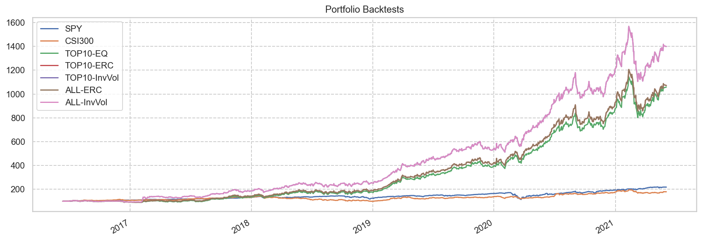

# 量化稳健成长

Last Update: 2021-06-10

[雪球实盘](https://xueqiu.com/P/ZH2566764)建立日期: 2021年6月10日

**策略说明：**

量化选择过去3年中成长性表现最好的10只A股标的，每月调仓一次，仓位模型为InvVol，时间窗口过去3个月。

### 量化选股

#### 选择指标

* 负债率 < 50%
* 应收比 < 20%
* 商誉比 < 10%
* ROE >= 20%
* 利润率 >= 20%
* 收入增长（三年平均） >= 10% 且 盈利增长（三年平均） >= 10%
* 收入增长TTM >= 5% 且 盈利增长TTM >= 5%
* CAGR > 5%
* 最大回撤 < 50%
* 市值 > 10B USD

#### 排序

* ROE倒排

<table id="T_fba7a_" ><thead>    <tr>        <th class="blank level0" ></th>        <th class="col_heading level0 col0" >名称</th>        <th class="col_heading level0 col1" >负债率</th>        <th class="col_heading level0 col2" >ROE</th>        <th class="col_heading level0 col3" >利润率</th>        <th class="col_heading level0 col4" >收入增长</th>        <th class="col_heading level0 col5" >收入增长TTM</th>        <th class="col_heading level0 col6" >盈利增长</th>        <th class="col_heading level0 col7" >盈利增长TTM</th>        <th class="col_heading level0 col8" >FCF增长</th>        <th class="col_heading level0 col9" >PE</th>        <th class="col_heading level0 col10" >PEm</th>        <th class="col_heading level0 col11" >PEG</th>        <th class="col_heading level0 col12" >CAGR</th>        <th class="col_heading level0 col13" >最大回撤</th>        <th class="col_heading level0 col14" >Calmar</th>        <th class="col_heading level0 col15" >折价率</th>        <th class="col_heading level0 col16" >回报率</th>    </tr>    <tr>        <th class="index_name level0" >Symbol</th>        <th class="blank" ></th>        <th class="blank" ></th>        <th class="blank" ></th>        <th class="blank" ></th>        <th class="blank" ></th>        <th class="blank" ></th>        <th class="blank" ></th>        <th class="blank" ></th>        <th class="blank" ></th>        <th class="blank" ></th>        <th class="blank" ></th>        <th class="blank" ></th>        <th class="blank" ></th>        <th class="blank" ></th>        <th class="blank" ></th>        <th class="blank" ></th>        <th class="blank" ></th>    </tr></thead><tbody>
                <tr>
                        <th id="T_fba7a_level0_row0" class="row_heading level0 row0" >603288.SS</th>
                        <td id="T_fba7a_row0_col0" class="data row0 col0" >海天味业</td>
                        <td id="T_fba7a_row0_col1" class="data row0 col1" >31.72</td>
                        <td id="T_fba7a_row0_col2" class="data row0 col2" >31.42</td>
                        <td id="T_fba7a_row0_col3" class="data row0 col3" >26.24</td>
                        <td id="T_fba7a_row0_col4" class="data row0 col4" >16.05</td>
                        <td id="T_fba7a_row0_col5" class="data row0 col5" >5.59</td>
                        <td id="T_fba7a_row0_col6" class="data row0 col6" >21.95</td>
                        <td id="T_fba7a_row0_col7" class="data row0 col7" >5.32</td>
                        <td id="T_fba7a_row0_col8" class="data row0 col8" >11.37</td>
                        <td id="T_fba7a_row0_col9" class="data row0 col9" >66.07</td>
                        <td id="T_fba7a_row0_col10" class="data row0 col10" >90.64</td>
                        <td id="T_fba7a_row0_col11" class="data row0 col11" >4.13</td>
                        <td id="T_fba7a_row0_col12" class="data row0 col12" >44.08</td>
                        <td id="T_fba7a_row0_col13" class="data row0 col13" >-31.85</td>
                        <td id="T_fba7a_row0_col14" class="data row0 col14" >1.38</td>
                        <td id="T_fba7a_row0_col15" class="data row0 col15" >-366.47</td>
                        <td id="T_fba7a_row0_col16" class="data row0 col16" >197.11</td>
            </tr>
            <tr>
                        <th id="T_fba7a_level0_row1" class="row_heading level0 row1" >002714.SZ</th>
                        <td id="T_fba7a_row1_col0" class="data row1 col0" >牧原股份</td>
                        <td id="T_fba7a_row1_col1" class="data row1 col1" >46.09</td>
                        <td id="T_fba7a_row1_col2" class="data row1 col2" >28.10</td>
                        <td id="T_fba7a_row1_col3" class="data row1 col3" >26.61</td>
                        <td id="T_fba7a_row1_col4" class="data row1 col4" >87.55</td>
                        <td id="T_fba7a_row1_col5" class="data row1 col5" >21.47</td>
                        <td id="T_fba7a_row1_col6" class="data row1 col6" >448.77</td>
                        <td id="T_fba7a_row1_col7" class="data row1 col7" >10.32</td>
                        <td id="T_fba7a_row1_col8" class="data row1 col8" >199.27</td>
                        <td id="T_fba7a_row1_col9" class="data row1 col9" >8.29</td>
                        <td id="T_fba7a_row1_col10" class="data row1 col10" >27.97</td>
                        <td id="T_fba7a_row1_col11" class="data row1 col11" >0.06</td>
                        <td id="T_fba7a_row1_col12" class="data row1 col12" >82.88</td>
                        <td id="T_fba7a_row1_col13" class="data row1 col13" >-29.80</td>
                        <td id="T_fba7a_row1_col14" class="data row1 col14" >2.78</td>
                        <td id="T_fba7a_row1_col15" class="data row1 col15" >-</td>
                        <td id="T_fba7a_row1_col16" class="data row1 col16" >504.82</td>
            </tr>
            <tr>
                        <th id="T_fba7a_level0_row2" class="row_heading level0 row2" >600570.SS</th>
                        <td id="T_fba7a_row2_col0" class="data row2 col0" >恒生电子</td>
                        <td id="T_fba7a_row2_col1" class="data row2 col1" >49.48</td>
                        <td id="T_fba7a_row2_col2" class="data row2 col2" >24.06</td>
                        <td id="T_fba7a_row2_col3" class="data row2 col3" >26.42</td>
                        <td id="T_fba7a_row2_col4" class="data row2 col4" >16.27</td>
                        <td id="T_fba7a_row2_col5" class="data row2 col5" >5.69</td>
                        <td id="T_fba7a_row2_col6" class="data row2 col6" >49.90</td>
                        <td id="T_fba7a_row2_col7" class="data row2 col7" >16.16</td>
                        <td id="T_fba7a_row2_col8" class="data row2 col8" >10.32</td>
                        <td id="T_fba7a_row2_col9" class="data row2 col9" >58.78</td>
                        <td id="T_fba7a_row2_col10" class="data row2 col10" >95.23</td>
                        <td id="T_fba7a_row2_col11" class="data row2 col11" >1.91</td>
                        <td id="T_fba7a_row2_col12" class="data row2 col12" >37.63</td>
                        <td id="T_fba7a_row2_col13" class="data row2 col13" >-38.38</td>
                        <td id="T_fba7a_row2_col14" class="data row2 col14" >0.98</td>
                        <td id="T_fba7a_row2_col15" class="data row2 col15" >-604.99</td>
                        <td id="T_fba7a_row2_col16" class="data row2 col16" >159.14</td>
            </tr>
            <tr>
                        <th id="T_fba7a_level0_row3" class="row_heading level0 row3" >600763.SS</th>
                        <td id="T_fba7a_row3_col0" class="data row3 col0" >通策医疗</td>
                        <td id="T_fba7a_row3_col1" class="data row3 col1" >23.37</td>
                        <td id="T_fba7a_row3_col2" class="data row3 col2" >23.98</td>
                        <td id="T_fba7a_row3_col3" class="data row3 col3" >21.89</td>
                        <td id="T_fba7a_row3_col4" class="data row3 col4" >21.36</td>
                        <td id="T_fba7a_row3_col5" class="data row3 col5" >20.99</td>
                        <td id="T_fba7a_row3_col6" class="data row3 col6" >33.13</td>
                        <td id="T_fba7a_row3_col7" class="data row3 col7" >37.14</td>
                        <td id="T_fba7a_row3_col8" class="data row3 col8" >38.60</td>
                        <td id="T_fba7a_row3_col9" class="data row3 col9" >176.39</td>
                        <td id="T_fba7a_row3_col10" class="data row3 col10" >315.32</td>
                        <td id="T_fba7a_row3_col11" class="data row3 col11" >9.52</td>
                        <td id="T_fba7a_row3_col12" class="data row3 col12" >104.02</td>
                        <td id="T_fba7a_row3_col13" class="data row3 col13" >-45.88</td>
                        <td id="T_fba7a_row3_col14" class="data row3 col14" >2.27</td>
                        <td id="T_fba7a_row3_col15" class="data row3 col15" >-846.40</td>
                        <td id="T_fba7a_row3_col16" class="data row3 col16" >738.06</td>
            </tr>
            <tr>
                        <th id="T_fba7a_level0_row4" class="row_heading level0 row4" >300595.SZ</th>
                        <td id="T_fba7a_row4_col0" class="data row4 col0" >欧普康视</td>
                        <td id="T_fba7a_row4_col1" class="data row4 col1" >10.02</td>
                        <td id="T_fba7a_row4_col2" class="data row4 col2" >21.91</td>
                        <td id="T_fba7a_row4_col3" class="data row4 col3" >48.20</td>
                        <td id="T_fba7a_row4_col4" class="data row4 col4" >40.94</td>
                        <td id="T_fba7a_row4_col5" class="data row4 col5" >21.01</td>
                        <td id="T_fba7a_row4_col6" class="data row4 col6" >42.15</td>
                        <td id="T_fba7a_row4_col7" class="data row4 col7" >23.11</td>
                        <td id="T_fba7a_row4_col8" class="data row4 col8" >54.08</td>
                        <td id="T_fba7a_row4_col9" class="data row4 col9" >114.88</td>
                        <td id="T_fba7a_row4_col10" class="data row4 col10" >220.13</td>
                        <td id="T_fba7a_row4_col11" class="data row4 col11" >5.22</td>
                        <td id="T_fba7a_row4_col12" class="data row4 col12" >113.95</td>
                        <td id="T_fba7a_row4_col13" class="data row4 col13" >-42.52</td>
                        <td id="T_fba7a_row4_col14" class="data row4 col14" >2.68</td>
                        <td id="T_fba7a_row4_col15" class="data row4 col15" >-706.63</td>
                        <td id="T_fba7a_row4_col16" class="data row4 col16" >865.64</td>
            </tr>
    </tbody></table>

### 历史回测

    Stat                 SPY         CSI300      TOP10-EQ    TOP10-ERC    TOP10-InvVol    ALL-ERC     ALL-InvVol
    -------------------  ----------  ----------  ----------  -----------  --------------  ----------  ------------
    Start                2016-06-12  2016-06-12  2016-06-12  2016-06-12   2016-06-12      2016-06-12  2016-06-12
    End                  2021-06-03  2021-06-03  2021-06-03  2021-06-03   2021-06-03      2021-06-03  2021-06-03
    Risk-free rate       0.00%       0.00%       0.00%       0.00%        0.00%           0.00%       0.00%
    
    Total Return         118.15%     79.00%      958.47%     971.53%      1298.68%        971.53%     1298.68%
    Daily Sharpe         0.97        0.74        1.83        1.89         2.01            1.89        2.01
    Daily Sortino        1.44        1.21        3.12        3.23         3.60            3.23        3.60
    CAGR                 16.98%      12.42%      60.69%      61.08%       69.95%          61.08%      69.95%
    Max Drawdown         -33.71%     -31.29%     -30.05%     -28.92%      -29.51%         -28.92%     -29.51%
    Calmar Ratio         0.50        0.40        2.02        2.11         2.37            2.11        2.37
    
    MTD                  -0.07%      -0.21%      0.70%       -0.61%       -0.47%          -0.61%      -0.47%
    3m                   10.15%      -2.51%      13.53%      8.43%        9.60%           8.43%       9.60%
    6m                   15.06%      3.67%       36.48%      29.71%       30.06%          29.71%      30.06%
    YTD                  12.37%      0.57%       20.65%      15.45%       15.55%          15.45%      15.55%
    1Y                   36.29%      33.66%      81.52%      71.71%       74.96%          71.71%      74.96%
    3Y (ann.)            17.22%      13.01%      82.84%      79.65%       79.09%          79.65%      79.09%
    5Y (ann.)            16.98%      12.42%      60.69%      61.08%       69.95%          61.08%      69.95%
    10Y (ann.)           -           -           -           -            -               -           -
    Since Incep. (ann.)  16.98%      12.42%      60.69%      61.08%       69.95%          61.08%      69.95%
    
    Daily Sharpe         0.97        0.74        1.83        1.89         2.01            1.89        2.01
    Daily Sortino        1.44        1.21        3.12        3.23         3.60            3.23        3.60
    Daily Mean (ann.)    18.69%      14.50%      55.59%      55.57%       61.68%          55.57%      61.68%
    Daily Vol (ann.)     19.18%      19.70%      30.42%      29.47%       30.73%          29.47%      30.73%
    Daily Skew           -0.77       0.03        -0.23       -0.22        0.21            -0.22       0.21
    Daily Kurt           18.46       6.80        2.04        1.91         3.11            1.91        3.11
    Best Day             9.06%       9.47%       7.64%       7.47%        9.87%           7.47%       9.87%
    Worst Day            -10.94%     -8.43%      -8.70%      -8.30%       -8.03%          -8.30%      -8.03%
    
    Monthly Sharpe       1.09        0.79        1.89        1.96         1.79            1.96        1.79
    Monthly Sortino      1.81        1.59        5.87        5.98         6.87            5.98        6.87
    Monthly Mean (ann.)  16.89%      13.00%      51.57%      51.64%       58.59%          51.64%      58.59%
    Monthly Vol (ann.)   15.45%      16.37%      27.23%      26.39%       32.75%          26.39%      32.75%
    Monthly Skew         -0.76       0.28        0.41        0.30         1.73            0.30        1.73
    Monthly Kurt         2.27        0.56        -0.33       -0.45        6.36            -0.45       6.36
    Best Month           12.70%      14.40%      22.93%      21.44%       48.45%          21.44%      48.45%
    Worst Month          -12.49%     -8.64%      -9.79%      -10.50%      -10.24%         -10.50%     -10.24%
    
    Yearly Sharpe        1.14        0.53        1.38        1.41         1.62            1.41        1.62
    Yearly Sortino       6.58        1.25        inf         inf          inf             inf         inf
    Yearly Mean          15.88%      13.49%      68.69%      68.74%       77.58%          68.74%      77.58%
    Yearly Vol           13.94%      25.27%      49.85%      48.90%       47.98%          48.90%      47.98%
    Yearly Skew          -0.77       -0.90       0.45        0.27         -0.58           0.27        -0.58
    Yearly Kurt          1.28        -0.33       -3.12       -2.84        -2.47           -2.84       -2.47
    Best Year            32.37%      38.60%      123.43%     120.63%      123.59%         120.63%     123.59%
    Worst Year           -5.40%      -24.16%     20.65%      15.45%       15.55%          15.45%      15.55%
    
    Avg. Drawdown        -1.41%      -3.28%      -3.48%      -3.32%       -3.51%          -3.32%      -3.51%
    Avg. Drawdown Days   13.23       47.86       16.63       15.55        15.17           15.55       15.17
    Avg. Up Month        3.14%       3.80%       7.84%       7.97%        8.81%           7.97%       8.81%
    Avg. Down Month      -4.84%      -3.61%      -4.66%      -4.25%       -4.28%          -4.25%      -4.28%
    Win Year %           80.00%      80.00%      100.00%     100.00%      100.00%         100.00%     100.00%
    Win 12m %            96.00%      80.00%      96.00%      98.00%       100.00%         98.00%      100.00%

    

    

### 当前仓位

    Date: 2021-06-04 00:00:00

<table id="T_b1efb_" ><thead>    <tr>        <th class="blank level0" ></th>        <th class="col_heading level0 col0" >Weight</th>        <th class="col_heading level0 col1" >名称</th>        <th class="col_heading level0 col2" >负债率</th>        <th class="col_heading level0 col3" >ROE</th>        <th class="col_heading level0 col4" >利润率</th>        <th class="col_heading level0 col5" >收入增长</th>        <th class="col_heading level0 col6" >收入增长TTM</th>        <th class="col_heading level0 col7" >盈利增长</th>        <th class="col_heading level0 col8" >盈利增长TTM</th>        <th class="col_heading level0 col9" >FCF增长</th>        <th class="col_heading level0 col10" >PE</th>        <th class="col_heading level0 col11" >PEm</th>        <th class="col_heading level0 col12" >PEG</th>        <th class="col_heading level0 col13" >CAGR</th>        <th class="col_heading level0 col14" >最大回撤</th>        <th class="col_heading level0 col15" >Calmar</th>        <th class="col_heading level0 col16" >折价率</th>        <th class="col_heading level0 col17" >回报率</th>    </tr></thead><tbody>
                <tr>
                        <th id="T_b1efb_level0_row0" class="row_heading level0 row0" >603288.SS</th>
                        <td id="T_b1efb_row0_col0" class="data row0 col0" >24.09</td>
                        <td id="T_b1efb_row0_col1" class="data row0 col1" >海天味业</td>
                        <td id="T_b1efb_row0_col2" class="data row0 col2" >31.72</td>
                        <td id="T_b1efb_row0_col3" class="data row0 col3" >31.42</td>
                        <td id="T_b1efb_row0_col4" class="data row0 col4" >26.24</td>
                        <td id="T_b1efb_row0_col5" class="data row0 col5" >16.05</td>
                        <td id="T_b1efb_row0_col6" class="data row0 col6" >5.59</td>
                        <td id="T_b1efb_row0_col7" class="data row0 col7" >21.95</td>
                        <td id="T_b1efb_row0_col8" class="data row0 col8" >5.32</td>
                        <td id="T_b1efb_row0_col9" class="data row0 col9" >11.37</td>
                        <td id="T_b1efb_row0_col10" class="data row0 col10" >66.07</td>
                        <td id="T_b1efb_row0_col11" class="data row0 col11" >90.64</td>
                        <td id="T_b1efb_row0_col12" class="data row0 col12" >4.13</td>
                        <td id="T_b1efb_row0_col13" class="data row0 col13" >44.08</td>
                        <td id="T_b1efb_row0_col14" class="data row0 col14" >-31.85</td>
                        <td id="T_b1efb_row0_col15" class="data row0 col15" >1.38</td>
                        <td id="T_b1efb_row0_col16" class="data row0 col16" >-366.47</td>
                        <td id="T_b1efb_row0_col17" class="data row0 col17" >197.11</td>
            </tr>
            <tr>
                        <th id="T_b1efb_level0_row1" class="row_heading level0 row1" >600570.SS</th>
                        <td id="T_b1efb_row1_col0" class="data row1 col0" >22.79</td>
                        <td id="T_b1efb_row1_col1" class="data row1 col1" >恒生电子</td>
                        <td id="T_b1efb_row1_col2" class="data row1 col2" >49.48</td>
                        <td id="T_b1efb_row1_col3" class="data row1 col3" >24.06</td>
                        <td id="T_b1efb_row1_col4" class="data row1 col4" >26.42</td>
                        <td id="T_b1efb_row1_col5" class="data row1 col5" >16.27</td>
                        <td id="T_b1efb_row1_col6" class="data row1 col6" >5.69</td>
                        <td id="T_b1efb_row1_col7" class="data row1 col7" >49.90</td>
                        <td id="T_b1efb_row1_col8" class="data row1 col8" >16.16</td>
                        <td id="T_b1efb_row1_col9" class="data row1 col9" >10.32</td>
                        <td id="T_b1efb_row1_col10" class="data row1 col10" >58.78</td>
                        <td id="T_b1efb_row1_col11" class="data row1 col11" >95.23</td>
                        <td id="T_b1efb_row1_col12" class="data row1 col12" >1.91</td>
                        <td id="T_b1efb_row1_col13" class="data row1 col13" >37.63</td>
                        <td id="T_b1efb_row1_col14" class="data row1 col14" >-38.38</td>
                        <td id="T_b1efb_row1_col15" class="data row1 col15" >0.98</td>
                        <td id="T_b1efb_row1_col16" class="data row1 col16" >-604.99</td>
                        <td id="T_b1efb_row1_col17" class="data row1 col17" >159.14</td>
            </tr>
            <tr>
                        <th id="T_b1efb_level0_row2" class="row_heading level0 row2" >002714.SZ</th>
                        <td id="T_b1efb_row2_col0" class="data row2 col0" >21.38</td>
                        <td id="T_b1efb_row2_col1" class="data row2 col1" >牧原股份</td>
                        <td id="T_b1efb_row2_col2" class="data row2 col2" >46.09</td>
                        <td id="T_b1efb_row2_col3" class="data row2 col3" >28.10</td>
                        <td id="T_b1efb_row2_col4" class="data row2 col4" >26.61</td>
                        <td id="T_b1efb_row2_col5" class="data row2 col5" >87.55</td>
                        <td id="T_b1efb_row2_col6" class="data row2 col6" >21.47</td>
                        <td id="T_b1efb_row2_col7" class="data row2 col7" >448.77</td>
                        <td id="T_b1efb_row2_col8" class="data row2 col8" >10.32</td>
                        <td id="T_b1efb_row2_col9" class="data row2 col9" >199.27</td>
                        <td id="T_b1efb_row2_col10" class="data row2 col10" >8.29</td>
                        <td id="T_b1efb_row2_col11" class="data row2 col11" >27.97</td>
                        <td id="T_b1efb_row2_col12" class="data row2 col12" >0.06</td>
                        <td id="T_b1efb_row2_col13" class="data row2 col13" >82.88</td>
                        <td id="T_b1efb_row2_col14" class="data row2 col14" >-29.80</td>
                        <td id="T_b1efb_row2_col15" class="data row2 col15" >2.78</td>
                        <td id="T_b1efb_row2_col16" class="data row2 col16" >-</td>
                        <td id="T_b1efb_row2_col17" class="data row2 col17" >504.82</td>
            </tr>
            <tr>
                        <th id="T_b1efb_level0_row3" class="row_heading level0 row3" >300595.SZ</th>
                        <td id="T_b1efb_row3_col0" class="data row3 col0" >16.74</td>
                        <td id="T_b1efb_row3_col1" class="data row3 col1" >欧普康视</td>
                        <td id="T_b1efb_row3_col2" class="data row3 col2" >10.02</td>
                        <td id="T_b1efb_row3_col3" class="data row3 col3" >21.91</td>
                        <td id="T_b1efb_row3_col4" class="data row3 col4" >48.20</td>
                        <td id="T_b1efb_row3_col5" class="data row3 col5" >40.94</td>
                        <td id="T_b1efb_row3_col6" class="data row3 col6" >21.01</td>
                        <td id="T_b1efb_row3_col7" class="data row3 col7" >42.15</td>
                        <td id="T_b1efb_row3_col8" class="data row3 col8" >23.11</td>
                        <td id="T_b1efb_row3_col9" class="data row3 col9" >54.08</td>
                        <td id="T_b1efb_row3_col10" class="data row3 col10" >114.88</td>
                        <td id="T_b1efb_row3_col11" class="data row3 col11" >220.13</td>
                        <td id="T_b1efb_row3_col12" class="data row3 col12" >5.22</td>
                        <td id="T_b1efb_row3_col13" class="data row3 col13" >113.95</td>
                        <td id="T_b1efb_row3_col14" class="data row3 col14" >-42.52</td>
                        <td id="T_b1efb_row3_col15" class="data row3 col15" >2.68</td>
                        <td id="T_b1efb_row3_col16" class="data row3 col16" >-706.63</td>
                        <td id="T_b1efb_row3_col17" class="data row3 col17" >865.64</td>
            </tr>
            <tr>
                        <th id="T_b1efb_level0_row4" class="row_heading level0 row4" >600763.SS</th>
                        <td id="T_b1efb_row4_col0" class="data row4 col0" >14.99</td>
                        <td id="T_b1efb_row4_col1" class="data row4 col1" >通策医疗</td>
                        <td id="T_b1efb_row4_col2" class="data row4 col2" >23.37</td>
                        <td id="T_b1efb_row4_col3" class="data row4 col3" >23.98</td>
                        <td id="T_b1efb_row4_col4" class="data row4 col4" >21.89</td>
                        <td id="T_b1efb_row4_col5" class="data row4 col5" >21.36</td>
                        <td id="T_b1efb_row4_col6" class="data row4 col6" >20.99</td>
                        <td id="T_b1efb_row4_col7" class="data row4 col7" >33.13</td>
                        <td id="T_b1efb_row4_col8" class="data row4 col8" >37.14</td>
                        <td id="T_b1efb_row4_col9" class="data row4 col9" >38.60</td>
                        <td id="T_b1efb_row4_col10" class="data row4 col10" >176.39</td>
                        <td id="T_b1efb_row4_col11" class="data row4 col11" >315.32</td>
                        <td id="T_b1efb_row4_col12" class="data row4 col12" >9.52</td>
                        <td id="T_b1efb_row4_col13" class="data row4 col13" >104.02</td>
                        <td id="T_b1efb_row4_col14" class="data row4 col14" >-45.88</td>
                        <td id="T_b1efb_row4_col15" class="data row4 col15" >2.27</td>
                        <td id="T_b1efb_row4_col16" class="data row4 col16" >-846.40</td>
                        <td id="T_b1efb_row4_col17" class="data row4 col17" >738.06</td>
            </tr>
    </tbody></table>

