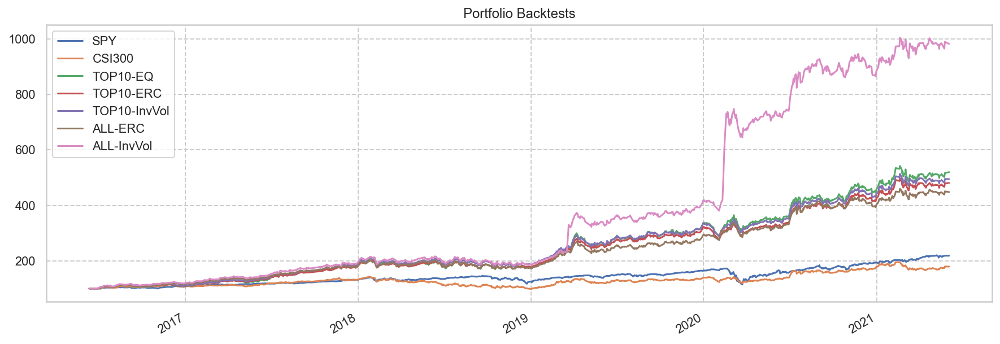

# 量化大型稳健成长

Last Update: 2021-06-10

[雪球实盘](https://xueqiu.com/P/ZH2567050)建立日期: 2021年6月10日

**策略说明:**

量化选择过去3年中运营稳健、成长性表现最好的10只A股大市值标的，每3个月调仓一次，仓位模型为InvVol，时间窗口过去3个月。

### 量化选股

#### 选择指标

* 负债率 < 50%
* 应收比 < 10%
* 商誉比 < 10%
* ROE >= 15%
* 利润率 >= 15%
* 收入增长（三年平均） >= 5% 且 盈利增长（三年平均） >= 5%
* 收入增长TTM >= 0% 且 盈利增长TTM >= 0%
* FCF增长 > 0%
* 市值 > 100B USD
* DCF折价率 > -200%

#### 排序

* 市值倒排

<table id="T_e4da0_" ><thead>    <tr>        <th class="blank level0" ></th>        <th class="col_heading level0 col0" >名称</th>        <th class="col_heading level0 col1" >负债率</th>        <th class="col_heading level0 col2" >ROE</th>        <th class="col_heading level0 col3" >利润率</th>        <th class="col_heading level0 col4" >收入增长</th>        <th class="col_heading level0 col5" >收入增长TTM</th>        <th class="col_heading level0 col6" >盈利增长</th>        <th class="col_heading level0 col7" >盈利增长TTM</th>        <th class="col_heading level0 col8" >FCF增长</th>        <th class="col_heading level0 col9" >PE</th>        <th class="col_heading level0 col10" >PEm</th>        <th class="col_heading level0 col11" >PEG</th>        <th class="col_heading level0 col12" >CAGR</th>        <th class="col_heading level0 col13" >最大回撤</th>        <th class="col_heading level0 col14" >Calmar</th>        <th class="col_heading level0 col15" >折价率</th>        <th class="col_heading level0 col16" >回报率</th>    </tr>    <tr>        <th class="index_name level0" >Symbol</th>        <th class="blank" ></th>        <th class="blank" ></th>        <th class="blank" ></th>        <th class="blank" ></th>        <th class="blank" ></th>        <th class="blank" ></th>        <th class="blank" ></th>        <th class="blank" ></th>        <th class="blank" ></th>        <th class="blank" ></th>        <th class="blank" ></th>        <th class="blank" ></th>        <th class="blank" ></th>        <th class="blank" ></th>        <th class="blank" ></th>        <th class="blank" ></th>        <th class="blank" ></th>    </tr></thead><tbody>
                <tr>
                        <th id="T_e4da0_level0_row0" class="row_heading level0 row0" >600519.SS</th>
                        <td id="T_e4da0_row0_col0" class="data row0 col0" >贵州茅台</td>
                        <td id="T_e4da0_row0_col1" class="data row0 col1" >21.40</td>
                        <td id="T_e4da0_row0_col2" class="data row0 col2" >30.01</td>
                        <td id="T_e4da0_row0_col3" class="data row0 col3" >47.94</td>
                        <td id="T_e4da0_row0_col4" class="data row0 col4" >17.87</td>
                        <td id="T_e4da0_row0_col5" class="data row0 col5" >3.02</td>
                        <td id="T_e4da0_row0_col6" class="data row0 col6" >20.13</td>
                        <td id="T_e4da0_row0_col7" class="data row0 col7" >1.84</td>
                        <td id="T_e4da0_row0_col8" class="data row0 col8" >37.59</td>
                        <td id="T_e4da0_row0_col9" class="data row0 col9" >59.47</td>
                        <td id="T_e4da0_row0_col10" class="data row0 col10" >75.33</td>
                        <td id="T_e4da0_row0_col11" class="data row0 col11" >3.74</td>
                        <td id="T_e4da0_row0_col12" class="data row0 col12" >44.91</td>
                        <td id="T_e4da0_row0_col13" class="data row0 col13" >-33.50</td>
                        <td id="T_e4da0_row0_col14" class="data row0 col14" >1.34</td>
                        <td id="T_e4da0_row0_col15" class="data row0 col15" >-137.77</td>
                        <td id="T_e4da0_row0_col16" class="data row0 col16" >202.21</td>
            </tr>
            <tr>
                        <th id="T_e4da0_level0_row1" class="row_heading level0 row1" >600900.SS</th>
                        <td id="T_e4da0_row1_col0" class="data row1 col0" >长江电力</td>
                        <td id="T_e4da0_row1_col1" class="data row1 col1" >46.10</td>
                        <td id="T_e4da0_row1_col2" class="data row1 col2" >15.52</td>
                        <td id="T_e4da0_row1_col3" class="data row1 col3" >44.31</td>
                        <td id="T_e4da0_row1_col4" class="data row1 col4" >5.12</td>
                        <td id="T_e4da0_row1_col5" class="data row1 col5" >0.84</td>
                        <td id="T_e4da0_row1_col6" class="data row1 col6" >6.31</td>
                        <td id="T_e4da0_row1_col7" class="data row1 col7" >2.20</td>
                        <td id="T_e4da0_row1_col8" class="data row1 col8" >0.54</td>
                        <td id="T_e4da0_row1_col9" class="data row1 col9" >16.54</td>
                        <td id="T_e4da0_row1_col10" class="data row1 col10" >19.50</td>
                        <td id="T_e4da0_row1_col11" class="data row1 col11" >3.09</td>
                        <td id="T_e4da0_row1_col12" class="data row1 col12" >9.47</td>
                        <td id="T_e4da0_row1_col13" class="data row1 col13" >-16.39</td>
                        <td id="T_e4da0_row1_col14" class="data row1 col14" >0.58</td>
                        <td id="T_e4da0_row1_col15" class="data row1 col15" >3.28</td>
                        <td id="T_e4da0_row1_col16" class="data row1 col16" >30.97</td>
            </tr>
            <tr>
                        <th id="T_e4da0_level0_row2" class="row_heading level0 row2" >002714.SZ</th>
                        <td id="T_e4da0_row2_col0" class="data row2 col0" >牧原股份</td>
                        <td id="T_e4da0_row2_col1" class="data row2 col1" >46.09</td>
                        <td id="T_e4da0_row2_col2" class="data row2 col2" >28.10</td>
                        <td id="T_e4da0_row2_col3" class="data row2 col3" >26.61</td>
                        <td id="T_e4da0_row2_col4" class="data row2 col4" >87.55</td>
                        <td id="T_e4da0_row2_col5" class="data row2 col5" >21.47</td>
                        <td id="T_e4da0_row2_col6" class="data row2 col6" >448.77</td>
                        <td id="T_e4da0_row2_col7" class="data row2 col7" >10.32</td>
                        <td id="T_e4da0_row2_col8" class="data row2 col8" >199.27</td>
                        <td id="T_e4da0_row2_col9" class="data row2 col9" >8.29</td>
                        <td id="T_e4da0_row2_col10" class="data row2 col10" >27.97</td>
                        <td id="T_e4da0_row2_col11" class="data row2 col11" >0.06</td>
                        <td id="T_e4da0_row2_col12" class="data row2 col12" >82.88</td>
                        <td id="T_e4da0_row2_col13" class="data row2 col13" >-29.80</td>
                        <td id="T_e4da0_row2_col14" class="data row2 col14" >2.78</td>
                        <td id="T_e4da0_row2_col15" class="data row2 col15" >-</td>
                        <td id="T_e4da0_row2_col16" class="data row2 col16" >504.82</td>
            </tr>
            <tr>
                        <th id="T_e4da0_level0_row3" class="row_heading level0 row3" >600585.SS</th>
                        <td id="T_e4da0_row3_col0" class="data row3 col0" >海螺水泥</td>
                        <td id="T_e4da0_row3_col1" class="data row3 col1" >16.30</td>
                        <td id="T_e4da0_row3_col2" class="data row3 col2" >22.59</td>
                        <td id="T_e4da0_row3_col3" class="data row3 col3" >21.40</td>
                        <td id="T_e4da0_row3_col4" class="data row3 col4" >35.01</td>
                        <td id="T_e4da0_row3_col5" class="data row3 col5" >6.37</td>
                        <td id="T_e4da0_row3_col6" class="data row3 col6" >35.10</td>
                        <td id="T_e4da0_row3_col7" class="data row3 col7" >2.55</td>
                        <td id="T_e4da0_row3_col8" class="data row3 col8" >36.04</td>
                        <td id="T_e4da0_row3_col9" class="data row3 col9" >7.10</td>
                        <td id="T_e4da0_row3_col10" class="data row3 col10" >8.49</td>
                        <td id="T_e4da0_row3_col11" class="data row3 col11" >0.24</td>
                        <td id="T_e4da0_row3_col12" class="data row3 col12" >14.76</td>
                        <td id="T_e4da0_row3_col13" class="data row3 col13" >-27.78</td>
                        <td id="T_e4da0_row3_col14" class="data row3 col14" >0.53</td>
                        <td id="T_e4da0_row3_col15" class="data row3 col15" >68.41</td>
                        <td id="T_e4da0_row3_col16" class="data row3 col16" >50.76</td>
            </tr>
            <tr>
                        <th id="T_e4da0_level0_row4" class="row_heading level0 row4" >601225.SS</th>
                        <td id="T_e4da0_row4_col0" class="data row4 col0" >陕西煤业</td>
                        <td id="T_e4da0_row4_col1" class="data row4 col1" >39.78</td>
                        <td id="T_e4da0_row4_col2" class="data row4 col2" >21.57</td>
                        <td id="T_e4da0_row4_col3" class="data row4 col3" >17.80</td>
                        <td id="T_e4da0_row4_col4" class="data row4 col4" >23.29</td>
                        <td id="T_e4da0_row4_col5" class="data row4 col5" >17.32</td>
                        <td id="T_e4da0_row4_col6" class="data row4 col6" >12.98</td>
                        <td id="T_e4da0_row4_col7" class="data row4 col7" >6.82</td>
                        <td id="T_e4da0_row4_col8" class="data row4 col8" >3.92</td>
                        <td id="T_e4da0_row4_col9" class="data row4 col9" >7.77</td>
                        <td id="T_e4da0_row4_col10" class="data row4 col10" >9.98</td>
                        <td id="T_e4da0_row4_col11" class="data row4 col11" >0.77</td>
                        <td id="T_e4da0_row4_col12" class="data row4 col12" >17.51</td>
                        <td id="T_e4da0_row4_col13" class="data row4 col13" >-28.52</td>
                        <td id="T_e4da0_row4_col14" class="data row4 col14" >0.61</td>
                        <td id="T_e4da0_row4_col15" class="data row4 col15" >37.95</td>
                        <td id="T_e4da0_row4_col16" class="data row4 col16" >61.77</td>
            </tr>
            <tr>
                        <th id="T_e4da0_level0_row5" class="row_heading level0 row5" >603195.SS</th>
                        <td id="T_e4da0_row5_col0" class="data row5 col0" >公牛集团</td>
                        <td id="T_e4da0_row5_col1" class="data row5 col1" >26.53</td>
                        <td id="T_e4da0_row5_col2" class="data row5 col2" >50.07</td>
                        <td id="T_e4da0_row5_col3" class="data row5 col3" >20.55</td>
                        <td id="T_e4da0_row5_col4" class="data row5 col4" >12.02</td>
                        <td id="T_e4da0_row5_col5" class="data row5 col5" >11.88</td>
                        <td id="T_e4da0_row5_col6" class="data row5 col6" >22.75</td>
                        <td id="T_e4da0_row5_col7" class="data row5 col7" >18.87</td>
                        <td id="T_e4da0_row5_col8" class="data row5 col8" >61.00</td>
                        <td id="T_e4da0_row5_col9" class="data row5 col9" >49.70</td>
                        <td id="T_e4da0_row5_col10" class="data row5 col10" >61.28</td>
                        <td id="T_e4da0_row5_col11" class="data row5 col11" >2.69</td>
                        <td id="T_e4da0_row5_col12" class="data row5 col12" >-</td>
                        <td id="T_e4da0_row5_col13" class="data row5 col13" >-34.35</td>
                        <td id="T_e4da0_row5_col14" class="data row5 col14" >-</td>
                        <td id="T_e4da0_row5_col15" class="data row5 col15" >-34.61</td>
                        <td id="T_e4da0_row5_col16" class="data row5 col16" >-</td>
            </tr>
            <tr>
                        <th id="T_e4da0_level0_row6" class="row_heading level0 row6" >300033.SZ</th>
                        <td id="T_e4da0_row6_col0" class="data row6 col0" >同花顺</td>
                        <td id="T_e4da0_row6_col1" class="data row6 col1" >26.99</td>
                        <td id="T_e4da0_row6_col2" class="data row6 col2" >24.34</td>
                        <td id="T_e4da0_row6_col3" class="data row6 col3" >52.33</td>
                        <td id="T_e4da0_row6_col4" class="data row6 col4" >29.08</td>
                        <td id="T_e4da0_row6_col5" class="data row6 col5" >5.13</td>
                        <td id="T_e4da0_row6_col6" class="data row6 col6" >40.34</td>
                        <td id="T_e4da0_row6_col7" class="data row6 col7" >2.48</td>
                        <td id="T_e4da0_row6_col8" class="data row6 col8" >63.18</td>
                        <td id="T_e4da0_row6_col9" class="data row6 col9" >34.67</td>
                        <td id="T_e4da0_row6_col10" class="data row6 col10" >61.58</td>
                        <td id="T_e4da0_row6_col11" class="data row6 col11" >1.53</td>
                        <td id="T_e4da0_row6_col12" class="data row6 col12" >38.77</td>
                        <td id="T_e4da0_row6_col13" class="data row6 col13" >-41.83</td>
                        <td id="T_e4da0_row6_col14" class="data row6 col14" >0.93</td>
                        <td id="T_e4da0_row6_col15" class="data row6 col15" >-27.89</td>
                        <td id="T_e4da0_row6_col16" class="data row6 col16" >165.61</td>
            </tr>
            <tr>
                        <th id="T_e4da0_level0_row7" class="row_heading level0 row7" >601636.SS</th>
                        <td id="T_e4da0_row7_col0" class="data row7 col0" >旗滨集团</td>
                        <td id="T_e4da0_row7_col1" class="data row7 col1" >33.42</td>
                        <td id="T_e4da0_row7_col2" class="data row7 col2" >16.93</td>
                        <td id="T_e4da0_row7_col3" class="data row7 col3" >15.72</td>
                        <td id="T_e4da0_row7_col4" class="data row7 col4" >8.39</td>
                        <td id="T_e4da0_row7_col5" class="data row7 col5" >16.83</td>
                        <td id="T_e4da0_row7_col6" class="data row7 col6" >17.58</td>
                        <td id="T_e4da0_row7_col7" class="data row7 col7" >39.42</td>
                        <td id="T_e4da0_row7_col8" class="data row7 col8" >28.11</td>
                        <td id="T_e4da0_row7_col9" class="data row7 col9" >25.49</td>
                        <td id="T_e4da0_row7_col10" class="data row7 col10" >33.97</td>
                        <td id="T_e4da0_row7_col11" class="data row7 col11" >1.93</td>
                        <td id="T_e4da0_row7_col12" class="data row7 col12" >60.73</td>
                        <td id="T_e4da0_row7_col13" class="data row7 col13" >-33.07</td>
                        <td id="T_e4da0_row7_col14" class="data row7 col14" >1.84</td>
                        <td id="T_e4da0_row7_col15" class="data row7 col15" >-40.74</td>
                        <td id="T_e4da0_row7_col16" class="data row7 col16" >311.63</td>
            </tr>
            <tr>
                        <th id="T_e4da0_level0_row8" class="row_heading level0 row8" >002372.SZ</th>
                        <td id="T_e4da0_row8_col0" class="data row8 col0" >伟星新材</td>
                        <td id="T_e4da0_row8_col1" class="data row8 col1" >23.20</td>
                        <td id="T_e4da0_row8_col2" class="data row8 col2" >26.35</td>
                        <td id="T_e4da0_row8_col3" class="data row8 col3" >21.72</td>
                        <td id="T_e4da0_row8_col4" class="data row8 col4" >9.53</td>
                        <td id="T_e4da0_row8_col5" class="data row8 col5" >6.51</td>
                        <td id="T_e4da0_row8_col6" class="data row8 col6" >13.64</td>
                        <td id="T_e4da0_row8_col7" class="data row8 col7" >2.24</td>
                        <td id="T_e4da0_row8_col8" class="data row8 col8" >20.85</td>
                        <td id="T_e4da0_row8_col9" class="data row8 col9" >29.85</td>
                        <td id="T_e4da0_row8_col10" class="data row8 col10" >37.73</td>
                        <td id="T_e4da0_row8_col11" class="data row8 col11" >2.77</td>
                        <td id="T_e4da0_row8_col12" class="data row8 col12" >15.65</td>
                        <td id="T_e4da0_row8_col13" class="data row8 col13" >-40.34</td>
                        <td id="T_e4da0_row8_col14" class="data row8 col14" >0.39</td>
                        <td id="T_e4da0_row8_col15" class="data row8 col15" >-112.28</td>
                        <td id="T_e4da0_row8_col16" class="data row8 col16" >54.45</td>
            </tr>
            <tr>
                        <th id="T_e4da0_level0_row9" class="row_heading level0 row9" >600801.SS</th>
                        <td id="T_e4da0_row9_col0" class="data row9 col0" >华新水泥</td>
                        <td id="T_e4da0_row9_col1" class="data row9 col1" >41.40</td>
                        <td id="T_e4da0_row9_col2" class="data row9 col2" >25.55</td>
                        <td id="T_e4da0_row9_col3" class="data row9 col3" >17.04</td>
                        <td id="T_e4da0_row9_col4" class="data row9 col4" >13.11</td>
                        <td id="T_e4da0_row9_col5" class="data row9 col5" >7.97</td>
                        <td id="T_e4da0_row9_col6" class="data row9 col6" >53.52</td>
                        <td id="T_e4da0_row9_col7" class="data row9 col7" >6.75</td>
                        <td id="T_e4da0_row9_col8" class="data row9 col8" >29.58</td>
                        <td id="T_e4da0_row9_col9" class="data row9 col9" >7.67</td>
                        <td id="T_e4da0_row9_col10" class="data row9 col10" >6.15</td>
                        <td id="T_e4da0_row9_col11" class="data row9 col11" >0.11</td>
                        <td id="T_e4da0_row9_col12" class="data row9 col12" >27.00</td>
                        <td id="T_e4da0_row9_col13" class="data row9 col13" >-33.90</td>
                        <td id="T_e4da0_row9_col14" class="data row9 col14" >0.80</td>
                        <td id="T_e4da0_row9_col15" class="data row9 col15" >76.12</td>
                        <td id="T_e4da0_row9_col16" class="data row9 col16" >103.92</td>
            </tr>
            <tr>
                        <th id="T_e4da0_level0_row10" class="row_heading level0 row10" >000672.SZ</th>
                        <td id="T_e4da0_row10_col0" class="data row10 col0" >上峰水泥</td>
                        <td id="T_e4da0_row10_col1" class="data row10 col1" >36.62</td>
                        <td id="T_e4da0_row10_col2" class="data row10 col2" >37.68</td>
                        <td id="T_e4da0_row10_col3" class="data row10 col3" >26.99</td>
                        <td id="T_e4da0_row10_col4" class="data row10 col4" >14.05</td>
                        <td id="T_e4da0_row10_col5" class="data row10 col5" >2.69</td>
                        <td id="T_e4da0_row10_col6" class="data row10 col6" >43.73</td>
                        <td id="T_e4da0_row10_col7" class="data row10 col7" >0.90</td>
                        <td id="T_e4da0_row10_col8" class="data row10 col8" >34.90</td>
                        <td id="T_e4da0_row10_col9" class="data row10 col9" >7.66</td>
                        <td id="T_e4da0_row10_col10" class="data row10 col10" >9.60</td>
                        <td id="T_e4da0_row10_col11" class="data row10 col11" >0.22</td>
                        <td id="T_e4da0_row10_col12" class="data row10 col12" >31.66</td>
                        <td id="T_e4da0_row10_col13" class="data row10 col13" >-44.75</td>
                        <td id="T_e4da0_row10_col14" class="data row10 col14" >0.71</td>
                        <td id="T_e4da0_row10_col15" class="data row10 col15" >66.27</td>
                        <td id="T_e4da0_row10_col16" class="data row10 col16" >127.05</td>
            </tr>
            <tr>
                        <th id="T_e4da0_level0_row11" class="row_heading level0 row11" >002233.SZ</th>
                        <td id="T_e4da0_row11_col0" class="data row11 col0" >塔牌集团</td>
                        <td id="T_e4da0_row11_col1" class="data row11 col1" >17.09</td>
                        <td id="T_e4da0_row11_col2" class="data row11 col2" >15.70</td>
                        <td id="T_e4da0_row11_col3" class="data row11 col3" >23.06</td>
                        <td id="T_e4da0_row11_col4" class="data row11 col4" >17.15</td>
                        <td id="T_e4da0_row11_col5" class="data row11 col5" >7.23</td>
                        <td id="T_e4da0_row11_col6" class="data row11 col6" >47.47</td>
                        <td id="T_e4da0_row11_col7" class="data row11 col7" >1.59</td>
                        <td id="T_e4da0_row11_col8" class="data row11 col8" >161.27</td>
                        <td id="T_e4da0_row11_col9" class="data row11 col9" >7.14</td>
                        <td id="T_e4da0_row11_col10" class="data row11 col10" >8.76</td>
                        <td id="T_e4da0_row11_col11" class="data row11 col11" >0.18</td>
                        <td id="T_e4da0_row11_col12" class="data row11 col12" >4.24</td>
                        <td id="T_e4da0_row11_col13" class="data row11 col13" >-29.22</td>
                        <td id="T_e4da0_row11_col14" class="data row11 col14" >0.15</td>
                        <td id="T_e4da0_row11_col15" class="data row11 col15" >94.31</td>
                        <td id="T_e4da0_row11_col16" class="data row11 col16" >13.19</td>
            </tr>
            <tr>
                        <th id="T_e4da0_level0_row12" class="row_heading level0 row12" >002677.SZ</th>
                        <td id="T_e4da0_row12_col0" class="data row12 col0" >浙江美大</td>
                        <td id="T_e4da0_row12_col1" class="data row12 col1" >21.80</td>
                        <td id="T_e4da0_row12_col2" class="data row12 col2" >28.29</td>
                        <td id="T_e4da0_row12_col3" class="data row12 col3" >28.67</td>
                        <td id="T_e4da0_row12_col4" class="data row12 col4" >20.62</td>
                        <td id="T_e4da0_row12_col5" class="data row12 col5" >14.49</td>
                        <td id="T_e4da0_row12_col6" class="data row12 col6" >21.24</td>
                        <td id="T_e4da0_row12_col7" class="data row12 col7" >14.76</td>
                        <td id="T_e4da0_row12_col8" class="data row12 col8" >44.23</td>
                        <td id="T_e4da0_row12_col9" class="data row12 col9" >19.73</td>
                        <td id="T_e4da0_row12_col10" class="data row12 col10" >29.71</td>
                        <td id="T_e4da0_row12_col11" class="data row12 col11" >1.40</td>
                        <td id="T_e4da0_row12_col12" class="data row12 col12" >1.73</td>
                        <td id="T_e4da0_row12_col13" class="data row12 col13" >-53.24</td>
                        <td id="T_e4da0_row12_col14" class="data row12 col14" >0.03</td>
                        <td id="T_e4da0_row12_col15" class="data row12 col15" >-6.01</td>
                        <td id="T_e4da0_row12_col16" class="data row12 col16" >5.25</td>
            </tr>
            <tr>
                        <th id="T_e4da0_level0_row13" class="row_heading level0 row13" >002950.SZ</th>
                        <td id="T_e4da0_row13_col0" class="data row13 col0" >奥美医疗</td>
                        <td id="T_e4da0_row13_col1" class="data row13 col1" >39.81</td>
                        <td id="T_e4da0_row13_col2" class="data row13 col2" >23.62</td>
                        <td id="T_e4da0_row13_col3" class="data row13 col3" >17.23</td>
                        <td id="T_e4da0_row13_col4" class="data row13 col4" >32.51</td>
                        <td id="T_e4da0_row13_col5" class="data row13 col5" >5.82</td>
                        <td id="T_e4da0_row13_col6" class="data row13 col6" >98.59</td>
                        <td id="T_e4da0_row13_col7" class="data row13 col7" >2.17</td>
                        <td id="T_e4da0_row13_col8" class="data row13 col8" >921.00</td>
                        <td id="T_e4da0_row13_col9" class="data row13 col9" >10.41</td>
                        <td id="T_e4da0_row13_col10" class="data row13 col10" >25.32</td>
                        <td id="T_e4da0_row13_col11" class="data row13 col11" >0.26</td>
                        <td id="T_e4da0_row13_col12" class="data row13 col12" >-</td>
                        <td id="T_e4da0_row13_col13" class="data row13 col13" >-50.88</td>
                        <td id="T_e4da0_row13_col14" class="data row13 col14" >-</td>
                        <td id="T_e4da0_row13_col15" class="data row13 col15" >99.43</td>
                        <td id="T_e4da0_row13_col16" class="data row13 col16" >-</td>
            </tr>
    </tbody></table>

### 历史回测

    Stat                 SPY         CSI300      TOP10-EQ    TOP10-ERC    TOP10-InvVol    ALL-ERC     ALL-InvVol
    -------------------  ----------  ----------  ----------  -----------  --------------  ----------  ------------
    Start                2016-06-12  2016-06-12  2016-06-12  2016-06-12   2016-06-12      2016-06-12  2016-06-12
    End                  2021-06-03  2021-06-03  2021-06-03  2021-06-03   2021-06-03      2021-06-03  2021-06-03
    Risk-free rate       0.00%       0.00%       0.00%       0.00%        0.00%           0.00%       0.00%
    
    Total Return         118.15%     79.00%      419.75%     380.77%      394.79%         348.04%     882.26%
    Daily Sharpe         0.97        0.74        1.66        1.80         1.82            1.71        2.04
    Daily Sortino        1.44        1.21        2.94        3.20         3.25            3.03        4.43
    CAGR                 16.98%      12.42%      39.28%      37.11%       37.91%          35.18%      58.29%
    Max Drawdown         -33.71%     -31.29%     -18.84%     -15.05%      -14.45%         -15.58%     -15.01%
    Calmar Ratio         0.50        0.40        2.09        2.47         2.62            2.26        3.88
    
    MTD                  -0.07%      -0.21%      0.50%       0.27%        -0.07%          -0.45%      -0.71%
    3m                   10.15%      -2.51%      -1.91%      -1.60%       -1.78%          -1.16%      -1.58%
    6m                   15.06%      3.67%       11.94%      10.93%       9.90%           6.71%       6.05%
    YTD                  12.37%      0.57%       13.90%      13.48%       12.49%          11.49%      11.22%
    1Y                   36.29%      33.66%      46.85%      45.65%       42.87%          37.78%      33.67%
    3Y (ann.)            17.22%      13.01%      39.73%      35.79%       35.12%          31.81%      67.68%
    5Y (ann.)            16.98%      12.42%      39.28%      37.11%       37.91%          35.18%      58.29%
    10Y (ann.)           -           -           -           -            -               -           -
    Since Incep. (ann.)  16.98%      12.42%      39.28%      37.11%       37.91%          35.18%      58.29%
    
    Daily Sharpe         0.97        0.74        1.66        1.80         1.82            1.71        2.04
    Daily Sortino        1.44        1.21        2.94        3.20         3.25            3.03        4.43
    Daily Mean (ann.)    18.69%      14.50%      38.22%      35.88%       36.53%          34.39%      52.56%
    Daily Vol (ann.)     19.18%      19.70%      22.98%      19.90%       20.05%          20.07%      25.78%
    Daily Skew           -0.77       0.03        0.03        0.01         0.03            0.00        2.86
    Daily Kurt           18.46       6.80        2.06        2.02         1.94            1.65        27.95
    Best Day             9.06%       9.47%       6.58%       6.02%        5.89%           5.61%       20.62%
    Worst Day            -10.94%     -8.43%      -7.29%      -6.13%       -5.85%          -5.13%      -5.55%
    
    Monthly Sharpe       1.09        0.79        1.80        1.92         1.95            1.88        1.29
    Monthly Sortino      1.81        1.59        4.71        4.77         4.93            5.03        8.96
    Monthly Mean (ann.)  16.89%      13.00%      35.24%      33.25%       33.85%          31.73%      52.28%
    Monthly Vol (ann.)   15.45%      16.37%      19.59%      17.30%       17.37%          16.89%      40.50%
    Monthly Skew         -0.76       0.28        0.29        0.04         0.04            0.31        4.41
    Monthly Kurt         2.27        0.56        0.08        0.07         0.00            0.22        22.96
    Best Month           12.70%      14.40%      16.45%      14.53%       14.69%          15.74%      73.15%
    Worst Month          -12.49%     -8.64%      -8.59%      -8.19%       -8.18%          -6.69%      -6.95%
    
    Yearly Sharpe        1.14        0.53        1.09        1.16         1.16            1.17        1.08
    Yearly Sortino       6.58        1.25        46.33       inf          inf             40.51       129.39
    Yearly Mean          15.88%      13.49%      41.13%      37.79%       38.24%          33.63%      60.76%
    Yearly Vol           13.94%      25.27%      37.82%      32.63%       33.02%          28.75%      56.32%
    Yearly Skew          -0.77       -0.90       0.27        0.28         0.24            -0.16       0.02
    Yearly Kurt          1.28        -0.33       -1.79       -2.12        -2.62           -2.01       -2.80
    Best Year            32.37%      38.60%      89.88%      78.95%       77.14%          67.23%      122.31%
    Worst Year           -5.40%      -24.16%     -1.98%      1.62%        2.40%           -1.86%      -1.05%
    
    Avg. Drawdown        -1.41%      -3.28%      -3.37%      -2.77%       -2.70%          -2.55%      -2.83%
    Avg. Drawdown Days   13.23       47.86       23.88       21.99        21.18           19.65       22.03
    Avg. Up Month        3.14%       3.80%       5.10%       4.90%        5.19%           4.72%       7.00%
    Avg. Down Month      -4.84%      -3.61%      -4.16%      -3.62%       -3.17%          -3.06%      -2.90%
    Win Year %           80.00%      80.00%      80.00%      100.00%      100.00%         80.00%      80.00%
    Win 12m %            96.00%      80.00%      94.00%      94.00%       96.00%          94.00%      94.00%

    

    

### 当前仓位

    Date: 2021-06-04 00:00:00

<table id="T_3b83d_" ><thead>    <tr>        <th class="blank level0" ></th>        <th class="col_heading level0 col0" >Weight</th>        <th class="col_heading level0 col1" >名称</th>        <th class="col_heading level0 col2" >负债率</th>        <th class="col_heading level0 col3" >ROE</th>        <th class="col_heading level0 col4" >利润率</th>        <th class="col_heading level0 col5" >收入增长</th>        <th class="col_heading level0 col6" >收入增长TTM</th>        <th class="col_heading level0 col7" >盈利增长</th>        <th class="col_heading level0 col8" >盈利增长TTM</th>        <th class="col_heading level0 col9" >FCF增长</th>        <th class="col_heading level0 col10" >PE</th>        <th class="col_heading level0 col11" >PEm</th>        <th class="col_heading level0 col12" >PEG</th>        <th class="col_heading level0 col13" >CAGR</th>        <th class="col_heading level0 col14" >最大回撤</th>        <th class="col_heading level0 col15" >Calmar</th>        <th class="col_heading level0 col16" >折价率</th>        <th class="col_heading level0 col17" >回报率</th>    </tr></thead><tbody>
                <tr>
                        <th id="T_3b83d_level0_row0" class="row_heading level0 row0" >600585.SS</th>
                        <td id="T_3b83d_row0_col0" class="data row0 col0" >17.73</td>
                        <td id="T_3b83d_row0_col1" class="data row0 col1" >海螺水泥</td>
                        <td id="T_3b83d_row0_col2" class="data row0 col2" >16.30</td>
                        <td id="T_3b83d_row0_col3" class="data row0 col3" >22.59</td>
                        <td id="T_3b83d_row0_col4" class="data row0 col4" >21.40</td>
                        <td id="T_3b83d_row0_col5" class="data row0 col5" >35.01</td>
                        <td id="T_3b83d_row0_col6" class="data row0 col6" >6.37</td>
                        <td id="T_3b83d_row0_col7" class="data row0 col7" >35.10</td>
                        <td id="T_3b83d_row0_col8" class="data row0 col8" >2.55</td>
                        <td id="T_3b83d_row0_col9" class="data row0 col9" >36.04</td>
                        <td id="T_3b83d_row0_col10" class="data row0 col10" >7.10</td>
                        <td id="T_3b83d_row0_col11" class="data row0 col11" >8.49</td>
                        <td id="T_3b83d_row0_col12" class="data row0 col12" >0.24</td>
                        <td id="T_3b83d_row0_col13" class="data row0 col13" >14.76</td>
                        <td id="T_3b83d_row0_col14" class="data row0 col14" >-27.78</td>
                        <td id="T_3b83d_row0_col15" class="data row0 col15" >0.53</td>
                        <td id="T_3b83d_row0_col16" class="data row0 col16" >68.41</td>
                        <td id="T_3b83d_row0_col17" class="data row0 col17" >50.76</td>
            </tr>
            <tr>
                        <th id="T_3b83d_level0_row1" class="row_heading level0 row1" >600900.SS</th>
                        <td id="T_3b83d_row1_col0" class="data row1 col0" >16.17</td>
                        <td id="T_3b83d_row1_col1" class="data row1 col1" >长江电力</td>
                        <td id="T_3b83d_row1_col2" class="data row1 col2" >46.10</td>
                        <td id="T_3b83d_row1_col3" class="data row1 col3" >15.52</td>
                        <td id="T_3b83d_row1_col4" class="data row1 col4" >44.31</td>
                        <td id="T_3b83d_row1_col5" class="data row1 col5" >5.12</td>
                        <td id="T_3b83d_row1_col6" class="data row1 col6" >0.84</td>
                        <td id="T_3b83d_row1_col7" class="data row1 col7" >6.31</td>
                        <td id="T_3b83d_row1_col8" class="data row1 col8" >2.20</td>
                        <td id="T_3b83d_row1_col9" class="data row1 col9" >0.54</td>
                        <td id="T_3b83d_row1_col10" class="data row1 col10" >16.54</td>
                        <td id="T_3b83d_row1_col11" class="data row1 col11" >19.50</td>
                        <td id="T_3b83d_row1_col12" class="data row1 col12" >3.09</td>
                        <td id="T_3b83d_row1_col13" class="data row1 col13" >9.47</td>
                        <td id="T_3b83d_row1_col14" class="data row1 col14" >-16.39</td>
                        <td id="T_3b83d_row1_col15" class="data row1 col15" >0.58</td>
                        <td id="T_3b83d_row1_col16" class="data row1 col16" >3.28</td>
                        <td id="T_3b83d_row1_col17" class="data row1 col17" >30.97</td>
            </tr>
            <tr>
                        <th id="T_3b83d_level0_row2" class="row_heading level0 row2" >600801.SS</th>
                        <td id="T_3b83d_row2_col0" class="data row2 col0" >10.75</td>
                        <td id="T_3b83d_row2_col1" class="data row2 col1" >华新水泥</td>
                        <td id="T_3b83d_row2_col2" class="data row2 col2" >41.40</td>
                        <td id="T_3b83d_row2_col3" class="data row2 col3" >25.55</td>
                        <td id="T_3b83d_row2_col4" class="data row2 col4" >17.04</td>
                        <td id="T_3b83d_row2_col5" class="data row2 col5" >13.11</td>
                        <td id="T_3b83d_row2_col6" class="data row2 col6" >7.97</td>
                        <td id="T_3b83d_row2_col7" class="data row2 col7" >53.52</td>
                        <td id="T_3b83d_row2_col8" class="data row2 col8" >6.75</td>
                        <td id="T_3b83d_row2_col9" class="data row2 col9" >29.58</td>
                        <td id="T_3b83d_row2_col10" class="data row2 col10" >7.67</td>
                        <td id="T_3b83d_row2_col11" class="data row2 col11" >6.15</td>
                        <td id="T_3b83d_row2_col12" class="data row2 col12" >0.11</td>
                        <td id="T_3b83d_row2_col13" class="data row2 col13" >27.00</td>
                        <td id="T_3b83d_row2_col14" class="data row2 col14" >-33.90</td>
                        <td id="T_3b83d_row2_col15" class="data row2 col15" >0.80</td>
                        <td id="T_3b83d_row2_col16" class="data row2 col16" >76.12</td>
                        <td id="T_3b83d_row2_col17" class="data row2 col17" >103.92</td>
            </tr>
            <tr>
                        <th id="T_3b83d_level0_row3" class="row_heading level0 row3" >600519.SS</th>
                        <td id="T_3b83d_row3_col0" class="data row3 col0" >9.65</td>
                        <td id="T_3b83d_row3_col1" class="data row3 col1" >贵州茅台</td>
                        <td id="T_3b83d_row3_col2" class="data row3 col2" >21.40</td>
                        <td id="T_3b83d_row3_col3" class="data row3 col3" >30.01</td>
                        <td id="T_3b83d_row3_col4" class="data row3 col4" >47.94</td>
                        <td id="T_3b83d_row3_col5" class="data row3 col5" >17.87</td>
                        <td id="T_3b83d_row3_col6" class="data row3 col6" >3.02</td>
                        <td id="T_3b83d_row3_col7" class="data row3 col7" >20.13</td>
                        <td id="T_3b83d_row3_col8" class="data row3 col8" >1.84</td>
                        <td id="T_3b83d_row3_col9" class="data row3 col9" >37.59</td>
                        <td id="T_3b83d_row3_col10" class="data row3 col10" >59.47</td>
                        <td id="T_3b83d_row3_col11" class="data row3 col11" >75.33</td>
                        <td id="T_3b83d_row3_col12" class="data row3 col12" >3.74</td>
                        <td id="T_3b83d_row3_col13" class="data row3 col13" >44.91</td>
                        <td id="T_3b83d_row3_col14" class="data row3 col14" >-33.50</td>
                        <td id="T_3b83d_row3_col15" class="data row3 col15" >1.34</td>
                        <td id="T_3b83d_row3_col16" class="data row3 col16" >-137.77</td>
                        <td id="T_3b83d_row3_col17" class="data row3 col17" >202.21</td>
            </tr>
            <tr>
                        <th id="T_3b83d_level0_row4" class="row_heading level0 row4" >601225.SS</th>
                        <td id="T_3b83d_row4_col0" class="data row4 col0" >8.67</td>
                        <td id="T_3b83d_row4_col1" class="data row4 col1" >陕西煤业</td>
                        <td id="T_3b83d_row4_col2" class="data row4 col2" >39.78</td>
                        <td id="T_3b83d_row4_col3" class="data row4 col3" >21.57</td>
                        <td id="T_3b83d_row4_col4" class="data row4 col4" >17.80</td>
                        <td id="T_3b83d_row4_col5" class="data row4 col5" >23.29</td>
                        <td id="T_3b83d_row4_col6" class="data row4 col6" >17.32</td>
                        <td id="T_3b83d_row4_col7" class="data row4 col7" >12.98</td>
                        <td id="T_3b83d_row4_col8" class="data row4 col8" >6.82</td>
                        <td id="T_3b83d_row4_col9" class="data row4 col9" >3.92</td>
                        <td id="T_3b83d_row4_col10" class="data row4 col10" >7.77</td>
                        <td id="T_3b83d_row4_col11" class="data row4 col11" >9.98</td>
                        <td id="T_3b83d_row4_col12" class="data row4 col12" >0.77</td>
                        <td id="T_3b83d_row4_col13" class="data row4 col13" >17.51</td>
                        <td id="T_3b83d_row4_col14" class="data row4 col14" >-28.52</td>
                        <td id="T_3b83d_row4_col15" class="data row4 col15" >0.61</td>
                        <td id="T_3b83d_row4_col16" class="data row4 col16" >37.95</td>
                        <td id="T_3b83d_row4_col17" class="data row4 col17" >61.77</td>
            </tr>
            <tr>
                        <th id="T_3b83d_level0_row5" class="row_heading level0 row5" >002714.SZ</th>
                        <td id="T_3b83d_row5_col0" class="data row5 col0" >8.07</td>
                        <td id="T_3b83d_row5_col1" class="data row5 col1" >牧原股份</td>
                        <td id="T_3b83d_row5_col2" class="data row5 col2" >46.09</td>
                        <td id="T_3b83d_row5_col3" class="data row5 col3" >28.10</td>
                        <td id="T_3b83d_row5_col4" class="data row5 col4" >26.61</td>
                        <td id="T_3b83d_row5_col5" class="data row5 col5" >87.55</td>
                        <td id="T_3b83d_row5_col6" class="data row5 col6" >21.47</td>
                        <td id="T_3b83d_row5_col7" class="data row5 col7" >448.77</td>
                        <td id="T_3b83d_row5_col8" class="data row5 col8" >10.32</td>
                        <td id="T_3b83d_row5_col9" class="data row5 col9" >199.27</td>
                        <td id="T_3b83d_row5_col10" class="data row5 col10" >8.29</td>
                        <td id="T_3b83d_row5_col11" class="data row5 col11" >27.97</td>
                        <td id="T_3b83d_row5_col12" class="data row5 col12" >0.06</td>
                        <td id="T_3b83d_row5_col13" class="data row5 col13" >82.88</td>
                        <td id="T_3b83d_row5_col14" class="data row5 col14" >-29.80</td>
                        <td id="T_3b83d_row5_col15" class="data row5 col15" >2.78</td>
                        <td id="T_3b83d_row5_col16" class="data row5 col16" >-</td>
                        <td id="T_3b83d_row5_col17" class="data row5 col17" >504.82</td>
            </tr>
            <tr>
                        <th id="T_3b83d_level0_row6" class="row_heading level0 row6" >300033.SZ</th>
                        <td id="T_3b83d_row6_col0" class="data row6 col0" >7.62</td>
                        <td id="T_3b83d_row6_col1" class="data row6 col1" >同花顺</td>
                        <td id="T_3b83d_row6_col2" class="data row6 col2" >26.99</td>
                        <td id="T_3b83d_row6_col3" class="data row6 col3" >24.34</td>
                        <td id="T_3b83d_row6_col4" class="data row6 col4" >52.33</td>
                        <td id="T_3b83d_row6_col5" class="data row6 col5" >29.08</td>
                        <td id="T_3b83d_row6_col6" class="data row6 col6" >5.13</td>
                        <td id="T_3b83d_row6_col7" class="data row6 col7" >40.34</td>
                        <td id="T_3b83d_row6_col8" class="data row6 col8" >2.48</td>
                        <td id="T_3b83d_row6_col9" class="data row6 col9" >63.18</td>
                        <td id="T_3b83d_row6_col10" class="data row6 col10" >34.67</td>
                        <td id="T_3b83d_row6_col11" class="data row6 col11" >61.58</td>
                        <td id="T_3b83d_row6_col12" class="data row6 col12" >1.53</td>
                        <td id="T_3b83d_row6_col13" class="data row6 col13" >38.77</td>
                        <td id="T_3b83d_row6_col14" class="data row6 col14" >-41.83</td>
                        <td id="T_3b83d_row6_col15" class="data row6 col15" >0.93</td>
                        <td id="T_3b83d_row6_col16" class="data row6 col16" >-27.89</td>
                        <td id="T_3b83d_row6_col17" class="data row6 col17" >165.61</td>
            </tr>
            <tr>
                        <th id="T_3b83d_level0_row7" class="row_heading level0 row7" >601636.SS</th>
                        <td id="T_3b83d_row7_col0" class="data row7 col0" >7.26</td>
                        <td id="T_3b83d_row7_col1" class="data row7 col1" >旗滨集团</td>
                        <td id="T_3b83d_row7_col2" class="data row7 col2" >33.42</td>
                        <td id="T_3b83d_row7_col3" class="data row7 col3" >16.93</td>
                        <td id="T_3b83d_row7_col4" class="data row7 col4" >15.72</td>
                        <td id="T_3b83d_row7_col5" class="data row7 col5" >8.39</td>
                        <td id="T_3b83d_row7_col6" class="data row7 col6" >16.83</td>
                        <td id="T_3b83d_row7_col7" class="data row7 col7" >17.58</td>
                        <td id="T_3b83d_row7_col8" class="data row7 col8" >39.42</td>
                        <td id="T_3b83d_row7_col9" class="data row7 col9" >28.11</td>
                        <td id="T_3b83d_row7_col10" class="data row7 col10" >25.49</td>
                        <td id="T_3b83d_row7_col11" class="data row7 col11" >33.97</td>
                        <td id="T_3b83d_row7_col12" class="data row7 col12" >1.93</td>
                        <td id="T_3b83d_row7_col13" class="data row7 col13" >60.73</td>
                        <td id="T_3b83d_row7_col14" class="data row7 col14" >-33.07</td>
                        <td id="T_3b83d_row7_col15" class="data row7 col15" >1.84</td>
                        <td id="T_3b83d_row7_col16" class="data row7 col16" >-40.74</td>
                        <td id="T_3b83d_row7_col17" class="data row7 col17" >311.63</td>
            </tr>
            <tr>
                        <th id="T_3b83d_level0_row8" class="row_heading level0 row8" >002372.SZ</th>
                        <td id="T_3b83d_row8_col0" class="data row8 col0" >7.14</td>
                        <td id="T_3b83d_row8_col1" class="data row8 col1" >伟星新材</td>
                        <td id="T_3b83d_row8_col2" class="data row8 col2" >23.20</td>
                        <td id="T_3b83d_row8_col3" class="data row8 col3" >26.35</td>
                        <td id="T_3b83d_row8_col4" class="data row8 col4" >21.72</td>
                        <td id="T_3b83d_row8_col5" class="data row8 col5" >9.53</td>
                        <td id="T_3b83d_row8_col6" class="data row8 col6" >6.51</td>
                        <td id="T_3b83d_row8_col7" class="data row8 col7" >13.64</td>
                        <td id="T_3b83d_row8_col8" class="data row8 col8" >2.24</td>
                        <td id="T_3b83d_row8_col9" class="data row8 col9" >20.85</td>
                        <td id="T_3b83d_row8_col10" class="data row8 col10" >29.85</td>
                        <td id="T_3b83d_row8_col11" class="data row8 col11" >37.73</td>
                        <td id="T_3b83d_row8_col12" class="data row8 col12" >2.77</td>
                        <td id="T_3b83d_row8_col13" class="data row8 col13" >15.65</td>
                        <td id="T_3b83d_row8_col14" class="data row8 col14" >-40.34</td>
                        <td id="T_3b83d_row8_col15" class="data row8 col15" >0.39</td>
                        <td id="T_3b83d_row8_col16" class="data row8 col16" >-112.28</td>
                        <td id="T_3b83d_row8_col17" class="data row8 col17" >54.45</td>
            </tr>
            <tr>
                        <th id="T_3b83d_level0_row9" class="row_heading level0 row9" >603195.SS</th>
                        <td id="T_3b83d_row9_col0" class="data row9 col0" >6.92</td>
                        <td id="T_3b83d_row9_col1" class="data row9 col1" >公牛集团</td>
                        <td id="T_3b83d_row9_col2" class="data row9 col2" >26.53</td>
                        <td id="T_3b83d_row9_col3" class="data row9 col3" >50.07</td>
                        <td id="T_3b83d_row9_col4" class="data row9 col4" >20.55</td>
                        <td id="T_3b83d_row9_col5" class="data row9 col5" >12.02</td>
                        <td id="T_3b83d_row9_col6" class="data row9 col6" >11.88</td>
                        <td id="T_3b83d_row9_col7" class="data row9 col7" >22.75</td>
                        <td id="T_3b83d_row9_col8" class="data row9 col8" >18.87</td>
                        <td id="T_3b83d_row9_col9" class="data row9 col9" >61.00</td>
                        <td id="T_3b83d_row9_col10" class="data row9 col10" >49.70</td>
                        <td id="T_3b83d_row9_col11" class="data row9 col11" >61.28</td>
                        <td id="T_3b83d_row9_col12" class="data row9 col12" >2.69</td>
                        <td id="T_3b83d_row9_col13" class="data row9 col13" >-</td>
                        <td id="T_3b83d_row9_col14" class="data row9 col14" >-34.35</td>
                        <td id="T_3b83d_row9_col15" class="data row9 col15" >-</td>
                        <td id="T_3b83d_row9_col16" class="data row9 col16" >-34.61</td>
                        <td id="T_3b83d_row9_col17" class="data row9 col17" >-</td>
            </tr>
    </tbody></table>

