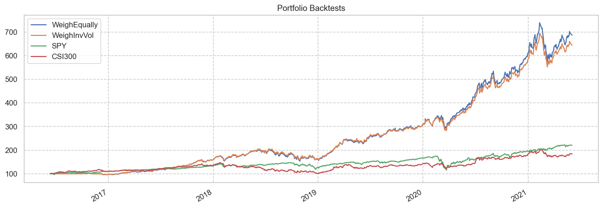
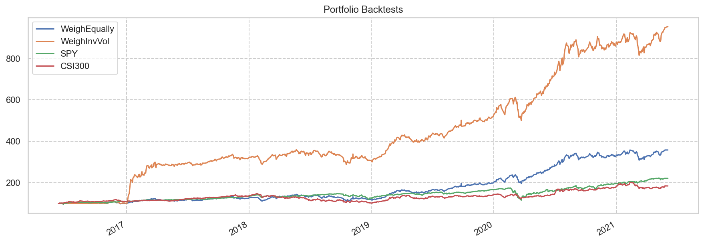
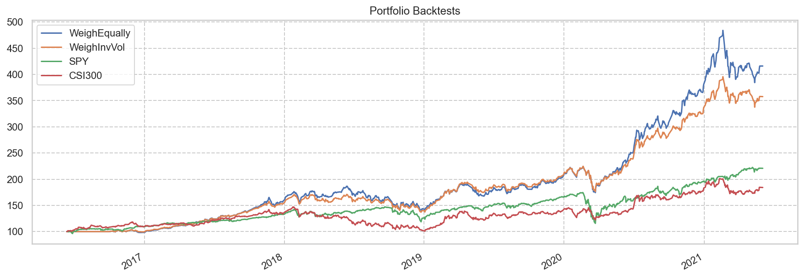

# 选股

Update: 20210609

### 稳健成长

#### 选择指标

* 负债率 < 70%
* ROE >= 15%
* 利润率 >= 20%
* 收入增长 >= 10% 且 盈利增长 >= 10%
* 收入增长TTM >= 5% 且 盈利增长TTM >= 5%
* CAGR > 5%
* 最大回撤 < 50%
* 市值 > 5B USD

<table id="T_05e35_" ><thead>    <tr>        <th class="blank level0" ></th>        <th class="col_heading level0 col0" >名称</th>        <th class="col_heading level0 col1" >负债率</th>        <th class="col_heading level0 col2" >ROE</th>        <th class="col_heading level0 col3" >利润率</th>        <th class="col_heading level0 col4" >收入增长</th>        <th class="col_heading level0 col5" >收入增长TTM</th>        <th class="col_heading level0 col6" >盈利增长</th>        <th class="col_heading level0 col7" >盈利增长TTM</th>        <th class="col_heading level0 col8" >FCF增长</th>        <th class="col_heading level0 col9" >PE</th>        <th class="col_heading level0 col10" >PEm</th>        <th class="col_heading level0 col11" >PEG</th>        <th class="col_heading level0 col12" >CAGR</th>        <th class="col_heading level0 col13" >最大回撤</th>        <th class="col_heading level0 col14" >Calmar</th>        <th class="col_heading level0 col15" >折价率</th>    </tr>    <tr>        <th class="index_name level0" >Symbol</th>        <th class="blank" ></th>        <th class="blank" ></th>        <th class="blank" ></th>        <th class="blank" ></th>        <th class="blank" ></th>        <th class="blank" ></th>        <th class="blank" ></th>        <th class="blank" ></th>        <th class="blank" ></th>        <th class="blank" ></th>        <th class="blank" ></th>        <th class="blank" ></th>        <th class="blank" ></th>        <th class="blank" ></th>        <th class="blank" ></th>        <th class="blank" ></th>    </tr></thead><tbody>
                <tr>
                        <th id="T_05e35_level0_row0" class="row_heading level0 row0" >0700.HK</th>
                        <td id="T_05e35_row0_col0" class="data row0 col0" >腾讯控股</td>
                        <td id="T_05e35_row0_col1" class="data row0 col1" >41.65</td>
                        <td id="T_05e35_row0_col2" class="data row0 col2" >24.13</td>
                        <td id="T_05e35_row0_col3" class="data row0 col3" >28.29</td>
                        <td id="T_05e35_row0_col4" class="data row0 col4" >26.65</td>
                        <td id="T_05e35_row0_col5" class="data row0 col5" >27.77</td>
                        <td id="T_05e35_row0_col6" class="data row0 col6" >33.31</td>
                        <td id="T_05e35_row0_col7" class="data row0 col7" >71.31</td>
                        <td id="T_05e35_row0_col8" class="data row0 col8" >20.72</td>
                        <td id="T_05e35_row0_col9" class="data row0 col9" >55.52</td>
                        <td id="T_05e35_row0_col10" class="data row0 col10" >58.17</td>
                        <td id="T_05e35_row0_col11" class="data row0 col11" >1.75</td>
                        <td id="T_05e35_row0_col12" class="data row0 col12" >13.83</td>
                        <td id="T_05e35_row0_col13" class="data row0 col13" >-39.81</td>
                        <td id="T_05e35_row0_col14" class="data row0 col14" >0.35</td>
                        <td id="T_05e35_row0_col15" class="data row0 col15" >-131.45</td>
            </tr>
            <tr>
                        <th id="T_05e35_level0_row1" class="row_heading level0 row1" >MSFT</th>
                        <td id="T_05e35_row1_col0" class="data row1 col0" >Microsoft </td>
                        <td id="T_05e35_row1_col1" class="data row1 col1" >60.74</td>
                        <td id="T_05e35_row1_col2" class="data row1 col2" >31.22</td>
                        <td id="T_05e35_row1_col3" class="data row1 col3" >25.89</td>
                        <td id="T_05e35_row1_col4" class="data row1 col4" >13.98</td>
                        <td id="T_05e35_row1_col5" class="data row1 col5" >11.85</td>
                        <td id="T_05e35_row1_col6" class="data row1 col6" >38.22</td>
                        <td id="T_05e35_row1_col7" class="data row1 col7" >26.50</td>
                        <td id="T_05e35_row1_col8" class="data row1 col8" >13.21</td>
                        <td id="T_05e35_row1_col9" class="data row1 col9" >34.18</td>
                        <td id="T_05e35_row1_col10" class="data row1 col10" >60.16</td>
                        <td id="T_05e35_row1_col11" class="data row1 col11" >1.57</td>
                        <td id="T_05e35_row1_col12" class="data row1 col12" >37.23</td>
                        <td id="T_05e35_row1_col13" class="data row1 col13" >-28.04</td>
                        <td id="T_05e35_row1_col14" class="data row1 col14" >1.33</td>
                        <td id="T_05e35_row1_col15" class="data row1 col15" >-185.90</td>
            </tr>
            <tr>
                        <th id="T_05e35_level0_row2" class="row_heading level0 row2" >000858.SZ</th>
                        <td id="T_05e35_row2_col0" class="data row2 col0" >五 粮 液</td>
                        <td id="T_05e35_row2_col1" class="data row2 col1" >22.95</td>
                        <td id="T_05e35_row2_col2" class="data row2 col2" >21.48</td>
                        <td id="T_05e35_row2_col3" class="data row2 col3" >33.75</td>
                        <td id="T_05e35_row2_col4" class="data row2 col4" >24.06</td>
                        <td id="T_05e35_row2_col5" class="data row2 col5" >7.13</td>
                        <td id="T_05e35_row2_col6" class="data row2 col6" >27.68</td>
                        <td id="T_05e35_row2_col7" class="data row2 col7" >8.11</td>
                        <td id="T_05e35_row2_col8" class="data row2 col8" >22.79</td>
                        <td id="T_05e35_row2_col9" class="data row2 col9" >56.73</td>
                        <td id="T_05e35_row2_col10" class="data row2 col10" >81.03</td>
                        <td id="T_05e35_row2_col11" class="data row2 col11" >2.93</td>
                        <td id="T_05e35_row2_col12" class="data row2 col12" >59.40</td>
                        <td id="T_05e35_row2_col13" class="data row2 col13" >-43.75</td>
                        <td id="T_05e35_row2_col14" class="data row2 col14" >1.36</td>
                        <td id="T_05e35_row2_col15" class="data row2 col15" >-282.95</td>
            </tr>
            <tr>
                        <th id="T_05e35_level0_row3" class="row_heading level0 row3" >FB</th>
                        <td id="T_05e35_row3_col0" class="data row3 col0" >Facebook I</td>
                        <td id="T_05e35_row3_col1" class="data row3 col1" >19.47</td>
                        <td id="T_05e35_row3_col2" class="data row3 col2" >22.18</td>
                        <td id="T_05e35_row3_col3" class="data row3 col3" >34.71</td>
                        <td id="T_05e35_row3_col4" class="data row3 col4" >28.52</td>
                        <td id="T_05e35_row3_col5" class="data row3 col5" >9.81</td>
                        <td id="T_05e35_row3_col6" class="data row3 col6" >26.68</td>
                        <td id="T_05e35_row3_col7" class="data row3 col7" >15.76</td>
                        <td id="T_05e35_row3_col8" class="data row3 col8" >12.46</td>
                        <td id="T_05e35_row3_col9" class="data row3 col9" >28.31</td>
                        <td id="T_05e35_row3_col10" class="data row3 col10" >43.73</td>
                        <td id="T_05e35_row3_col11" class="data row3 col11" >1.64</td>
                        <td id="T_05e35_row3_col12" class="data row3 col12" >19.98</td>
                        <td id="T_05e35_row3_col13" class="data row3 col13" >-42.96</td>
                        <td id="T_05e35_row3_col14" class="data row3 col14" >0.47</td>
                        <td id="T_05e35_row3_col15" class="data row3 col15" >-173.62</td>
            </tr>
            <tr>
                        <th id="T_05e35_level0_row4" class="row_heading level0 row4" >002415.SZ</th>
                        <td id="T_05e35_row4_col0" class="data row4 col0" >海康威视</td>
                        <td id="T_05e35_row4_col1" class="data row4 col1" >38.58</td>
                        <td id="T_05e35_row4_col2" class="data row4 col2" >28.43</td>
                        <td id="T_05e35_row4_col3" class="data row4 col3" >21.96</td>
                        <td id="T_05e35_row4_col4" class="data row4 col4" >14.92</td>
                        <td id="T_05e35_row4_col5" class="data row4 col5" >7.18</td>
                        <td id="T_05e35_row4_col6" class="data row4 col6" >12.60</td>
                        <td id="T_05e35_row4_col7" class="data row4 col7" >5.03</td>
                        <td id="T_05e35_row4_col8" class="data row4 col8" >49.38</td>
                        <td id="T_05e35_row4_col9" class="data row4 col9" >40.45</td>
                        <td id="T_05e35_row4_col10" class="data row4 col10" >49.06</td>
                        <td id="T_05e35_row4_col11" class="data row4 col11" >3.89</td>
                        <td id="T_05e35_row4_col12" class="data row4 col12" >18.44</td>
                        <td id="T_05e35_row4_col13" class="data row4 col13" >-40.39</td>
                        <td id="T_05e35_row4_col14" class="data row4 col14" >0.46</td>
                        <td id="T_05e35_row4_col15" class="data row4 col15" >-77.07</td>
            </tr>
            <tr>
                        <th id="T_05e35_level0_row5" class="row_heading level0 row5" >603288.SS</th>
                        <td id="T_05e35_row5_col0" class="data row5 col0" >海天味业</td>
                        <td id="T_05e35_row5_col1" class="data row5 col1" >31.72</td>
                        <td id="T_05e35_row5_col2" class="data row5 col2" >31.42</td>
                        <td id="T_05e35_row5_col3" class="data row5 col3" >26.24</td>
                        <td id="T_05e35_row5_col4" class="data row5 col4" >16.05</td>
                        <td id="T_05e35_row5_col5" class="data row5 col5" >5.59</td>
                        <td id="T_05e35_row5_col6" class="data row5 col6" >21.95</td>
                        <td id="T_05e35_row5_col7" class="data row5 col7" >5.32</td>
                        <td id="T_05e35_row5_col8" class="data row5 col8" >11.37</td>
                        <td id="T_05e35_row5_col9" class="data row5 col9" >66.07</td>
                        <td id="T_05e35_row5_col10" class="data row5 col10" >90.64</td>
                        <td id="T_05e35_row5_col11" class="data row5 col11" >4.13</td>
                        <td id="T_05e35_row5_col12" class="data row5 col12" >44.08</td>
                        <td id="T_05e35_row5_col13" class="data row5 col13" >-31.85</td>
                        <td id="T_05e35_row5_col14" class="data row5 col14" >1.38</td>
                        <td id="T_05e35_row5_col15" class="data row5 col15" >-366.47</td>
            </tr>
            <tr>
                        <th id="T_05e35_level0_row6" class="row_heading level0 row6" >000568.SZ</th>
                        <td id="T_05e35_row6_col0" class="data row6 col0" >泸州老窖</td>
                        <td id="T_05e35_row6_col1" class="data row6 col1" >33.78</td>
                        <td id="T_05e35_row6_col2" class="data row6 col2" >21.84</td>
                        <td id="T_05e35_row6_col3" class="data row6 col3" >29.18</td>
                        <td id="T_05e35_row6_col4" class="data row6 col4" >17.34</td>
                        <td id="T_05e35_row6_col5" class="data row6 col5" >8.71</td>
                        <td id="T_05e35_row6_col6" class="data row6 col6" >32.94</td>
                        <td id="T_05e35_row6_col7" class="data row6 col7" >7.65</td>
                        <td id="T_05e35_row6_col8" class="data row6 col8" >334.91</td>
                        <td id="T_05e35_row6_col9" class="data row6 col9" >63.40</td>
                        <td id="T_05e35_row6_col10" class="data row6 col10" >98.15</td>
                        <td id="T_05e35_row6_col11" class="data row6 col11" >2.98</td>
                        <td id="T_05e35_row6_col12" class="data row6 col12" >63.37</td>
                        <td id="T_05e35_row6_col13" class="data row6 col13" >-48.07</td>
                        <td id="T_05e35_row6_col14" class="data row6 col14" >1.32</td>
                        <td id="T_05e35_row6_col15" class="data row6 col15" >77.81</td>
            </tr>
            <tr>
                        <th id="T_05e35_level0_row7" class="row_heading level0 row7" >300122.SZ</th>
                        <td id="T_05e35_row7_col0" class="data row7 col0" >智飞生物</td>
                        <td id="T_05e35_row7_col1" class="data row7 col1" >45.79</td>
                        <td id="T_05e35_row7_col2" class="data row7 col2" >32.66</td>
                        <td id="T_05e35_row7_col3" class="data row7 col3" >26.01</td>
                        <td id="T_05e35_row7_col4" class="data row7 col4" >145.13</td>
                        <td id="T_05e35_row7_col5" class="data row7 col5" >8.51</td>
                        <td id="T_05e35_row7_col6" class="data row7 col6" >112.77</td>
                        <td id="T_05e35_row7_col7" class="data row7 col7" >12.78</td>
                        <td id="T_05e35_row7_col8" class="data row7 col8" >132.88</td>
                        <td id="T_05e35_row7_col9" class="data row7 col9" >76.32</td>
                        <td id="T_05e35_row7_col10" class="data row7 col10" >150.51</td>
                        <td id="T_05e35_row7_col11" class="data row7 col11" >1.33</td>
                        <td id="T_05e35_row7_col12" class="data row7 col12" >60.79</td>
                        <td id="T_05e35_row7_col13" class="data row7 col13" >-38.04</td>
                        <td id="T_05e35_row7_col14" class="data row7 col14" >1.60</td>
                        <td id="T_05e35_row7_col15" class="data row7 col15" >-123.58</td>
            </tr>
            <tr>
                        <th id="T_05e35_level0_row8" class="row_heading level0 row8" >ASML</th>
                        <td id="T_05e35_row8_col0" class="data row8 col0" >ASML Holdi</td>
                        <td id="T_05e35_row8_col1" class="data row8 col1" >49.15</td>
                        <td id="T_05e35_row8_col2" class="data row8 col2" >21.91</td>
                        <td id="T_05e35_row8_col3" class="data row8 col3" >23.52</td>
                        <td id="T_05e35_row8_col4" class="data row8 col4" >16.12</td>
                        <td id="T_05e35_row8_col5" class="data row8 col5" >13.76</td>
                        <td id="T_05e35_row8_col6" class="data row8 col6" >20.84</td>
                        <td id="T_05e35_row8_col7" class="data row8 col7" >26.47</td>
                        <td id="T_05e35_row8_col8" class="data row8 col8" >38.47</td>
                        <td id="T_05e35_row8_col9" class="data row8 col9" >52.73</td>
                        <td id="T_05e35_row8_col10" class="data row8 col10" >103.81</td>
                        <td id="T_05e35_row8_col11" class="data row8 col11" >4.98</td>
                        <td id="T_05e35_row8_col12" class="data row8 col12" >49.71</td>
                        <td id="T_05e35_row8_col13" class="data row8 col13" >-37.94</td>
                        <td id="T_05e35_row8_col14" class="data row8 col14" >1.31</td>
                        <td id="T_05e35_row8_col15" class="data row8 col15" >-247.59</td>
            </tr>
            <tr>
                        <th id="T_05e35_level0_row9" class="row_heading level0 row9" >002714.SZ</th>
                        <td id="T_05e35_row9_col0" class="data row9 col0" >牧原股份</td>
                        <td id="T_05e35_row9_col1" class="data row9 col1" >46.09</td>
                        <td id="T_05e35_row9_col2" class="data row9 col2" >28.10</td>
                        <td id="T_05e35_row9_col3" class="data row9 col3" >26.61</td>
                        <td id="T_05e35_row9_col4" class="data row9 col4" >87.55</td>
                        <td id="T_05e35_row9_col5" class="data row9 col5" >21.47</td>
                        <td id="T_05e35_row9_col6" class="data row9 col6" >448.77</td>
                        <td id="T_05e35_row9_col7" class="data row9 col7" >10.32</td>
                        <td id="T_05e35_row9_col8" class="data row9 col8" >199.27</td>
                        <td id="T_05e35_row9_col9" class="data row9 col9" >8.29</td>
                        <td id="T_05e35_row9_col10" class="data row9 col10" >27.97</td>
                        <td id="T_05e35_row9_col11" class="data row9 col11" >0.06</td>
                        <td id="T_05e35_row9_col12" class="data row9 col12" >82.88</td>
                        <td id="T_05e35_row9_col13" class="data row9 col13" >-29.80</td>
                        <td id="T_05e35_row9_col14" class="data row9 col14" >2.78</td>
                        <td id="T_05e35_row9_col15" class="data row9 col15" >-</td>
            </tr>
            <tr>
                        <th id="T_05e35_level0_row10" class="row_heading level0 row10" >ADBE</th>
                        <td id="T_05e35_row10_col0" class="data row10 col0" >Adobe Inc</td>
                        <td id="T_05e35_row10_col1" class="data row10 col1" >45.38</td>
                        <td id="T_05e35_row10_col2" class="data row10 col2" >28.84</td>
                        <td id="T_05e35_row10_col3" class="data row10 col3" >29.80</td>
                        <td id="T_05e35_row10_col4" class="data row10 col4" >20.86</td>
                        <td id="T_05e35_row10_col5" class="data row10 col5" >6.33</td>
                        <td id="T_05e35_row10_col6" class="data row10 col6" >48.36</td>
                        <td id="T_05e35_row10_col7" class="data row10 col7" >5.82</td>
                        <td id="T_05e35_row10_col8" class="data row10 col8" >25.47</td>
                        <td id="T_05e35_row10_col9" class="data row10 col9" >43.92</td>
                        <td id="T_05e35_row10_col10" class="data row10 col10" >77.19</td>
                        <td id="T_05e35_row10_col11" class="data row10 col11" >1.60</td>
                        <td id="T_05e35_row10_col12" class="data row10 col12" >26.72</td>
                        <td id="T_05e35_row10_col13" class="data row10 col13" >-25.64</td>
                        <td id="T_05e35_row10_col14" class="data row10 col14" >1.04</td>
                        <td id="T_05e35_row10_col15" class="data row10 col15" >-153.79</td>
            </tr>
            <tr>
                        <th id="T_05e35_level0_row11" class="row_heading level0 row11" >300347.SZ</th>
                        <td id="T_05e35_row11_col0" class="data row11 col0" >泰格医药</td>
                        <td id="T_05e35_row11_col1" class="data row11 col1" >8.45</td>
                        <td id="T_05e35_row11_col2" class="data row11 col2" >15.14</td>
                        <td id="T_05e35_row11_col3" class="data row11 col3" >30.80</td>
                        <td id="T_05e35_row11_col4" class="data row11 col4" >24.03</td>
                        <td id="T_05e35_row11_col5" class="data row11 col5" >7.89</td>
                        <td id="T_05e35_row11_col6" class="data row11 col6" >81.00</td>
                        <td id="T_05e35_row11_col7" class="data row11 col7" >11.46</td>
                        <td id="T_05e35_row11_col8" class="data row11 col8" >52.33</td>
                        <td id="T_05e35_row11_col9" class="data row11 col9" >79.30</td>
                        <td id="T_05e35_row11_col10" class="data row11 col10" >188.04</td>
                        <td id="T_05e35_row11_col11" class="data row11 col11" >2.32</td>
                        <td id="T_05e35_row11_col12" class="data row11 col12" >72.83</td>
                        <td id="T_05e35_row11_col13" class="data row11 col13" >-44.04</td>
                        <td id="T_05e35_row11_col14" class="data row11 col14" >1.65</td>
                        <td id="T_05e35_row11_col15" class="data row11 col15" >-670.10</td>
            </tr>
            <tr>
                        <th id="T_05e35_level0_row12" class="row_heading level0 row12" >600763.SS</th>
                        <td id="T_05e35_row12_col0" class="data row12 col0" >通策医疗</td>
                        <td id="T_05e35_row12_col1" class="data row12 col1" >23.37</td>
                        <td id="T_05e35_row12_col2" class="data row12 col2" >23.98</td>
                        <td id="T_05e35_row12_col3" class="data row12 col3" >21.89</td>
                        <td id="T_05e35_row12_col4" class="data row12 col4" >21.36</td>
                        <td id="T_05e35_row12_col5" class="data row12 col5" >20.99</td>
                        <td id="T_05e35_row12_col6" class="data row12 col6" >33.13</td>
                        <td id="T_05e35_row12_col7" class="data row12 col7" >37.14</td>
                        <td id="T_05e35_row12_col8" class="data row12 col8" >38.60</td>
                        <td id="T_05e35_row12_col9" class="data row12 col9" >176.39</td>
                        <td id="T_05e35_row12_col10" class="data row12 col10" >315.32</td>
                        <td id="T_05e35_row12_col11" class="data row12 col11" >9.52</td>
                        <td id="T_05e35_row12_col12" class="data row12 col12" >104.02</td>
                        <td id="T_05e35_row12_col13" class="data row12 col13" >-45.88</td>
                        <td id="T_05e35_row12_col14" class="data row12 col14" >2.27</td>
                        <td id="T_05e35_row12_col15" class="data row12 col15" >-846.40</td>
            </tr>
            <tr>
                        <th id="T_05e35_level0_row13" class="row_heading level0 row13" >601100.SS</th>
                        <td id="T_05e35_row13_col0" class="data row13 col0" >恒立液压</td>
                        <td id="T_05e35_row13_col1" class="data row13 col1" >30.78</td>
                        <td id="T_05e35_row13_col2" class="data row13 col2" >20.59</td>
                        <td id="T_05e35_row13_col3" class="data row13 col3" >21.54</td>
                        <td id="T_05e35_row13_col4" class="data row13 col4" >41.44</td>
                        <td id="T_05e35_row13_col5" class="data row13 col5" >18.94</td>
                        <td id="T_05e35_row13_col6" class="data row13 col6" >82.62</td>
                        <td id="T_05e35_row13_col7" class="data row13 col7" >19.34</td>
                        <td id="T_05e35_row13_col8" class="data row13 col8" >-92.80</td>
                        <td id="T_05e35_row13_col9" class="data row13 col9" >37.47</td>
                        <td id="T_05e35_row13_col10" class="data row13 col10" >84.40</td>
                        <td id="T_05e35_row13_col11" class="data row13 col11" >1.02</td>
                        <td id="T_05e35_row13_col12" class="data row13 col12" >75.07</td>
                        <td id="T_05e35_row13_col13" class="data row13 col13" >-44.95</td>
                        <td id="T_05e35_row13_col14" class="data row13 col14" >1.67</td>
                        <td id="T_05e35_row13_col15" class="data row13 col15" >-163695.12</td>
            </tr>
            <tr>
                        <th id="T_05e35_level0_row14" class="row_heading level0 row14" >600570.SS</th>
                        <td id="T_05e35_row14_col0" class="data row14 col0" >恒生电子</td>
                        <td id="T_05e35_row14_col1" class="data row14 col1" >49.48</td>
                        <td id="T_05e35_row14_col2" class="data row14 col2" >24.06</td>
                        <td id="T_05e35_row14_col3" class="data row14 col3" >26.42</td>
                        <td id="T_05e35_row14_col4" class="data row14 col4" >16.27</td>
                        <td id="T_05e35_row14_col5" class="data row14 col5" >5.69</td>
                        <td id="T_05e35_row14_col6" class="data row14 col6" >49.90</td>
                        <td id="T_05e35_row14_col7" class="data row14 col7" >16.16</td>
                        <td id="T_05e35_row14_col8" class="data row14 col8" >10.32</td>
                        <td id="T_05e35_row14_col9" class="data row14 col9" >58.78</td>
                        <td id="T_05e35_row14_col10" class="data row14 col10" >95.23</td>
                        <td id="T_05e35_row14_col11" class="data row14 col11" >1.91</td>
                        <td id="T_05e35_row14_col12" class="data row14 col12" >37.63</td>
                        <td id="T_05e35_row14_col13" class="data row14 col13" >-38.38</td>
                        <td id="T_05e35_row14_col14" class="data row14 col14" >0.98</td>
                        <td id="T_05e35_row14_col15" class="data row14 col15" >-604.99</td>
            </tr>
            <tr>
                        <th id="T_05e35_level0_row15" class="row_heading level0 row15" >603369.SS</th>
                        <td id="T_05e35_row15_col0" class="data row15 col0" >今世缘</td>
                        <td id="T_05e35_row15_col1" class="data row15 col1" >30.24</td>
                        <td id="T_05e35_row15_col2" class="data row15 col2" >18.77</td>
                        <td id="T_05e35_row15_col3" class="data row15 col3" >30.42</td>
                        <td id="T_05e35_row15_col4" class="data row15 col4" >20.67</td>
                        <td id="T_05e35_row15_col5" class="data row15 col5" >12.22</td>
                        <td id="T_05e35_row15_col6" class="data row15 col6" >20.87</td>
                        <td id="T_05e35_row15_col7" class="data row15 col7" >14.36</td>
                        <td id="T_05e35_row15_col8" class="data row15 col8" >3.42</td>
                        <td id="T_05e35_row15_col9" class="data row15 col9" >42.78</td>
                        <td id="T_05e35_row15_col10" class="data row15 col10" >60.44</td>
                        <td id="T_05e35_row15_col11" class="data row15 col11" >2.90</td>
                        <td id="T_05e35_row15_col12" class="data row15 col12" >40.95</td>
                        <td id="T_05e35_row15_col13" class="data row15 col13" >-44.58</td>
                        <td id="T_05e35_row15_col14" class="data row15 col14" >0.92</td>
                        <td id="T_05e35_row15_col15" class="data row15 col15" >-518.82</td>
            </tr>
            <tr>
                        <th id="T_05e35_level0_row16" class="row_heading level0 row16" >300408.SZ</th>
                        <td id="T_05e35_row16_col0" class="data row16 col0" >三环集团</td>
                        <td id="T_05e35_row16_col1" class="data row16 col1" >12.42</td>
                        <td id="T_05e35_row16_col2" class="data row16 col2" >15.54</td>
                        <td id="T_05e35_row16_col3" class="data row16 col3" >34.45</td>
                        <td id="T_05e35_row16_col4" class="data row16 col4" >13.00</td>
                        <td id="T_05e35_row16_col5" class="data row16 col5" >17.71</td>
                        <td id="T_05e35_row16_col6" class="data row16 col6" >17.67</td>
                        <td id="T_05e35_row16_col7" class="data row16 col7" >21.20</td>
                        <td id="T_05e35_row16_col8" class="data row16 col8" >121.42</td>
                        <td id="T_05e35_row16_col9" class="data row16 col9" >39.93</td>
                        <td id="T_05e35_row16_col10" class="data row16 col10" >60.03</td>
                        <td id="T_05e35_row16_col11" class="data row16 col11" >3.40</td>
                        <td id="T_05e35_row16_col12" class="data row16 col12" >17.89</td>
                        <td id="T_05e35_row16_col13" class="data row16 col13" >-44.69</td>
                        <td id="T_05e35_row16_col14" class="data row16 col14" >0.40</td>
                        <td id="T_05e35_row16_col15" class="data row16 col15" >-7.29</td>
            </tr>
            <tr>
                        <th id="T_05e35_level0_row17" class="row_heading level0 row17" >002001.SZ</th>
                        <td id="T_05e35_row17_col0" class="data row17 col0" >新 和 成</td>
                        <td id="T_05e35_row17_col1" class="data row17 col1" >37.20</td>
                        <td id="T_05e35_row17_col2" class="data row17 col2" >15.60</td>
                        <td id="T_05e35_row17_col3" class="data row17 col3" >31.40</td>
                        <td id="T_05e35_row17_col4" class="data row17 col4" >20.71</td>
                        <td id="T_05e35_row17_col5" class="data row17 col5" >10.90</td>
                        <td id="T_05e35_row17_col6" class="data row17 col6" >38.52</td>
                        <td id="T_05e35_row17_col7" class="data row17 col7" >6.61</td>
                        <td id="T_05e35_row17_col8" class="data row17 col8" >-180.44</td>
                        <td id="T_05e35_row17_col9" class="data row17 col9" >17.70</td>
                        <td id="T_05e35_row17_col10" class="data row17 col10" >25.61</td>
                        <td id="T_05e35_row17_col11" class="data row17 col11" >0.66</td>
                        <td id="T_05e35_row17_col12" class="data row17 col12" >31.42</td>
                        <td id="T_05e35_row17_col13" class="data row17 col13" >-29.32</td>
                        <td id="T_05e35_row17_col14" class="data row17 col14" >1.07</td>
                        <td id="T_05e35_row17_col15" class="data row17 col15" >-1645.37</td>
            </tr>
            <tr>
                        <th id="T_05e35_level0_row18" class="row_heading level0 row18" >300595.SZ</th>
                        <td id="T_05e35_row18_col0" class="data row18 col0" >欧普康视</td>
                        <td id="T_05e35_row18_col1" class="data row18 col1" >10.02</td>
                        <td id="T_05e35_row18_col2" class="data row18 col2" >21.91</td>
                        <td id="T_05e35_row18_col3" class="data row18 col3" >48.20</td>
                        <td id="T_05e35_row18_col4" class="data row18 col4" >40.94</td>
                        <td id="T_05e35_row18_col5" class="data row18 col5" >21.01</td>
                        <td id="T_05e35_row18_col6" class="data row18 col6" >42.15</td>
                        <td id="T_05e35_row18_col7" class="data row18 col7" >23.11</td>
                        <td id="T_05e35_row18_col8" class="data row18 col8" >54.08</td>
                        <td id="T_05e35_row18_col9" class="data row18 col9" >114.88</td>
                        <td id="T_05e35_row18_col10" class="data row18 col10" >220.13</td>
                        <td id="T_05e35_row18_col11" class="data row18 col11" >5.22</td>
                        <td id="T_05e35_row18_col12" class="data row18 col12" >113.95</td>
                        <td id="T_05e35_row18_col13" class="data row18 col13" >-42.52</td>
                        <td id="T_05e35_row18_col14" class="data row18 col14" >2.68</td>
                        <td id="T_05e35_row18_col15" class="data row18 col15" >-706.63</td>
            </tr>
            <tr>
                        <th id="T_05e35_level0_row19" class="row_heading level0 row19" >0586.HK</th>
                        <td id="T_05e35_row19_col0" class="data row19 col0" >海螺创业</td>
                        <td id="T_05e35_row19_col1" class="data row19 col1" >26.41</td>
                        <td id="T_05e35_row19_col2" class="data row19 col2" >20.34</td>
                        <td id="T_05e35_row19_col3" class="data row19 col3" >155.65</td>
                        <td id="T_05e35_row19_col4" class="data row19 col4" >48.71</td>
                        <td id="T_05e35_row19_col5" class="data row19 col5" >28.99</td>
                        <td id="T_05e35_row19_col6" class="data row19 col6" >33.76</td>
                        <td id="T_05e35_row19_col7" class="data row19 col7" >8.89</td>
                        <td id="T_05e35_row19_col8" class="data row19 col8" >111.47</td>
                        <td id="T_05e35_row19_col9" class="data row19 col9" >-</td>
                        <td id="T_05e35_row19_col10" class="data row19 col10" >10.09</td>
                        <td id="T_05e35_row19_col11" class="data row19 col11" >0.30</td>
                        <td id="T_05e35_row19_col12" class="data row19 col12" >6.54</td>
                        <td id="T_05e35_row19_col13" class="data row19 col13" >-25.68</td>
                        <td id="T_05e35_row19_col14" class="data row19 col14" >0.25</td>
                        <td id="T_05e35_row19_col15" class="data row19 col15" >-</td>
            </tr>
            <tr>
                        <th id="T_05e35_level0_row20" class="row_heading level0 row20" >REGN</th>
                        <td id="T_05e35_row20_col0" class="data row20 col0" >Regeneron </td>
                        <td id="T_05e35_row20_col1" class="data row20 col1" >35.76</td>
                        <td id="T_05e35_row20_col2" class="data row20 col2" >24.59</td>
                        <td id="T_05e35_row20_col3" class="data row20 col3" >35.61</td>
                        <td id="T_05e35_row20_col4" class="data row20 col4" >13.93</td>
                        <td id="T_05e35_row20_col5" class="data row20 col5" >26.73</td>
                        <td id="T_05e35_row20_col6" class="data row20 col6" >52.19</td>
                        <td id="T_05e35_row20_col7" class="data row20 col7" >66.05</td>
                        <td id="T_05e35_row20_col8" class="data row20 col8" >28.57</td>
                        <td id="T_05e35_row20_col9" class="data row20 col9" >16.77</td>
                        <td id="T_05e35_row20_col10" class="data row20 col10" >23.52</td>
                        <td id="T_05e35_row20_col11" class="data row20 col11" >0.45</td>
                        <td id="T_05e35_row20_col12" class="data row20 col12" >18.07</td>
                        <td id="T_05e35_row20_col13" class="data row20 col13" >-37.79</td>
                        <td id="T_05e35_row20_col14" class="data row20 col14" >0.48</td>
                        <td id="T_05e35_row20_col15" class="data row20 col15" >-23.76</td>
            </tr>
            <tr>
                        <th id="T_05e35_level0_row21" class="row_heading level0 row21" >MNST</th>
                        <td id="T_05e35_row21_col0" class="data row21 col0" >Monster Be</td>
                        <td id="T_05e35_row21_col1" class="data row21 col1" >16.80</td>
                        <td id="T_05e35_row21_col2" class="data row21 col2" >25.61</td>
                        <td id="T_05e35_row21_col3" class="data row21 col3" >26.87</td>
                        <td id="T_05e35_row21_col4" class="data row21 col4" >10.94</td>
                        <td id="T_05e35_row21_col5" class="data row21 col5" >9.47</td>
                        <td id="T_05e35_row21_col6" class="data row21 col6" >19.93</td>
                        <td id="T_05e35_row21_col7" class="data row21 col7" >27.24</td>
                        <td id="T_05e35_row21_col8" class="data row21 col8" >14.54</td>
                        <td id="T_05e35_row21_col9" class="data row21 col9" >36.12</td>
                        <td id="T_05e35_row21_col10" class="data row21 col10" >46.56</td>
                        <td id="T_05e35_row21_col11" class="data row21 col11" >2.34</td>
                        <td id="T_05e35_row21_col12" class="data row21 col12" >19.01</td>
                        <td id="T_05e35_row21_col13" class="data row21 col13" >-27.60</td>
                        <td id="T_05e35_row21_col14" class="data row21 col14" >0.69</td>
                        <td id="T_05e35_row21_col15" class="data row21 col15" >-150.80</td>
            </tr>
            <tr>
                        <th id="T_05e35_level0_row22" class="row_heading level0 row22" >3319.HK</th>
                        <td id="T_05e35_row22_col0" class="data row22 col0" >雅生活服务</td>
                        <td id="T_05e35_row22_col1" class="data row22 col1" >38.05</td>
                        <td id="T_05e35_row22_col2" class="data row22 col2" >19.55</td>
                        <td id="T_05e35_row22_col3" class="data row22 col3" >20.42</td>
                        <td id="T_05e35_row22_col4" class="data row22 col4" >79.72</td>
                        <td id="T_05e35_row22_col5" class="data row22 col5" >95.54</td>
                        <td id="T_05e35_row22_col6" class="data row22 col6" >90.89</td>
                        <td id="T_05e35_row22_col7" class="data row22 col7" >42.55</td>
                        <td id="T_05e35_row22_col8" class="data row22 col8" >121.61</td>
                        <td id="T_05e35_row22_col9" class="data row22 col9" >-</td>
                        <td id="T_05e35_row22_col10" class="data row22 col10" >47.43</td>
                        <td id="T_05e35_row22_col11" class="data row22 col11" >0.52</td>
                        <td id="T_05e35_row22_col12" class="data row22 col12" >35.79</td>
                        <td id="T_05e35_row22_col13" class="data row22 col13" >-43.12</td>
                        <td id="T_05e35_row22_col14" class="data row22 col14" >0.83</td>
                        <td id="T_05e35_row22_col15" class="data row22 col15" >70.53</td>
            </tr>
            <tr>
                        <th id="T_05e35_level0_row23" class="row_heading level0 row23" >VEEV</th>
                        <td id="T_05e35_row23_col0" class="data row23 col0" >Veeva Syst</td>
                        <td id="T_05e35_row23_col1" class="data row23 col1" >25.60</td>
                        <td id="T_05e35_row23_col2" class="data row23 col2" >17.52</td>
                        <td id="T_05e35_row23_col3" class="data row23 col3" >25.44</td>
                        <td id="T_05e35_row23_col4" class="data row23 col4" >28.54</td>
                        <td id="T_05e35_row23_col5" class="data row23 col5" >32.70</td>
                        <td id="T_05e35_row23_col6" class="data row23 col6" >36.41</td>
                        <td id="T_05e35_row23_col7" class="data row23 col7" >26.20</td>
                        <td id="T_05e35_row23_col8" class="data row23 col8" >34.55</td>
                        <td id="T_05e35_row23_col9" class="data row23 col9" >122.16</td>
                        <td id="T_05e35_row23_col10" class="data row23 col10" >165.27</td>
                        <td id="T_05e35_row23_col11" class="data row23 col11" >4.54</td>
                        <td id="T_05e35_row23_col12" class="data row23 col12" >53.95</td>
                        <td id="T_05e35_row23_col13" class="data row23 col13" >-31.15</td>
                        <td id="T_05e35_row23_col14" class="data row23 col14" >1.73</td>
                        <td id="T_05e35_row23_col15" class="data row23 col15" >-299.55</td>
            </tr>
            <tr>
                        <th id="T_05e35_level0_row24" class="row_heading level0 row24" >603707.SS</th>
                        <td id="T_05e35_row24_col0" class="data row24 col0" >健友股份</td>
                        <td id="T_05e35_row24_col1" class="data row24 col1" >51.50</td>
                        <td id="T_05e35_row24_col2" class="data row24 col2" >18.72</td>
                        <td id="T_05e35_row24_col3" class="data row24 col3" >26.34</td>
                        <td id="T_05e35_row24_col4" class="data row24 col4" >38.69</td>
                        <td id="T_05e35_row24_col5" class="data row24 col5" >5.11</td>
                        <td id="T_05e35_row24_col6" class="data row24 col6" >36.95</td>
                        <td id="T_05e35_row24_col7" class="data row24 col7" >8.50</td>
                        <td id="T_05e35_row24_col8" class="data row24 col8" >1496.05</td>
                        <td id="T_05e35_row24_col9" class="data row24 col9" >44.12</td>
                        <td id="T_05e35_row24_col10" class="data row24 col10" >71.31</td>
                        <td id="T_05e35_row24_col11" class="data row24 col11" >1.93</td>
                        <td id="T_05e35_row24_col12" class="data row24 col12" >36.37</td>
                        <td id="T_05e35_row24_col13" class="data row24 col13" >-46.89</td>
                        <td id="T_05e35_row24_col14" class="data row24 col14" >0.78</td>
                        <td id="T_05e35_row24_col15" class="data row24 col15" >-</td>
            </tr>
            <tr>
                        <th id="T_05e35_level0_row25" class="row_heading level0 row25" >603658.SS</th>
                        <td id="T_05e35_row25_col0" class="data row25 col0" >安图生物</td>
                        <td id="T_05e35_row25_col1" class="data row25 col1" >19.07</td>
                        <td id="T_05e35_row25_col2" class="data row25 col2" >24.44</td>
                        <td id="T_05e35_row25_col3" class="data row25 col3" >28.76</td>
                        <td id="T_05e35_row25_col4" class="data row25 col4" >29.27</td>
                        <td id="T_05e35_row25_col5" class="data row25 col5" >8.95</td>
                        <td id="T_05e35_row25_col6" class="data row25 col6" >20.06</td>
                        <td id="T_05e35_row25_col7" class="data row25 col7" >10.48</td>
                        <td id="T_05e35_row25_col8" class="data row25 col8" >166.88</td>
                        <td id="T_05e35_row25_col9" class="data row25 col9" >43.99</td>
                        <td id="T_05e35_row25_col10" class="data row25 col10" >59.32</td>
                        <td id="T_05e35_row25_col11" class="data row25 col11" >2.96</td>
                        <td id="T_05e35_row25_col12" class="data row25 col12" >13.84</td>
                        <td id="T_05e35_row25_col13" class="data row25 col13" >-45.36</td>
                        <td id="T_05e35_row25_col14" class="data row25 col14" >0.31</td>
                        <td id="T_05e35_row25_col15" class="data row25 col15" >-204.44</td>
            </tr>
            <tr>
                        <th id="T_05e35_level0_row26" class="row_heading level0 row26" >603638.SS</th>
                        <td id="T_05e35_row26_col0" class="data row26 col0" >艾迪精密</td>
                        <td id="T_05e35_row26_col1" class="data row26 col1" >34.06</td>
                        <td id="T_05e35_row26_col2" class="data row26 col2" >19.20</td>
                        <td id="T_05e35_row26_col3" class="data row26 col3" >22.61</td>
                        <td id="T_05e35_row26_col4" class="data row26 col4" >52.28</td>
                        <td id="T_05e35_row26_col5" class="data row26 col5" >22.73</td>
                        <td id="T_05e35_row26_col6" class="data row26 col6" >54.66</td>
                        <td id="T_05e35_row26_col7" class="data row26 col7" >21.30</td>
                        <td id="T_05e35_row26_col8" class="data row26 col8" >-197.71</td>
                        <td id="T_05e35_row26_col9" class="data row26 col9" >57.12</td>
                        <td id="T_05e35_row26_col10" class="data row26 col10" >117.89</td>
                        <td id="T_05e35_row26_col11" class="data row26 col11" >2.16</td>
                        <td id="T_05e35_row26_col12" class="data row26 col12" >68.37</td>
                        <td id="T_05e35_row26_col13" class="data row26 col13" >-39.57</td>
                        <td id="T_05e35_row26_col14" class="data row26 col14" >1.73</td>
                        <td id="T_05e35_row26_col15" class="data row26 col15" >-2491.36</td>
            </tr>
            <tr>
                        <th id="T_05e35_level0_row27" class="row_heading level0 row27" >300357.SZ</th>
                        <td id="T_05e35_row27_col0" class="data row27 col0" >我武生物</td>
                        <td id="T_05e35_row27_col1" class="data row27 col1" >4.77</td>
                        <td id="T_05e35_row27_col2" class="data row27 col2" >22.46</td>
                        <td id="T_05e35_row27_col3" class="data row27 col3" >46.30</td>
                        <td id="T_05e35_row27_col4" class="data row27 col4" >19.02</td>
                        <td id="T_05e35_row27_col5" class="data row27 col5" >8.55</td>
                        <td id="T_05e35_row27_col6" class="data row27 col6" >15.52</td>
                        <td id="T_05e35_row27_col7" class="data row27 col7" >10.45</td>
                        <td id="T_05e35_row27_col8" class="data row27 col8" >16.74</td>
                        <td id="T_05e35_row27_col9" class="data row27 col9" >111.58</td>
                        <td id="T_05e35_row27_col10" class="data row27 col10" >137.77</td>
                        <td id="T_05e35_row27_col11" class="data row27 col11" >8.87</td>
                        <td id="T_05e35_row27_col12" class="data row27 col12" >44.53</td>
                        <td id="T_05e35_row27_col13" class="data row27 col13" >-41.81</td>
                        <td id="T_05e35_row27_col14" class="data row27 col14" >1.07</td>
                        <td id="T_05e35_row27_col15" class="data row27 col15" >-1101.31</td>
            </tr>
            <tr>
                        <th id="T_05e35_level0_row28" class="row_heading level0 row28" >CPRT</th>
                        <td id="T_05e35_row28_col0" class="data row28 col0" >Copart Inc</td>
                        <td id="T_05e35_row28_col1" class="data row28 col1" >27.95</td>
                        <td id="T_05e35_row28_col2" class="data row28 col2" >30.93</td>
                        <td id="T_05e35_row28_col3" class="data row28 col3" >27.77</td>
                        <td id="T_05e35_row28_col4" class="data row28 col4" >15.27</td>
                        <td id="T_05e35_row28_col5" class="data row28 col5" >11.97</td>
                        <td id="T_05e35_row28_col6" class="data row28 col6" >21.96</td>
                        <td id="T_05e35_row28_col7" class="data row28 col7" >20.88</td>
                        <td id="T_05e35_row28_col8" class="data row28 col8" >2.37</td>
                        <td id="T_05e35_row28_col9" class="data row28 col9" >42.37</td>
                        <td id="T_05e35_row28_col10" class="data row28 col10" >56.18</td>
                        <td id="T_05e35_row28_col11" class="data row28 col11" >2.56</td>
                        <td id="T_05e35_row28_col12" class="data row28 col12" >29.62</td>
                        <td id="T_05e35_row28_col13" class="data row28 col13" >-43.75</td>
                        <td id="T_05e35_row28_col14" class="data row28 col14" >0.68</td>
                        <td id="T_05e35_row28_col15" class="data row28 col15" >-647.73</td>
            </tr>
            <tr>
                        <th id="T_05e35_level0_row29" class="row_heading level0 row29" >603568.SS</th>
                        <td id="T_05e35_row29_col0" class="data row29 col0" >伟明环保</td>
                        <td id="T_05e35_row29_col1" class="data row29 col1" >47.02</td>
                        <td id="T_05e35_row29_col2" class="data row29 col2" >23.01</td>
                        <td id="T_05e35_row29_col3" class="data row29 col3" >46.28</td>
                        <td id="T_05e35_row29_col4" class="data row29 col4" >45.09</td>
                        <td id="T_05e35_row29_col5" class="data row29 col5" >10.07</td>
                        <td id="T_05e35_row29_col6" class="data row29 col6" >35.57</td>
                        <td id="T_05e35_row29_col7" class="data row29 col7" >13.63</td>
                        <td id="T_05e35_row29_col8" class="data row29 col8" >-21.35</td>
                        <td id="T_05e35_row29_col9" class="data row29 col9" >20.12</td>
                        <td id="T_05e35_row29_col10" class="data row29 col10" >32.76</td>
                        <td id="T_05e35_row29_col11" class="data row29 col11" >0.92</td>
                        <td id="T_05e35_row29_col12" class="data row29 col12" >19.13</td>
                        <td id="T_05e35_row29_col13" class="data row29 col13" >-35.10</td>
                        <td id="T_05e35_row29_col14" class="data row29 col14" >0.55</td>
                        <td id="T_05e35_row29_col15" class="data row29 col15" >-</td>
            </tr>
            <tr>
                        <th id="T_05e35_level0_row30" class="row_heading level0 row30" >300725.SZ</th>
                        <td id="T_05e35_row30_col0" class="data row30 col0" >药石科技</td>
                        <td id="T_05e35_row30_col1" class="data row30 col1" >21.88</td>
                        <td id="T_05e35_row30_col2" class="data row30 col2" >16.51</td>
                        <td id="T_05e35_row30_col3" class="data row30 col3" >23.36</td>
                        <td id="T_05e35_row30_col4" class="data row30 col4" >55.95</td>
                        <td id="T_05e35_row30_col5" class="data row30 col5" >11.27</td>
                        <td id="T_05e35_row30_col6" class="data row30 col6" >44.56</td>
                        <td id="T_05e35_row30_col7" class="data row30 col7" >22.56</td>
                        <td id="T_05e35_row30_col8" class="data row30 col8" >413.19</td>
                        <td id="T_05e35_row30_col9" class="data row30 col9" >117.55</td>
                        <td id="T_05e35_row30_col10" class="data row30 col10" >207.10</td>
                        <td id="T_05e35_row30_col11" class="data row30 col11" >4.65</td>
                        <td id="T_05e35_row30_col12" class="data row30 col12" >55.13</td>
                        <td id="T_05e35_row30_col13" class="data row30 col13" >-39.63</td>
                        <td id="T_05e35_row30_col14" class="data row30 col14" >1.39</td>
                        <td id="T_05e35_row30_col15" class="data row30 col15" >72.00</td>
            </tr>
            <tr>
                        <th id="T_05e35_level0_row31" class="row_heading level0 row31" >GRMN</th>
                        <td id="T_05e35_row31_col0" class="data row31 col0" >Garmin Ltd</td>
                        <td id="T_05e35_row31_col1" class="data row31 col1" >21.55</td>
                        <td id="T_05e35_row31_col2" class="data row31 col2" >18.23</td>
                        <td id="T_05e35_row31_col3" class="data row31 col3" >23.12</td>
                        <td id="T_05e35_row31_col4" class="data row31 col4" >10.30</td>
                        <td id="T_05e35_row31_col5" class="data row31 col5" >5.16</td>
                        <td id="T_05e35_row31_col6" class="data row31 col6" >13.10</td>
                        <td id="T_05e35_row31_col7" class="data row31 col7" >5.93</td>
                        <td id="T_05e35_row31_col8" class="data row31 col8" >28.73</td>
                        <td id="T_05e35_row31_col9" class="data row31 col9" >26.27</td>
                        <td id="T_05e35_row31_col10" class="data row31 col10" >32.98</td>
                        <td id="T_05e35_row31_col11" class="data row31 col11" >2.52</td>
                        <td id="T_05e35_row31_col12" class="data row31 col12" >35.89</td>
                        <td id="T_05e35_row31_col13" class="data row31 col13" >-38.14</td>
                        <td id="T_05e35_row31_col14" class="data row31 col14" >0.94</td>
                        <td id="T_05e35_row31_col15" class="data row31 col15" >-51.89</td>
            </tr>
            <tr>
                        <th id="T_05e35_level0_row32" class="row_heading level0 row32" >GMAB</th>
                        <td id="T_05e35_row32_col0" class="data row32 col0" >Genmab A/S</td>
                        <td id="T_05e35_row32_col1" class="data row32 col1" >9.56</td>
                        <td id="T_05e35_row32_col2" class="data row32 col2" >19.07</td>
                        <td id="T_05e35_row32_col3" class="data row32 col3" >45.68</td>
                        <td id="T_05e35_row32_col4" class="data row32 col4" >64.57</td>
                        <td id="T_05e35_row32_col5" class="data row32 col5" >88.43</td>
                        <td id="T_05e35_row32_col6" class="data row32 col6" >66.73</td>
                        <td id="T_05e35_row32_col7" class="data row32 col7" >119.67</td>
                        <td id="T_05e35_row32_col8" class="data row32 col8" >128.78</td>
                        <td id="T_05e35_row32_col9" class="data row32 col9" >-</td>
                        <td id="T_05e35_row32_col10" class="data row32 col10" >11.42</td>
                        <td id="T_05e35_row32_col11" class="data row32 col11" >0.17</td>
                        <td id="T_05e35_row32_col12" class="data row32 col12" >39.79</td>
                        <td id="T_05e35_row32_col13" class="data row32 col13" >-32.49</td>
                        <td id="T_05e35_row32_col14" class="data row32 col14" >1.22</td>
                        <td id="T_05e35_row32_col15" class="data row32 col15" >91.88</td>
            </tr>
            <tr>
                        <th id="T_05e35_level0_row33" class="row_heading level0 row33" >002595.SZ</th>
                        <td id="T_05e35_row33_col0" class="data row33 col0" >豪迈科技</td>
                        <td id="T_05e35_row33_col1" class="data row33 col1" >17.16</td>
                        <td id="T_05e35_row33_col2" class="data row33 col2" >17.31</td>
                        <td id="T_05e35_row33_col3" class="data row33 col3" >20.28</td>
                        <td id="T_05e35_row33_col4" class="data row33 col4" >20.94</td>
                        <td id="T_05e35_row33_col5" class="data row33 col5" >6.94</td>
                        <td id="T_05e35_row33_col6" class="data row33 col6" >14.28</td>
                        <td id="T_05e35_row33_col7" class="data row33 col7" >5.08</td>
                        <td id="T_05e35_row33_col8" class="data row33 col8" >-21.78</td>
                        <td id="T_05e35_row33_col9" class="data row33 col9" >22.49</td>
                        <td id="T_05e35_row33_col10" class="data row33 col10" >28.99</td>
                        <td id="T_05e35_row33_col11" class="data row33 col11" >2.03</td>
                        <td id="T_05e35_row33_col12" class="data row33 col12" >25.45</td>
                        <td id="T_05e35_row33_col13" class="data row33 col13" >-29.13</td>
                        <td id="T_05e35_row33_col14" class="data row33 col14" >0.87</td>
                        <td id="T_05e35_row33_col15" class="data row33 col15" >-</td>
            </tr>
            <tr>
                        <th id="T_05e35_level0_row34" class="row_heading level0 row34" >300685.SZ</th>
                        <td id="T_05e35_row34_col0" class="data row34 col0" >艾德生物</td>
                        <td id="T_05e35_row34_col1" class="data row34 col1" >12.72</td>
                        <td id="T_05e35_row34_col2" class="data row34 col2" >15.56</td>
                        <td id="T_05e35_row34_col3" class="data row34 col3" >26.38</td>
                        <td id="T_05e35_row34_col4" class="data row34 col4" >30.19</td>
                        <td id="T_05e35_row34_col5" class="data row34 col5" >11.41</td>
                        <td id="T_05e35_row34_col6" class="data row34 col6" >24.91</td>
                        <td id="T_05e35_row34_col7" class="data row34 col7" >9.71</td>
                        <td id="T_05e35_row34_col8" class="data row34 col8" >46.64</td>
                        <td id="T_05e35_row34_col9" class="data row34 col9" >101.58</td>
                        <td id="T_05e35_row34_col10" class="data row34 col10" >148.97</td>
                        <td id="T_05e35_row34_col11" class="data row34 col11" >5.98</td>
                        <td id="T_05e35_row34_col12" class="data row34 col12" >31.74</td>
                        <td id="T_05e35_row34_col13" class="data row34 col13" >-44.94</td>
                        <td id="T_05e35_row34_col14" class="data row34 col14" >0.71</td>
                        <td id="T_05e35_row34_col15" class="data row34 col15" >-413.46</td>
            </tr>
            <tr>
                        <th id="T_05e35_level0_row35" class="row_heading level0 row35" >0535.HK</th>
                        <td id="T_05e35_row35_col0" class="data row35 col0" >金地商置</td>
                        <td id="T_05e35_row35_col1" class="data row35 col1" >67.24</td>
                        <td id="T_05e35_row35_col2" class="data row35 col2" >20.60</td>
                        <td id="T_05e35_row35_col3" class="data row35 col3" >31.46</td>
                        <td id="T_05e35_row35_col4" class="data row35 col4" >51.69</td>
                        <td id="T_05e35_row35_col5" class="data row35 col5" >39.38</td>
                        <td id="T_05e35_row35_col6" class="data row35 col6" >40.11</td>
                        <td id="T_05e35_row35_col7" class="data row35 col7" >14.60</td>
                        <td id="T_05e35_row35_col8" class="data row35 col8" >-38.48</td>
                        <td id="T_05e35_row35_col9" class="data row35 col9" >4.00</td>
                        <td id="T_05e35_row35_col10" class="data row35 col10" >5.87</td>
                        <td id="T_05e35_row35_col11" class="data row35 col11" >0.15</td>
                        <td id="T_05e35_row35_col12" class="data row35 col12" >10.68</td>
                        <td id="T_05e35_row35_col13" class="data row35 col13" >-33.80</td>
                        <td id="T_05e35_row35_col14" class="data row35 col14" >0.32</td>
                        <td id="T_05e35_row35_col15" class="data row35 col15" >-124.53</td>
            </tr>
            <tr>
                        <th id="T_05e35_level0_row36" class="row_heading level0 row36" >300327.SZ</th>
                        <td id="T_05e35_row36_col0" class="data row36 col0" >中颖电子</td>
                        <td id="T_05e35_row36_col1" class="data row36 col1" >18.54</td>
                        <td id="T_05e35_row36_col2" class="data row36 col2" >19.01</td>
                        <td id="T_05e35_row36_col3" class="data row36 col3" >21.27</td>
                        <td id="T_05e35_row36_col4" class="data row36 col4" >13.98</td>
                        <td id="T_05e35_row36_col5" class="data row36 col5" >10.35</td>
                        <td id="T_05e35_row36_col6" class="data row36 col6" >16.35</td>
                        <td id="T_05e35_row36_col7" class="data row36 col7" >12.19</td>
                        <td id="T_05e35_row36_col8" class="data row36 col8" >11.01</td>
                        <td id="T_05e35_row36_col9" class="data row36 col9" >71.97</td>
                        <td id="T_05e35_row36_col10" class="data row36 col10" >97.85</td>
                        <td id="T_05e35_row36_col11" class="data row36 col11" >5.99</td>
                        <td id="T_05e35_row36_col12" class="data row36 col12" >49.77</td>
                        <td id="T_05e35_row36_col13" class="data row36 col13" >-35.85</td>
                        <td id="T_05e35_row36_col14" class="data row36 col14" >1.39</td>
                        <td id="T_05e35_row36_col15" class="data row36 col15" >-678.01</td>
            </tr>
            <tr>
                        <th id="T_05e35_level0_row37" class="row_heading level0 row37" >002287.SZ</th>
                        <td id="T_05e35_row37_col0" class="data row37 col0" >奇正藏药</td>
                        <td id="T_05e35_row37_col1" class="data row37 col1" >40.92</td>
                        <td id="T_05e35_row37_col2" class="data row37 col2" >15.86</td>
                        <td id="T_05e35_row37_col3" class="data row37 col3" >27.07</td>
                        <td id="T_05e35_row37_col4" class="data row37 col4" >12.02</td>
                        <td id="T_05e35_row37_col5" class="data row37 col5" >11.76</td>
                        <td id="T_05e35_row37_col6" class="data row37 col6" >10.54</td>
                        <td id="T_05e35_row37_col7" class="data row37 col7" >13.48</td>
                        <td id="T_05e35_row37_col8" class="data row37 col8" >-2.20</td>
                        <td id="T_05e35_row37_col9" class="data row37 col9" >30.83</td>
                        <td id="T_05e35_row37_col10" class="data row37 col10" >40.90</td>
                        <td id="T_05e35_row37_col11" class="data row37 col11" >3.88</td>
                        <td id="T_05e35_row37_col12" class="data row37 col12" >6.09</td>
                        <td id="T_05e35_row37_col13" class="data row37 col13" >-46.17</td>
                        <td id="T_05e35_row37_col14" class="data row37 col14" >0.13</td>
                        <td id="T_05e35_row37_col15" class="data row37 col15" >-503.97</td>
            </tr>
            <tr>
                        <th id="T_05e35_level0_row38" class="row_heading level0 row38" >300394.SZ</th>
                        <td id="T_05e35_row38_col0" class="data row38 col0" >天孚通信</td>
                        <td id="T_05e35_row38_col1" class="data row38 col1" >14.22</td>
                        <td id="T_05e35_row38_col2" class="data row38 col2" >15.30</td>
                        <td id="T_05e35_row38_col3" class="data row38 col3" >31.70</td>
                        <td id="T_05e35_row38_col4" class="data row38 col4" >38.76</td>
                        <td id="T_05e35_row38_col5" class="data row38 col5" >9.94</td>
                        <td id="T_05e35_row38_col6" class="data row38 col6" >37.74</td>
                        <td id="T_05e35_row38_col7" class="data row38 col7" >8.48</td>
                        <td id="T_05e35_row38_col8" class="data row38 col8" >131.01</td>
                        <td id="T_05e35_row38_col9" class="data row38 col9" >32.10</td>
                        <td id="T_05e35_row38_col10" class="data row38 col10" >60.90</td>
                        <td id="T_05e35_row38_col11" class="data row38 col11" >1.61</td>
                        <td id="T_05e35_row38_col12" class="data row38 col12" >38.40</td>
                        <td id="T_05e35_row38_col13" class="data row38 col13" >-49.77</td>
                        <td id="T_05e35_row38_col14" class="data row38 col14" >0.77</td>
                        <td id="T_05e35_row38_col15" class="data row38 col15" >-20.65</td>
            </tr>
            <tr>
                        <th id="T_05e35_level0_row39" class="row_heading level0 row39" >603416.SS</th>
                        <td id="T_05e35_row39_col0" class="data row39 col0" >信捷电气</td>
                        <td id="T_05e35_row39_col1" class="data row39 col1" >31.78</td>
                        <td id="T_05e35_row39_col2" class="data row39 col2" >15.71</td>
                        <td id="T_05e35_row39_col3" class="data row39 col3" >26.29</td>
                        <td id="T_05e35_row39_col4" class="data row39 col4" >35.58</td>
                        <td id="T_05e35_row39_col5" class="data row39 col5" >12.64</td>
                        <td id="T_05e35_row39_col6" class="data row39 col6" >44.31</td>
                        <td id="T_05e35_row39_col7" class="data row39 col7" >12.51</td>
                        <td id="T_05e35_row39_col8" class="data row39 col8" >79.99</td>
                        <td id="T_05e35_row39_col9" class="data row39 col9" >24.39</td>
                        <td id="T_05e35_row39_col10" class="data row39 col10" >42.17</td>
                        <td id="T_05e35_row39_col11" class="data row39 col11" >0.95</td>
                        <td id="T_05e35_row39_col12" class="data row39 col12" >25.72</td>
                        <td id="T_05e35_row39_col13" class="data row39 col13" >-47.35</td>
                        <td id="T_05e35_row39_col14" class="data row39 col14" >0.54</td>
                        <td id="T_05e35_row39_col15" class="data row39 col15" >-63.23</td>
            </tr>
            <tr>
                        <th id="T_05e35_level0_row40" class="row_heading level0 row40" >002833.SZ</th>
                        <td id="T_05e35_row40_col0" class="data row40 col0" >弘亚数控</td>
                        <td id="T_05e35_row40_col1" class="data row40 col1" >26.31</td>
                        <td id="T_05e35_row40_col2" class="data row40 col2" >22.78</td>
                        <td id="T_05e35_row40_col3" class="data row40 col3" >23.79</td>
                        <td id="T_05e35_row40_col4" class="data row40 col4" >28.09</td>
                        <td id="T_05e35_row40_col5" class="data row40 col5" >28.92</td>
                        <td id="T_05e35_row40_col6" class="data row40 col6" >14.35</td>
                        <td id="T_05e35_row40_col7" class="data row40 col7" >15.16</td>
                        <td id="T_05e35_row40_col8" class="data row40 col8" >6.66</td>
                        <td id="T_05e35_row40_col9" class="data row40 col9" >21.30</td>
                        <td id="T_05e35_row40_col10" class="data row40 col10" >25.76</td>
                        <td id="T_05e35_row40_col11" class="data row40 col11" >1.80</td>
                        <td id="T_05e35_row40_col12" class="data row40 col12" >14.31</td>
                        <td id="T_05e35_row40_col13" class="data row40 col13" >-45.45</td>
                        <td id="T_05e35_row40_col14" class="data row40 col14" >0.31</td>
                        <td id="T_05e35_row40_col15" class="data row40 col15" >-111.39</td>
            </tr>
            <tr>
                        <th id="T_05e35_level0_row41" class="row_heading level0 row41" >603203.SS</th>
                        <td id="T_05e35_row41_col0" class="data row41 col0" >快克股份</td>
                        <td id="T_05e35_row41_col1" class="data row41 col1" >18.66</td>
                        <td id="T_05e35_row41_col2" class="data row41 col2" >17.35</td>
                        <td id="T_05e35_row41_col3" class="data row41 col3" >35.88</td>
                        <td id="T_05e35_row41_col4" class="data row41 col4" >14.05</td>
                        <td id="T_05e35_row41_col5" class="data row41 col5" >11.50</td>
                        <td id="T_05e35_row41_col6" class="data row41 col6" >10.64</td>
                        <td id="T_05e35_row41_col7" class="data row41 col7" >16.08</td>
                        <td id="T_05e35_row41_col8" class="data row41 col8" >27.75</td>
                        <td id="T_05e35_row41_col9" class="data row41 col9" >31.77</td>
                        <td id="T_05e35_row41_col10" class="data row41 col10" >35.14</td>
                        <td id="T_05e35_row41_col11" class="data row41 col11" >3.30</td>
                        <td id="T_05e35_row41_col12" class="data row41 col12" >13.10</td>
                        <td id="T_05e35_row41_col13" class="data row41 col13" >-35.27</td>
                        <td id="T_05e35_row41_col14" class="data row41 col14" >0.37</td>
                        <td id="T_05e35_row41_col15" class="data row41 col15" >-54.97</td>
            </tr>
    </tbody></table>

#### TOP20 历史回测

    Stat                 WeighEqually    WeighInvVol    SPY         CSI300
    -------------------  --------------  -------------  ----------  ----------
    Start                2016-06-12      2016-06-12     2016-06-12  2016-06-12
    End                  2021-06-03      2021-06-03     2021-06-03  2021-06-03
    Risk-free rate       0.00%           0.00%          0.00%       0.00%
    
    Total Return         586.93%         544.11%        120.83%     84.19%
    Daily Sharpe         2.01            2.07           0.98        0.77
    Daily Sortino        3.30            3.41           1.46        1.27
    CAGR                 47.31%          45.42%         17.26%      13.06%
    Max Drawdown         -24.65%         -23.28%        -33.71%     -31.29%
    Calmar Ratio         1.92            1.95           0.51        0.42
    
    MTD                  -1.57%          -2.02%         -0.07%      -0.21%
    3m                   6.66%           5.09%          10.15%      -2.51%
    6m                   24.25%          21.01%         15.06%      3.67%
    YTD                  12.57%          10.49%         12.37%      0.57%
    1Y                   78.81%          73.41%         36.29%      33.66%
    3Y (ann.)            51.75%          47.87%         17.22%      13.01%
    5Y (ann.)            47.31%          45.42%         17.26%      13.06%
    10Y (ann.)           -               -              -           -
    Since Incep. (ann.)  47.31%          45.42%         17.26%      13.06%
    
    Daily Sharpe         2.01            2.07           0.98        0.77
    Daily Sortino        3.30            3.41           1.46        1.27
    Daily Mean (ann.)    44.02%          42.30%         18.98%      15.13%
    Daily Vol (ann.)     21.91%          20.39%         19.33%      19.73%
    Daily Skew           -0.43           -0.50          -0.78       0.03
    Daily Kurt           2.66            3.09           17.89       6.74
    Best Day             5.87%           4.77%          9.06%       9.47%
    Worst Day            -7.29%          -7.78%         -10.94%     -8.43%
    
    Monthly Sharpe       2.07            2.07           1.10        0.79
    Monthly Sortino      5.41            5.41           1.81        1.59
    Monthly Mean (ann.)  41.05%          39.58%         16.93%      12.98%
    Monthly Vol (ann.)   19.85%          19.08%         15.45%      16.37%
    Monthly Skew         0.01            0.02           -0.76       0.28
    Monthly Kurt         0.75            0.80           2.26        0.57
    Best Month           15.58%          15.60%         12.70%      14.40%
    Worst Month          -14.39%         -13.87%        -12.49%     -8.64%
    
    Yearly Sharpe        1.22            1.24           1.14        0.53
    Yearly Sortino       inf             inf            6.58        1.25
    Yearly Mean          53.31%          50.97%         15.88%      13.49%
    Yearly Vol           43.54%          41.05%         13.94%      25.27%
    Yearly Skew          -0.30           -0.39          -0.77       -0.90
    Yearly Kurt          -2.85           -3.03          1.28        -0.33
    Best Year            97.85%          90.20%         32.37%      38.60%
    Worst Year           2.99%           4.18%          -5.40%      -24.16%
    
    Avg. Drawdown        -2.50%          -2.39%         -1.45%      -3.07%
    Avg. Drawdown Days   13.51           13.86          13.28       44.47
    Avg. Up Month        6.25%           5.97%          3.14%       3.80%
    Avg. Down Month      -2.67%          -2.48%         -4.84%      -3.61%
    Win Year %           100.00%         100.00%        80.00%      80.00%
    Win 12m %            98.00%          98.00%         96.00%      80.00%

    

    

#### BOTTOM 20 历史回测

    Stat                 WeighEqually    WeighInvVol    SPY         CSI300
    -------------------  --------------  -------------  ----------  ----------
    Start                2016-06-12      2016-06-12     2016-06-12  2016-06-12
    End                  2021-06-03      2021-06-03     2021-06-03  2021-06-03
    Risk-free rate       0.00%           0.00%          0.00%       0.00%
    
    Total Return         257.96%         854.29%        120.83%     84.19%
    Daily Sharpe         1.37            2.00           0.98        0.77
    Daily Sortino        2.21            3.79           1.46        1.27
    CAGR                 29.22%          57.37%         17.26%      13.06%
    Max Drawdown         -22.78%         -19.96%        -33.71%     -31.29%
    Calmar Ratio         1.28            2.87           0.51        0.42
    
    MTD                  -0.01%          0.50%          -0.07%      -0.21%
    3m                   3.61%           6.22%          10.15%      -2.51%
    6m                   9.12%           10.84%         15.06%      3.67%
    YTD                  7.21%           8.56%          12.37%      0.57%
    1Y                   39.31%          45.62%         36.29%      33.66%
    3Y (ann.)            38.02%          40.75%         17.22%      13.01%
    5Y (ann.)            29.22%          57.37%         17.26%      13.06%
    10Y (ann.)           -               -              -           -
    Since Incep. (ann.)  29.22%          57.37%         17.26%      13.06%
    
    Daily Sharpe         1.37            2.00           0.98        0.77
    Daily Sortino        2.21            3.79           1.46        1.27
    Daily Mean (ann.)    29.90%          52.04%         18.98%      15.13%
    Daily Vol (ann.)     21.75%          25.99%         19.33%      19.73%
    Daily Skew           -0.43           1.28           -0.78       0.03
    Daily Kurt           4.71            10.32          17.89       6.74
    Best Day             8.04%           9.94%          9.06%       9.47%
    Worst Day            -7.46%          -7.04%         -10.94%     -8.43%
    
    Monthly Sharpe       1.52            0.91           1.10        0.79
    Monthly Sortino      4.02            9.04           1.81        1.59
    Monthly Mean (ann.)  27.31%          57.12%         16.93%      12.98%
    Monthly Vol (ann.)   18.00%          62.91%         15.45%      16.37%
    Monthly Skew         0.56            6.83           -0.76       0.28
    Monthly Kurt         0.78            50.44          2.26        0.57
    Best Month           17.99%          137.50%        12.70%      14.40%
    Worst Month          -9.11%          -8.53%         -12.49%     -8.64%
    
    Yearly Sharpe        0.96            0.82           1.14        0.53
    Yearly Sortino       14.66           51.89          6.58        1.25
    Yearly Mean          32.86%          72.03%         15.88%      13.49%
    Yearly Vol           34.10%          87.45%         13.94%      25.27%
    Yearly Skew          0.18            1.46           -0.77       -0.90
    Yearly Kurt          -2.76           2.36           1.28        -0.33
    Best Year            69.94%          216.58%        32.37%      38.60%
    Worst Year           -5.01%          -3.10%         -5.40%      -24.16%
    
    Avg. Drawdown        -3.57%          -3.52%         -1.45%      -3.07%
    Avg. Drawdown Days   23.39           19.86          13.28       44.47
    Avg. Up Month        5.29%           8.55%          3.14%       3.80%
    Avg. Down Month      -2.57%          -2.28%         -4.84%      -3.61%
    Win Year %           80.00%          80.00%         80.00%      80.00%
    Win 12m %            94.00%          96.00%         96.00%      80.00%

    

    

### 明星股

<table id="T_0adb4_" ><thead>    <tr>        <th class="blank level0" ></th>        <th class="col_heading level0 col0" >名称</th>        <th class="col_heading level0 col1" >负债率</th>        <th class="col_heading level0 col2" >ROE</th>        <th class="col_heading level0 col3" >利润率</th>        <th class="col_heading level0 col4" >收入增长</th>        <th class="col_heading level0 col5" >收入增长TTM</th>        <th class="col_heading level0 col6" >盈利增长</th>        <th class="col_heading level0 col7" >盈利增长TTM</th>        <th class="col_heading level0 col8" >FCF增长</th>        <th class="col_heading level0 col9" >PE</th>        <th class="col_heading level0 col10" >PEm</th>        <th class="col_heading level0 col11" >PEG</th>        <th class="col_heading level0 col12" >CAGR</th>        <th class="col_heading level0 col13" >最大回撤</th>        <th class="col_heading level0 col14" >Calmar</th>        <th class="col_heading level0 col15" >折价率</th>    </tr>    <tr>        <th class="index_name level0" >Symbol</th>        <th class="blank" ></th>        <th class="blank" ></th>        <th class="blank" ></th>        <th class="blank" ></th>        <th class="blank" ></th>        <th class="blank" ></th>        <th class="blank" ></th>        <th class="blank" ></th>        <th class="blank" ></th>        <th class="blank" ></th>        <th class="blank" ></th>        <th class="blank" ></th>        <th class="blank" ></th>        <th class="blank" ></th>        <th class="blank" ></th>        <th class="blank" ></th>    </tr></thead><tbody>
                <tr>
                        <th id="T_0adb4_level0_row0" class="row_heading level0 row0" >300750.SZ</th>
                        <td id="T_0adb4_row0_col0" class="data row0 col0" >宁德时代</td>
                        <td id="T_0adb4_row0_col1" class="data row0 col1" >55.82</td>
                        <td id="T_0adb4_row0_col2" class="data row0 col2" >11.66</td>
                        <td id="T_0adb4_row0_col3" class="data row0 col3" >12.97</td>
                        <td id="T_0adb4_row0_col4" class="data row0 col4" >37.54</td>
                        <td id="T_0adb4_row0_col5" class="data row0 col5" >20.14</td>
                        <td id="T_0adb4_row0_col6" class="data row0 col6" >14.80</td>
                        <td id="T_0adb4_row0_col7" class="data row0 col7" >21.71</td>
                        <td id="T_0adb4_row0_col8" class="data row0 col8" >-61.23</td>
                        <td id="T_0adb4_row0_col9" class="data row0 col9" >145.04</td>
                        <td id="T_0adb4_row0_col10" class="data row0 col10" >231.34</td>
                        <td id="T_0adb4_row0_col11" class="data row0 col11" >15.63</td>
                        <td id="T_0adb4_row0_col12" class="data row0 col12" >130.00</td>
                        <td id="T_0adb4_row0_col13" class="data row0 col13" >-37.02</td>
                        <td id="T_0adb4_row0_col14" class="data row0 col14" >3.51</td>
                        <td id="T_0adb4_row0_col15" class="data row0 col15" >-38939.20</td>
            </tr>
            <tr>
                        <th id="T_0adb4_level0_row1" class="row_heading level0 row1" >2331.HK</th>
                        <td id="T_0adb4_row1_col0" class="data row1 col0" >李宁</td>
                        <td id="T_0adb4_row1_col1" class="data row1 col1" >40.46</td>
                        <td id="T_0adb4_row1_col2" class="data row1 col2" >15.76</td>
                        <td id="T_0adb4_row1_col3" class="data row1 col3" >8.79</td>
                        <td id="T_0adb4_row1_col4" class="data row1 col4" >18.21</td>
                        <td id="T_0adb4_row1_col5" class="data row1 col5" >4.23</td>
                        <td id="T_0adb4_row1_col6" class="data row1 col6" >53.91</td>
                        <td id="T_0adb4_row1_col7" class="data row1 col7" >13.30</td>
                        <td id="T_0adb4_row1_col8" class="data row1 col8" >59.22</td>
                        <td id="T_0adb4_row1_col9" class="data row1 col9" >106.62</td>
                        <td id="T_0adb4_row1_col10" class="data row1 col10" >166.19</td>
                        <td id="T_0adb4_row1_col11" class="data row1 col11" >3.08</td>
                        <td id="T_0adb4_row1_col12" class="data row1 col12" >102.15</td>
                        <td id="T_0adb4_row1_col13" class="data row1 col13" >-40.94</td>
                        <td id="T_0adb4_row1_col14" class="data row1 col14" >2.50</td>
                        <td id="T_0adb4_row1_col15" class="data row1 col15" >-124.06</td>
            </tr>
            <tr>
                        <th id="T_0adb4_level0_row2" class="row_heading level0 row2" >601012.SS</th>
                        <td id="T_0adb4_row2_col0" class="data row2 col0" >隆基股份</td>
                        <td id="T_0adb4_row2_col1" class="data row2 col1" >59.38</td>
                        <td id="T_0adb4_row2_col2" class="data row2 col2" >21.03</td>
                        <td id="T_0adb4_row2_col3" class="data row2 col3" >16.28</td>
                        <td id="T_0adb4_row2_col4" class="data row2 col4" >49.97</td>
                        <td id="T_0adb4_row2_col5" class="data row2 col5" >13.29</td>
                        <td id="T_0adb4_row2_col6" class="data row2 col6" >46.72</td>
                        <td id="T_0adb4_row2_col7" class="data row2 col7" >7.46</td>
                        <td id="T_0adb4_row2_col8" class="data row2 col8" >-97.28</td>
                        <td id="T_0adb4_row2_col9" class="data row2 col9" >39.34</td>
                        <td id="T_0adb4_row2_col10" class="data row2 col10" >74.12</td>
                        <td id="T_0adb4_row2_col11" class="data row2 col11" >1.59</td>
                        <td id="T_0adb4_row2_col12" class="data row2 col12" >93.63</td>
                        <td id="T_0adb4_row2_col13" class="data row2 col13" >-37.57</td>
                        <td id="T_0adb4_row2_col14" class="data row2 col14" >2.49</td>
                        <td id="T_0adb4_row2_col15" class="data row2 col15" >-823887.39</td>
            </tr>
            <tr>
                        <th id="T_0adb4_level0_row3" class="row_heading level0 row3" >BILI</th>
                        <td id="T_0adb4_row3_col0" class="data row3 col0" >Bilibili I</td>
                        <td id="T_0adb4_row3_col1" class="data row3 col1" >67.39</td>
                        <td id="T_0adb4_row3_col2" class="data row3 col2" >-9.33</td>
                        <td id="T_0adb4_row3_col3" class="data row3 col3" >-20.55</td>
                        <td id="T_0adb4_row3_col4" class="data row3 col4" >69.49</td>
                        <td id="T_0adb4_row3_col5" class="data row3 col5" >77.03</td>
                        <td id="T_0adb4_row3_col6" class="data row3 col6" >83.54</td>
                        <td id="T_0adb4_row3_col7" class="data row3 col7" >133.65</td>
                        <td id="T_0adb4_row3_col8" class="data row3 col8" >-110.94</td>
                        <td id="T_0adb4_row3_col9" class="data row3 col9" >-</td>
                        <td id="T_0adb4_row3_col10" class="data row3 col10" >-</td>
                        <td id="T_0adb4_row3_col11" class="data row3 col11" >-</td>
                        <td id="T_0adb4_row3_col12" class="data row3 col12" >78.78</td>
                        <td id="T_0adb4_row3_col13" class="data row3 col13" >-51.76</td>
                        <td id="T_0adb4_row3_col14" class="data row3 col14" >1.52</td>
                        <td id="T_0adb4_row3_col15" class="data row3 col15" >-</td>
            </tr>
            <tr>
                        <th id="T_0adb4_level0_row4" class="row_heading level0 row4" >AMD</th>
                        <td id="T_0adb4_row4_col0" class="data row4 col0" >Advanced M</td>
                        <td id="T_0adb4_row4_col1" class="data row4 col1" >34.87</td>
                        <td id="T_0adb4_row4_col2" class="data row4 col2" >18.95</td>
                        <td id="T_0adb4_row4_col3" class="data row4 col3" >8.79</td>
                        <td id="T_0adb4_row4_col4" class="data row4 col4" >24.09</td>
                        <td id="T_0adb4_row4_col5" class="data row4 col5" >16.99</td>
                        <td id="T_0adb4_row4_col6" class="data row4 col6" >-163.27</td>
                        <td id="T_0adb4_row4_col7" class="data row4 col7" >15.78</td>
                        <td id="T_0adb4_row4_col8" class="data row4 col8" >-34.90</td>
                        <td id="T_0adb4_row4_col9" class="data row4 col9" >34.25</td>
                        <td id="T_0adb4_row4_col10" class="data row4 col10" >126.47</td>
                        <td id="T_0adb4_row4_col11" class="data row4 col11" >-</td>
                        <td id="T_0adb4_row4_col12" class="data row4 col12" >73.26</td>
                        <td id="T_0adb4_row4_col13" class="data row4 col13" >-49.11</td>
                        <td id="T_0adb4_row4_col14" class="data row4 col14" >1.49</td>
                        <td id="T_0adb4_row4_col15" class="data row4 col15" >-11892.51</td>
            </tr>
            <tr>
                        <th id="T_0adb4_level0_row5" class="row_heading level0 row5" >601888.SS</th>
                        <td id="T_0adb4_row5_col0" class="data row5 col0" >中国中免</td>
                        <td id="T_0adb4_row5_col1" class="data row5 col1" >37.55</td>
                        <td id="T_0adb4_row5_col2" class="data row5 col2" >21.92</td>
                        <td id="T_0adb4_row5_col3" class="data row5 col3" >9.18</td>
                        <td id="T_0adb4_row5_col4" class="data row5 col4" >25.94</td>
                        <td id="T_0adb4_row5_col5" class="data row5 col5" >19.96</td>
                        <td id="T_0adb4_row5_col6" class="data row5 col6" >34.84</td>
                        <td id="T_0adb4_row5_col7" class="data row5 col7" >48.36</td>
                        <td id="T_0adb4_row5_col8" class="data row5 col8" >105.58</td>
                        <td id="T_0adb4_row5_col9" class="data row5 col9" >69.24</td>
                        <td id="T_0adb4_row5_col10" class="data row5 col10" >152.21</td>
                        <td id="T_0adb4_row5_col11" class="data row5 col11" >4.37</td>
                        <td id="T_0adb4_row5_col12" class="data row5 col12" >72.84</td>
                        <td id="T_0adb4_row5_col13" class="data row5 col13" >-35.14</td>
                        <td id="T_0adb4_row5_col14" class="data row5 col14" >2.07</td>
                        <td id="T_0adb4_row5_col15" class="data row5 col15" >-101.39</td>
            </tr>
            <tr>
                        <th id="T_0adb4_level0_row6" class="row_heading level0 row6" >0285.HK</th>
                        <td id="T_0adb4_row6_col0" class="data row6 col0" >比亚迪电子</td>
                        <td id="T_0adb4_row6_col1" class="data row6 col1" >41.35</td>
                        <td id="T_0adb4_row6_col2" class="data row6 col2" >16.47</td>
                        <td id="T_0adb4_row6_col3" class="data row6 col3" >5.61</td>
                        <td id="T_0adb4_row6_col4" class="data row6 col4" >24.31</td>
                        <td id="T_0adb4_row6_col5" class="data row6 col5" >37.89</td>
                        <td id="T_0adb4_row6_col6" class="data row6 col6" >66.09</td>
                        <td id="T_0adb4_row6_col7" class="data row6 col7" >240.59</td>
                        <td id="T_0adb4_row6_col8" class="data row6 col8" >-353.88</td>
                        <td id="T_0adb4_row6_col9" class="data row6 col9" >66.55</td>
                        <td id="T_0adb4_row6_col10" class="data row6 col10" >40.29</td>
                        <td id="T_0adb4_row6_col11" class="data row6 col11" >0.61</td>
                        <td id="T_0adb4_row6_col12" class="data row6 col12" >64.28</td>
                        <td id="T_0adb4_row6_col13" class="data row6 col13" >-40.90</td>
                        <td id="T_0adb4_row6_col14" class="data row6 col14" >1.57</td>
                        <td id="T_0adb4_row6_col15" class="data row6 col15" >-</td>
            </tr>
            <tr>
                        <th id="T_0adb4_level0_row7" class="row_heading level0 row7" >000858.SZ</th>
                        <td id="T_0adb4_row7_col0" class="data row7 col0" >五 粮 液</td>
                        <td id="T_0adb4_row7_col1" class="data row7 col1" >22.95</td>
                        <td id="T_0adb4_row7_col2" class="data row7 col2" >21.48</td>
                        <td id="T_0adb4_row7_col3" class="data row7 col3" >33.75</td>
                        <td id="T_0adb4_row7_col4" class="data row7 col4" >24.06</td>
                        <td id="T_0adb4_row7_col5" class="data row7 col5" >7.13</td>
                        <td id="T_0adb4_row7_col6" class="data row7 col6" >27.68</td>
                        <td id="T_0adb4_row7_col7" class="data row7 col7" >8.11</td>
                        <td id="T_0adb4_row7_col8" class="data row7 col8" >22.79</td>
                        <td id="T_0adb4_row7_col9" class="data row7 col9" >56.73</td>
                        <td id="T_0adb4_row7_col10" class="data row7 col10" >81.03</td>
                        <td id="T_0adb4_row7_col11" class="data row7 col11" >2.93</td>
                        <td id="T_0adb4_row7_col12" class="data row7 col12" >59.40</td>
                        <td id="T_0adb4_row7_col13" class="data row7 col13" >-43.75</td>
                        <td id="T_0adb4_row7_col14" class="data row7 col14" >1.36</td>
                        <td id="T_0adb4_row7_col15" class="data row7 col15" >-282.95</td>
            </tr>
            <tr>
                        <th id="T_0adb4_level0_row8" class="row_heading level0 row8" >2269.HK</th>
                        <td id="T_0adb4_row8_col0" class="data row8 col0" >药明生物</td>
                        <td id="T_0adb4_row8_col1" class="data row8 col1" >27.84</td>
                        <td id="T_0adb4_row8_col2" class="data row8 col2" >7.58</td>
                        <td id="T_0adb4_row8_col3" class="data row8 col3" >24.01</td>
                        <td id="T_0adb4_row8_col4" class="data row8 col4" >51.54</td>
                        <td id="T_0adb4_row8_col5" class="data row8 col5" >40.88</td>
                        <td id="T_0adb4_row8_col6" class="data row8 col6" >92.32</td>
                        <td id="T_0adb4_row8_col7" class="data row8 col7" >66.59</td>
                        <td id="T_0adb4_row8_col8" class="data row8 col8" >146.45</td>
                        <td id="T_0adb4_row8_col9" class="data row8 col9" >-</td>
                        <td id="T_0adb4_row8_col10" class="data row8 col10" >568.72</td>
                        <td id="T_0adb4_row8_col11" class="data row8 col11" >6.16</td>
                        <td id="T_0adb4_row8_col12" class="data row8 col12" >58.54</td>
                        <td id="T_0adb4_row8_col13" class="data row8 col13" >-50.94</td>
                        <td id="T_0adb4_row8_col14" class="data row8 col14" >1.15</td>
                        <td id="T_0adb4_row8_col15" class="data row8 col15" >-</td>
            </tr>
            <tr>
                        <th id="T_0adb4_level0_row9" class="row_heading level0 row9" >002594.SZ</th>
                        <td id="T_0adb4_row9_col0" class="data row9 col0" >比亚迪</td>
                        <td id="T_0adb4_row9_col1" class="data row9 col1" >67.94</td>
                        <td id="T_0adb4_row9_col2" class="data row9 col2" >5.68</td>
                        <td id="T_0adb4_row9_col3" class="data row9 col3" >2.49</td>
                        <td id="T_0adb4_row9_col4" class="data row9 col4" >14.53</td>
                        <td id="T_0adb4_row9_col5" class="data row9 col5" >13.61</td>
                        <td id="T_0adb4_row9_col6" class="data row9 col6" >29.57</td>
                        <td id="T_0adb4_row9_col7" class="data row9 col7" >2.95</td>
                        <td id="T_0adb4_row9_col8" class="data row9 col8" >-231.87</td>
                        <td id="T_0adb4_row9_col9" class="data row9 col9" >124.28</td>
                        <td id="T_0adb4_row9_col10" class="data row9 col10" >160.91</td>
                        <td id="T_0adb4_row9_col11" class="data row9 col11" >5.44</td>
                        <td id="T_0adb4_row9_col12" class="data row9 col12" >57.33</td>
                        <td id="T_0adb4_row9_col13" class="data row9 col13" >-46.19</td>
                        <td id="T_0adb4_row9_col14" class="data row9 col14" >1.24</td>
                        <td id="T_0adb4_row9_col15" class="data row9 col15" >-</td>
            </tr>
            <tr>
                        <th id="T_0adb4_level0_row10" class="row_heading level0 row10" >2020.HK</th>
                        <td id="T_0adb4_row10_col0" class="data row10 col0" >安踏体育</td>
                        <td id="T_0adb4_row10_col1" class="data row10 col1" >50.21</td>
                        <td id="T_0adb4_row10_col2" class="data row10 col2" >24.16</td>
                        <td id="T_0adb4_row10_col3" class="data row10 col3" >16.45</td>
                        <td id="T_0adb4_row10_col4" class="data row10 col4" >29.94</td>
                        <td id="T_0adb4_row10_col5" class="data row10 col5" >4.67</td>
                        <td id="T_0adb4_row10_col6" class="data row10 col6" >19.91</td>
                        <td id="T_0adb4_row10_col7" class="data row10 col7" >-3.41</td>
                        <td id="T_0adb4_row10_col8" class="data row10 col8" >41.31</td>
                        <td id="T_0adb4_row10_col9" class="data row10 col9" >70.93</td>
                        <td id="T_0adb4_row10_col10" class="data row10 col10" >96.24</td>
                        <td id="T_0adb4_row10_col11" class="data row10 col11" >4.83</td>
                        <td id="T_0adb4_row10_col12" class="data row10 col12" >52.28</td>
                        <td id="T_0adb4_row10_col13" class="data row10 col13" >-41.69</td>
                        <td id="T_0adb4_row10_col14" class="data row10 col14" >1.25</td>
                        <td id="T_0adb4_row10_col15" class="data row10 col15" >-147.94</td>
            </tr>
            <tr>
                        <th id="T_0adb4_level0_row11" class="row_heading level0 row11" >TSM</th>
                        <td id="T_0adb4_row11_col0" class="data row11 col0" >Taiwan Sem</td>
                        <td id="T_0adb4_row11_col1" class="data row11 col1" >32.97</td>
                        <td id="T_0adb4_row11_col2" class="data row11 col2" >23.33</td>
                        <td id="T_0adb4_row11_col3" class="data row11 col3" >35.07</td>
                        <td id="T_0adb4_row11_col4" class="data row11 col4" >11.48</td>
                        <td id="T_0adb4_row11_col5" class="data row11 col5" >3.87</td>
                        <td id="T_0adb4_row11_col6" class="data row11 col6" >16.70</td>
                        <td id="T_0adb4_row11_col7" class="data row11 col7" >4.38</td>
                        <td id="T_0adb4_row11_col8" class="data row11 col8" >21.73</td>
                        <td id="T_0adb4_row11_col9" class="data row11 col9" >32.04</td>
                        <td id="T_0adb4_row11_col10" class="data row11 col10" >1.46</td>
                        <td id="T_0adb4_row11_col11" class="data row11 col11" >0.09</td>
                        <td id="T_0adb4_row11_col12" class="data row11 col12" >51.48</td>
                        <td id="T_0adb4_row11_col13" class="data row11 col13" >-26.55</td>
                        <td id="T_0adb4_row11_col14" class="data row11 col14" >1.94</td>
                        <td id="T_0adb4_row11_col15" class="data row11 col15" >89.49</td>
            </tr>
            <tr>
                        <th id="T_0adb4_level0_row12" class="row_heading level0 row12" >0268.HK</th>
                        <td id="T_0adb4_row12_col0" class="data row12 col0" >金蝶国际</td>
                        <td id="T_0adb4_row12_col1" class="data row12 col1" >25.77</td>
                        <td id="T_0adb4_row12_col2" class="data row12 col2" >4.30</td>
                        <td id="T_0adb4_row12_col3" class="data row12 col3" >7.33</td>
                        <td id="T_0adb4_row12_col4" class="data row12 col4" >13.75</td>
                        <td id="T_0adb4_row12_col5" class="data row12 col5" >0.93</td>
                        <td id="T_0adb4_row12_col6" class="data row12 col6" >-55.57</td>
                        <td id="T_0adb4_row12_col7" class="data row12 col7" >-190.04</td>
                        <td id="T_0adb4_row12_col8" class="data row12 col8" >-12.84</td>
                        <td id="T_0adb4_row12_col9" class="data row12 col9" >220.22</td>
                        <td id="T_0adb4_row12_col10" class="data row12 col10" >518.11</td>
                        <td id="T_0adb4_row12_col11" class="data row12 col11" >-</td>
                        <td id="T_0adb4_row12_col12" class="data row12 col12" >47.60</td>
                        <td id="T_0adb4_row12_col13" class="data row12 col13" >-46.58</td>
                        <td id="T_0adb4_row12_col14" class="data row12 col14" >1.02</td>
                        <td id="T_0adb4_row12_col15" class="data row12 col15" >-1391.91</td>
            </tr>
            <tr>
                        <th id="T_0adb4_level0_row13" class="row_heading level0 row13" >600519.SS</th>
                        <td id="T_0adb4_row13_col0" class="data row13 col0" >贵州茅台</td>
                        <td id="T_0adb4_row13_col1" class="data row13 col1" >21.40</td>
                        <td id="T_0adb4_row13_col2" class="data row13 col2" >30.01</td>
                        <td id="T_0adb4_row13_col3" class="data row13 col3" >47.94</td>
                        <td id="T_0adb4_row13_col4" class="data row13 col4" >17.87</td>
                        <td id="T_0adb4_row13_col5" class="data row13 col5" >3.02</td>
                        <td id="T_0adb4_row13_col6" class="data row13 col6" >20.13</td>
                        <td id="T_0adb4_row13_col7" class="data row13 col7" >1.84</td>
                        <td id="T_0adb4_row13_col8" class="data row13 col8" >37.59</td>
                        <td id="T_0adb4_row13_col9" class="data row13 col9" >59.47</td>
                        <td id="T_0adb4_row13_col10" class="data row13 col10" >75.33</td>
                        <td id="T_0adb4_row13_col11" class="data row13 col11" >3.74</td>
                        <td id="T_0adb4_row13_col12" class="data row13 col12" >44.91</td>
                        <td id="T_0adb4_row13_col13" class="data row13 col13" >-33.50</td>
                        <td id="T_0adb4_row13_col14" class="data row13 col14" >1.34</td>
                        <td id="T_0adb4_row13_col15" class="data row13 col15" >-137.77</td>
            </tr>
            <tr>
                        <th id="T_0adb4_level0_row14" class="row_heading level0 row14" >603288.SS</th>
                        <td id="T_0adb4_row14_col0" class="data row14 col0" >海天味业</td>
                        <td id="T_0adb4_row14_col1" class="data row14 col1" >31.72</td>
                        <td id="T_0adb4_row14_col2" class="data row14 col2" >31.42</td>
                        <td id="T_0adb4_row14_col3" class="data row14 col3" >26.24</td>
                        <td id="T_0adb4_row14_col4" class="data row14 col4" >16.05</td>
                        <td id="T_0adb4_row14_col5" class="data row14 col5" >5.59</td>
                        <td id="T_0adb4_row14_col6" class="data row14 col6" >21.95</td>
                        <td id="T_0adb4_row14_col7" class="data row14 col7" >5.32</td>
                        <td id="T_0adb4_row14_col8" class="data row14 col8" >11.37</td>
                        <td id="T_0adb4_row14_col9" class="data row14 col9" >66.07</td>
                        <td id="T_0adb4_row14_col10" class="data row14 col10" >90.64</td>
                        <td id="T_0adb4_row14_col11" class="data row14 col11" >4.13</td>
                        <td id="T_0adb4_row14_col12" class="data row14 col12" >44.08</td>
                        <td id="T_0adb4_row14_col13" class="data row14 col13" >-31.85</td>
                        <td id="T_0adb4_row14_col14" class="data row14 col14" >1.38</td>
                        <td id="T_0adb4_row14_col15" class="data row14 col15" >-366.47</td>
            </tr>
            <tr>
                        <th id="T_0adb4_level0_row15" class="row_heading level0 row15" >601899.SS</th>
                        <td id="T_0adb4_row15_col0" class="data row15 col0" >紫金矿业</td>
                        <td id="T_0adb4_row15_col1" class="data row15 col1" >59.08</td>
                        <td id="T_0adb4_row15_col2" class="data row15 col2" >10.01</td>
                        <td id="T_0adb4_row15_col3" class="data row15 col3" >3.63</td>
                        <td id="T_0adb4_row15_col4" class="data row15 col4" >22.17</td>
                        <td id="T_0adb4_row15_col5" class="data row15 col5" >6.61</td>
                        <td id="T_0adb4_row15_col6" class="data row15 col6" >24.43</td>
                        <td id="T_0adb4_row15_col7" class="data row15 col7" >22.60</td>
                        <td id="T_0adb4_row15_col8" class="data row15 col8" >-110.17</td>
                        <td id="T_0adb4_row15_col9" class="data row15 col9" >35.54</td>
                        <td id="T_0adb4_row15_col10" class="data row15 col10" >57.71</td>
                        <td id="T_0adb4_row15_col11" class="data row15 col11" >2.36</td>
                        <td id="T_0adb4_row15_col12" class="data row15 col12" >42.88</td>
                        <td id="T_0adb4_row15_col13" class="data row15 col13" >-36.02</td>
                        <td id="T_0adb4_row15_col14" class="data row15 col14" >1.19</td>
                        <td id="T_0adb4_row15_col15" class="data row15 col15" >-</td>
            </tr>
            <tr>
                        <th id="T_0adb4_level0_row16" class="row_heading level0 row16" >NVDA</th>
                        <td id="T_0adb4_row16_col0" class="data row16 col0" >NVIDIA Cor</td>
                        <td id="T_0adb4_row16_col1" class="data row16 col1" >41.33</td>
                        <td id="T_0adb4_row16_col2" class="data row16 col2" >33.42</td>
                        <td id="T_0adb4_row16_col3" class="data row16 col3" >29.58</td>
                        <td id="T_0adb4_row16_col4" class="data row16 col4" >22.18</td>
                        <td id="T_0adb4_row16_col5" class="data row16 col5" >52.73</td>
                        <td id="T_0adb4_row16_col6" class="data row16 col6" >19.45</td>
                        <td id="T_0adb4_row16_col7" class="data row16 col7" >54.94</td>
                        <td id="T_0adb4_row16_col8" class="data row16 col8" >17.95</td>
                        <td id="T_0adb4_row16_col9" class="data row16 col9" >101.90</td>
                        <td id="T_0adb4_row16_col10" class="data row16 col10" >126.41</td>
                        <td id="T_0adb4_row16_col11" class="data row16 col11" >6.50</td>
                        <td id="T_0adb4_row16_col12" class="data row16 col12" >39.83</td>
                        <td id="T_0adb4_row16_col13" class="data row16 col13" >-56.04</td>
                        <td id="T_0adb4_row16_col14" class="data row16 col14" >0.71</td>
                        <td id="T_0adb4_row16_col15" class="data row16 col15" >-497.83</td>
            </tr>
            <tr>
                        <th id="T_0adb4_level0_row17" class="row_heading level0 row17" >AAPL</th>
                        <td id="T_0adb4_row17_col0" class="data row17 col0" >Apple Inc</td>
                        <td id="T_0adb4_row17_col1" class="data row17 col1" >79.83</td>
                        <td id="T_0adb4_row17_col2" class="data row17 col2" >60.14</td>
                        <td id="T_0adb4_row17_col3" class="data row17 col3" >21.41</td>
                        <td id="T_0adb4_row17_col4" class="data row17 col4" >6.44</td>
                        <td id="T_0adb4_row17_col5" class="data row17 col5" >18.54</td>
                        <td id="T_0adb4_row17_col6" class="data row17 col6" >6.61</td>
                        <td id="T_0adb4_row17_col7" class="data row17 col7" >32.92</td>
                        <td id="T_0adb4_row17_col8" class="data row17 col8" >13.42</td>
                        <td id="T_0adb4_row17_col9" class="data row17 col9" >28.30</td>
                        <td id="T_0adb4_row17_col10" class="data row17 col10" >38.10</td>
                        <td id="T_0adb4_row17_col11" class="data row17 col11" >5.76</td>
                        <td id="T_0adb4_row17_col12" class="data row17 col12" >39.81</td>
                        <td id="T_0adb4_row17_col13" class="data row17 col13" >-38.52</td>
                        <td id="T_0adb4_row17_col14" class="data row17 col14" >1.03</td>
                        <td id="T_0adb4_row17_col15" class="data row17 col15" >-87.55</td>
            </tr>
            <tr>
                        <th id="T_0adb4_level0_row18" class="row_heading level0 row18" >600570.SS</th>
                        <td id="T_0adb4_row18_col0" class="data row18 col0" >恒生电子</td>
                        <td id="T_0adb4_row18_col1" class="data row18 col1" >49.48</td>
                        <td id="T_0adb4_row18_col2" class="data row18 col2" >24.06</td>
                        <td id="T_0adb4_row18_col3" class="data row18 col3" >26.42</td>
                        <td id="T_0adb4_row18_col4" class="data row18 col4" >16.27</td>
                        <td id="T_0adb4_row18_col5" class="data row18 col5" >5.69</td>
                        <td id="T_0adb4_row18_col6" class="data row18 col6" >49.90</td>
                        <td id="T_0adb4_row18_col7" class="data row18 col7" >16.16</td>
                        <td id="T_0adb4_row18_col8" class="data row18 col8" >10.32</td>
                        <td id="T_0adb4_row18_col9" class="data row18 col9" >58.78</td>
                        <td id="T_0adb4_row18_col10" class="data row18 col10" >95.23</td>
                        <td id="T_0adb4_row18_col11" class="data row18 col11" >1.91</td>
                        <td id="T_0adb4_row18_col12" class="data row18 col12" >37.63</td>
                        <td id="T_0adb4_row18_col13" class="data row18 col13" >-38.38</td>
                        <td id="T_0adb4_row18_col14" class="data row18 col14" >0.98</td>
                        <td id="T_0adb4_row18_col15" class="data row18 col15" >-604.99</td>
            </tr>
            <tr>
                        <th id="T_0adb4_level0_row19" class="row_heading level0 row19" >MSFT</th>
                        <td id="T_0adb4_row19_col0" class="data row19 col0" >Microsoft </td>
                        <td id="T_0adb4_row19_col1" class="data row19 col1" >60.74</td>
                        <td id="T_0adb4_row19_col2" class="data row19 col2" >31.22</td>
                        <td id="T_0adb4_row19_col3" class="data row19 col3" >25.89</td>
                        <td id="T_0adb4_row19_col4" class="data row19 col4" >13.98</td>
                        <td id="T_0adb4_row19_col5" class="data row19 col5" >11.85</td>
                        <td id="T_0adb4_row19_col6" class="data row19 col6" >38.22</td>
                        <td id="T_0adb4_row19_col7" class="data row19 col7" >26.50</td>
                        <td id="T_0adb4_row19_col8" class="data row19 col8" >13.21</td>
                        <td id="T_0adb4_row19_col9" class="data row19 col9" >34.18</td>
                        <td id="T_0adb4_row19_col10" class="data row19 col10" >60.16</td>
                        <td id="T_0adb4_row19_col11" class="data row19 col11" >1.57</td>
                        <td id="T_0adb4_row19_col12" class="data row19 col12" >37.23</td>
                        <td id="T_0adb4_row19_col13" class="data row19 col13" >-28.04</td>
                        <td id="T_0adb4_row19_col14" class="data row19 col14" >1.33</td>
                        <td id="T_0adb4_row19_col15" class="data row19 col15" >-185.90</td>
            </tr>
            <tr>
                        <th id="T_0adb4_level0_row20" class="row_heading level0 row20" >000625.SZ</th>
                        <td id="T_0adb4_row20_col0" class="data row20 col0" >长安汽车</td>
                        <td id="T_0adb4_row20_col1" class="data row20 col1" >55.77</td>
                        <td id="T_0adb4_row20_col2" class="data row20 col2" >4.17</td>
                        <td id="T_0adb4_row20_col3" class="data row20 col3" >2.53</td>
                        <td id="T_0adb4_row20_col4" class="data row20 col4" >3.04</td>
                        <td id="T_0adb4_row20_col5" class="data row20 col5" >24.20</td>
                        <td id="T_0adb4_row20_col6" class="data row20 col6" >-268.29</td>
                        <td id="T_0adb4_row20_col7" class="data row20 col7" >6.69</td>
                        <td id="T_0adb4_row20_col8" class="data row20 col8" >-304.21</td>
                        <td id="T_0adb4_row20_col9" class="data row20 col9" >33.40</td>
                        <td id="T_0adb4_row20_col10" class="data row20 col10" >53.58</td>
                        <td id="T_0adb4_row20_col11" class="data row20 col11" >-</td>
                        <td id="T_0adb4_row20_col12" class="data row20 col12" >37.10</td>
                        <td id="T_0adb4_row20_col13" class="data row20 col13" >-49.37</td>
                        <td id="T_0adb4_row20_col14" class="data row20 col14" >0.75</td>
                        <td id="T_0adb4_row20_col15" class="data row20 col15" >36.72</td>
            </tr>
            <tr>
                        <th id="T_0adb4_level0_row21" class="row_heading level0 row21" >NTES</th>
                        <td id="T_0adb4_row21_col0" class="data row21 col0" >NetEase In</td>
                        <td id="T_0adb4_row21_col1" class="data row21 col1" >33.89</td>
                        <td id="T_0adb4_row21_col2" class="data row21 col2" >21.57</td>
                        <td id="T_0adb4_row21_col3" class="data row21 col3" >22.09</td>
                        <td id="T_0adb4_row21_col4" class="data row21 col4" >18.43</td>
                        <td id="T_0adb4_row21_col5" class="data row21 col5" >24.35</td>
                        <td id="T_0adb4_row21_col6" class="data row21 col6" >53.15</td>
                        <td id="T_0adb4_row21_col7" class="data row21 col7" >-43.20</td>
                        <td id="T_0adb4_row21_col8" class="data row21 col8" >33.70</td>
                        <td id="T_0adb4_row21_col9" class="data row21 col9" >41.17</td>
                        <td id="T_0adb4_row21_col10" class="data row21 col10" >6.27</td>
                        <td id="T_0adb4_row21_col11" class="data row21 col11" >0.12</td>
                        <td id="T_0adb4_row21_col12" class="data row21 col12" >34.42</td>
                        <td id="T_0adb4_row21_col13" class="data row21 col13" >-30.12</td>
                        <td id="T_0adb4_row21_col14" class="data row21 col14" >1.14</td>
                        <td id="T_0adb4_row21_col15" class="data row21 col15" >82.17</td>
            </tr>
            <tr>
                        <th id="T_0adb4_level0_row22" class="row_heading level0 row22" >0981.HK</th>
                        <td id="T_0adb4_row22_col0" class="data row22 col0" >中芯国际</td>
                        <td id="T_0adb4_row22_col1" class="data row22 col1" >30.77</td>
                        <td id="T_0adb4_row22_col2" class="data row22 col2" >3.54</td>
                        <td id="T_0adb4_row22_col3" class="data row22 col3" >8.91</td>
                        <td id="T_0adb4_row22_col4" class="data row22 col4" >8.82</td>
                        <td id="T_0adb4_row22_col5" class="data row22 col5" >25.40</td>
                        <td id="T_0adb4_row22_col6" class="data row22 col6" >84.86</td>
                        <td id="T_0adb4_row22_col7" class="data row22 col7" >204.90</td>
                        <td id="T_0adb4_row22_col8" class="data row22 col8" >97.63</td>
                        <td id="T_0adb4_row22_col9" class="data row22 col9" >303.19</td>
                        <td id="T_0adb4_row22_col10" class="data row22 col10" >817.82</td>
                        <td id="T_0adb4_row22_col11" class="data row22 col11" >9.64</td>
                        <td id="T_0adb4_row22_col12" class="data row22 col12" >30.69</td>
                        <td id="T_0adb4_row22_col13" class="data row22 col13" >-58.81</td>
                        <td id="T_0adb4_row22_col14" class="data row22 col14" >0.52</td>
                        <td id="T_0adb4_row22_col15" class="data row22 col15" >-</td>
            </tr>
            <tr>
                        <th id="T_0adb4_level0_row23" class="row_heading level0 row23" >600036.SS</th>
                        <td id="T_0adb4_row23_col0" class="data row23 col0" >招商银行</td>
                        <td id="T_0adb4_row23_col1" class="data row23 col1" >91.27</td>
                        <td id="T_0adb4_row23_col2" class="data row23 col2" >15.46</td>
                        <td id="T_0adb4_row23_col3" class="data row23 col3" >43.54</td>
                        <td id="T_0adb4_row23_col4" class="data row23 col4" >11.97</td>
                        <td id="T_0adb4_row23_col5" class="data row23 col5" >3.28</td>
                        <td id="T_0adb4_row23_col6" class="data row23 col6" >11.65</td>
                        <td id="T_0adb4_row23_col7" class="data row23 col7" >4.34</td>
                        <td id="T_0adb4_row23_col8" class="data row23 col8" >-693.52</td>
                        <td id="T_0adb4_row23_col9" class="data row23 col9" >14.53</td>
                        <td id="T_0adb4_row23_col10" class="data row23 col10" >17.00</td>
                        <td id="T_0adb4_row23_col11" class="data row23 col11" >1.46</td>
                        <td id="T_0adb4_row23_col12" class="data row23 col12" >30.21</td>
                        <td id="T_0adb4_row23_col13" class="data row23 col13" >-25.61</td>
                        <td id="T_0adb4_row23_col14" class="data row23 col14" >1.18</td>
                        <td id="T_0adb4_row23_col15" class="data row23 col15" >-</td>
            </tr>
            <tr>
                        <th id="T_0adb4_level0_row24" class="row_heading level0 row24" >GOOG</th>
                        <td id="T_0adb4_row24_col0" class="data row24 col0" >Alphabet I</td>
                        <td id="T_0adb4_row24_col1" class="data row24 col1" >30.37</td>
                        <td id="T_0adb4_row24_col2" class="data row24 col2" >15.19</td>
                        <td id="T_0adb4_row24_col3" class="data row24 col3" >19.29</td>
                        <td id="T_0adb4_row24_col4" class="data row24 col4" >18.16</td>
                        <td id="T_0adb4_row24_col5" class="data row24 col5" >7.76</td>
                        <td id="T_0adb4_row24_col6" class="data row24 col6" >57.24</td>
                        <td id="T_0adb4_row24_col7" class="data row24 col7" >27.55</td>
                        <td id="T_0adb4_row24_col8" class="data row24 col8" >23.16</td>
                        <td id="T_0adb4_row24_col9" class="data row24 col9" >32.67</td>
                        <td id="T_0adb4_row24_col10" class="data row24 col10" >55.11</td>
                        <td id="T_0adb4_row24_col11" class="data row24 col11" >0.96</td>
                        <td id="T_0adb4_row24_col12" class="data row24 col12" >29.57</td>
                        <td id="T_0adb4_row24_col13" class="data row24 col13" >-30.79</td>
                        <td id="T_0adb4_row24_col14" class="data row24 col14" >0.96</td>
                        <td id="T_0adb4_row24_col15" class="data row24 col15" >-136.87</td>
            </tr>
            <tr>
                        <th id="T_0adb4_level0_row25" class="row_heading level0 row25" >3888.HK</th>
                        <td id="T_0adb4_row25_col0" class="data row25 col0" >金山软件</td>
                        <td id="T_0adb4_row25_col1" class="data row25 col1" >19.45</td>
                        <td id="T_0adb4_row25_col2" class="data row25 col2" >14.75</td>
                        <td id="T_0adb4_row25_col3" class="data row25 col3" >53.14</td>
                        <td id="T_0adb4_row25_col4" class="data row25 col4" >5.33</td>
                        <td id="T_0adb4_row25_col5" class="data row25 col5" >27.98</td>
                        <td id="T_0adb4_row25_col6" class="data row25 col6" >-444.91</td>
                        <td id="T_0adb4_row25_col7" class="data row25 col7" >-749.58</td>
                        <td id="T_0adb4_row25_col8" class="data row25 col8" >-240.00</td>
                        <td id="T_0adb4_row25_col9" class="data row25 col9" >-</td>
                        <td id="T_0adb4_row25_col10" class="data row25 col10" >24.15</td>
                        <td id="T_0adb4_row25_col11" class="data row25 col11" >-</td>
                        <td id="T_0adb4_row25_col12" class="data row25 col12" >28.51</td>
                        <td id="T_0adb4_row25_col13" class="data row25 col13" >-60.54</td>
                        <td id="T_0adb4_row25_col14" class="data row25 col14" >0.47</td>
                        <td id="T_0adb4_row25_col15" class="data row25 col15" >-</td>
            </tr>
            <tr>
                        <th id="T_0adb4_level0_row26" class="row_heading level0 row26" >GOOGL</th>
                        <td id="T_0adb4_row26_col0" class="data row26 col0" >Alphabet I</td>
                        <td id="T_0adb4_row26_col1" class="data row26 col1" >30.37</td>
                        <td id="T_0adb4_row26_col2" class="data row26 col2" >15.19</td>
                        <td id="T_0adb4_row26_col3" class="data row26 col3" >19.29</td>
                        <td id="T_0adb4_row26_col4" class="data row26 col4" >18.16</td>
                        <td id="T_0adb4_row26_col5" class="data row26 col5" >7.76</td>
                        <td id="T_0adb4_row26_col6" class="data row26 col6" >57.24</td>
                        <td id="T_0adb4_row26_col7" class="data row26 col7" >27.55</td>
                        <td id="T_0adb4_row26_col8" class="data row26 col8" >23.16</td>
                        <td id="T_0adb4_row26_col9" class="data row26 col9" >31.90</td>
                        <td id="T_0adb4_row26_col10" class="data row26 col10" >54.91</td>
                        <td id="T_0adb4_row26_col11" class="data row26 col11" >0.96</td>
                        <td id="T_0adb4_row26_col12" class="data row26 col12" >28.13</td>
                        <td id="T_0adb4_row26_col13" class="data row26 col13" >-30.87</td>
                        <td id="T_0adb4_row26_col14" class="data row26 col14" >0.91</td>
                        <td id="T_0adb4_row26_col15" class="data row26 col15" >-136.01</td>
            </tr>
            <tr>
                        <th id="T_0adb4_level0_row27" class="row_heading level0 row27" >1347.HK</th>
                        <td id="T_0adb4_row27_col0" class="data row27 col0" >华虹半导体</td>
                        <td id="T_0adb4_row27_col1" class="data row27 col1" >26.58</td>
                        <td id="T_0adb4_row27_col2" class="data row27 col2" >7.06</td>
                        <td id="T_0adb4_row27_col3" class="data row27 col3" >16.35</td>
                        <td id="T_0adb4_row27_col4" class="data row27 col4" >6.15</td>
                        <td id="T_0adb4_row27_col5" class="data row27 col5" >3.08</td>
                        <td id="T_0adb4_row27_col6" class="data row27 col6" >-8.01</td>
                        <td id="T_0adb4_row27_col7" class="data row27 col7" >-38.71</td>
                        <td id="T_0adb4_row27_col8" class="data row27 col8" >-619.72</td>
                        <td id="T_0adb4_row27_col9" class="data row27 col9" >42.30</td>
                        <td id="T_0adb4_row27_col10" class="data row27 col10" >365.09</td>
                        <td id="T_0adb4_row27_col11" class="data row27 col11" >-</td>
                        <td id="T_0adb4_row27_col12" class="data row27 col12" >27.78</td>
                        <td id="T_0adb4_row27_col13" class="data row27 col13" >-58.32</td>
                        <td id="T_0adb4_row27_col14" class="data row27 col14" >0.48</td>
                        <td id="T_0adb4_row27_col15" class="data row27 col15" >89.79</td>
            </tr>
            <tr>
                        <th id="T_0adb4_level0_row28" class="row_heading level0 row28" >AMZN</th>
                        <td id="T_0adb4_row28_col0" class="data row28 col0" >Amazon</td>
                        <td id="T_0adb4_row28_col1" class="data row28 col1" >70.92</td>
                        <td id="T_0adb4_row28_col2" class="data row28 col2" >18.90</td>
                        <td id="T_0adb4_row28_col3" class="data row28 col3" >3.92</td>
                        <td id="T_0adb4_row28_col4" class="data row28 col4" >29.67</td>
                        <td id="T_0adb4_row28_col5" class="data row28 col5" >8.56</td>
                        <td id="T_0adb4_row28_col6" class="data row28 col6" >110.41</td>
                        <td id="T_0adb4_row28_col7" class="data row28 col7" >26.12</td>
                        <td id="T_0adb4_row28_col8" class="data row28 col8" >71.58</td>
                        <td id="T_0adb4_row28_col9" class="data row28 col9" >61.00</td>
                        <td id="T_0adb4_row28_col10" class="data row28 col10" >140.53</td>
                        <td id="T_0adb4_row28_col11" class="data row28 col11" >1.27</td>
                        <td id="T_0adb4_row28_col12" class="data row28 col12" >23.80</td>
                        <td id="T_0adb4_row28_col13" class="data row28 col13" >-34.10</td>
                        <td id="T_0adb4_row28_col14" class="data row28 col14" >0.70</td>
                        <td id="T_0adb4_row28_col15" class="data row28 col15" >-54.06</td>
            </tr>
            <tr>
                        <th id="T_0adb4_level0_row29" class="row_heading level0 row29" >JD</th>
                        <td id="T_0adb4_row29_col0" class="data row29 col0" >JD</td>
                        <td id="T_0adb4_row29_col1" class="data row29 col1" >47.52</td>
                        <td id="T_0adb4_row29_col2" class="data row29 col2" >9.19</td>
                        <td id="T_0adb4_row29_col3" class="data row29 col3" >2.04</td>
                        <td id="T_0adb4_row29_col4" class="data row29 col4" >27.22</td>
                        <td id="T_0adb4_row29_col5" class="data row29 col5" >29.28</td>
                        <td id="T_0adb4_row29_col6" class="data row29 col6" >417.65</td>
                        <td id="T_0adb4_row29_col7" class="data row29 col7" >305.49</td>
                        <td id="T_0adb4_row29_col8" class="data row29 col8" >117.46</td>
                        <td id="T_0adb4_row29_col9" class="data row29 col9" >15.42</td>
                        <td id="T_0adb4_row29_col10" class="data row29 col10" >8.12</td>
                        <td id="T_0adb4_row29_col11" class="data row29 col11" >0.02</td>
                        <td id="T_0adb4_row29_col12" class="data row29 col12" >23.60</td>
                        <td id="T_0adb4_row29_col13" class="data row29 col13" >-55.96</td>
                        <td id="T_0adb4_row29_col14" class="data row29 col14" >0.42</td>
                        <td id="T_0adb4_row29_col15" class="data row29 col15" >94.38</td>
            </tr>
            <tr>
                        <th id="T_0adb4_level0_row30" class="row_heading level0 row30" >DIS</th>
                        <td id="T_0adb4_row30_col0" class="data row30 col0" >Walt Disne</td>
                        <td id="T_0adb4_row30_col1" class="data row30 col1" >51.62</td>
                        <td id="T_0adb4_row30_col2" class="data row30 col2" >14.14</td>
                        <td id="T_0adb4_row30_col3" class="data row30 col3" >12.25</td>
                        <td id="T_0adb4_row30_col4" class="data row30 col4" >6.28</td>
                        <td id="T_0adb4_row30_col5" class="data row30 col5" >-7.05</td>
                        <td id="T_0adb4_row30_col6" class="data row30 col6" >-32.63</td>
                        <td id="T_0adb4_row30_col7" class="data row30 col7" >72.97</td>
                        <td id="T_0adb4_row30_col8" class="data row30 col8" >12.73</td>
                        <td id="T_0adb4_row30_col9" class="data row30 col9" >-</td>
                        <td id="T_0adb4_row30_col10" class="data row30 col10" >43.22</td>
                        <td id="T_0adb4_row30_col11" class="data row30 col11" >-</td>
                        <td id="T_0adb4_row30_col12" class="data row30 col12" >20.43</td>
                        <td id="T_0adb4_row30_col13" class="data row30 col13" >-43.11</td>
                        <td id="T_0adb4_row30_col14" class="data row30 col14" >0.47</td>
                        <td id="T_0adb4_row30_col15" class="data row30 col15" >-203.61</td>
            </tr>
            <tr>
                        <th id="T_0adb4_level0_row31" class="row_heading level0 row31" >FB</th>
                        <td id="T_0adb4_row31_col0" class="data row31 col0" >Facebook I</td>
                        <td id="T_0adb4_row31_col1" class="data row31 col1" >19.47</td>
                        <td id="T_0adb4_row31_col2" class="data row31 col2" >22.18</td>
                        <td id="T_0adb4_row31_col3" class="data row31 col3" >34.71</td>
                        <td id="T_0adb4_row31_col4" class="data row31 col4" >28.52</td>
                        <td id="T_0adb4_row31_col5" class="data row31 col5" >9.81</td>
                        <td id="T_0adb4_row31_col6" class="data row31 col6" >26.68</td>
                        <td id="T_0adb4_row31_col7" class="data row31 col7" >15.76</td>
                        <td id="T_0adb4_row31_col8" class="data row31 col8" >12.46</td>
                        <td id="T_0adb4_row31_col9" class="data row31 col9" >28.31</td>
                        <td id="T_0adb4_row31_col10" class="data row31 col10" >43.73</td>
                        <td id="T_0adb4_row31_col11" class="data row31 col11" >1.64</td>
                        <td id="T_0adb4_row31_col12" class="data row31 col12" >19.98</td>
                        <td id="T_0adb4_row31_col13" class="data row31 col13" >-42.96</td>
                        <td id="T_0adb4_row31_col14" class="data row31 col14" >0.47</td>
                        <td id="T_0adb4_row31_col15" class="data row31 col15" >-173.62</td>
            </tr>
            <tr>
                        <th id="T_0adb4_level0_row32" class="row_heading level0 row32" >002415.SZ</th>
                        <td id="T_0adb4_row32_col0" class="data row32 col0" >海康威视</td>
                        <td id="T_0adb4_row32_col1" class="data row32 col1" >38.58</td>
                        <td id="T_0adb4_row32_col2" class="data row32 col2" >28.43</td>
                        <td id="T_0adb4_row32_col3" class="data row32 col3" >21.96</td>
                        <td id="T_0adb4_row32_col4" class="data row32 col4" >14.92</td>
                        <td id="T_0adb4_row32_col5" class="data row32 col5" >7.18</td>
                        <td id="T_0adb4_row32_col6" class="data row32 col6" >12.60</td>
                        <td id="T_0adb4_row32_col7" class="data row32 col7" >5.03</td>
                        <td id="T_0adb4_row32_col8" class="data row32 col8" >49.38</td>
                        <td id="T_0adb4_row32_col9" class="data row32 col9" >40.45</td>
                        <td id="T_0adb4_row32_col10" class="data row32 col10" >49.06</td>
                        <td id="T_0adb4_row32_col11" class="data row32 col11" >3.89</td>
                        <td id="T_0adb4_row32_col12" class="data row32 col12" >18.44</td>
                        <td id="T_0adb4_row32_col13" class="data row32 col13" >-40.39</td>
                        <td id="T_0adb4_row32_col14" class="data row32 col14" >0.46</td>
                        <td id="T_0adb4_row32_col15" class="data row32 col15" >-77.07</td>
            </tr>
            <tr>
                        <th id="T_0adb4_level0_row33" class="row_heading level0 row33" >000725.SZ</th>
                        <td id="T_0adb4_row33_col0" class="data row33 col0" >京东方Ａ</td>
                        <td id="T_0adb4_row33_col1" class="data row33 col1" >59.13</td>
                        <td id="T_0adb4_row33_col2" class="data row33 col2" >4.95</td>
                        <td id="T_0adb4_row33_col3" class="data row33 col3" >4.24</td>
                        <td id="T_0adb4_row33_col4" class="data row33 col4" >13.28</td>
                        <td id="T_0adb4_row33_col5" class="data row33 col5" >17.54</td>
                        <td id="T_0adb4_row33_col6" class="data row33 col6" >21.23</td>
                        <td id="T_0adb4_row33_col7" class="data row33 col7" >91.65</td>
                        <td id="T_0adb4_row33_col8" class="data row33 col8" >-20.20</td>
                        <td id="T_0adb4_row33_col9" class="data row33 col9" >22.27</td>
                        <td id="T_0adb4_row33_col10" class="data row33 col10" >46.46</td>
                        <td id="T_0adb4_row33_col11" class="data row33 col11" >2.19</td>
                        <td id="T_0adb4_row33_col12" class="data row33 col12" >16.68</td>
                        <td id="T_0adb4_row33_col13" class="data row33 col13" >-39.28</td>
                        <td id="T_0adb4_row33_col14" class="data row33 col14" >0.42</td>
                        <td id="T_0adb4_row33_col15" class="data row33 col15" >-</td>
            </tr>
            <tr>
                        <th id="T_0adb4_level0_row34" class="row_heading level0 row34" >2319.HK</th>
                        <td id="T_0adb4_row34_col0" class="data row34 col0" >蒙牛乳业</td>
                        <td id="T_0adb4_row34_col1" class="data row34 col1" >53.53</td>
                        <td id="T_0adb4_row34_col2" class="data row34 col2" >11.48</td>
                        <td id="T_0adb4_row34_col3" class="data row34 col3" >4.41</td>
                        <td id="T_0adb4_row34_col4" class="data row34 col4" >8.48</td>
                        <td id="T_0adb4_row34_col5" class="data row34 col5" >-3.79</td>
                        <td id="T_0adb4_row34_col6" class="data row34 col6" >23.12</td>
                        <td id="T_0adb4_row34_col7" class="data row34 col7" >-14.14</td>
                        <td id="T_0adb4_row34_col8" class="data row34 col8" >-26.64</td>
                        <td id="T_0adb4_row34_col9" class="data row34 col9" >38.00</td>
                        <td id="T_0adb4_row34_col10" class="data row34 col10" >55.30</td>
                        <td id="T_0adb4_row34_col11" class="data row34 col11" >2.39</td>
                        <td id="T_0adb4_row34_col12" class="data row34 col12" >16.64</td>
                        <td id="T_0adb4_row34_col13" class="data row34 col13" >-28.02</td>
                        <td id="T_0adb4_row34_col14" class="data row34 col14" >0.59</td>
                        <td id="T_0adb4_row34_col15" class="data row34 col15" >-1311.91</td>
            </tr>
            <tr>
                        <th id="T_0adb4_level0_row35" class="row_heading level0 row35" >600276.SS</th>
                        <td id="T_0adb4_row35_col0" class="data row35 col0" >恒瑞医药</td>
                        <td id="T_0adb4_row35_col1" class="data row35 col1" >11.35</td>
                        <td id="T_0adb4_row35_col2" class="data row35 col2" >20.95</td>
                        <td id="T_0adb4_row35_col3" class="data row35 col3" >23.07</td>
                        <td id="T_0adb4_row35_col4" class="data row35 col4" >26.23</td>
                        <td id="T_0adb4_row35_col5" class="data row35 col5" >5.06</td>
                        <td id="T_0adb4_row35_col6" class="data row35 col6" >25.41</td>
                        <td id="T_0adb4_row35_col7" class="data row35 col7" >2.86</td>
                        <td id="T_0adb4_row35_col8" class="data row35 col8" >12.33</td>
                        <td id="T_0adb4_row35_col9" class="data row35 col9" >67.09</td>
                        <td id="T_0adb4_row35_col10" class="data row35 col10" >93.07</td>
                        <td id="T_0adb4_row35_col11" class="data row35 col11" >3.66</td>
                        <td id="T_0adb4_row35_col12" class="data row35 col12" >15.42</td>
                        <td id="T_0adb4_row35_col13" class="data row35 col13" >-37.19</td>
                        <td id="T_0adb4_row35_col14" class="data row35 col14" >0.41</td>
                        <td id="T_0adb4_row35_col15" class="data row35 col15" >-851.22</td>
            </tr>
            <tr>
                        <th id="T_0adb4_level0_row36" class="row_heading level0 row36" >600585.SS</th>
                        <td id="T_0adb4_row36_col0" class="data row36 col0" >海螺水泥</td>
                        <td id="T_0adb4_row36_col1" class="data row36 col1" >16.30</td>
                        <td id="T_0adb4_row36_col2" class="data row36 col2" >22.59</td>
                        <td id="T_0adb4_row36_col3" class="data row36 col3" >21.40</td>
                        <td id="T_0adb4_row36_col4" class="data row36 col4" >35.01</td>
                        <td id="T_0adb4_row36_col5" class="data row36 col5" >6.37</td>
                        <td id="T_0adb4_row36_col6" class="data row36 col6" >35.10</td>
                        <td id="T_0adb4_row36_col7" class="data row36 col7" >2.55</td>
                        <td id="T_0adb4_row36_col8" class="data row36 col8" >36.04</td>
                        <td id="T_0adb4_row36_col9" class="data row36 col9" >7.10</td>
                        <td id="T_0adb4_row36_col10" class="data row36 col10" >8.49</td>
                        <td id="T_0adb4_row36_col11" class="data row36 col11" >0.24</td>
                        <td id="T_0adb4_row36_col12" class="data row36 col12" >14.76</td>
                        <td id="T_0adb4_row36_col13" class="data row36 col13" >-27.78</td>
                        <td id="T_0adb4_row36_col14" class="data row36 col14" >0.53</td>
                        <td id="T_0adb4_row36_col15" class="data row36 col15" >68.41</td>
            </tr>
            <tr>
                        <th id="T_0adb4_level0_row37" class="row_heading level0 row37" >8083.HK</th>
                        <td id="T_0adb4_row37_col0" class="data row37 col0" >中国有赞</td>
                        <td id="T_0adb4_row37_col1" class="data row37 col1" >62.09</td>
                        <td id="T_0adb4_row37_col2" class="data row37 col2" >-11.46</td>
                        <td id="T_0adb4_row37_col3" class="data row37 col3" >-48.60</td>
                        <td id="T_0adb4_row37_col4" class="data row37 col4" >112.40</td>
                        <td id="T_0adb4_row37_col5" class="data row37 col5" >55.77</td>
                        <td id="T_0adb4_row37_col6" class="data row37 col6" >90.51</td>
                        <td id="T_0adb4_row37_col7" class="data row37 col7" >-50.21</td>
                        <td id="T_0adb4_row37_col8" class="data row37 col8" >81.34</td>
                        <td id="T_0adb4_row37_col9" class="data row37 col9" >-</td>
                        <td id="T_0adb4_row37_col10" class="data row37 col10" >-</td>
                        <td id="T_0adb4_row37_col11" class="data row37 col11" >-</td>
                        <td id="T_0adb4_row37_col12" class="data row37 col12" >14.21</td>
                        <td id="T_0adb4_row37_col13" class="data row37 col13" >-65.11</td>
                        <td id="T_0adb4_row37_col14" class="data row37 col14" >0.22</td>
                        <td id="T_0adb4_row37_col15" class="data row37 col15" >-</td>
            </tr>
            <tr>
                        <th id="T_0adb4_level0_row38" class="row_heading level0 row38" >000333.SZ</th>
                        <td id="T_0adb4_row38_col0" class="data row38 col0" >美的集团</td>
                        <td id="T_0adb4_row38_col1" class="data row38 col1" >65.53</td>
                        <td id="T_0adb4_row38_col2" class="data row38 col2" >23.69</td>
                        <td id="T_0adb4_row38_col3" class="data row38 col3" >8.31</td>
                        <td id="T_0adb4_row38_col4" class="data row38 col4" >5.73</td>
                        <td id="T_0adb4_row38_col5" class="data row38 col5" >8.62</td>
                        <td id="T_0adb4_row38_col6" class="data row38 col6" >16.39</td>
                        <td id="T_0adb4_row38_col7" class="data row38 col7" >6.09</td>
                        <td id="T_0adb4_row38_col8" class="data row38 col8" >11.21</td>
                        <td id="T_0adb4_row38_col9" class="data row38 col9" >18.81</td>
                        <td id="T_0adb4_row38_col10" class="data row38 col10" >24.64</td>
                        <td id="T_0adb4_row38_col11" class="data row38 col11" >1.50</td>
                        <td id="T_0adb4_row38_col12" class="data row38 col12" >14.18</td>
                        <td id="T_0adb4_row38_col13" class="data row38 col13" >-36.70</td>
                        <td id="T_0adb4_row38_col14" class="data row38 col14" >0.39</td>
                        <td id="T_0adb4_row38_col15" class="data row38 col15" >-23.91</td>
            </tr>
            <tr>
                        <th id="T_0adb4_level0_row39" class="row_heading level0 row39" >0700.HK</th>
                        <td id="T_0adb4_row39_col0" class="data row39 col0" >腾讯控股</td>
                        <td id="T_0adb4_row39_col1" class="data row39 col1" >41.65</td>
                        <td id="T_0adb4_row39_col2" class="data row39 col2" >24.13</td>
                        <td id="T_0adb4_row39_col3" class="data row39 col3" >28.29</td>
                        <td id="T_0adb4_row39_col4" class="data row39 col4" >26.65</td>
                        <td id="T_0adb4_row39_col5" class="data row39 col5" >27.77</td>
                        <td id="T_0adb4_row39_col6" class="data row39 col6" >33.31</td>
                        <td id="T_0adb4_row39_col7" class="data row39 col7" >71.31</td>
                        <td id="T_0adb4_row39_col8" class="data row39 col8" >20.72</td>
                        <td id="T_0adb4_row39_col9" class="data row39 col9" >55.52</td>
                        <td id="T_0adb4_row39_col10" class="data row39 col10" >58.17</td>
                        <td id="T_0adb4_row39_col11" class="data row39 col11" >1.75</td>
                        <td id="T_0adb4_row39_col12" class="data row39 col12" >13.83</td>
                        <td id="T_0adb4_row39_col13" class="data row39 col13" >-39.81</td>
                        <td id="T_0adb4_row39_col14" class="data row39 col14" >0.35</td>
                        <td id="T_0adb4_row39_col15" class="data row39 col15" >-131.45</td>
            </tr>
            <tr>
                        <th id="T_0adb4_level0_row40" class="row_heading level0 row40" >000895.SZ</th>
                        <td id="T_0adb4_row40_col0" class="data row40 col0" >双汇发展</td>
                        <td id="T_0adb4_row40_col1" class="data row40 col1" >30.46</td>
                        <td id="T_0adb4_row40_col2" class="data row40 col2" >31.63</td>
                        <td id="T_0adb4_row40_col3" class="data row40 col3" >9.01</td>
                        <td id="T_0adb4_row40_col4" class="data row40 col4" >14.21</td>
                        <td id="T_0adb4_row40_col5" class="data row40 col5" >0.98</td>
                        <td id="T_0adb4_row40_col6" class="data row40 col6" >13.15</td>
                        <td id="T_0adb4_row40_col7" class="data row40 col7" >-0.38</td>
                        <td id="T_0adb4_row40_col8" class="data row40 col8" >25.11</td>
                        <td id="T_0adb4_row40_col9" class="data row40 col9" >19.13</td>
                        <td id="T_0adb4_row40_col10" class="data row40 col10" >23.28</td>
                        <td id="T_0adb4_row40_col11" class="data row40 col11" >1.77</td>
                        <td id="T_0adb4_row40_col12" class="data row40 col12" >13.17</td>
                        <td id="T_0adb4_row40_col13" class="data row40 col13" >-46.20</td>
                        <td id="T_0adb4_row40_col14" class="data row40 col14" >0.29</td>
                        <td id="T_0adb4_row40_col15" class="data row40 col15" >2.12</td>
            </tr>
            <tr>
                        <th id="T_0adb4_level0_row41" class="row_heading level0 row41" >600030.SS</th>
                        <td id="T_0adb4_row41_col0" class="data row41 col0" >中信证券</td>
                        <td id="T_0adb4_row41_col1" class="data row41 col1" >82.35</td>
                        <td id="T_0adb4_row41_col2" class="data row41 col2" >7.53</td>
                        <td id="T_0adb4_row41_col3" class="data row41 col3" >27.81</td>
                        <td id="T_0adb4_row41_col4" class="data row41 col4" >9.51</td>
                        <td id="T_0adb4_row41_col5" class="data row41 col5" >8.70</td>
                        <td id="T_0adb4_row41_col6" class="data row41 col6" >13.17</td>
                        <td id="T_0adb4_row41_col7" class="data row41 col7" >7.02</td>
                        <td id="T_0adb4_row41_col8" class="data row41 col8" >50.91</td>
                        <td id="T_0adb4_row41_col9" class="data row41 col9" >20.60</td>
                        <td id="T_0adb4_row41_col10" class="data row41 col10" >25.32</td>
                        <td id="T_0adb4_row41_col11" class="data row41 col11" >1.92</td>
                        <td id="T_0adb4_row41_col12" class="data row41 col12" >13.13</td>
                        <td id="T_0adb4_row41_col13" class="data row41 col13" >-31.01</td>
                        <td id="T_0adb4_row41_col14" class="data row41 col14" >0.42</td>
                        <td id="T_0adb4_row41_col15" class="data row41 col15" >59.51</td>
            </tr>
            <tr>
                        <th id="T_0adb4_level0_row42" class="row_heading level0 row42" >TWTR</th>
                        <td id="T_0adb4_row42_col0" class="data row42 col0" >Twitter In</td>
                        <td id="T_0adb4_row42_col1" class="data row42 col1" >40.43</td>
                        <td id="T_0adb4_row42_col2" class="data row42 col2" >4.54</td>
                        <td id="T_0adb4_row42_col3" class="data row42 col3" >11.75</td>
                        <td id="T_0adb4_row42_col4" class="data row42 col4" >15.22</td>
                        <td id="T_0adb4_row42_col5" class="data row42 col5" >6.15</td>
                        <td id="T_0adb4_row42_col6" class="data row42 col6" >-457.18</td>
                        <td id="T_0adb4_row42_col7" class="data row42 col7" >-6.73</td>
                        <td id="T_0adb4_row42_col8" class="data row42 col8" >-22.52</td>
                        <td id="T_0adb4_row42_col9" class="data row42 col9" >-</td>
                        <td id="T_0adb4_row42_col10" class="data row42 col10" >131.94</td>
                        <td id="T_0adb4_row42_col11" class="data row42 col11" >-</td>
                        <td id="T_0adb4_row42_col12" class="data row42 col12" >12.60</td>
                        <td id="T_0adb4_row42_col13" class="data row42 col13" >-52.95</td>
                        <td id="T_0adb4_row42_col14" class="data row42 col14" >0.24</td>
                        <td id="T_0adb4_row42_col15" class="data row42 col15" >-1132.76</td>
            </tr>
            <tr>
                        <th id="T_0adb4_level0_row43" class="row_heading level0 row43" >KO</th>
                        <td id="T_0adb4_row43_col0" class="data row43 col0" >Coca-Cola </td>
                        <td id="T_0adb4_row43_col1" class="data row43 col1" >75.62</td>
                        <td id="T_0adb4_row43_col2" class="data row43 col2" >33.08</td>
                        <td id="T_0adb4_row43_col3" class="data row43 col3" >17.40</td>
                        <td id="T_0adb4_row43_col4" class="data row43 col4" >-2.68</td>
                        <td id="T_0adb4_row43_col5" class="data row43 col5" >1.27</td>
                        <td id="T_0adb4_row43_col6" class="data row43 col6" >147.01</td>
                        <td id="T_0adb4_row43_col7" class="data row43 col7" >-6.84</td>
                        <td id="T_0adb4_row43_col8" class="data row43 col8" >18.77</td>
                        <td id="T_0adb4_row43_col9" class="data row43 col9" >33.68</td>
                        <td id="T_0adb4_row43_col10" class="data row43 col10" >39.84</td>
                        <td id="T_0adb4_row43_col11" class="data row43 col11" >0.27</td>
                        <td id="T_0adb4_row43_col12" class="data row43 col12" >12.06</td>
                        <td id="T_0adb4_row43_col13" class="data row43 col13" >-36.99</td>
                        <td id="T_0adb4_row43_col14" class="data row43 col14" >0.33</td>
                        <td id="T_0adb4_row43_col15" class="data row43 col15" >-65.82</td>
            </tr>
            <tr>
                        <th id="T_0adb4_level0_row44" class="row_heading level0 row44" >600886.SS</th>
                        <td id="T_0adb4_row44_col0" class="data row44 col0" >国投电力</td>
                        <td id="T_0adb4_row44_col1" class="data row44 col1" >63.92</td>
                        <td id="T_0adb4_row44_col2" class="data row44 col2" >11.40</td>
                        <td id="T_0adb4_row44_col3" class="data row44 col3" >11.52</td>
                        <td id="T_0adb4_row44_col4" class="data row44 col4" >8.58</td>
                        <td id="T_0adb4_row44_col5" class="data row44 col5" >4.09</td>
                        <td id="T_0adb4_row44_col6" class="data row44 col6" >19.99</td>
                        <td id="T_0adb4_row44_col7" class="data row44 col7" >-4.68</td>
                        <td id="T_0adb4_row44_col8" class="data row44 col8" >18.50</td>
                        <td id="T_0adb4_row44_col9" class="data row44 col9" >12.38</td>
                        <td id="T_0adb4_row44_col10" class="data row44 col10" >15.00</td>
                        <td id="T_0adb4_row44_col11" class="data row44 col11" >0.75</td>
                        <td id="T_0adb4_row44_col12" class="data row44 col12" >11.47</td>
                        <td id="T_0adb4_row44_col13" class="data row44 col13" >-25.35</td>
                        <td id="T_0adb4_row44_col14" class="data row44 col14" >0.45</td>
                        <td id="T_0adb4_row44_col15" class="data row44 col15" >63.84</td>
            </tr>
            <tr>
                        <th id="T_0adb4_level0_row45" class="row_heading level0 row45" >600887.SS</th>
                        <td id="T_0adb4_row45_col0" class="data row45 col0" >伊利股份</td>
                        <td id="T_0adb4_row45_col1" class="data row45 col1" >57.09</td>
                        <td id="T_0adb4_row45_col2" class="data row45 col2" >24.20</td>
                        <td id="T_0adb4_row45_col3" class="data row45 col3" >7.98</td>
                        <td id="T_0adb4_row45_col4" class="data row45 col4" >12.56</td>
                        <td id="T_0adb4_row45_col5" class="data row45 col5" >6.93</td>
                        <td id="T_0adb4_row45_col6" class="data row45 col6" >5.69</td>
                        <td id="T_0adb4_row45_col7" class="data row45 col7" >23.85</td>
                        <td id="T_0adb4_row45_col8" class="data row45 col8" >-216.14</td>
                        <td id="T_0adb4_row45_col9" class="data row45 col9" >27.32</td>
                        <td id="T_0adb4_row45_col10" class="data row45 col10" >36.40</td>
                        <td id="T_0adb4_row45_col11" class="data row45 col11" >6.40</td>
                        <td id="T_0adb4_row45_col12" class="data row45 col12" >11.42</td>
                        <td id="T_0adb4_row45_col13" class="data row45 col13" >-32.35</td>
                        <td id="T_0adb4_row45_col14" class="data row45 col14" >0.35</td>
                        <td id="T_0adb4_row45_col15" class="data row45 col15" >-</td>
            </tr>
            <tr>
                        <th id="T_0adb4_level0_row46" class="row_heading level0 row46" >NFLX</th>
                        <td id="T_0adb4_row46_col0" class="data row46 col0" >Netflix In</td>
                        <td id="T_0adb4_row46_col1" class="data row46 col1" >71.83</td>
                        <td id="T_0adb4_row46_col2" class="data row46 col2" >22.08</td>
                        <td id="T_0adb4_row46_col3" class="data row46 col3" >8.19</td>
                        <td id="T_0adb4_row46_col4" class="data row46 col4" >28.90</td>
                        <td id="T_0adb4_row46_col5" class="data row46 col5" >5.58</td>
                        <td id="T_0adb4_row46_col6" class="data row46 col6" >72.92</td>
                        <td id="T_0adb4_row46_col7" class="data row46 col7" >36.13</td>
                        <td id="T_0adb4_row46_col8" class="data row46 col8" >-35.24</td>
                        <td id="T_0adb4_row46_col9" class="data row46 col9" >59.87</td>
                        <td id="T_0adb4_row46_col10" class="data row46 col10" >137.14</td>
                        <td id="T_0adb4_row46_col11" class="data row46 col11" >1.88</td>
                        <td id="T_0adb4_row46_col12" class="data row46 col12" >11.06</td>
                        <td id="T_0adb4_row46_col13" class="data row46 col13" >-44.18</td>
                        <td id="T_0adb4_row46_col14" class="data row46 col14" >0.25</td>
                        <td id="T_0adb4_row46_col15" class="data row46 col15" >-</td>
            </tr>
            <tr>
                        <th id="T_0adb4_level0_row47" class="row_heading level0 row47" >3908.HK</th>
                        <td id="T_0adb4_row47_col0" class="data row47 col0" >中金公司</td>
                        <td id="T_0adb4_row47_col1" class="data row47 col1" >86.23</td>
                        <td id="T_0adb4_row47_col2" class="data row47 col2" >8.66</td>
                        <td id="T_0adb4_row47_col3" class="data row47 col3" >25.33</td>
                        <td id="T_0adb4_row47_col4" class="data row47 col4" >34.26</td>
                        <td id="T_0adb4_row47_col5" class="data row47 col5" >5.38</td>
                        <td id="T_0adb4_row47_col6" class="data row47 col6" >39.22</td>
                        <td id="T_0adb4_row47_col7" class="data row47 col7" >8.31</td>
                        <td id="T_0adb4_row47_col8" class="data row47 col8" >-159.43</td>
                        <td id="T_0adb4_row47_col9" class="data row47 col9" >-</td>
                        <td id="T_0adb4_row47_col10" class="data row47 col10" >53.86</td>
                        <td id="T_0adb4_row47_col11" class="data row47 col11" >1.37</td>
                        <td id="T_0adb4_row47_col12" class="data row47 col12" >10.01</td>
                        <td id="T_0adb4_row47_col13" class="data row47 col13" >-43.57</td>
                        <td id="T_0adb4_row47_col14" class="data row47 col14" >0.23</td>
                        <td id="T_0adb4_row47_col15" class="data row47 col15" >-356.60</td>
            </tr>
            <tr>
                        <th id="T_0adb4_level0_row48" class="row_heading level0 row48" >600900.SS</th>
                        <td id="T_0adb4_row48_col0" class="data row48 col0" >长江电力</td>
                        <td id="T_0adb4_row48_col1" class="data row48 col1" >46.10</td>
                        <td id="T_0adb4_row48_col2" class="data row48 col2" >15.52</td>
                        <td id="T_0adb4_row48_col3" class="data row48 col3" >44.31</td>
                        <td id="T_0adb4_row48_col4" class="data row48 col4" >5.12</td>
                        <td id="T_0adb4_row48_col5" class="data row48 col5" >0.84</td>
                        <td id="T_0adb4_row48_col6" class="data row48 col6" >6.31</td>
                        <td id="T_0adb4_row48_col7" class="data row48 col7" >2.20</td>
                        <td id="T_0adb4_row48_col8" class="data row48 col8" >0.54</td>
                        <td id="T_0adb4_row48_col9" class="data row48 col9" >16.54</td>
                        <td id="T_0adb4_row48_col10" class="data row48 col10" >19.50</td>
                        <td id="T_0adb4_row48_col11" class="data row48 col11" >3.09</td>
                        <td id="T_0adb4_row48_col12" class="data row48 col12" >9.47</td>
                        <td id="T_0adb4_row48_col13" class="data row48 col13" >-16.39</td>
                        <td id="T_0adb4_row48_col14" class="data row48 col14" >0.58</td>
                        <td id="T_0adb4_row48_col15" class="data row48 col15" >3.28</td>
            </tr>
            <tr>
                        <th id="T_0adb4_level0_row49" class="row_heading level0 row49" >PFE</th>
                        <td id="T_0adb4_row49_col0" class="data row49 col0" >Pfizer Inc</td>
                        <td id="T_0adb4_row49_col1" class="data row49 col1" >58.84</td>
                        <td id="T_0adb4_row49_col2" class="data row49 col2" >22.12</td>
                        <td id="T_0adb4_row49_col3" class="data row49 col3" >32.59</td>
                        <td id="T_0adb4_row49_col4" class="data row49 col4" >-6.56</td>
                        <td id="T_0adb4_row49_col5" class="data row49 col5" >1.79</td>
                        <td id="T_0adb4_row49_col6" class="data row49 col6" >-14.22</td>
                        <td id="T_0adb4_row49_col7" class="data row49 col7" >-40.91</td>
                        <td id="T_0adb4_row49_col8" class="data row49 col8" >-5.08</td>
                        <td id="T_0adb4_row49_col9" class="data row49 col9" >22.93</td>
                        <td id="T_0adb4_row49_col10" class="data row49 col10" >14.97</td>
                        <td id="T_0adb4_row49_col11" class="data row49 col11" >-</td>
                        <td id="T_0adb4_row49_col12" class="data row49 col12" >8.45</td>
                        <td id="T_0adb4_row49_col13" class="data row49 col13" >-35.43</td>
                        <td id="T_0adb4_row49_col14" class="data row49 col14" >0.24</td>
                        <td id="T_0adb4_row49_col15" class="data row49 col15" >-54.60</td>
            </tr>
            <tr>
                        <th id="T_0adb4_level0_row50" class="row_heading level0 row50" >000651.SZ</th>
                        <td id="T_0adb4_row50_col0" class="data row50 col0" >格力电器</td>
                        <td id="T_0adb4_row50_col1" class="data row50 col1" >58.14</td>
                        <td id="T_0adb4_row50_col2" class="data row50 col2" >26.13</td>
                        <td id="T_0adb4_row50_col3" class="data row50 col3" >13.45</td>
                        <td id="T_0adb4_row50_col4" class="data row50 col4" >6.56</td>
                        <td id="T_0adb4_row50_col5" class="data row50 col5" >-21.30</td>
                        <td id="T_0adb4_row50_col6" class="data row50 col6" >0.34</td>
                        <td id="T_0adb4_row50_col7" class="data row50 col7" >-13.16</td>
                        <td id="T_0adb4_row50_col8" class="data row50 col8" >9.95</td>
                        <td id="T_0adb4_row50_col9" class="data row50 col9" >13.87</td>
                        <td id="T_0adb4_row50_col10" class="data row50 col10" >14.11</td>
                        <td id="T_0adb4_row50_col11" class="data row50 col11" >41.65</td>
                        <td id="T_0adb4_row50_col12" class="data row50 col12" >7.36</td>
                        <td id="T_0adb4_row50_col13" class="data row50 col13" >-29.48</td>
                        <td id="T_0adb4_row50_col14" class="data row50 col14" >0.25</td>
                        <td id="T_0adb4_row50_col15" class="data row50 col15" >-8.68</td>
            </tr>
            <tr>
                        <th id="T_0adb4_level0_row51" class="row_heading level0 row51" >601318.SS</th>
                        <td id="T_0adb4_row51_col0" class="data row51 col0" >中国平安</td>
                        <td id="T_0adb4_row51_col1" class="data row51 col1" >89.63</td>
                        <td id="T_0adb4_row51_col2" class="data row51 col2" >19.77</td>
                        <td id="T_0adb4_row51_col3" class="data row51 col3" >10.76</td>
                        <td id="T_0adb4_row51_col4" class="data row51 col4" >8.44</td>
                        <td id="T_0adb4_row51_col5" class="data row51 col5" >2.13</td>
                        <td id="T_0adb4_row51_col6" class="data row51 col6" >18.48</td>
                        <td id="T_0adb4_row51_col7" class="data row51 col7" >0.81</td>
                        <td id="T_0adb4_row51_col8" class="data row51 col8" >30.57</td>
                        <td id="T_0adb4_row51_col9" class="data row51 col9" >8.73</td>
                        <td id="T_0adb4_row51_col10" class="data row51 col10" >10.49</td>
                        <td id="T_0adb4_row51_col11" class="data row51 col11" >0.57</td>
                        <td id="T_0adb4_row51_col12" class="data row51 col12" >6.81</td>
                        <td id="T_0adb4_row51_col13" class="data row51 col13" >-27.70</td>
                        <td id="T_0adb4_row51_col14" class="data row51 col14" >0.25</td>
                        <td id="T_0adb4_row51_col15" class="data row51 col15" >67.93</td>
            </tr>
            <tr>
                        <th id="T_0adb4_level0_row52" class="row_heading level0 row52" >600489.SS</th>
                        <td id="T_0adb4_row52_col0" class="data row52 col0" >中金黄金</td>
                        <td id="T_0adb4_row52_col1" class="data row52 col1" >44.27</td>
                        <td id="T_0adb4_row52_col2" class="data row52 col2" >3.80</td>
                        <td id="T_0adb4_row52_col3" class="data row52 col3" >1.64</td>
                        <td id="T_0adb4_row52_col4" class="data row52 col4" >13.64</td>
                        <td id="T_0adb4_row52_col5" class="data row52 col5" >8.12</td>
                        <td id="T_0adb4_row52_col6" class="data row52 col6" >124.57</td>
                        <td id="T_0adb4_row52_col7" class="data row52 col7" >20.74</td>
                        <td id="T_0adb4_row52_col8" class="data row52 col8" >-40.46</td>
                        <td id="T_0adb4_row52_col9" class="data row52 col9" >27.32</td>
                        <td id="T_0adb4_row52_col10" class="data row52 col10" >63.62</td>
                        <td id="T_0adb4_row52_col11" class="data row52 col11" >0.51</td>
                        <td id="T_0adb4_row52_col12" class="data row52 col12" >3.65</td>
                        <td id="T_0adb4_row52_col13" class="data row52 col13" >-35.32</td>
                        <td id="T_0adb4_row52_col14" class="data row52 col14" >0.10</td>
                        <td id="T_0adb4_row52_col15" class="data row52 col15" >-1075.91</td>
            </tr>
            <tr>
                        <th id="T_0adb4_level0_row53" class="row_heading level0 row53" >000002.SZ</th>
                        <td id="T_0adb4_row53_col0" class="data row53 col0" >万  科Ａ</td>
                        <td id="T_0adb4_row53_col1" class="data row53 col1" >81.28</td>
                        <td id="T_0adb4_row53_col2" class="data row53 col2" >20.50</td>
                        <td id="T_0adb4_row53_col3" class="data row53 col3" >10.84</td>
                        <td id="T_0adb4_row53_col4" class="data row53 col4" >20.02</td>
                        <td id="T_0adb4_row53_col5" class="data row53 col5" >3.46</td>
                        <td id="T_0adb4_row53_col6" class="data row53 col6" >14.10</td>
                        <td id="T_0adb4_row53_col7" class="data row53 col7" >0.10</td>
                        <td id="T_0adb4_row53_col8" class="data row53 col8" >25.80</td>
                        <td id="T_0adb4_row53_col9" class="data row53 col9" >7.32</td>
                        <td id="T_0adb4_row53_col10" class="data row53 col10" >8.33</td>
                        <td id="T_0adb4_row53_col11" class="data row53 col11" >0.59</td>
                        <td id="T_0adb4_row53_col12" class="data row53 col12" >2.63</td>
                        <td id="T_0adb4_row53_col13" class="data row53 col13" >-25.77</td>
                        <td id="T_0adb4_row53_col14" class="data row53 col14" >0.10</td>
                        <td id="T_0adb4_row53_col15" class="data row53 col15" >72.92</td>
            </tr>
            <tr>
                        <th id="T_0adb4_level0_row54" class="row_heading level0 row54" >600000.SS</th>
                        <td id="T_0adb4_row54_col0" class="data row54 col0" >浦发银行</td>
                        <td id="T_0adb4_row54_col1" class="data row54 col1" >91.88</td>
                        <td id="T_0adb4_row54_col2" class="data row54 col2" >11.54</td>
                        <td id="T_0adb4_row54_col3" class="data row54 col3" >50.05</td>
                        <td id="T_0adb4_row54_col4" class="data row54 col4" >1.01</td>
                        <td id="T_0adb4_row54_col5" class="data row54 col5" >2.01</td>
                        <td id="T_0adb4_row54_col6" class="data row54 col6" >2.47</td>
                        <td id="T_0adb4_row54_col7" class="data row54 col7" >2.29</td>
                        <td id="T_0adb4_row54_col8" class="data row54 col8" >-67.43</td>
                        <td id="T_0adb4_row54_col9" class="data row54 col9" >5.77</td>
                        <td id="T_0adb4_row54_col10" class="data row54 col10" >5.28</td>
                        <td id="T_0adb4_row54_col11" class="data row54 col11" >2.14</td>
                        <td id="T_0adb4_row54_col12" class="data row54 col12" >2.57</td>
                        <td id="T_0adb4_row54_col13" class="data row54 col13" >-25.94</td>
                        <td id="T_0adb4_row54_col14" class="data row54 col14" >0.10</td>
                        <td id="T_0adb4_row54_col15" class="data row54 col15" >-</td>
            </tr>
            <tr>
                        <th id="T_0adb4_level0_row55" class="row_heading level0 row55" >601398.SS</th>
                        <td id="T_0adb4_row55_col0" class="data row55 col0" >工商银行</td>
                        <td id="T_0adb4_row55_col1" class="data row55 col1" >91.27</td>
                        <td id="T_0adb4_row55_col2" class="data row55 col2" >12.72</td>
                        <td id="T_0adb4_row55_col3" class="data row55 col3" >50.13</td>
                        <td id="T_0adb4_row55_col4" class="data row55 col4" >0.07</td>
                        <td id="T_0adb4_row55_col5" class="data row55 col5" >0.76</td>
                        <td id="T_0adb4_row55_col6" class="data row55 col6" >3.38</td>
                        <td id="T_0adb4_row55_col7" class="data row55 col7" >0.39</td>
                        <td id="T_0adb4_row55_col8" class="data row55 col8" >-104.59</td>
                        <td id="T_0adb4_row55_col9" class="data row55 col9" >6.01</td>
                        <td id="T_0adb4_row55_col10" class="data row55 col10" >5.82</td>
                        <td id="T_0adb4_row55_col11" class="data row55 col11" >1.72</td>
                        <td id="T_0adb4_row55_col12" class="data row55 col12" >2.09</td>
                        <td id="T_0adb4_row55_col13" class="data row55 col13" >-16.97</td>
                        <td id="T_0adb4_row55_col14" class="data row55 col14" >0.12</td>
                        <td id="T_0adb4_row55_col15" class="data row55 col15" >-41723.95</td>
            </tr>
            <tr>
                        <th id="T_0adb4_level0_row56" class="row_heading level0 row56" >BABA</th>
                        <td id="T_0adb4_row56_col0" class="data row56 col0" >Alibaba Gr</td>
                        <td id="T_0adb4_row56_col1" class="data row56 col1" >33.70</td>
                        <td id="T_0adb4_row56_col2" class="data row56 col2" >17.71</td>
                        <td id="T_0adb4_row56_col3" class="data row56 col3" >26.46</td>
                        <td id="T_0adb4_row56_col4" class="data row56 col4" >47.99</td>
                        <td id="T_0adb4_row56_col5" class="data row56 col5" >26.39</td>
                        <td id="T_0adb4_row56_col6" class="data row56 col6" >51.30</td>
                        <td id="T_0adb4_row56_col7" class="data row56 col7" >6.51</td>
                        <td id="T_0adb4_row56_col8" class="data row56 col8" >28.25</td>
                        <td id="T_0adb4_row56_col9" class="data row56 col9" >24.47</td>
                        <td id="T_0adb4_row56_col10" class="data row56 col10" >7.01</td>
                        <td id="T_0adb4_row56_col11" class="data row56 col11" >0.14</td>
                        <td id="T_0adb4_row56_col12" class="data row56 col12" >1.79</td>
                        <td id="T_0adb4_row56_col13" class="data row56 col13" >-38.06</td>
                        <td id="T_0adb4_row56_col14" class="data row56 col14" >0.05</td>
                        <td id="T_0adb4_row56_col15" class="data row56 col15" >78.56</td>
            </tr>
            <tr>
                        <th id="T_0adb4_level0_row57" class="row_heading level0 row57" >GILD</th>
                        <td id="T_0adb4_row57_col0" class="data row57 col0" >Gilead Sci</td>
                        <td id="T_0adb4_row57_col1" class="data row57 col1" >73.36</td>
                        <td id="T_0adb4_row57_col2" class="data row57 col2" >18.18</td>
                        <td id="T_0adb4_row57_col3" class="data row57 col3" >16.72</td>
                        <td id="T_0adb4_row57_col4" class="data row57 col4" >-1.27</td>
                        <td id="T_0adb4_row57_col5" class="data row57 col5" >3.54</td>
                        <td id="T_0adb4_row57_col6" class="data row57 col6" >-27.04</td>
                        <td id="T_0adb4_row57_col7" class="data row57 col7" >144.72</td>
                        <td id="T_0adb4_row57_col8" class="data row57 col8" >-10.75</td>
                        <td id="T_0adb4_row57_col9" class="data row57 col9" >280.96</td>
                        <td id="T_0adb4_row57_col10" class="data row57 col10" >21.78</td>
                        <td id="T_0adb4_row57_col11" class="data row57 col11" >-</td>
                        <td id="T_0adb4_row57_col12" class="data row57 col12" >1.68</td>
                        <td id="T_0adb4_row57_col13" class="data row57 col13" >-30.47</td>
                        <td id="T_0adb4_row57_col14" class="data row57 col14" >0.06</td>
                        <td id="T_0adb4_row57_col15" class="data row57 col15" >-5.53</td>
            </tr>
            <tr>
                        <th id="T_0adb4_level0_row58" class="row_heading level0 row58" >002027.SZ</th>
                        <td id="T_0adb4_row58_col0" class="data row58 col0" >分众传媒</td>
                        <td id="T_0adb4_row58_col1" class="data row58 col1" >20.21</td>
                        <td id="T_0adb4_row58_col2" class="data row58 col2" >34.01</td>
                        <td id="T_0adb4_row58_col3" class="data row58 col3" >34.64</td>
                        <td id="T_0adb4_row58_col4" class="data row58 col4" >1.40</td>
                        <td id="T_0adb4_row58_col5" class="data row58 col5" >13.68</td>
                        <td id="T_0adb4_row58_col6" class="data row58 col6" >14.23</td>
                        <td id="T_0adb4_row58_col7" class="data row58 col7" >33.23</td>
                        <td id="T_0adb4_row58_col8" class="data row58 col8" >23.11</td>
                        <td id="T_0adb4_row58_col9" class="data row58 col9" >26.89</td>
                        <td id="T_0adb4_row58_col10" class="data row58 col10" >32.99</td>
                        <td id="T_0adb4_row58_col11" class="data row58 col11" >2.32</td>
                        <td id="T_0adb4_row58_col12" class="data row58 col12" >0.70</td>
                        <td id="T_0adb4_row58_col13" class="data row58 col13" >-64.78</td>
                        <td id="T_0adb4_row58_col14" class="data row58 col14" >0.01</td>
                        <td id="T_0adb4_row58_col15" class="data row58 col15" >-80.61</td>
            </tr>
            <tr>
                        <th id="T_0adb4_level0_row59" class="row_heading level0 row59" >WFC</th>
                        <td id="T_0adb4_row59_col0" class="data row59 col0" >Wells Farg</td>
                        <td id="T_0adb4_row59_col1" class="data row59 col1" >90.49</td>
                        <td id="T_0adb4_row59_col2" class="data row59 col2" >9.67</td>
                        <td id="T_0adb4_row59_col3" class="data row59 col3" >20.40</td>
                        <td id="T_0adb4_row59_col4" class="data row59 col4" >-11.14</td>
                        <td id="T_0adb4_row59_col5" class="data row59 col5" >9.26</td>
                        <td id="T_0adb4_row59_col6" class="data row59 col6" >-31.62</td>
                        <td id="T_0adb4_row59_col7" class="data row59 col7" >123.87</td>
                        <td id="T_0adb4_row59_col8" class="data row59 col8" >-</td>
                        <td id="T_0adb4_row59_col9" class="data row59 col9" >32.25</td>
                        <td id="T_0adb4_row59_col10" class="data row59 col10" >11.54</td>
                        <td id="T_0adb4_row59_col11" class="data row59 col11" >-</td>
                        <td id="T_0adb4_row59_col12" class="data row59 col12" >-2.25</td>
                        <td id="T_0adb4_row59_col13" class="data row59 col13" >-61.21</td>
                        <td id="T_0adb4_row59_col14" class="data row59 col14" >-0.04</td>
                        <td id="T_0adb4_row59_col15" class="data row59 col15" >-</td>
            </tr>
            <tr>
                        <th id="T_0adb4_level0_row60" class="row_heading level0 row60" >3613.HK</th>
                        <td id="T_0adb4_row60_col0" class="data row60 col0" >同仁堂国药</td>
                        <td id="T_0adb4_row60_col1" class="data row60 col1" >8.41</td>
                        <td id="T_0adb4_row60_col2" class="data row60 col2" >19.63</td>
                        <td id="T_0adb4_row60_col3" class="data row60 col3" >39.28</td>
                        <td id="T_0adb4_row60_col4" class="data row60 col4" >2.01</td>
                        <td id="T_0adb4_row60_col5" class="data row60 col5" >-8.19</td>
                        <td id="T_0adb4_row60_col6" class="data row60 col6" >3.94</td>
                        <td id="T_0adb4_row60_col7" class="data row60 col7" >-2.46</td>
                        <td id="T_0adb4_row60_col8" class="data row60 col8" >-19.44</td>
                        <td id="T_0adb4_row60_col9" class="data row60 col9" >-</td>
                        <td id="T_0adb4_row60_col10" class="data row60 col10" >19.82</td>
                        <td id="T_0adb4_row60_col11" class="data row60 col11" >5.03</td>
                        <td id="T_0adb4_row60_col12" class="data row60 col12" >-3.84</td>
                        <td id="T_0adb4_row60_col13" class="data row60 col13" >-47.83</td>
                        <td id="T_0adb4_row60_col14" class="data row60 col14" >-0.08</td>
                        <td id="T_0adb4_row60_col15" class="data row60 col15" >-282.28</td>
            </tr>
            <tr>
                        <th id="T_0adb4_level0_row61" class="row_heading level0 row61" >EDU</th>
                        <td id="T_0adb4_row61_col0" class="data row61 col0" >New Orient</td>
                        <td id="T_0adb4_row61_col1" class="data row61 col1" >56.23</td>
                        <td id="T_0adb4_row61_col2" class="data row61 col2" >14.10</td>
                        <td id="T_0adb4_row61_col3" class="data row61 col3" >11.65</td>
                        <td id="T_0adb4_row61_col4" class="data row61 col4" >26.03</td>
                        <td id="T_0adb4_row61_col5" class="data row61 col5" >7.95</td>
                        <td id="T_0adb4_row61_col6" class="data row61 col6" >20.64</td>
                        <td id="T_0adb4_row61_col7" class="data row61 col7" >-4.90</td>
                        <td id="T_0adb4_row61_col8" class="data row61 col8" >-1.15</td>
                        <td id="T_0adb4_row61_col9" class="data row61 col9" >38.42</td>
                        <td id="T_0adb4_row61_col10" class="data row61 col10" >51.36</td>
                        <td id="T_0adb4_row61_col11" class="data row61 col11" >2.49</td>
                        <td id="T_0adb4_row61_col12" class="data row61 col12" >-4.38</td>
                        <td id="T_0adb4_row61_col13" class="data row61 col13" >-53.91</td>
                        <td id="T_0adb4_row61_col14" class="data row61 col14" >-0.08</td>
                        <td id="T_0adb4_row61_col15" class="data row61 col15" >-141.11</td>
            </tr>
            <tr>
                        <th id="T_0adb4_level0_row62" class="row_heading level0 row62" >1068.HK</th>
                        <td id="T_0adb4_row62_col0" class="data row62 col0" >雨润食品</td>
                        <td id="T_0adb4_row62_col1" class="data row62 col1" >135.43</td>
                        <td id="T_0adb4_row62_col2" class="data row62 col2" >38.19</td>
                        <td id="T_0adb4_row62_col3" class="data row62 col3" >-23.16</td>
                        <td id="T_0adb4_row62_col4" class="data row62 col4" >8.40</td>
                        <td id="T_0adb4_row62_col5" class="data row62 col5" >-0.08</td>
                        <td id="T_0adb4_row62_col6" class="data row62 col6" >27.51</td>
                        <td id="T_0adb4_row62_col7" class="data row62 col7" >-48.76</td>
                        <td id="T_0adb4_row62_col8" class="data row62 col8" >12.50</td>
                        <td id="T_0adb4_row62_col9" class="data row62 col9" >-</td>
                        <td id="T_0adb4_row62_col10" class="data row62 col10" >-</td>
                        <td id="T_0adb4_row62_col11" class="data row62 col11" >-</td>
                        <td id="T_0adb4_row62_col12" class="data row62 col12" >-4.58</td>
                        <td id="T_0adb4_row62_col13" class="data row62 col13" >-79.57</td>
                        <td id="T_0adb4_row62_col14" class="data row62 col14" >-0.06</td>
                        <td id="T_0adb4_row62_col15" class="data row62 col15" >-</td>
            </tr>
            <tr>
                        <th id="T_0adb4_level0_row63" class="row_heading level0 row63" >TCOM</th>
                        <td id="T_0adb4_row63_col0" class="data row63 col0" >Trip</td>
                        <td id="T_0adb4_row63_col1" class="data row63 col1" >45.76</td>
                        <td id="T_0adb4_row63_col2" class="data row63 col2" >1.84</td>
                        <td id="T_0adb4_row63_col3" class="data row63 col3" >3.39</td>
                        <td id="T_0adb4_row63_col4" class="data row63 col4" >-5.97</td>
                        <td id="T_0adb4_row63_col5" class="data row63 col5" >-48.65</td>
                        <td id="T_0adb4_row63_col6" class="data row63 col6" >111.92</td>
                        <td id="T_0adb4_row63_col7" class="data row63 col7" >-146.31</td>
                        <td id="T_0adb4_row63_col8" class="data row63 col8" >-56.07</td>
                        <td id="T_0adb4_row63_col9" class="data row63 col9" >-</td>
                        <td id="T_0adb4_row63_col10" class="data row63 col10" >13.42</td>
                        <td id="T_0adb4_row63_col11" class="data row63 col11" >0.12</td>
                        <td id="T_0adb4_row63_col12" class="data row63 col12" >-7.48</td>
                        <td id="T_0adb4_row63_col13" class="data row63 col13" >-58.18</td>
                        <td id="T_0adb4_row63_col14" class="data row63 col14" >-0.13</td>
                        <td id="T_0adb4_row63_col15" class="data row63 col15" >-305.28</td>
            </tr>
            <tr>
                        <th id="T_0adb4_level0_row64" class="row_heading level0 row64" >600066.SS</th>
                        <td id="T_0adb4_row64_col0" class="data row64 col0" >宇通客车</td>
                        <td id="T_0adb4_row64_col1" class="data row64 col1" >53.64</td>
                        <td id="T_0adb4_row64_col2" class="data row64 col2" >12.11</td>
                        <td id="T_0adb4_row64_col3" class="data row64 col3" >6.35</td>
                        <td id="T_0adb4_row64_col4" class="data row64 col4" >-12.40</td>
                        <td id="T_0adb4_row64_col5" class="data row64 col5" >3.78</td>
                        <td id="T_0adb4_row64_col6" class="data row64 col6" >-38.50</td>
                        <td id="T_0adb4_row64_col7" class="data row64 col7" >6.31</td>
                        <td id="T_0adb4_row64_col8" class="data row64 col8" >-3.73</td>
                        <td id="T_0adb4_row64_col9" class="data row64 col9" >58.85</td>
                        <td id="T_0adb4_row64_col10" class="data row64 col10" >15.33</td>
                        <td id="T_0adb4_row64_col11" class="data row64 col11" >-</td>
                        <td id="T_0adb4_row64_col12" class="data row64 col12" >-10.01</td>
                        <td id="T_0adb4_row64_col13" class="data row64 col13" >-50.98</td>
                        <td id="T_0adb4_row64_col14" class="data row64 col14" >-0.20</td>
                        <td id="T_0adb4_row64_col15" class="data row64 col15" >-73.96</td>
            </tr>
            <tr>
                        <th id="T_0adb4_level0_row65" class="row_heading level0 row65" >BIDU</th>
                        <td id="T_0adb4_row65_col0" class="data row65 col0" >Baidu Inc</td>
                        <td id="T_0adb4_row65_col1" class="data row65 col1" >42.34</td>
                        <td id="T_0adb4_row65_col2" class="data row65 col2" >11.59</td>
                        <td id="T_0adb4_row65_col3" class="data row65 col3" >17.64</td>
                        <td id="T_0adb4_row65_col4" class="data row65 col4" >7.63</td>
                        <td id="T_0adb4_row65_col5" class="data row65 col5" >-0.32</td>
                        <td id="T_0adb4_row65_col6" class="data row65 col6" >316.86</td>
                        <td id="T_0adb4_row65_col7" class="data row65 col7" >992.46</td>
                        <td id="T_0adb4_row65_col8" class="data row65 col8" >-11.75</td>
                        <td id="T_0adb4_row65_col9" class="data row65 col9" >19.24</td>
                        <td id="T_0adb4_row65_col10" class="data row65 col10" >3.69</td>
                        <td id="T_0adb4_row65_col11" class="data row65 col11" >0.01</td>
                        <td id="T_0adb4_row65_col12" class="data row65 col12" >-11.23</td>
                        <td id="T_0adb4_row65_col13" class="data row65 col13" >-69.37</td>
                        <td id="T_0adb4_row65_col14" class="data row65 col14" >-0.16</td>
                        <td id="T_0adb4_row65_col15" class="data row65 col15" >70.09</td>
            </tr>
            <tr>
                        <th id="T_0adb4_level0_row66" class="row_heading level0 row66" >SOGO</th>
                        <td id="T_0adb4_row66_col0" class="data row66 col0" >Sogou Inc</td>
                        <td id="T_0adb4_row66_col1" class="data row66 col1" >29.89</td>
                        <td id="T_0adb4_row66_col2" class="data row66 col2" >4.04</td>
                        <td id="T_0adb4_row66_col3" class="data row66 col3" >3.43</td>
                        <td id="T_0adb4_row66_col4" class="data row66 col4" >2.30</td>
                        <td id="T_0adb4_row66_col5" class="data row66 col5" >-21.12</td>
                        <td id="T_0adb4_row66_col6" class="data row66 col6" >-70.36</td>
                        <td id="T_0adb4_row66_col7" class="data row66 col7" >-221.45</td>
                        <td id="T_0adb4_row66_col8" class="data row66 col8" >-4.09</td>
                        <td id="T_0adb4_row66_col9" class="data row66 col9" >-</td>
                        <td id="T_0adb4_row66_col10" class="data row66 col10" >79.59</td>
                        <td id="T_0adb4_row66_col11" class="data row66 col11" >-</td>
                        <td id="T_0adb4_row66_col12" class="data row66 col12" >-12.06</td>
                        <td id="T_0adb4_row66_col13" class="data row66 col13" >-80.82</td>
                        <td id="T_0adb4_row66_col14" class="data row66 col14" >-0.15</td>
                        <td id="T_0adb4_row66_col15" class="data row66 col15" >-288.58</td>
            </tr>
            <tr>
                        <th id="T_0adb4_level0_row67" class="row_heading level0 row67" >TAL</th>
                        <td id="T_0adb4_row67_col0" class="data row67 col0" >TAL Educat</td>
                        <td id="T_0adb4_row67_col1" class="data row67 col1" >57.03</td>
                        <td id="T_0adb4_row67_col2" class="data row67 col2" >5.10</td>
                        <td id="T_0adb4_row67_col3" class="data row67 col3" >4.99</td>
                        <td id="T_0adb4_row67_col4" class="data row67 col4" >38.17</td>
                        <td id="T_0adb4_row67_col5" class="data row67 col5" >37.35</td>
                        <td id="T_0adb4_row67_col6" class="data row67 col6" >-13.23</td>
                        <td id="T_0adb4_row67_col7" class="data row67 col7" >5.26</td>
                        <td id="T_0adb4_row67_col8" class="data row67 col8" >340.43</td>
                        <td id="T_0adb4_row67_col9" class="data row67 col9" >-</td>
                        <td id="T_0adb4_row67_col10" class="data row67 col10" >212.22</td>
                        <td id="T_0adb4_row67_col11" class="data row67 col11" >-</td>
                        <td id="T_0adb4_row67_col12" class="data row67 col12" >-13.27</td>
                        <td id="T_0adb4_row67_col13" class="data row67 col13" >-66.72</td>
                        <td id="T_0adb4_row67_col14" class="data row67 col14" >-0.20</td>
                        <td id="T_0adb4_row67_col15" class="data row67 col15" >95.57</td>
            </tr>
            <tr>
                        <th id="T_0adb4_level0_row68" class="row_heading level0 row68" >YY</th>
                        <td id="T_0adb4_row68_col0" class="data row68 col0" >JOYY Inc</td>
                        <td id="T_0adb4_row68_col1" class="data row68 col1" >22.90</td>
                        <td id="T_0adb4_row68_col2" class="data row68 col2" >16.55</td>
                        <td id="T_0adb4_row68_col3" class="data row68 col3" >29.44</td>
                        <td id="T_0adb4_row68_col4" class="data row68 col4" >16.64</td>
                        <td id="T_0adb4_row68_col5" class="data row68 col5" >-48.27</td>
                        <td id="T_0adb4_row68_col6" class="data row68 col6" >85.34</td>
                        <td id="T_0adb4_row68_col7" class="data row68 col7" >184.34</td>
                        <td id="T_0adb4_row68_col8" class="data row68 col8" >3.79</td>
                        <td id="T_0adb4_row68_col9" class="data row68 col9" >3.82</td>
                        <td id="T_0adb4_row68_col10" class="data row68 col10" >1.29</td>
                        <td id="T_0adb4_row68_col11" class="data row68 col11" >0.02</td>
                        <td id="T_0adb4_row68_col12" class="data row68 col12" >-14.07</td>
                        <td id="T_0adb4_row68_col13" class="data row68 col13" >-64.64</td>
                        <td id="T_0adb4_row68_col14" class="data row68 col14" >-0.22</td>
                        <td id="T_0adb4_row68_col15" class="data row68 col15" >89.32</td>
            </tr>
            <tr>
                        <th id="T_0adb4_level0_row69" class="row_heading level0 row69" >WB</th>
                        <td id="T_0adb4_row69_col0" class="data row69 col0" >Weibo Corp</td>
                        <td id="T_0adb4_row69_col1" class="data row69 col1" >54.44</td>
                        <td id="T_0adb4_row69_col2" class="data row69 col2" >23.78</td>
                        <td id="T_0adb4_row69_col3" class="data row69 col3" >27.62</td>
                        <td id="T_0adb4_row69_col4" class="data row69 col4" >15.96</td>
                        <td id="T_0adb4_row69_col5" class="data row69 col5" >-4.36</td>
                        <td id="T_0adb4_row69_col6" class="data row69 col6" >4.01</td>
                        <td id="T_0adb4_row69_col7" class="data row69 col7" >-36.65</td>
                        <td id="T_0adb4_row69_col8" class="data row69 col8" >12.40</td>
                        <td id="T_0adb4_row69_col9" class="data row69 col9" >34.59</td>
                        <td id="T_0adb4_row69_col10" class="data row69 col10" >25.11</td>
                        <td id="T_0adb4_row69_col11" class="data row69 col11" >6.26</td>
                        <td id="T_0adb4_row69_col12" class="data row69 col12" >-22.95</td>
                        <td id="T_0adb4_row69_col13" class="data row69 col13" >-73.22</td>
                        <td id="T_0adb4_row69_col14" class="data row69 col14" >-0.31</td>
                        <td id="T_0adb4_row69_col15" class="data row69 col15" >-7.68</td>
            </tr>
            <tr>
                        <th id="T_0adb4_level0_row70" class="row_heading level0 row70" >XNET</th>
                        <td id="T_0adb4_row70_col0" class="data row70 col0" >Xunlei Lim</td>
                        <td id="T_0adb4_row70_col1" class="data row70 col1" >30.13</td>
                        <td id="T_0adb4_row70_col2" class="data row70 col2" >-10.96</td>
                        <td id="T_0adb4_row70_col3" class="data row70 col3" >-18.19</td>
                        <td id="T_0adb4_row70_col4" class="data row70 col4" >-1.18</td>
                        <td id="T_0adb4_row70_col5" class="data row70 col5" >3.16</td>
                        <td id="T_0adb4_row70_col6" class="data row70 col6" >-11.58</td>
                        <td id="T_0adb4_row70_col7" class="data row70 col7" >-73.97</td>
                        <td id="T_0adb4_row70_col8" class="data row70 col8" >22.97</td>
                        <td id="T_0adb4_row70_col9" class="data row70 col9" >-</td>
                        <td id="T_0adb4_row70_col10" class="data row70 col10" >-</td>
                        <td id="T_0adb4_row70_col11" class="data row70 col11" >-</td>
                        <td id="T_0adb4_row70_col12" class="data row70 col12" >-32.68</td>
                        <td id="T_0adb4_row70_col13" class="data row70 col13" >-87.88</td>
                        <td id="T_0adb4_row70_col14" class="data row70 col14" >-0.37</td>
                        <td id="T_0adb4_row70_col15" class="data row70 col15" >-</td>
            </tr>
            <tr>
                        <th id="T_0adb4_level0_row71" class="row_heading level0 row71" >MOMO</th>
                        <td id="T_0adb4_row71_col0" class="data row71 col0" >Momo Inc</td>
                        <td id="T_0adb4_row71_col1" class="data row71 col1" >36.11</td>
                        <td id="T_0adb4_row71_col2" class="data row71 col2" >23.50</td>
                        <td id="T_0adb4_row71_col3" class="data row71 col3" >19.16</td>
                        <td id="T_0adb4_row71_col4" class="data row71 col4" >22.03</td>
                        <td id="T_0adb4_row71_col5" class="data row71 col5" >-11.70</td>
                        <td id="T_0adb4_row71_col6" class="data row71 col6" >2.46</td>
                        <td id="T_0adb4_row71_col7" class="data row71 col7" >-29.20</td>
                        <td id="T_0adb4_row71_col8" class="data row71 col8" >14.14</td>
                        <td id="T_0adb4_row71_col9" class="data row71 col9" >9.32</td>
                        <td id="T_0adb4_row71_col10" class="data row71 col10" >1.14</td>
                        <td id="T_0adb4_row71_col11" class="data row71 col11" >0.46</td>
                        <td id="T_0adb4_row71_col12" class="data row71 col12" >-33.90</td>
                        <td id="T_0adb4_row71_col13" class="data row71 col13" >-74.83</td>
                        <td id="T_0adb4_row71_col14" class="data row71 col14" >-0.45</td>
                        <td id="T_0adb4_row71_col15" class="data row71 col15" >95.54</td>
            </tr>
            <tr>
                        <th id="T_0adb4_level0_row72" class="row_heading level0 row72" >2298.HK</th>
                        <td id="T_0adb4_row72_col0" class="data row72 col0" >都市丽人</td>
                        <td id="T_0adb4_row72_col1" class="data row72 col1" >46.44</td>
                        <td id="T_0adb4_row72_col2" class="data row72 col2" >-9.33</td>
                        <td id="T_0adb4_row72_col3" class="data row72 col3" >-5.31</td>
                        <td id="T_0adb4_row72_col4" class="data row72 col4" >-10.94</td>
                        <td id="T_0adb4_row72_col5" class="data row72 col5" >-25.10</td>
                        <td id="T_0adb4_row72_col6" class="data row72 col6" >-171.57</td>
                        <td id="T_0adb4_row72_col7" class="data row72 col7" >-90.90</td>
                        <td id="T_0adb4_row72_col8" class="data row72 col8" >153.46</td>
                        <td id="T_0adb4_row72_col9" class="data row72 col9" >-</td>
                        <td id="T_0adb4_row72_col10" class="data row72 col10" >-</td>
                        <td id="T_0adb4_row72_col11" class="data row72 col11" >-</td>
                        <td id="T_0adb4_row72_col12" class="data row72 col12" >-34.32</td>
                        <td id="T_0adb4_row72_col13" class="data row72 col13" >-89.80</td>
                        <td id="T_0adb4_row72_col14" class="data row72 col14" >-0.38</td>
                        <td id="T_0adb4_row72_col15" class="data row72 col15" >66.34</td>
            </tr>
            <tr>
                        <th id="T_0adb4_level0_row73" class="row_heading level0 row73" >600340.SS</th>
                        <td id="T_0adb4_row73_col0" class="data row73 col0" >华夏幸福</td>
                        <td id="T_0adb4_row73_col1" class="data row73 col1" >81.29</td>
                        <td id="T_0adb4_row73_col2" class="data row73 col2" >21.44</td>
                        <td id="T_0adb4_row73_col3" class="data row73 col3" >11.59</td>
                        <td id="T_0adb4_row73_col4" class="data row73 col4" >20.76</td>
                        <td id="T_0adb4_row73_col5" class="data row73 col5" >-11.43</td>
                        <td id="T_0adb4_row73_col6" class="data row73 col6" >-5.88</td>
                        <td id="T_0adb4_row73_col7" class="data row73 col7" >-179.20</td>
                        <td id="T_0adb4_row73_col8" class="data row73 col8" >57.88</td>
                        <td id="T_0adb4_row73_col9" class="data row73 col9" >5.59</td>
                        <td id="T_0adb4_row73_col10" class="data row73 col10" >2.16</td>
                        <td id="T_0adb4_row73_col11" class="data row73 col11" >-</td>
                        <td id="T_0adb4_row73_col12" class="data row73 col12" >-34.48</td>
                        <td id="T_0adb4_row73_col13" class="data row73 col13" >-79.22</td>
                        <td id="T_0adb4_row73_col14" class="data row73 col14" >-0.44</td>
                        <td id="T_0adb4_row73_col15" class="data row73 col15" >-</td>
            </tr>
            <tr>
                        <th id="T_0adb4_level0_row74" class="row_heading level0 row74" >1810.HK</th>
                        <td id="T_0adb4_row74_col0" class="data row74 col0" >小米集团-W</td>
                        <td id="T_0adb4_row74_col1" class="data row74 col1" >51.11</td>
                        <td id="T_0adb4_row74_col2" class="data row74 col2" >20.56</td>
                        <td id="T_0adb4_row74_col3" class="data row74 col3" >-4.33</td>
                        <td id="T_0adb4_row74_col4" class="data row74 col4" >29.91</td>
                        <td id="T_0adb4_row74_col5" class="data row74 col5" >19.45</td>
                        <td id="T_0adb4_row74_col6" class="data row74 col6" >-18.05</td>
                        <td id="T_0adb4_row74_col7" class="data row74 col7" >102.66</td>
                        <td id="T_0adb4_row74_col8" class="data row74 col8" >-121.70</td>
                        <td id="T_0adb4_row74_col9" class="data row74 col9" >-</td>
                        <td id="T_0adb4_row74_col10" class="data row74 col10" >23181.24</td>
                        <td id="T_0adb4_row74_col11" class="data row74 col11" >-</td>
                        <td id="T_0adb4_row74_col12" class="data row74 col12" >-</td>
                        <td id="T_0adb4_row74_col13" class="data row74 col13" >-61.25</td>
                        <td id="T_0adb4_row74_col14" class="data row74 col14" >-</td>
                        <td id="T_0adb4_row74_col15" class="data row74 col15" >-</td>
            </tr>
            <tr>
                        <th id="T_0adb4_level0_row75" class="row_heading level0 row75" >3690.HK</th>
                        <td id="T_0adb4_row75_col0" class="data row75 col0" >美团-W</td>
                        <td id="T_0adb4_row75_col1" class="data row75 col1" >41.39</td>
                        <td id="T_0adb4_row75_col2" class="data row75 col2" >-19.90</td>
                        <td id="T_0adb4_row75_col3" class="data row75 col3" >-56.90</td>
                        <td id="T_0adb4_row75_col4" class="data row75 col4" >52.67</td>
                        <td id="T_0adb4_row75_col5" class="data row75 col5" >17.75</td>
                        <td id="T_0adb4_row75_col6" class="data row75 col6" >172.94</td>
                        <td id="T_0adb4_row75_col7" class="data row75 col7" >110.31</td>
                        <td id="T_0adb4_row75_col8" class="data row75 col8" >219.37</td>
                        <td id="T_0adb4_row75_col9" class="data row75 col9" >-</td>
                        <td id="T_0adb4_row75_col10" class="data row75 col10" >-</td>
                        <td id="T_0adb4_row75_col11" class="data row75 col11" >-</td>
                        <td id="T_0adb4_row75_col12" class="data row75 col12" >-</td>
                        <td id="T_0adb4_row75_col13" class="data row75 col13" >-45.95</td>
                        <td id="T_0adb4_row75_col14" class="data row75 col14" >-</td>
                        <td id="T_0adb4_row75_col15" class="data row75 col15" >-</td>
            </tr>
            <tr>
                        <th id="T_0adb4_level0_row76" class="row_heading level0 row76" >1024.HK</th>
                        <td id="T_0adb4_row76_col0" class="data row76 col0" >快手-W</td>
                        <td id="T_0adb4_row76_col1" class="data row76 col1" >406.92</td>
                        <td id="T_0adb4_row76_col2" class="data row76 col2" >58.33</td>
                        <td id="T_0adb4_row76_col3" class="data row76 col3" >-137.56</td>
                        <td id="T_0adb4_row76_col4" class="data row76 col4" >95.46</td>
                        <td id="T_0adb4_row76_col5" class="data row76 col5" >50.24</td>
                        <td id="T_0adb4_row76_col6" class="data row76 col6" >171.21</td>
                        <td id="T_0adb4_row76_col7" class="data row76 col7" >493.52</td>
                        <td id="T_0adb4_row76_col8" class="data row76 col8" >-317.01</td>
                        <td id="T_0adb4_row76_col9" class="data row76 col9" >-</td>
                        <td id="T_0adb4_row76_col10" class="data row76 col10" >-</td>
                        <td id="T_0adb4_row76_col11" class="data row76 col11" >-</td>
                        <td id="T_0adb4_row76_col12" class="data row76 col12" >-</td>
                        <td id="T_0adb4_row76_col13" class="data row76 col13" >-53.18</td>
                        <td id="T_0adb4_row76_col14" class="data row76 col14" >-</td>
                        <td id="T_0adb4_row76_col15" class="data row76 col15" >-</td>
            </tr>
            <tr>
                        <th id="T_0adb4_level0_row77" class="row_heading level0 row77" >9992.HK</th>
                        <td id="T_0adb4_row77_col0" class="data row77 col0" >泡泡玛特</td>
                        <td id="T_0adb4_row77_col1" class="data row77 col1" >12.05</td>
                        <td id="T_0adb4_row77_col2" class="data row77 col2" >33.03</td>
                        <td id="T_0adb4_row77_col3" class="data row77 col3" >16.99</td>
                        <td id="T_0adb4_row77_col4" class="data row77 col4" >167.33</td>
                        <td id="T_0adb4_row77_col5" class="data row77 col5" >49.31</td>
                        <td id="T_0adb4_row77_col6" class="data row77 col6" >2204.10</td>
                        <td id="T_0adb4_row77_col7" class="data row77 col7" >16.05</td>
                        <td id="T_0adb4_row77_col8" class="data row77 col8" >1216.11</td>
                        <td id="T_0adb4_row77_col9" class="data row77 col9" >-</td>
                        <td id="T_0adb4_row77_col10" class="data row77 col10" >390.98</td>
                        <td id="T_0adb4_row77_col11" class="data row77 col11" >0.18</td>
                        <td id="T_0adb4_row77_col12" class="data row77 col12" >-</td>
                        <td id="T_0adb4_row77_col13" class="data row77 col13" >-51.38</td>
                        <td id="T_0adb4_row77_col14" class="data row77 col14" >-</td>
                        <td id="T_0adb4_row77_col15" class="data row77 col15" >98.41</td>
            </tr>
            <tr>
                        <th id="T_0adb4_level0_row78" class="row_heading level0 row78" >6055.HK</th>
                        <td id="T_0adb4_row78_col0" class="data row78 col0" >中烟香港</td>
                        <td id="T_0adb4_row78_col1" class="data row78 col1" >56.43</td>
                        <td id="T_0adb4_row78_col2" class="data row78 col2" >21.51</td>
                        <td id="T_0adb4_row78_col3" class="data row78 col3" >3.60</td>
                        <td id="T_0adb4_row78_col4" class="data row78 col4" >-14.50</td>
                        <td id="T_0adb4_row78_col5" class="data row78 col5" >-61.22</td>
                        <td id="T_0adb4_row78_col6" class="data row78 col6" >-23.96</td>
                        <td id="T_0adb4_row78_col7" class="data row78 col7" >-70.15</td>
                        <td id="T_0adb4_row78_col8" class="data row78 col8" >-17.49</td>
                        <td id="T_0adb4_row78_col9" class="data row78 col9" >-</td>
                        <td id="T_0adb4_row78_col10" class="data row78 col10" >48.38</td>
                        <td id="T_0adb4_row78_col11" class="data row78 col11" >-</td>
                        <td id="T_0adb4_row78_col12" class="data row78 col12" >-</td>
                        <td id="T_0adb4_row78_col13" class="data row78 col13" >-47.31</td>
                        <td id="T_0adb4_row78_col14" class="data row78 col14" >-</td>
                        <td id="T_0adb4_row78_col15" class="data row78 col15" >-357.19</td>
            </tr>
            <tr>
                        <th id="T_0adb4_level0_row79" class="row_heading level0 row79" >2359.HK</th>
                        <td id="T_0adb4_row79_col0" class="data row79 col0" >药明康德</td>
                        <td id="T_0adb4_row79_col1" class="data row79 col1" >29.32</td>
                        <td id="T_0adb4_row79_col2" class="data row79 col2" >12.99</td>
                        <td id="T_0adb4_row79_col3" class="data row79 col3" >17.91</td>
                        <td id="T_0adb4_row79_col4" class="data row79 col4" >28.72</td>
                        <td id="T_0adb4_row79_col5" class="data row79 col5" >10.66</td>
                        <td id="T_0adb4_row79_col6" class="data row79 col6" >41.96</td>
                        <td id="T_0adb4_row79_col7" class="data row79 col7" >40.43</td>
                        <td id="T_0adb4_row79_col8" class="data row79 col8" >-86.40</td>
                        <td id="T_0adb4_row79_col9" class="data row79 col9" >-</td>
                        <td id="T_0adb4_row79_col10" class="data row79 col10" >211.05</td>
                        <td id="T_0adb4_row79_col11" class="data row79 col11" >5.03</td>
                        <td id="T_0adb4_row79_col12" class="data row79 col12" >-</td>
                        <td id="T_0adb4_row79_col13" class="data row79 col13" >-34.12</td>
                        <td id="T_0adb4_row79_col14" class="data row79 col14" >-</td>
                        <td id="T_0adb4_row79_col15" class="data row79 col15" >-846116.14</td>
            </tr>
            <tr>
                        <th id="T_0adb4_level0_row80" class="row_heading level0 row80" >9626.HK</th>
                        <td id="T_0adb4_row80_col0" class="data row80 col0" >哔哩哔哩-SW</td>
                        <td id="T_0adb4_row80_col1" class="data row80 col1" >67.39</td>
                        <td id="T_0adb4_row80_col2" class="data row80 col2" >-9.33</td>
                        <td id="T_0adb4_row80_col3" class="data row80 col3" >-20.55</td>
                        <td id="T_0adb4_row80_col4" class="data row80 col4" >69.49</td>
                        <td id="T_0adb4_row80_col5" class="data row80 col5" >77.03</td>
                        <td id="T_0adb4_row80_col6" class="data row80 col6" >83.54</td>
                        <td id="T_0adb4_row80_col7" class="data row80 col7" >133.65</td>
                        <td id="T_0adb4_row80_col8" class="data row80 col8" >-110.94</td>
                        <td id="T_0adb4_row80_col9" class="data row80 col9" >-</td>
                        <td id="T_0adb4_row80_col10" class="data row80 col10" >-</td>
                        <td id="T_0adb4_row80_col11" class="data row80 col11" >-</td>
                        <td id="T_0adb4_row80_col12" class="data row80 col12" >-</td>
                        <td id="T_0adb4_row80_col13" class="data row80 col13" >-25.19</td>
                        <td id="T_0adb4_row80_col14" class="data row80 col14" >-</td>
                        <td id="T_0adb4_row80_col15" class="data row80 col15" >-</td>
            </tr>
            <tr>
                        <th id="T_0adb4_level0_row81" class="row_heading level0 row81" >TLSA</th>
                        <td id="T_0adb4_row81_col0" class="data row81 col0" >Tiziana Li</td>
                        <td id="T_0adb4_row81_col1" class="data row81 col1" >11.70</td>
                        <td id="T_0adb4_row81_col2" class="data row81 col2" >-255.94</td>
                        <td id="T_0adb4_row81_col3" class="data row81 col3" >-</td>
                        <td id="T_0adb4_row81_col4" class="data row81 col4" >-</td>
                        <td id="T_0adb4_row81_col5" class="data row81 col5" >-</td>
                        <td id="T_0adb4_row81_col6" class="data row81 col6" >63.37</td>
                        <td id="T_0adb4_row81_col7" class="data row81 col7" >180.29</td>
                        <td id="T_0adb4_row81_col8" class="data row81 col8" >25.17</td>
                        <td id="T_0adb4_row81_col9" class="data row81 col9" >-</td>
                        <td id="T_0adb4_row81_col10" class="data row81 col10" >-</td>
                        <td id="T_0adb4_row81_col11" class="data row81 col11" >-</td>
                        <td id="T_0adb4_row81_col12" class="data row81 col12" >-</td>
                        <td id="T_0adb4_row81_col13" class="data row81 col13" >-73.39</td>
                        <td id="T_0adb4_row81_col14" class="data row81 col14" >-</td>
                        <td id="T_0adb4_row81_col15" class="data row81 col15" >-</td>
            </tr>
            <tr>
                        <th id="T_0adb4_level0_row82" class="row_heading level0 row82" >NIO</th>
                        <td id="T_0adb4_row82_col0" class="data row82 col0" >NIO Inc</td>
                        <td id="T_0adb4_row82_col1" class="data row82 col1" >41.69</td>
                        <td id="T_0adb4_row82_col2" class="data row82 col2" >-28.88</td>
                        <td id="T_0adb4_row82_col3" class="data row82 col3" >-217.18</td>
                        <td id="T_0adb4_row82_col4" class="data row82 col4" >inf</td>
                        <td id="T_0adb4_row82_col5" class="data row82 col5" >40.66</td>
                        <td id="T_0adb4_row82_col6" class="data row82 col6" >35.53</td>
                        <td id="T_0adb4_row82_col7" class="data row82 col7" >56.18</td>
                        <td id="T_0adb4_row82_col8" class="data row82 col8" >-7.85</td>
                        <td id="T_0adb4_row82_col9" class="data row82 col9" >-</td>
                        <td id="T_0adb4_row82_col10" class="data row82 col10" >-</td>
                        <td id="T_0adb4_row82_col11" class="data row82 col11" >-</td>
                        <td id="T_0adb4_row82_col12" class="data row82 col12" >-</td>
                        <td id="T_0adb4_row82_col13" class="data row82 col13" >-88.62</td>
                        <td id="T_0adb4_row82_col14" class="data row82 col14" >-</td>
                        <td id="T_0adb4_row82_col15" class="data row82 col15" >-</td>
            </tr>
            <tr>
                        <th id="T_0adb4_level0_row83" class="row_heading level0 row83" >LI</th>
                        <td id="T_0adb4_row83_col0" class="data row83 col0" >Li Auto In</td>
                        <td id="T_0adb4_row83_col1" class="data row83 col1" >18.06</td>
                        <td id="T_0adb4_row83_col2" class="data row83 col2" >35.47</td>
                        <td id="T_0adb4_row83_col3" class="data row83 col3" >-429.57</td>
                        <td id="T_0adb4_row83_col4" class="data row83 col4" >inf</td>
                        <td id="T_0adb4_row83_col5" class="data row83 col5" >3225.49</td>
                        <td id="T_0adb4_row83_col6" class="data row83 col6" >-17.32</td>
                        <td id="T_0adb4_row83_col7" class="data row83 col7" >-93.78</td>
                        <td id="T_0adb4_row83_col8" class="data row83 col8" >-85.61</td>
                        <td id="T_0adb4_row83_col9" class="data row83 col9" >-</td>
                        <td id="T_0adb4_row83_col10" class="data row83 col10" >-</td>
                        <td id="T_0adb4_row83_col11" class="data row83 col11" >-</td>
                        <td id="T_0adb4_row83_col12" class="data row83 col12" >-</td>
                        <td id="T_0adb4_row83_col13" class="data row83 col13" >-61.31</td>
                        <td id="T_0adb4_row83_col14" class="data row83 col14" >-</td>
                        <td id="T_0adb4_row83_col15" class="data row83 col15" >-</td>
            </tr>
            <tr>
                        <th id="T_0adb4_level0_row84" class="row_heading level0 row84" >XPEV</th>
                        <td id="T_0adb4_row84_col0" class="data row84 col0" >XPeng Inc</td>
                        <td id="T_0adb4_row84_col1" class="data row84 col1" >22.99</td>
                        <td id="T_0adb4_row84_col2" class="data row84 col2" >36.71</td>
                        <td id="T_0adb4_row84_col3" class="data row84 col3" >-4872.58</td>
                        <td id="T_0adb4_row84_col4" class="data row84 col4" >11983.54</td>
                        <td id="T_0adb4_row84_col5" class="data row84 col5" >151.78</td>
                        <td id="T_0adb4_row84_col6" class="data row84 col6" >68.96</td>
                        <td id="T_0adb4_row84_col7" class="data row84 col7" >-26.00</td>
                        <td id="T_0adb4_row84_col8" class="data row84 col8" >25.86</td>
                        <td id="T_0adb4_row84_col9" class="data row84 col9" >-</td>
                        <td id="T_0adb4_row84_col10" class="data row84 col10" >-</td>
                        <td id="T_0adb4_row84_col11" class="data row84 col11" >-</td>
                        <td id="T_0adb4_row84_col12" class="data row84 col12" >-</td>
                        <td id="T_0adb4_row84_col13" class="data row84 col13" >-67.35</td>
                        <td id="T_0adb4_row84_col14" class="data row84 col14" >-</td>
                        <td id="T_0adb4_row84_col15" class="data row84 col15" >-</td>
            </tr>
            <tr>
                        <th id="T_0adb4_level0_row85" class="row_heading level0 row85" >FUTU</th>
                        <td id="T_0adb4_row85_col0" class="data row85 col0" >Futu Holdi</td>
                        <td id="T_0adb4_row85_col1" class="data row85 col1" >88.35</td>
                        <td id="T_0adb4_row85_col2" class="data row85 col2" >-16.57</td>
                        <td id="T_0adb4_row85_col3" class="data row85 col3" >19.01</td>
                        <td id="T_0adb4_row85_col4" class="data row85 col4" >134.20</td>
                        <td id="T_0adb4_row85_col5" class="data row85 col5" >221.47</td>
                        <td id="T_0adb4_row85_col6" class="data row85 col6" >-363.29</td>
                        <td id="T_0adb4_row85_col7" class="data row85 col7" >700.13</td>
                        <td id="T_0adb4_row85_col8" class="data row85 col8" >361.72</td>
                        <td id="T_0adb4_row85_col9" class="data row85 col9" >119.18</td>
                        <td id="T_0adb4_row85_col10" class="data row85 col10" >55.97</td>
                        <td id="T_0adb4_row85_col11" class="data row85 col11" >-</td>
                        <td id="T_0adb4_row85_col12" class="data row85 col12" >-</td>
                        <td id="T_0adb4_row85_col13" class="data row85 col13" >-55.21</td>
                        <td id="T_0adb4_row85_col14" class="data row85 col14" >-</td>
                        <td id="T_0adb4_row85_col15" class="data row85 col15" >99.71</td>
            </tr>
            <tr>
                        <th id="T_0adb4_level0_row86" class="row_heading level0 row86" >TIGR</th>
                        <td id="T_0adb4_row86_col0" class="data row86 col0" >UP Fintech</td>
                        <td id="T_0adb4_row86_col1" class="data row86 col1" >89.25</td>
                        <td id="T_0adb4_row86_col2" class="data row86 col2" >38.57</td>
                        <td id="T_0adb4_row86_col3" class="data row86 col3" >-43.16</td>
                        <td id="T_0adb4_row86_col4" class="data row86 col4" >98.63</td>
                        <td id="T_0adb4_row86_col5" class="data row86 col5" >135.32</td>
                        <td id="T_0adb4_row86_col6" class="data row86 col6" >15.60</td>
                        <td id="T_0adb4_row86_col7" class="data row86 col7" >-343.80</td>
                        <td id="T_0adb4_row86_col8" class="data row86 col8" >-295.56</td>
                        <td id="T_0adb4_row86_col9" class="data row86 col9" >234.21</td>
                        <td id="T_0adb4_row86_col10" class="data row86 col10" >-</td>
                        <td id="T_0adb4_row86_col11" class="data row86 col11" >-</td>
                        <td id="T_0adb4_row86_col12" class="data row86 col12" >-</td>
                        <td id="T_0adb4_row86_col13" class="data row86 col13" >-90.00</td>
                        <td id="T_0adb4_row86_col14" class="data row86 col14" >-</td>
                        <td id="T_0adb4_row86_col15" class="data row86 col15" >-</td>
            </tr>
            <tr>
                        <th id="T_0adb4_level0_row87" class="row_heading level0 row87" >NIU</th>
                        <td id="T_0adb4_row87_col0" class="data row87 col0" >Niu Techno</td>
                        <td id="T_0adb4_row87_col1" class="data row87 col1" >46.21</td>
                        <td id="T_0adb4_row87_col2" class="data row87 col2" >9.14</td>
                        <td id="T_0adb4_row87_col3" class="data row87 col3" >-7.89</td>
                        <td id="T_0adb4_row87_col4" class="data row87 col4" >50.10</td>
                        <td id="T_0adb4_row87_col5" class="data row87 col5" >17.73</td>
                        <td id="T_0adb4_row87_col6" class="data row87 col6" >-25.58</td>
                        <td id="T_0adb4_row87_col7" class="data row87 col7" >-11.28</td>
                        <td id="T_0adb4_row87_col8" class="data row87 col8" >-22.35</td>
                        <td id="T_0adb4_row87_col9" class="data row87 col9" >101.93</td>
                        <td id="T_0adb4_row87_col10" class="data row87 col10" >-</td>
                        <td id="T_0adb4_row87_col11" class="data row87 col11" >-</td>
                        <td id="T_0adb4_row87_col12" class="data row87 col12" >-</td>
                        <td id="T_0adb4_row87_col13" class="data row87 col13" >-59.08</td>
                        <td id="T_0adb4_row87_col14" class="data row87 col14" >-</td>
                        <td id="T_0adb4_row87_col15" class="data row87 col15" >-257.08</td>
            </tr>
    </tbody></table>

#### 历史回测

    Stat                 WeighEqually    WeighInvVol    SPY         CSI300
    -------------------  --------------  -------------  ----------  ----------
    Start                2016-06-12      2016-06-12     2016-06-12  2016-06-12
    End                  2021-06-03      2021-06-03     2021-06-03  2021-06-03
    Risk-free rate       0.00%           0.00%          0.00%       0.00%
    
    Total Return         316.09%         257.70%        120.83%     84.19%
    Daily Sharpe         1.67            1.68           0.98        0.77
    Daily Sortino        2.72            2.71           1.46        1.27
    CAGR                 33.19%          29.20%         17.26%      13.06%
    Max Drawdown         -25.20%         -21.43%        -33.71%     -31.29%
    Calmar Ratio         1.32            1.36           0.51        0.42
    
    MTD                  0.02%           -0.08%         -0.07%      -0.21%
    3m                   -4.01%          -3.03%         10.15%      -2.51%
    6m                   14.77%          10.01%         15.06%      3.67%
    YTD                  9.09%           6.09%          12.37%      0.57%
    1Y                   79.39%          59.87%         36.29%      33.66%
    3Y (ann.)            31.70%          28.82%         17.22%      13.01%
    5Y (ann.)            33.19%          29.20%         17.26%      13.06%
    10Y (ann.)           -               -              -           -
    Since Incep. (ann.)  33.19%          29.20%         17.26%      13.06%
    
    Daily Sharpe         1.67            1.68           0.98        0.77
    Daily Sortino        2.72            2.71           1.46        1.27
    Daily Mean (ann.)    32.70%          29.01%         18.98%      15.13%
    Daily Vol (ann.)     19.58%          17.28%         19.33%      19.73%
    Daily Skew           -0.41           -0.47          -0.78       0.03
    Daily Kurt           4.28            4.89           17.89       6.74
    Best Day             6.57%           6.48%          9.06%       9.47%
    Worst Day            -7.83%          -7.14%         -10.94%     -8.43%
    
    Monthly Sharpe       1.60            1.60           1.10        0.79
    Monthly Sortino      3.47            3.53           1.81        1.59
    Monthly Mean (ann.)  30.63%          27.15%         16.93%      12.98%
    Monthly Vol (ann.)   19.18%          16.96%         15.45%      16.37%
    Monthly Skew         -0.07           -0.08          -0.76       0.28
    Monthly Kurt         0.80            0.51           2.26        0.57
    Best Month           17.16%          13.77%         12.70%      14.40%
    Worst Month          -11.72%         -10.33%        -12.49%     -8.64%
    
    Yearly Sharpe        1.00            1.03           1.14        0.53
    Yearly Sortino       9.24            8.48           6.58        1.25
    Yearly Mean          37.79%          32.42%         15.88%      13.49%
    Yearly Vol           37.96%          31.49%         13.94%      25.27%
    Yearly Skew          -0.10           -0.63          -0.77       -0.90
    Yearly Kurt          -1.65           -2.50          1.28        -0.33
    Best Year            84.46%          61.60%         32.37%      38.60%
    Worst Year           -9.14%          -8.54%         -5.40%      -24.16%
    
    Avg. Drawdown        -2.72%          -2.33%         -1.45%      -3.07%
    Avg. Drawdown Days   18.81           18.89          13.28       44.47
    Avg. Up Month        5.33%           4.88%          3.14%       3.80%
    Avg. Down Month      -3.44%          -2.96%         -4.84%      -3.61%
    Win Year %           80.00%          80.00%         80.00%      80.00%
    Win 12m %            90.00%          92.00%         96.00%      80.00%

    

    

### 指标说明

1. 负债率: 总负债/总资产，最近一期年报
2. 应收比: 应收款/总营收，最近一期年报
3. 商誉比：商誉/总资产，最近一期年报
4. ROE：净利润/归属于上市公司股东净资产，4年平均值
5. 利润率：净利润/总营收，4年平均值
6. 收入增长：总营收年同比增长，3年平均
7. 盈利：净利润，4年平均
8. 盈利增长：净利润年同比增长，3年平均
9. FCF：自由现金流，4年平均
10. FCF增长：自由现金流年同比增长，3年平均
11. 波动：年同比增长的标准差
12. TTM: (最近12个月/最新年报 - 1)*100
13. PEm: 当前市值/4年平均盈利
14. PEG: PEm/盈利增长
15. CARG: 3年复合增长
16. Sharpe、Sortino、Calmar根据最近3年价格计算
17. 回报率: 3年总回报

